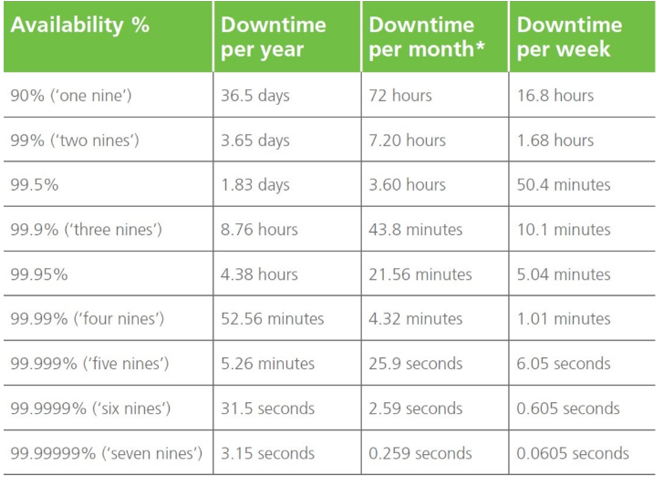
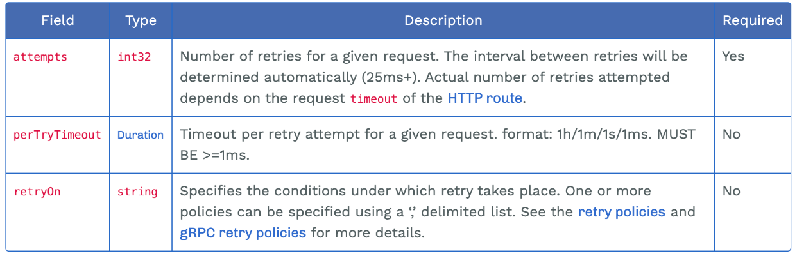
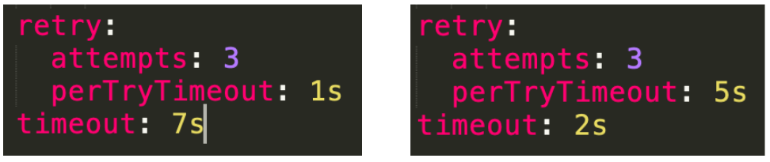
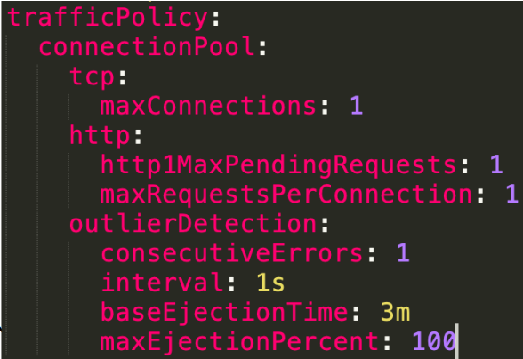

# 提升系统的弹性能力

## 一、系统可用性度量

>• 服务级别协议（SLA – Service Level Agreement）
>• 可用性计算公式




## 二、弹性设计

>应对故障的一种方法，让系统具有容错和适应能力
>
>防止故障（Fault）转化为失败（Failure）
>
>主要包括：
>
>>容错性：重试、幂等
>>
>>伸缩性：自动水平扩展（autoscaling）
>>
>>过载保护：超时、熔断、降级、限流
>>
>>弹性测试：故障注入

## 三、Istio的弹性能力

>• 超时
>• 重试
>• 熔断
>• 故障注入

## 四、重试配置项



>• x-envoy-retry-on: 5xx, gateway-error, reset, connect-failure…
>• x-envoy-retry-grpc-on: cancelled, deadline-exceeded, internal, unavailable…

## 五、超时配置规则

>timeout & retries.perTryTimout 同时存在时
>
>超时生效 = min (timeout, retry.perTryTimout * retry.attempts)



## 六、熔断配置



>• TCP 和 HTTP 连接池大小为 1
>• 只容许出错 1 次
>• 每秒 1 次请求计数
>• 可以从负载池中移除全部 pod
>• 发生故障的 pod 移除 3m 之后才能再次加入

## 七、实验

### 1、配置访问规则

```yaml
apiVersion: security.istio.io/v1beta1
kind: AuthorizationPolicy
metadata:
  name: httpbin                      # 授权策略的名称，命名为 httpbin
  namespace: demo                   # 授权策略应用的命名空间，这里是 demo
spec:
  action: ALLOW                     # 策略行为为 ALLOW，表示只允许符合规则的请求通过
  rules:
  - from:
    - source:
        principals: ["cluster.local/ns/testauth/sa/sleep"]
        # 指定来源身份，允许来自 testauth 命名空间中名为 sleep 的 ServiceAccount 的请求
    - source:
        namespaces: ["demo"]
        # 或者，允许来自 demo 命名空间的所有请求（不限定具体 ServiceAccount）

```

### 2、配置目标规则

```yaml
apiVersion: networking.istio.io/v1alpha3
kind: DestinationRule
metadata:
  name: httpbin                      # DestinationRule 的名称
  namespace: demo                   # 所属的命名空间
spec:
  host: httpbin                     # 目标服务的主机名，通常为服务名或 FQDN（如 httpbin.demo.svc.cluster.local）
  trafficPolicy:                    # 针对目标服务的流量策略
    connectionPool:                # 连接池设置，控制连接的并发和复用
      tcp:
        maxConnections: 1         # 每个后端主机允许的最大 TCP 连接数为 1
      http:
        http1MaxPendingRequests: 1     # HTTP1 中最大挂起请求数为 1，超出将被拒绝
        maxRequestsPerConnection: 1    # 每个连接最多只处理 1 个请求，用于强制禁用连接复用（Keep-Alive）
    outlierDetection:                  # 异常实例检测与逐出策略（用于熔断）
      consecutiveErrors: 1             # 连续出错 1 次就标记为异常
      interval: 1s                     # 每 1 秒评估一次实例健康状况
      baseEjectionTime: 3m            # 实例被逐出后的基础拒绝时间为 3 分钟
      maxEjectionPercent: 100         # 最多可逐出 100% 的实例（即全部），用于强熔断策略

```

### 3、虚拟服务

#### 1.默认状态

```yaml
apiVersion: networking.istio.io/v1alpha3
kind: VirtualService
metadata:
  name: httpbin                      # VirtualService 的名称
  namespace: demo                   # 所属命名空间
spec:
  hosts:
  - "*"                             # 匹配所有主机名（域名），也可以指定为具体的 FQDN，例如 "httpbin.example.com"
  gateways:
  - httpbin-gateway                 # 指定此路由将通过名为 httpbin-gateway 的 Gateway 入口资源生效
  http:
  - route:
    - destination:
        host: httpbin              # 目标服务名称（可省略 FQDN，默认指向 demo 命名空间内的服务 httpbin）
        port:
          number: 8000             # 目标服务暴露的端口号

```

#### 2.超时机制

```yaml
apiVersion: networking.istio.io/v1alpha3
kind: VirtualService
metadata:
  name: httpbin                      # VirtualService 的名称
  namespace: demo                   # 所属命名空间
spec:
  hosts:
  - "*"                             # 匹配所有的 Host（域名）。可用于通配请求，生产环境建议使用具体域名
  gateways:
  - httpbin-gateway                 # 指定该路由规则仅通过名为 httpbin-gateway 的 Gateway 生效
  http:
  - route:
    - destination:
        host: httpbin              # 目标服务名称（默认为 demo 命名空间中的 httpbin 服务）
        port:
          number: 8000             # 目标服务监听的端口号，必须与 Service 中定义的端口一致
    timeout: 8s                    # 整个请求的最大超时时间为 8 秒
```

#### 3.超时重试机制

```yaml
apiVersion: networking.istio.io/v1alpha3
kind: VirtualService
metadata:
  name: httpbin                      # VirtualService 的名称
  namespace: demo                   # 所属命名空间
spec:
  hosts:
  - "*"                             # 匹配所有的 Host（域名）。可用于通配请求，生产环境建议使用具体域名
  gateways:
  - httpbin-gateway                 # 指定该路由规则仅通过名为 httpbin-gateway 的 Gateway 生效
  http:
  - route:
    - destination:
        host: httpbin              # 目标服务名称（默认为 demo 命名空间中的 httpbin 服务）
        port:
          number: 8000             # 目标服务监听的端口号，必须与 Service 中定义的端口一致
    retry:
      attempts: 3                  # 若调用失败，最多重试 3 次（总共最多请求 4 次：1 次原始请求 + 3 次重试）
      perTryTimeout: 1s           # 每次重试的超时时间为 1 秒，超时视为失败并尝试下一次重试
    timeout: 8s                    # 整个请求的最大超时时间为 8 秒（包含所有重试过程）
```


