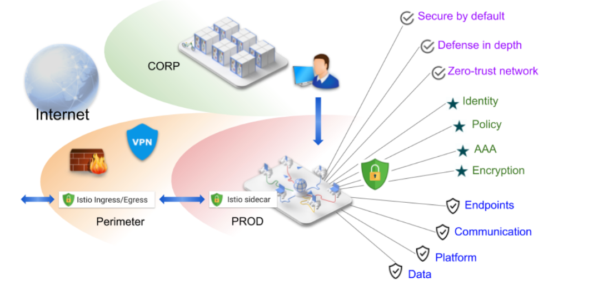
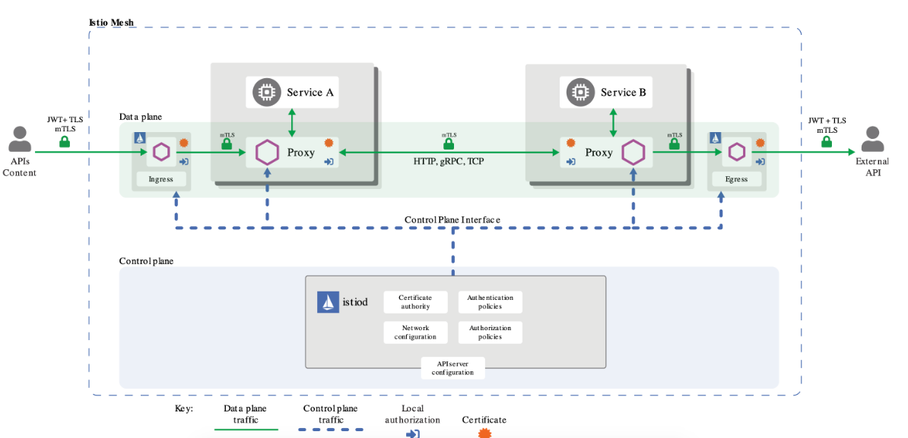

# 配置安全策略

## 一、解决方案



## 二、安全架构



## 三、实验

### 1、创建授权

>特定服务，注意没有rule，表示deny当前服务

```yaml
kubectl apply -f - <<EOF
apiVersion: security.istio.io/v1beta1
kind: AuthorizationPolicy
metadata:
  name: httpbin
  namespace: demo
spec:
  selector:
    matchLabels:
      app: httpbin
EOF
```

```bash
#不通过：kubectl exec -it -n demo sleep-6bdb595bcb-wg6bc -c sleep -- curl "http://httpbin.demo:8000/get"
#通过：kubectl exec -it -n demo sleep-6bdb595bcb-wg6bc -c sleep -- curl "http://httpbin-v2.demo:8000/get"
```

### 2、指定来源必须是demo ns

```yaml
apiVersion: security.istio.io/v1beta1
kind: AuthorizationPolicy
metadata:
 name: httpbin
 namespace: demo
spec:
 action: ALLOW
 rules:
 - from:
   - source:
       principals: ["cluster.local/ns/demo/sa/sleep"]
   - source:
       namespaces: ["demo"]
```

```bash
#通过：kubectl exec -it -n demo sleep-6bdb595bcb-wg6bc -c sleep -- curl "http://httpbin.demo:8000/get"
#不通过： kubectl exec -it -n testauth sleep-57ddb67999-bwbkq -c sleep -- curl "http://httpbin.demo:8000/get"
#修改service account 为testauth, 通过
```

### 3、只允许访问特定接口

```yaml
kubectl apply -f - <<EOF
apiVersion: security.istio.io/v1beta1
kind: AuthorizationPolicy
metadata:
 name: httpbin
 namespace: demo
spec:
 action: ALLOW
 rules:
 - from:
   - source:
       principals: ["cluster.local/ns/demo/sa/sleep"]
   - source:
       namespaces: ["demo"]
   to:
   - operation:
       methods: ["GET"]
       paths: ["/get"]
EOF
```

```bash
#通过：kubectl exec -it -n demo sleep-6bdb595bcb-wg6bc -c sleep -- curl "http://httpbin.demo:8000/get"
#不通： kubectl exec -it -n demo sleep-6bdb595bcb-wg6bc -c sleep -- curl "http://httpbin.demo:8000/ip"
```

### 4、只允许特定请求头

```yaml
kubectl apply -f - <<EOF
apiVersion: security.istio.io/v1beta1
kind: AuthorizationPolicy
metadata:
 name: httpbin
 namespace: demo
spec:
 action: ALLOW
 rules:
 - from:
   - source:
       principals: ["cluster.local/ns/demo/sa/sleep"]
   - source:
       namespaces: ["demo"]
   to:
   - operation:
       methods: ["GET"]
       paths: ["/get"]
   when:
   - key: request.headers[x-rfma-token]
     values: ["test*"]
EOF
```

```bash
#不通过：kubectl exec -it -n demo sleep-6bdb595bcb-wg6bc -c sleep -- curl "http://httpbin.demo:8000/get"
#加token通过：kubectl exec -it -n demo sleep-6bdb595bcb-wg6bc -c sleep -- curl "http://httpbin.demo:8000/get" -H x-rfma-token:test1
```

