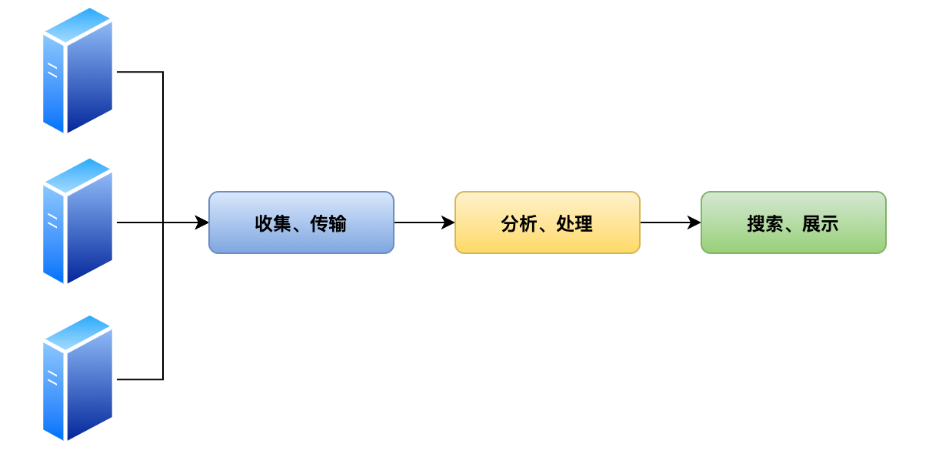
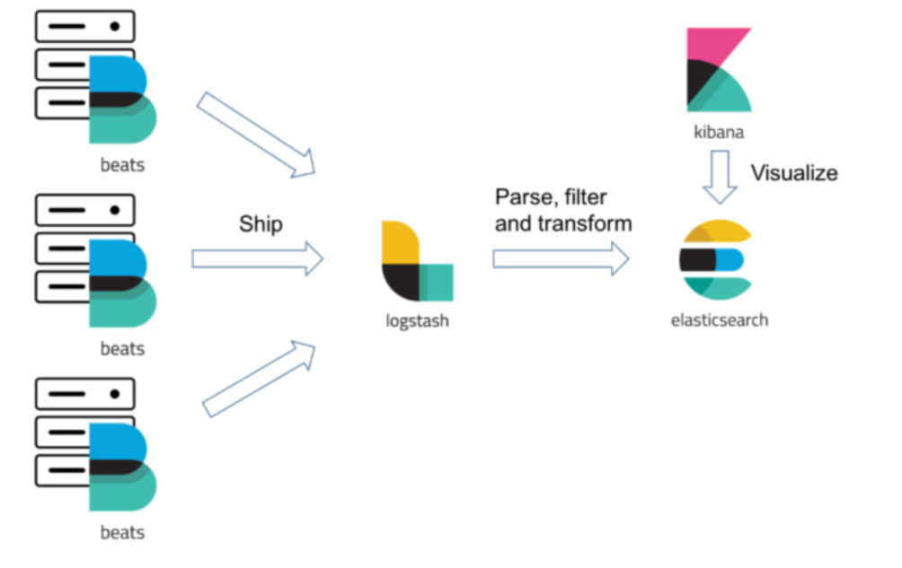
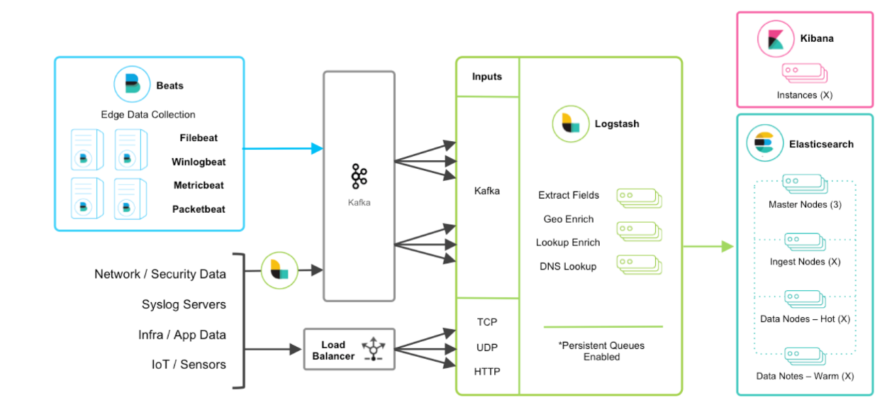

# ELK日志收集

## 一、集中式日志架构

>收集
>
>处理
>
>展示



## 二、ELK架构图

>ElasticSearch
>
>Logstash
>
>Kibana
>
>LibBeats



## 三、ELK的部署形态



## 四、实战

### 1、部署ELK

```yaml
kind: List
apiVersion: v1
items:
- apiVersion: apps/v1beta1
  kind: Deployment
  metadata:
    name: kibana
  spec:
    replicas: 1
    template:
      metadata:
        name: kibana
        labels:
          app: kibana
      spec:
        containers:
        - image: docker.elastic.co/kibana/kibana:6.4.0
          name: kibana
          env:
          - name: ELASTICSEARCH_URL
            value: "http://elasticsearch:9200"
          ports:
          - name: http
            containerPort: 5601
- apiVersion: v1
  kind: Service
  metadata:
    name: kibana
  spec:
    type: NodePort
    ports:
    - name: http
      port: 5601
      targetPort: 5601 
      nodePort: 32001
    selector:
      app: kibana            
- apiVersion: apps/v1beta1
  kind: Deployment
  metadata:
    name: elasticsearch
  spec:
    replicas: 1
    template:
      metadata:
        name: elasticsearch
        labels:
          app: elasticsearch
      spec:
        containers:
        - image: docker.elastic.co/elasticsearch/elasticsearch:6.4.0
          name: elasticsearch
          env:
          - name: network.host
            value: "_site_"
          - name: node.name
            value: "${HOSTNAME}"
          - name: discovery.zen.ping.unicast.hosts
            value: "${ELASTICSEARCH_NODEPORT_SERVICE_HOST}"
          - name: cluster.name
            value: "test-single"
          - name: ES_JAVA_OPTS
            value: "-Xms128m -Xmx128m"
          volumeMounts:
          - name: es-data
            mountPath: /usr/share/elasticsearch/data
        volumes:
          - name: es-data
            emptyDir: {}
- apiVersion: v1
  kind: Service
  metadata: 
    name: elasticsearch-nodeport
  spec:
    type: NodePort
    ports:
    - name: http
      port: 9200
      targetPort: 9200
      nodePort: 32002
    - name: tcp
      port: 9300
      targetPort: 9300
      nodePort: 32003
    selector:
      app: elasticsearch
- apiVersion: v1
  kind: Service
  metadata:
    name: elasticsearch
  spec:
    clusterIP: None
    ports:
    - name: http
      port: 9200
    - name: tcp
      port: 9300
    selector:
      app: elasticsearch
```

### 2、部署filebeat

```yaml
kind: List
apiVersion: v1
items:
# ----------------------------------------------
# 1. ConfigMap：包含 Filebeat 的配置文件
# ----------------------------------------------
- apiVersion: v1
  kind: ConfigMap
  metadata:
    name: filebeat-config
    labels:
      k8s-app: filebeat
      kubernetes.io/cluster-service: "true"
      app: filebeat-config
  data:
    filebeat.yml: |
      processors:
        - add_cloud_metadata:     # 添加云服务元数据（可选）
      filebeat.modules:
      - module: system            # 启用 system 模块（可收集系统日志，未启用详细日志路径可能不起作用）
      filebeat.inputs:           # 配置日志输入
      - type: log
        paths:
          - /var/log/containers/*.log  # 从宿主机上的容器日志文件中读取
        symlinks: true                 # 支持软链接读取
      output.elasticsearch:           # 日志输出到 Elasticsearch
        hosts: ['elasticsearch:9200']
      logging.level: info             # 设置日志级别为 info

# ------------------------------------------------
# 2. Deployment：运行 Filebeat 容器收集日志
# ------------------------------------------------
- apiVersion: extensions/v1beta1
  kind: Deployment 
  metadata:
    name: filebeat
    labels:
      k8s-app: filebeat
      kubernetes.io/cluster-service: "true"
  spec:
    replicas: 1
    template:
      metadata:
        name: filebeat
        labels:
          app: filebeat
          k8s-app: filebeat
          kubernetes.io/cluster-service: "true"
      spec:
        containers:
        - image: docker.elastic.co/beats/filebeat:6.4.0  # 使用 Filebeat 6.4.0 镜像
          name: filebeat
          args: [
            "-c", "/home/filebeat-config/filebeat.yml",  # 使用挂载的 filebeat.yml 配置
            "-e",
          ]
          securityContext:
            runAsUser: 0               # 以 root 用户运行，以便读取宿主机日志
          volumeMounts:
          - name: filebeat-storage
            mountPath: /var/log/containers             # 容器日志目录（容器输出的 stdout/stderr）
          - name: varlogpods
            mountPath: /var/log/pods                   # Pod 日志目录（Kubelet 管理的日志）
          - name: varlibdockercontainers
            mountPath: /var/lib/docker/containers      # Docker 原始容器日志
          - name: "filebeat-volume"
            mountPath: "/home/filebeat-config"         # 挂载配置文件
        volumes:
          - name: filebeat-storage
            hostPath:
              path: /var/log/containers                # 宿主机容器日志目录
          - name: varlogpods
            hostPath:
              path: /var/log/pods                      # 宿主机 Pod 日志目录
          - name: varlibdockercontainers
            hostPath:
              path: /var/lib/docker/containers         # Docker 容器原始日志路径
          - name: filebeat-volume
            configMap:
              name: filebeat-config                    # 引用前面定义的 ConfigMap

# ------------------------------------------------
# 3. ClusterRoleBinding：授予 Filebeat 读取 K8s 资源的权限
# ------------------------------------------------
- apiVersion: rbac.authorization.k8s.io/v1beta1
  kind: ClusterRoleBinding
  metadata:
    name: filebeat
  subjects:
  - kind: ServiceAccount
    name: filebeat
    namespace: elk          # 绑定的是 elk 命名空间下的 filebeat 账户
  roleRef:
    kind: ClusterRole
    name: filebeat
    apiGroup: rbac.authorization.k8s.io

# ------------------------------------------------
# 4. ClusterRole：允许读取 pods 和 namespaces（用于日志标签增强）
# ------------------------------------------------
- apiVersion: rbac.authorization.k8s.io/v1beta1
  kind: ClusterRole
  metadata:
    name: filebeat
    labels:
      k8s-app: filebeat
  rules:
  - apiGroups: [""]                 # Core API group
    resources:
    - namespaces
    - pods
    verbs:
    - get
    - watch
    - list

# ------------------------------------------------
# 5. ServiceAccount：Filebeat 运行时所使用的身份
# ------------------------------------------------
- apiVersion: v1
  kind: ServiceAccount
  metadata:
    name: filebeat
    namespace: elk
    labels:
      k8s-app: filebeat

```