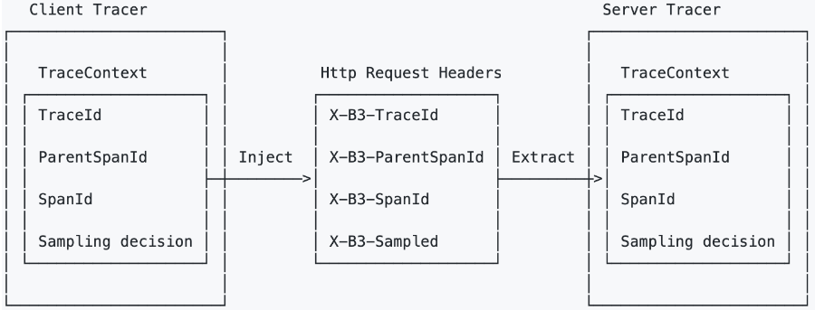

# 分布式链路监控

## 一、Istio 的分布式追踪

>基于 Envoy 实现
>
>应用负责传递追踪头信息（b3 trace header）
>
>>https://github.com/openzipkin/b3-propagation
>
>支持采样率



## 二、实验

### 1、下载资源清单

```bash
git clone https://github.com/jaegertracing/jaeger-operator.git
```

### 2、修改watch namespace 为空

### 3、安装CRD

```bash
kubectl create -f https://raw.githubusercontent.com/jaegertracing/jaeger-operator/master/deploy/crds/jaegertracing.io_jaegers_crd.yaml
```

### 4、创建ns

```bash
kubectl create ns observability
```

### 5、安装operator

```bash
kubectl create -n observability -f https://raw.githubusercontent.com/jaegertracing/jaeger-operator/master/deploy/service_account.yaml
kubectl create -n observability -f https://raw.githubusercontent.com/jaegertracing/jaeger-operator/master/deploy/role.yaml
kubectl create -n observability -f https://raw.githubusercontent.com/jaegertracing/jaeger-operator/master/deploy/role_binding.yaml
kubectl create -n observability -f https://raw.githubusercontent.com/jaegertracing/jaeger-operator/master/deploy/operator.yaml
```

### 6、创建集群角色

```bash
kubectl create -f https://raw.githubusercontent.com/jaegertracing/jaeger-operator/master/deploy/cluster_role.yaml
kubectl create -f https://raw.githubusercontent.com/jaegertracing/jaeger-operator/master/deploy/cluster_role_binding.yaml
```

### 7、安装jaeger

```bash
kubectl apply -f examples/simplest.yaml -n observability
```

### 8、集成Istio

```bash
# --set values.global.tracer.zipkin.address=<jaeger-collector-service>.<jaeger-collector-namespace>:9411
istioctl manifest apply \
--set values.global.tracer.zipkin.address=simplest-collector.observability:9411 \
--set values.tracing.ingress.enabled=true \
--set values.pilot.traceSampling=100
```

```bash
重启pod
```

### 9、pod和deploy修改注释

```bash
sidecar.jaegertracing.io/inject: "true"
```


