# 调试网格的工具和方法

## 一、调试工具和方法

>• istioctl 命令行
>• controlZ 自检工具
>• Envoy admin 接口
>• Pilot debug 接口

### 1、istioctl 命令行

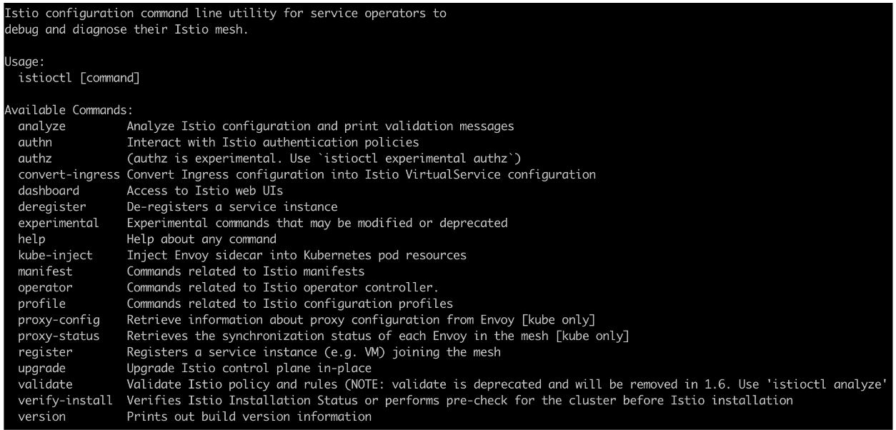

#### 1.安装部署相关

>• istioctl verify-install
>• istioctl manifest [apply / diff / generate / migrate / versions]
>• istioctl profile [list / diff / dump]
>• istioctl kube-inject
>• istioctl dashboard [command]
>  • controlz / envoy / Grafana / jaeger / kiali / Prometheus / zipkin

#### 2.网格配置状态检查

##### 1）配置同步检查

>• istioctl ps（proxy-status）
>  • 状态：SYNCED / NOT SENT / STALE
>• istioctl ps <pod-name>

##### 2）配置详情

>• istioctl pc（proxy-config）
>  • istioctl pc [cluster/route/…] <pod-name.namespace>

#### 3.查看 Pod 相关网格配置信息

>• istioctl x（ experimental ）describe pod <pod-name>
>  • 验证是否在网格内
>  • 验证 VirtualService
>  • 验证 DestinationRule
>  • 验证路由
>  • …

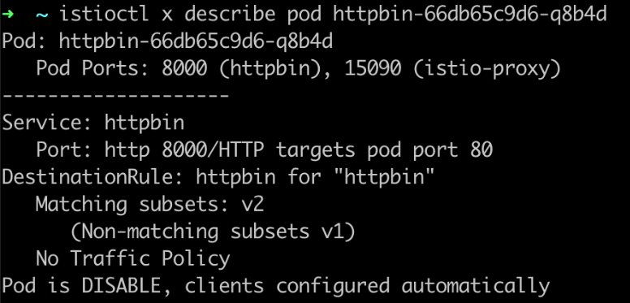

#### 4.网格配置诊断

>• istioctl analyze [–n <namespace> / --all-namespaces]
>• istioctl analyze a.yaml b.yaml my-app-config/
>• istioctl analyze --use-kube=false a.yaml

### 2、controlZ 可视化自检工具

>• istioctl d controlz <istiod-podname> -n istio-system
>  • 调整日志输出级别
>  • 查看内存使用情况
>  • 环境变量
>  • 进程信息

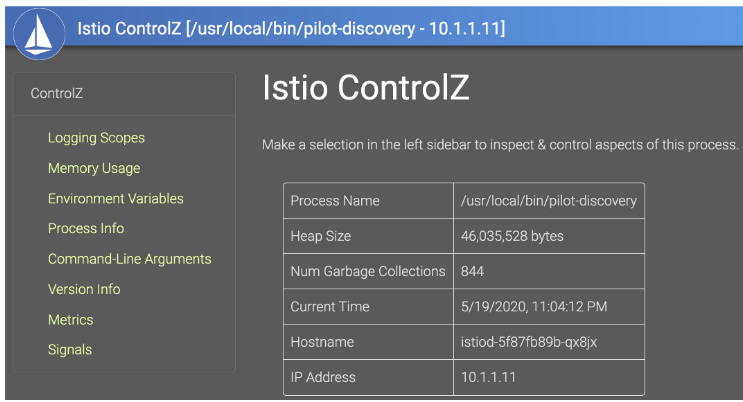

### 3、Envoy admin API 接口

>• istioctl d envoy <pod-name>.[namespace]
>• k port-forward pod-name xxx:15000
>• 日志级别调整
>• 性能数据分析
>• 配置等信息
>• 指标查看

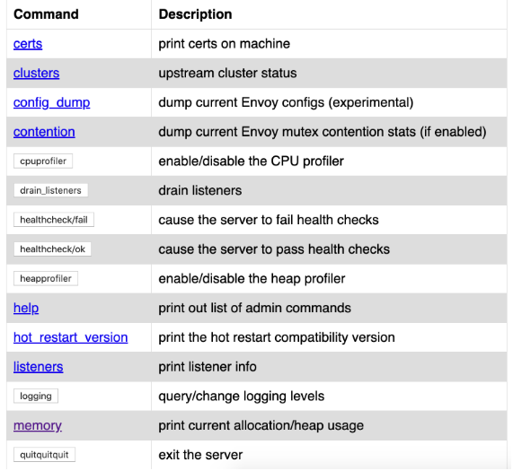

### 4、Pilot debug 接口

>• k port-forward service/istio-pilot -n istio-system 8080:8080
>• http://localhost:8080/debug
>• xDS 和配置信息
>• 性能问题分析
>• 配置同步情况

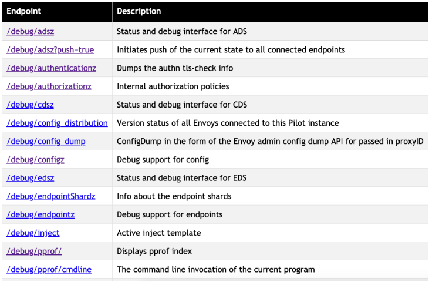

## 二、常见错误

### 1、503

>• 可能的原因
>  • 上游服务不可用（UH）；连接不上（UF）
>  • 路由配置错误（NR）
>  • 熔断导致（UO）
>  • 配置下发问题，可自愈
>• 解决方法：
>  • 根据 Envoy 日志中 RESPONSE_FLAGS 判断
>  • 保证配置的可用性（先更新定义，后更新调用）

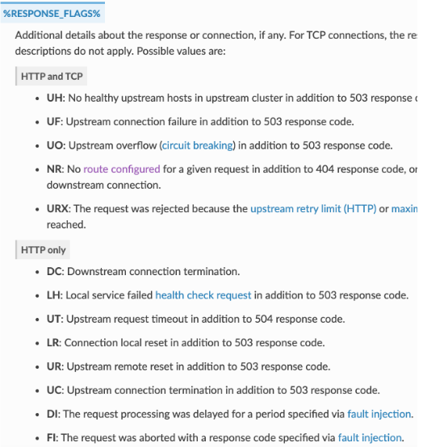

### 2、请求中断分析

>• 因为 Envoy 的引入，无法准确判断出问题的节点
>• 解决方法
>  • 根据 request id 串连上下游
>  • 分析 Envoy 日志中的上下游元组信息
>  • UPSTREAM_CLUSTER/ DOWNSTREAM_REMOTE_ADDRESS/DOWNSTREAM_LOCAL_ADDRESS/ UPSTREAM_LOCAL_ADDRESS/UPSTREAM_HOST

### 3、路由规则没有生效

>• 查看是否满足 Pod 和 Service 的定义要求
>  • https://istio.io/docs/ops/deployment/requirements/
>• 是否占用了 Istio 默认端口
>• 是否是配置下发延迟
>  • 使用 istioctl proxy-status 查看配置同步情况
>• 使用 Kiali 的配置验证

### 4、路由规则冲突

>• 重复定义对同一 host 的路由规则
>• 解决方案
>  • 各业务维护自己的配置，避免交叉定义
>  • 通过 Kiali 进行配置验证

### 5、VirtualService 作用域

>• VirtualService 中的 gateway 字段
>  • 作用于网关：< gateway-name >
>  • 作用于网格内部：空 或者 [mesh]
>  • 同时生效：
>    • 需要显示加上 mesh 和 gateway-name

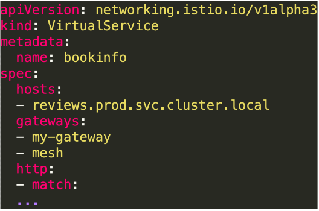

### 6、JWT 身份认证失败

>• 确保正确设置了jwks 或 jwksUrl
>• 确保 issuer 设置正确
>• 确保 token 正确、没有过期 （jwt.io)

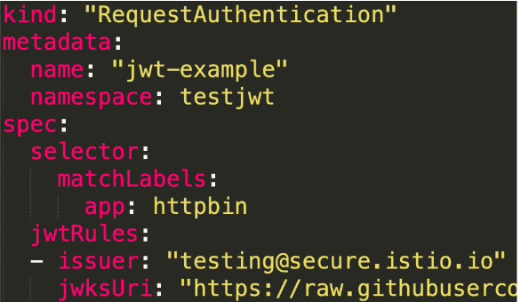

### 7、TLS/mTLS 导致连接失败

>• 确保 Citadel 运行正常
>• 确保授权策略下发正确
>• 查看策略生效的作用域 – 最窄原则
>• 确保客户端、服务端都正确配置了自动的 mTLS

### 8、性能问题分析

>• 控制平面：
>  • 使用 controlZ 观察内存、GC 等情况
>  • 使用 pilot 的 debug 接口
>• 数据平面：
>  • 使用 Envoy admin API

## 三、最佳实践

### 1、部署

>• 少跨集群，多用命名空间
>  • 少量的大集群 好过 大量的小集群
>• 考虑网络延迟 - 就近原则
>• 异地多活策略
>• Mesh 的部署尽可能使用 GitOps 模式

### 2、流量控制

>• 总是配置一个默认路由
>• 控制配置的命名空间可见性
>• 拆分复杂的路由配置 – 单一职责
>• 注意配置生效顺序

### 3、默认路由、可见性

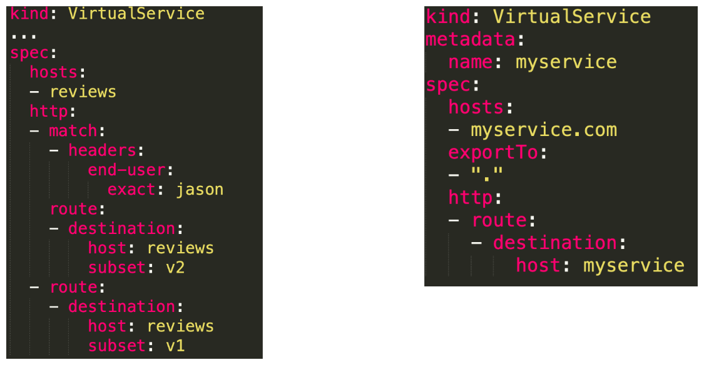

### 4、拆分复杂的路由配置 – 单一职责

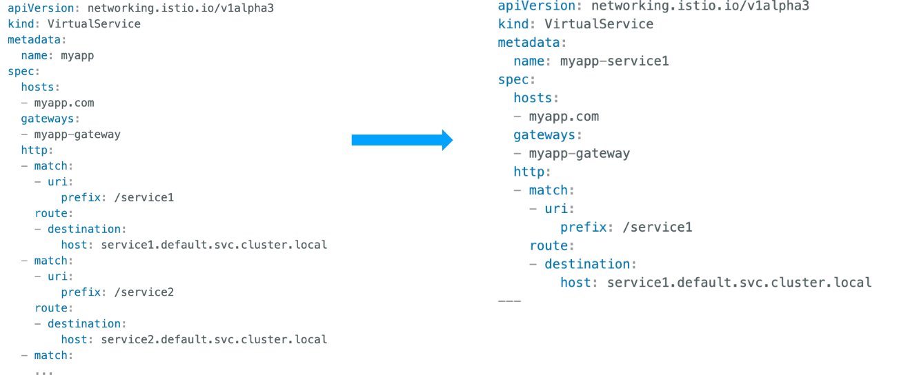

### 5、注意配置生效顺序

>• 先保证服务可用，再配置路由
>• 添加 subset：
>  • 更新 DestinationRules，添加新子集
>  • 更新会使用它的 VirtualServices
>• 删除 subset：
>  • 从 VirtualServices 删除对该子集的所有引用
>  • 从 DestinationRule 中删除子集

### 6、安全配置建议

>• 通过命名空间隔离访问权限
>• 尽可能使用 ISTIO_MUTUAL 模式（Istio 自动管理证书密钥）
>• 平滑过渡到安全策略
>  • JWT：更新时先添加新的再删除旧的
>  • mTLS：优先使用 permissive 模式
>• 使用三方 Service Account Token
>  • --set values.global.jwtPolicy=third-party-jwt

### 7、可观察性配置建议

>• 使用 Prometheus 层级联盟（Hierarchical federation）
>• 和现有监控集成

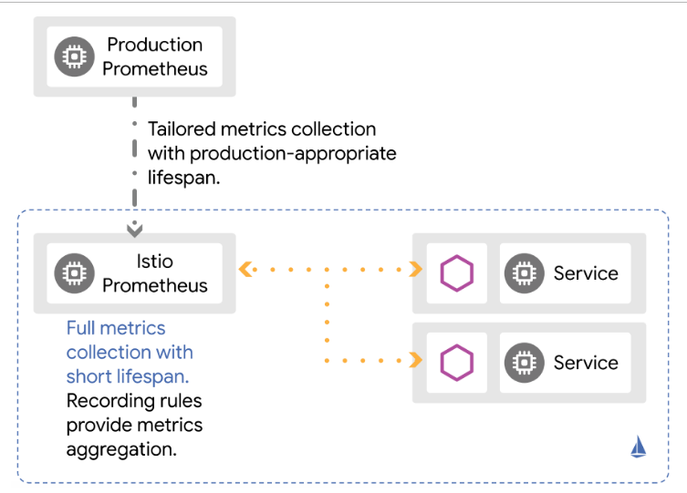

## 四、问题排查（troubleshooting）

>• 善用 debug 工具
>  • istioctl proxy-status / proxy-config / analyze
>  • istio-pilot debug 接口（8080）
>  • Envoy admin 接口（15000）
>• 关联故障发生时的日志、监控数据，进行分析

