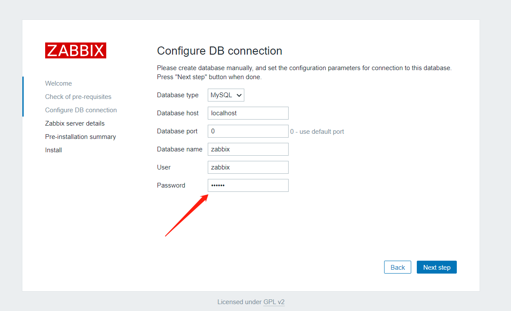
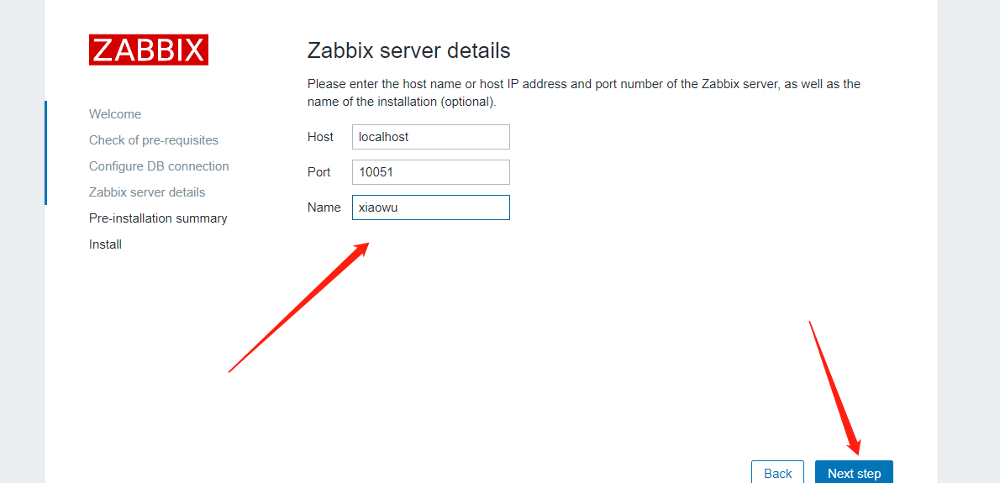
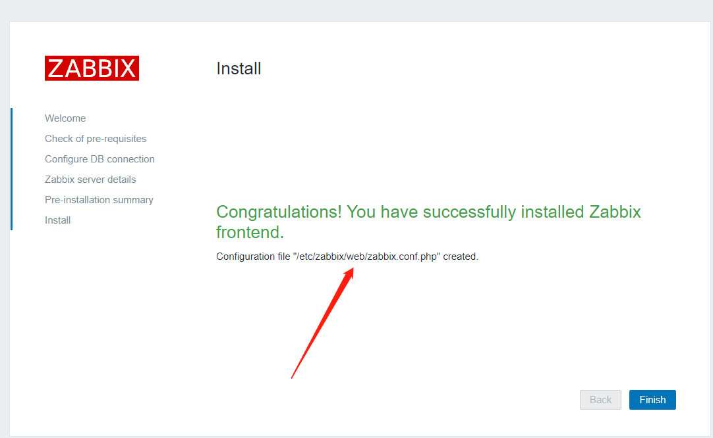
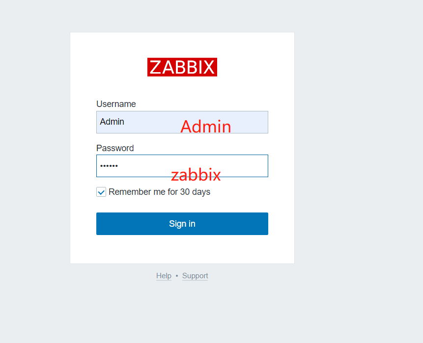
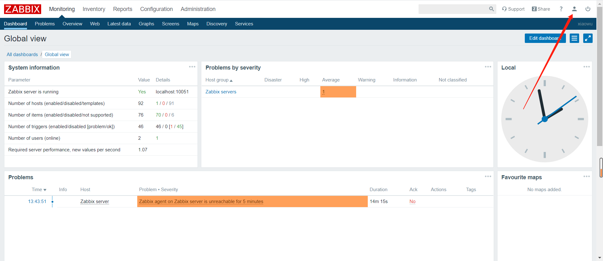
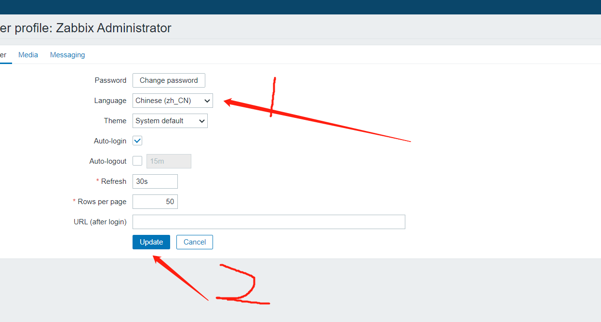
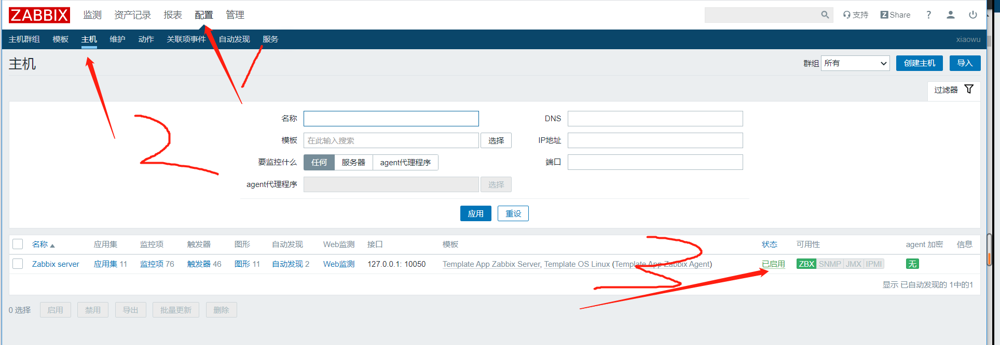

# zabbix安装

## 一、介绍主要版本

```bash
1.8		开始知道
2.0		
2.2LTS	火爆 		
2.4
3.0 LTS
3.2 标准版
3.4 标准版
4.0 LTS
4.2 标准版
4.4 标准版
5.0 LTS

LTS：长期支持版 大约支持五年
标准版：支持七个月
```


## 二、学习规划

### 1、学习版本

```bash
学习4.0版本，因为4.0是长期支持版本之一，比较新，企业常用。学完时进行4.0到5.0的升级。
```

### 2、学习环境

```bash
主机：zabbix
ip:	 10.0.0.71
操作系统版本：centos 7.6
```


## 三、zabbix生产环境安装

### 1、配置yum 源

#### 1）下载zabbix yum仓库

方法一

```bash
rpm -Uvh https://repo.zabbix.com/zabbix/4.0/rhel/7/x86_64/zabbix-release-4.0-2.el7.noarch.rpm

yum clean all
```

方法二

````bash
wget https://repo.zabbix.com/zabbix/4.0/rhel/7/x86_64/zabbix-release-4.0-2.el7.noarch.rpm

rpm -ivh zabbix-release-4.0-2.el7.noarch.rpm

yum clean all
````


#### 2）修改zabbix yum源

所有gpgcheck都设置为0

```bash
[root@zabbix ~]# vim /etc/yum.repos.d/zabbix.repo 
[zabbix]
name=Zabbix Official Repository - $basearch
baseurl=http://repo.zabbix.com/zabbix/4.0/rhel/7/$basearch/
enabled=1
gpgcheck=0
gpgkey=file:///etc/pki/rpm-gpg/RPM-GPG-KEY-ZABBIX-A14FE591

[zabbix-debuginfo]
name=Zabbix Official Repository debuginfo - $basearch
baseurl=http://repo.zabbix.com/zabbix/4.0/rhel/7/$basearch/debuginfo/
enabled=0
gpgkey=file:///etc/pki/rpm-gpg/RPM-GPG-KEY-ZABBIX-A14FE591
gpgcheck=0

[zabbix-non-supported]
name=Zabbix Official Repository non-supported - $basearch
baseurl=http://repo.zabbix.com/non-supported/rhel/7/$basearch/
enabled=1
gpgkey=file:///etc/pki/rpm-gpg/RPM-GPG-KEY-ZABBIX
gpgcheck=0
```


### 2、安装zabbix服务器，前端，代理，数据库，客户端

```bash
[root@zabbix ~]# yum install -y zabbix-server-mysql zabbix-web-mysql

[root@zabbix ~]# yum install -y mariadb-server.x86_64
[root@zabbix ~]# yum install zabbix-agent.x86_64 -y
```


### 3、启动数据库并设置开机自启

```bash
[root@zabbix ~]# systemctl start mariadb.service 
[root@zabbix ~]# systemctl enable mariadb.service 
```


### 4、mariadb安全配置向导

```bash
[root@zabbix ~]# mysql_secure_installation 
Enter current password for root (enter for none): 数据库密码，刚下载，默认没有密码，直接回车

Set root password? [Y/n] 是否设置用户密码，y设置密码

Remove anonymous users? [Y/n] 是否删除匿名用户，y

Disallow root login remotely? [Y/n] 是否禁止root用户远程登录，y

Remove test database and access to it? [Y/n] 是否删除任何人都可以访问的text测试库，y

Reload privilege tables now? [Y/n] 重新加载授权表，y

```


### 5、确认删库，授权成功

````mysql
[root@zabbix ~]# mysql -p
Enter password: 

MariaDB [(none)]> show databases;
+--------------------+
| Database           |
+--------------------+
| information_schema |
| mysql              |
| performance_schema |
+--------------------+
3 rows in set (0.00 sec)

MariaDB [(none)]> select user,host from mysql.user;
+------+-----------+
| user | host      |
+------+-----------+
| root | 127.0.0.1 |
| root | ::1       |
| root | localhost |
+------+-----------+

````


### 6、mariadb创建zabbix库，并授权

```mysql
[root@zabbix ~]# mysql -p
Enter password: 

建库
MariaDB [(none)]> create database zabbix character set utf8 collate utf8_bin;

授权
MariaDB [(none)]> grant all on zabbix.* to zabbix@localhost identified by '123456';

```


### 7、导入初始数据

#### 1）查找初始数据位置

```bash
[root@zabbix ~]# rpm -ql zabbix-server-mysql |grep create.sql
/usr/share/doc/zabbix-server-mysql-4.0.29/create.sql.gz
```


#### 2）导入初始数据

```bash
[root@zabbix ~]# zcat /usr/share/doc/zabbix-server-mysql-4.0.29/create.sql.gz | mysql -uzabbix -p123456 zabbix

无需查找通用命令
zcat /usr/share/doc/zabbix-server-mysql*/create.sql.gz | mysql -uzabbix -p123456 zabbix
```


#### 3）查看是否导入成功

```mysql
MariaDB [(none)]> use zabbix
MariaDB [zabbix]> show tables;

或
[root@zabbix ~]# mysql zabbix -p -e 'show tables';
Enter password: 
```


### 8、配置zabbix server的配置文件

```bash
修改以下信息
[root@zabbix ~]# vim /etc/zabbix/zabbix_server.conf 
DBHost=localhost
DBName=zabbix
DBUser=zabbix
DBPassword=123456

```


### 9、启动zabbix server并加入开机自启

```bash
[root@zabbix ~]# systemctl start zabbix-server.service 
[root@zabbix ~]# systemctl enable zabbix-server.service 
```


### 10、确认zabbix服务端启动成功

```bash
[root@zabbix ~]# netstat -lntup
Active Internet connections (only servers)
Proto Recv-Q Send-Q Local Address           Foreign Address         State       PID/Program name    
tcp        0      0 0.0.0.0:3306            0.0.0.0:*               LISTEN      2210/mysqld         
tcp        0      0 0.0.0.0:22              0.0.0.0:*               LISTEN      1400/sshd           
tcp        0      0 127.0.0.1:25            0.0.0.0:*               LISTEN      1561/master         
tcp        0      0 0.0.0.0:10051           0.0.0.0:*               LISTEN      18523/zabbix_server 
tcp6       0      0 :::22                   :::*                    LISTEN      1400/sshd           
tcp6       0      0 ::1:25                  :::*                    LISTEN      1561/master         
tcp6       0      0 :::10051                :::*                    LISTEN      18523/zabbix_server 

```


### 11、配置zabbix web（httpd）配置文件

```bash
[root@zabbix ~]# vim /etc/httpd/conf.d/zabbix.conf 
        php_value date.timezone Asia/Shanghai
        
或
[root@zabbix ~]# vim /etc/php.ini 
date.timezone = Asia/Shanghai

```


### 12、启动httpd，并加入开机自启

```bash
[root@zabbix ~]# systemctl start httpd.service 
[root@zabbix ~]# systemctl enable httpd.service 
Created symlink from /etc/systemd/system/multi-user.target.wants/httpd.service to /usr/lib/systemd/system/httpd.service.
```


### 13、访问zabbix页面，并设置

```bash
http://10.0.0.71/zabbix
下一步。。
设置密码
```



```bash
设置好密码
下一步
设置名字
```




下一步。。

生成了php文件，做迁移和升级会用到




完成。

登录

账号：Admin

密码：zabbix




设置中文






### 14、启动zabbix-agent并开机自启

```mysql
[root@zabbix ~]# systemctl start zabbix-agent.service 
[root@zabbix ~]# systemctl enable zabbix-agent.service 
```


### 15、确认自我监控成功




