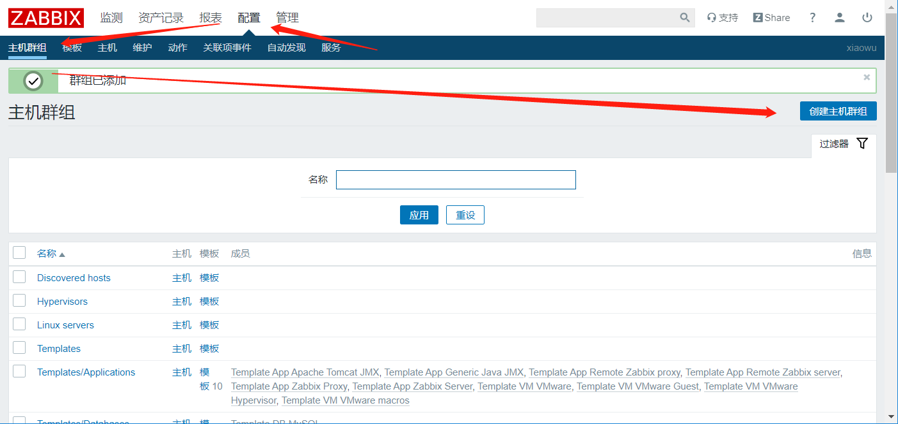
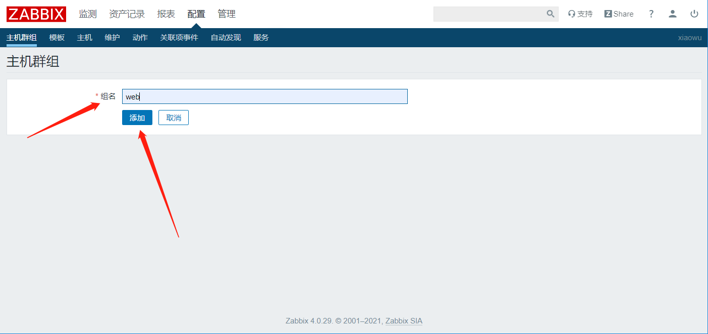
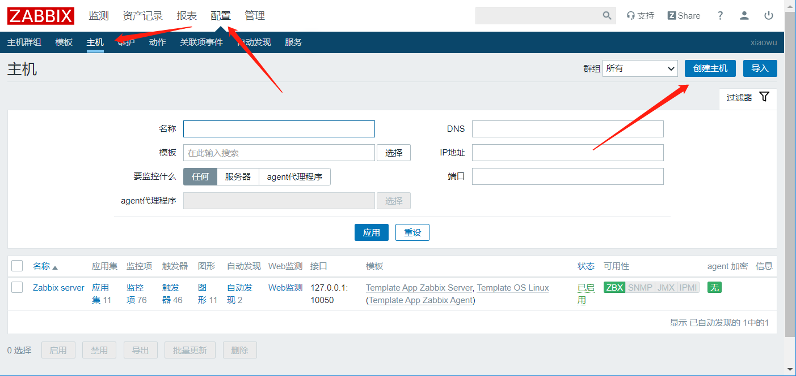
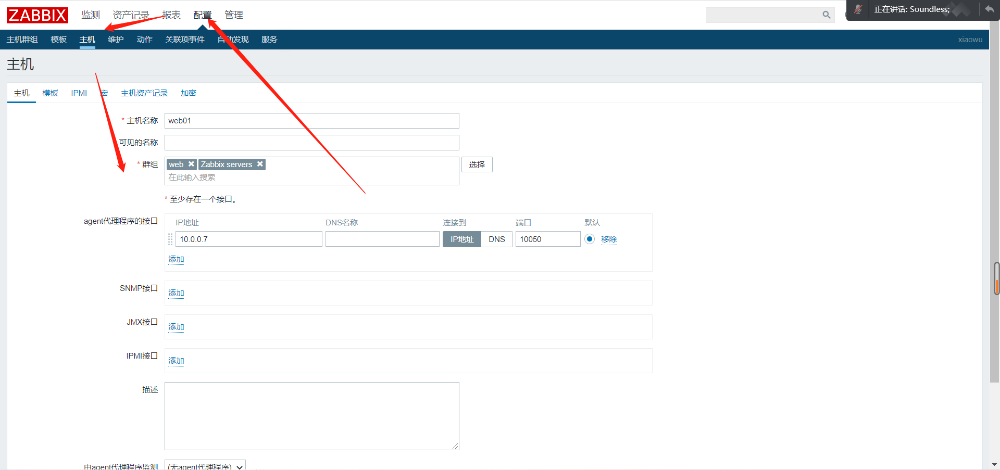
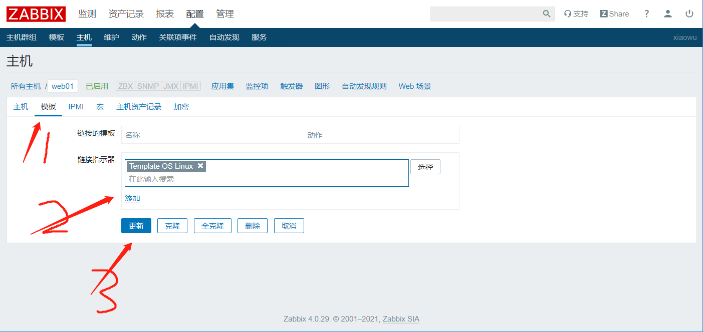
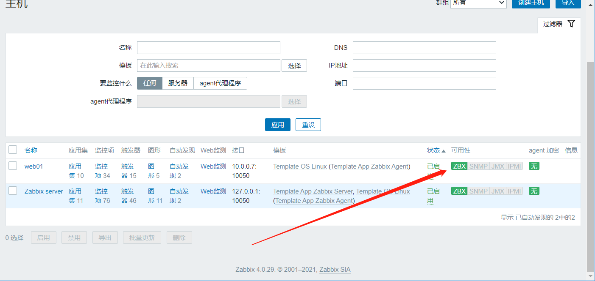

# 监控客户端部署及添加主机

## 一、在zabbix-server安装客户端

```bash
[root@zabbix ~]# yum install zabbix-agent.x86_64 -y
[root@zabbix ~]# systemctl start zabbix-agent.service 
[root@zabbix ~]# systemctl enable zabbix-agent.service 
```


## 二、其他linux主机安装linux客户端

### 1、安装

方法一：服务器特别多的话

```mysql
[root@web01 ~]# wget https://mirror.tuna.tsinghua.edu.cn/zabbix/zabbix/4.0/rhel/7/x86_64/zabbix-agent-4.0.29-1.el7.x86_64.rpm

[root@web01 ~]# sz zabbix-agent-4.0.29-1.el7.x86_64.rpm 
导出桌面

自己服务器直接安装，其他服务器拖进rpm包再安装

[root@web01 ~]# rpm -ivh zabbix-agent-4.0.29-1.el7.x86_64.rp
	
```


方法二：直接安装

```bash
[root@web02 ~]# rpm -ivh https://mirror.tuna.tsinghua.edu.cn/zabbix/zabbix/4.0/rhel/7/x86_64/zabbix-agent-4.0.29-1.el7.x86_64.rpm
```


### 2、配置

```mysql
[root@web02 ~]# vim /etc/zabbix/zabbix_agentd.conf 
Server=10.0.0.71
```


### 3、启动并开机自启

```bash
g[root@web01 ~]# systemctl start zabbix-agent.service 
[root@web01 ~]# systemctl enable zabbix-agent.service 
```


### 4、添加主机

#### 创建主机组





#### 创建主机








#### 等一会或重启zabbix-server查看配置是否成功




：
