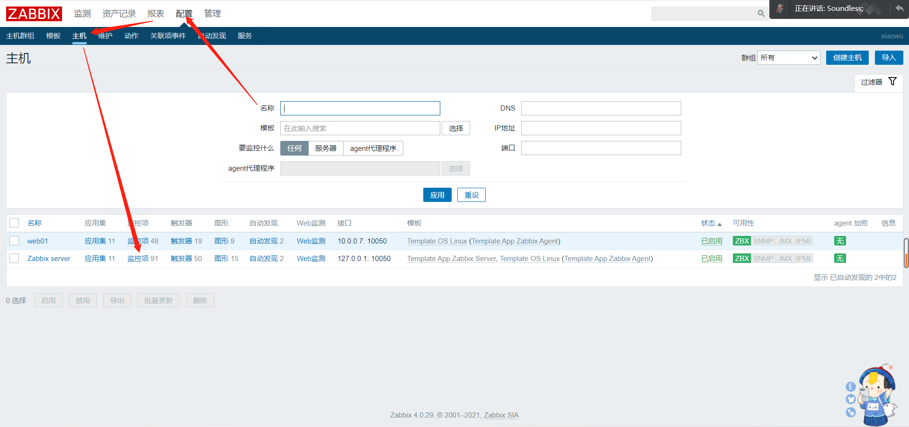
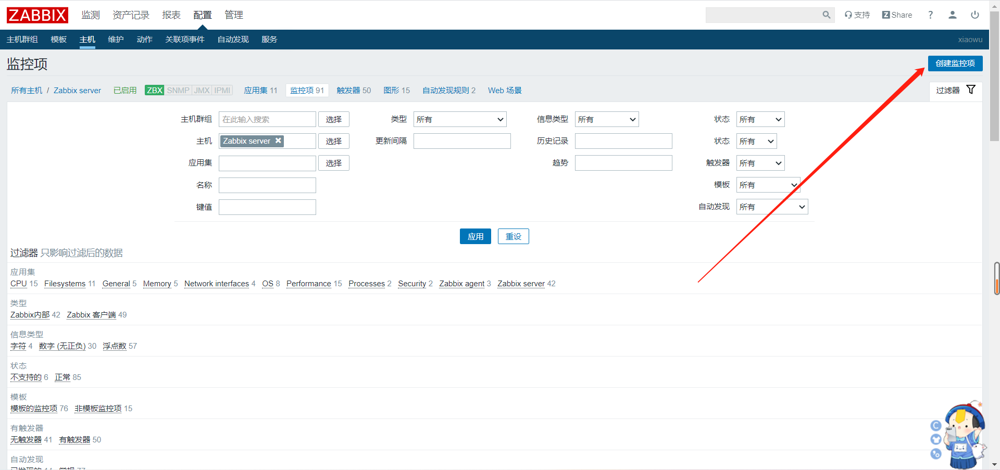
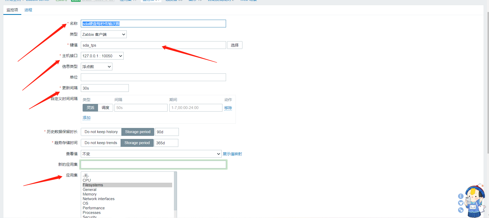
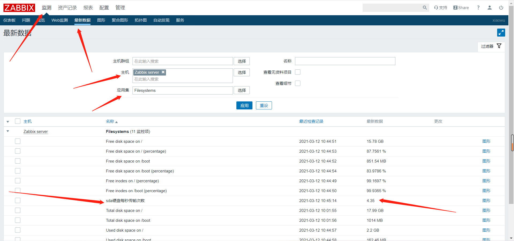

# 自定义监控项

## 一、什么是监控项

```bash
1.监控项:就是我们想要监控的指标，例如剩余内存，磁盘空间，服务的状态等等

2.每一个监控项，都有一个唯一的key，简洁明了（相当于shel脚本的变量名）

3.只需要安装 zabbix- agent，默认就支持大量的监控项，但是 Llinux模板并没有使用所有监控项

4.Template OS Linux by Zabbix agent主要监控了cpu内存，磁盘，网卡，安全，它们都属于通用监控

5.应用集是监控项的分组
```


## 二、自定义监控sda_tps的状态

### 1、尝试命令行手动取值

```bash
[root@zabbix ~]# iostat|awk '$1 ~/sda/'
sda               4.51        66.05        70.15     390244     414478
[root@zabbix ~]# iostat|awk '$1 ~/sda/{print $2}'
4.50
```


### 2、修改zabbix-agent配置文件添加key，并重启

````bash
[root@zabbix ~]# vim /etc/zabbix/zabbix_agentd.conf 
UserParameter=sda_tps,iostat|awk '$1 ~/sda/{print $2}'

[root@zabbix ~]# systemctl restart zabbix-agent.service 
````


### 3、zabbix-server测试监控项取值

```mysql
安装在zabbix-server上
[root@zabbix ~]# yum install -y zabbix-get.x86_64 

[root@zabbix ~]# zabbix_get -s 127.0.0.1 -k sda_tps
4.42

-s	被监控主机的ip地址
-p	端口
-k  指定监控项的key
```


### 4、web页面添加自定义监控项









### 5、确认

