# 自定义触发器

```bash
触发器：设置一个报警条件
一个触发器至少对应一个监控项
```


## 一、测试触发器告警

### 1、开启声音告警

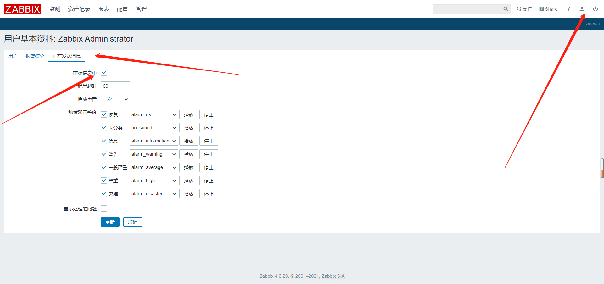


### 2、找个好测试的已存在监控项并含有触发器

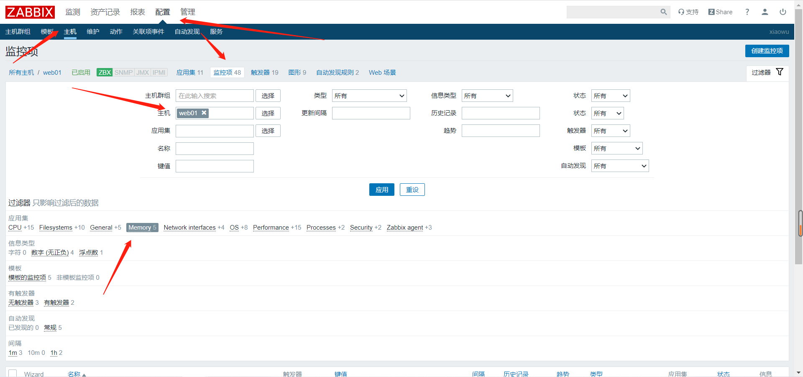

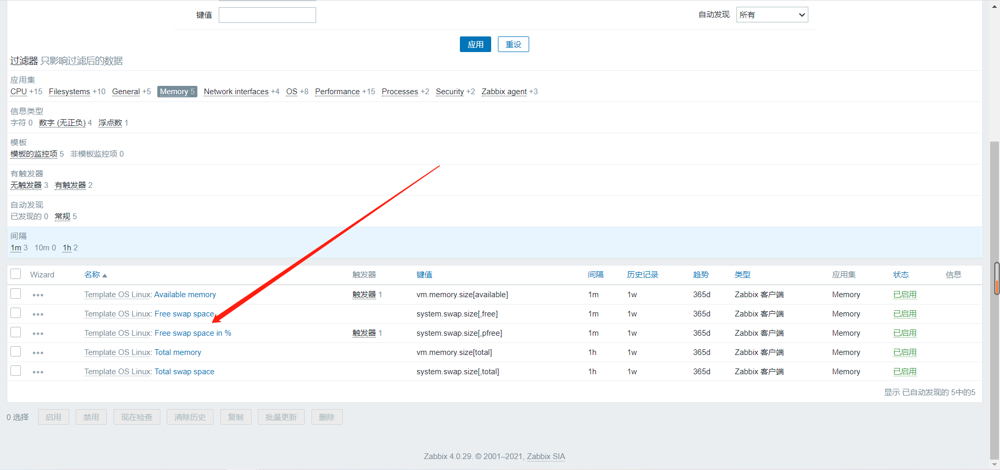

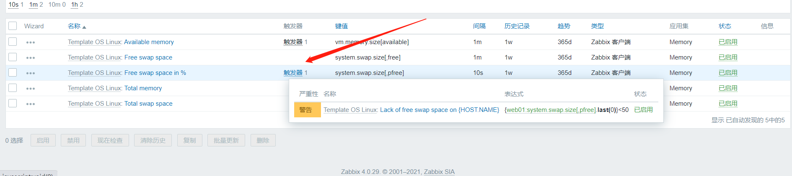


### 3、修改更新间隔并更新

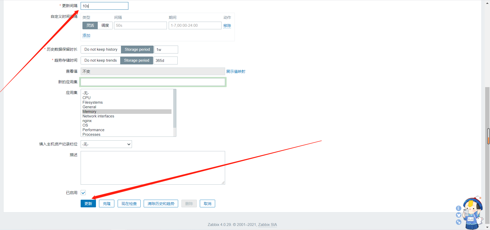


### 4、关闭swap分区

```bash
[root@web01 ~]# swapoff -a
```


### 5、发现出现报警声且页面显示问题

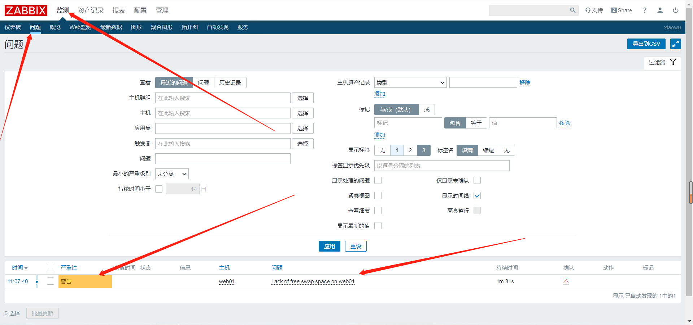


```bash
后面可以将报警改为其他方式
```


## 二、自定义触发器

### 1、选定无触发器的监控项

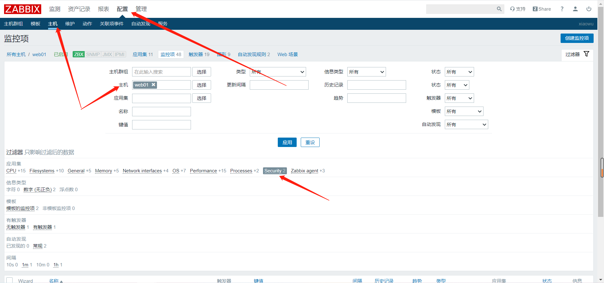

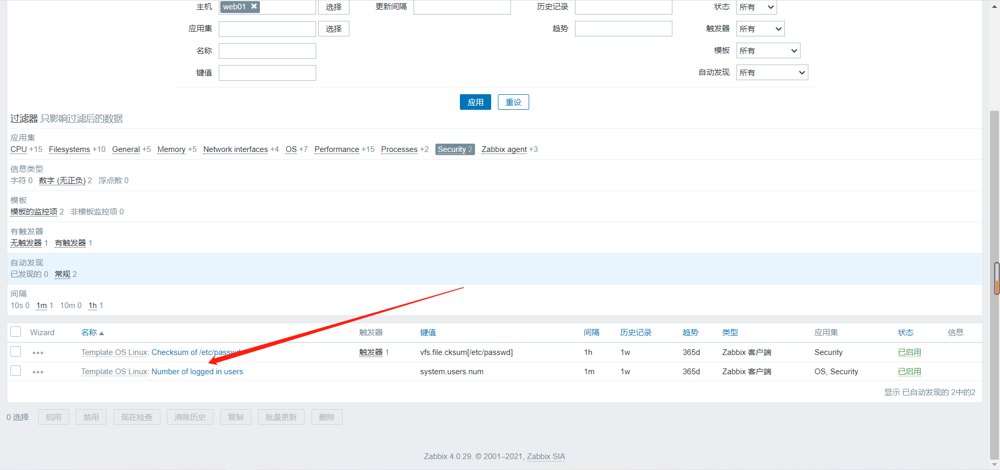


### 2、修改监控项更新间隔

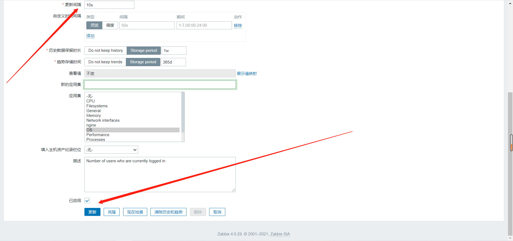


### 3、创建触发器

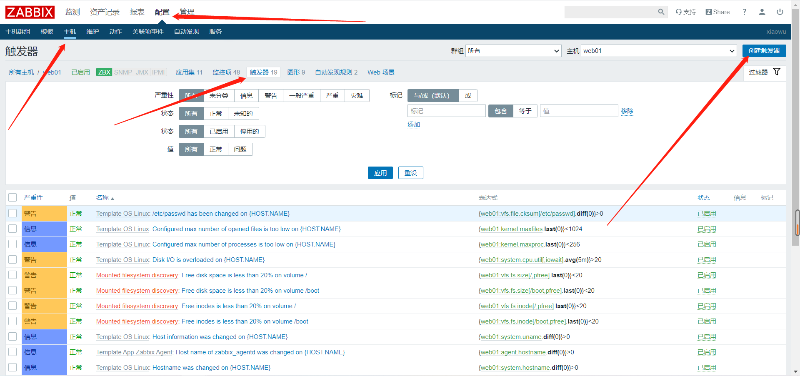

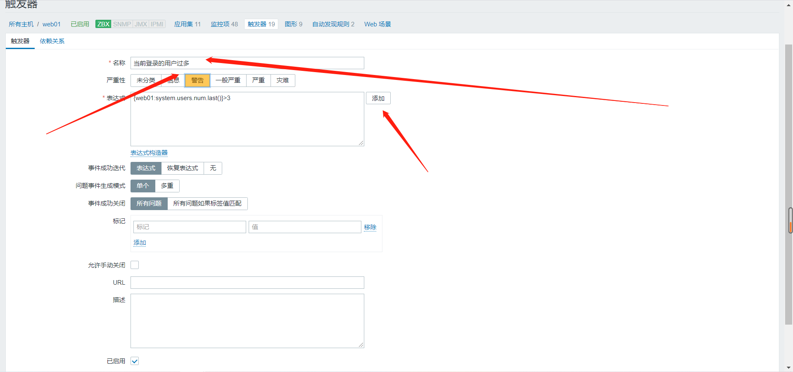

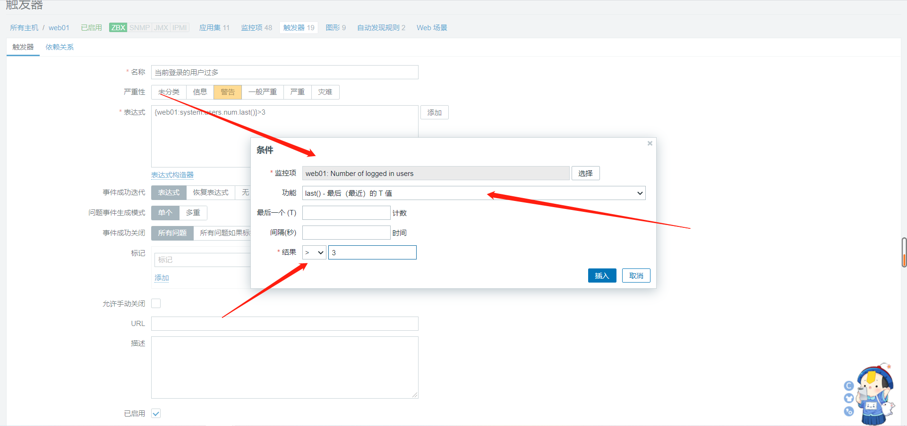

```bash
{web01:system.users.num.last()}>3
拆分：
	{
	web01				主机名
	:
	system.users.num	监控的key
	.
	last()				函数（最新）	
	}
	>3
	
	{主机名:key.avg(5m)}>3			平均五分钟大于3，告警
	{主机名:key.nodata(5m)}=1		平均五分钟没有数据，告警
```

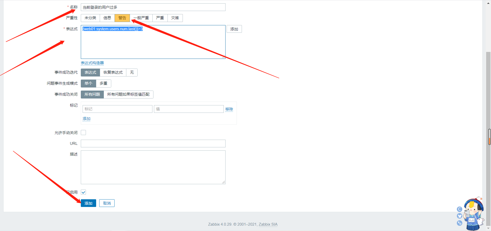

## 三、触发触发器

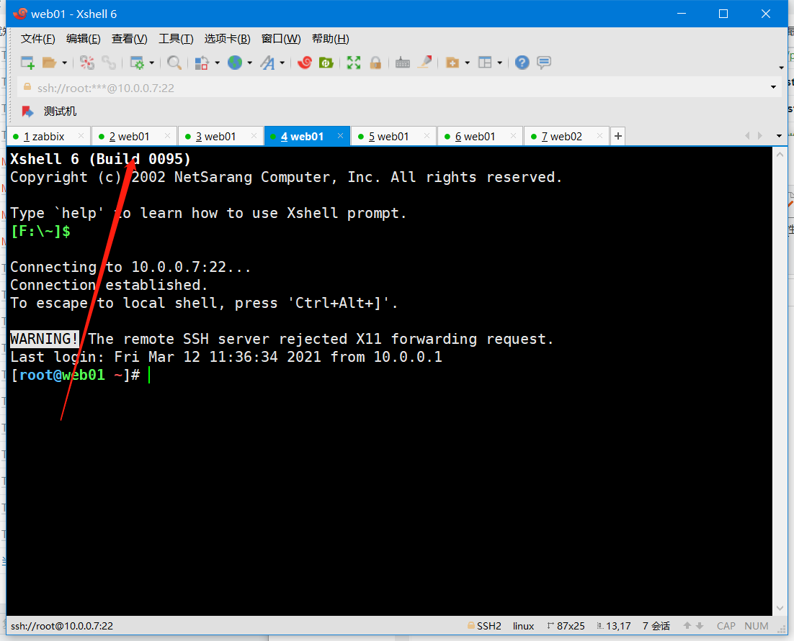

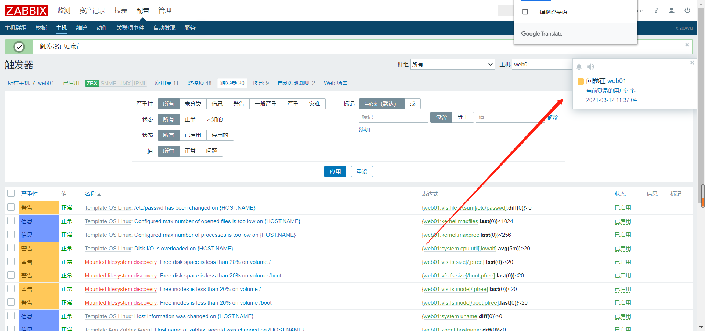

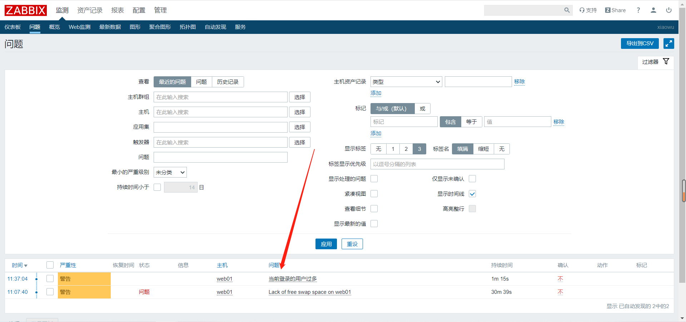


## 四、解决告警

```bash
ctrl+d		关闭登录用户
[root@web01 ~]# swapon -a		打开swap分区
```

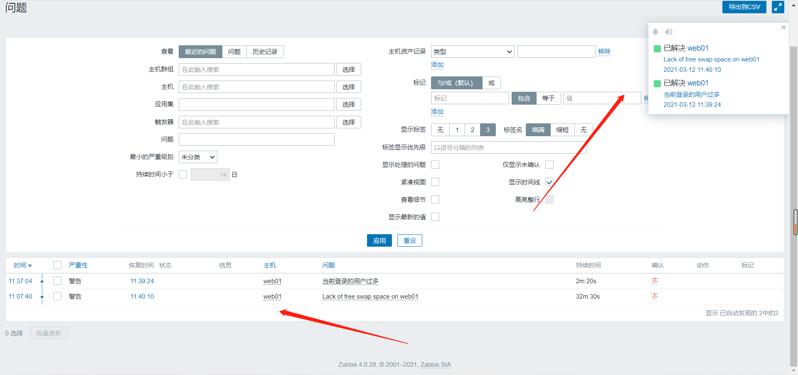


## 五、常用触发器函数

### 1、diff

```bash
最新值和前一个是否有变化
1：true 有变化
0：fase 无变化
常用于检测某个文件是否有变化


{10.0.0.8:vfs.file.cksum[/etc/passwd].diff()}>0
主机：10.0.0.8
key值：vfs.file.cksum[/etc/passwd]
函数方法：diff() 对比两次监控项的值
```


### 2、last

```bash
查看最新值的大小

指定范围

检测数量或大小的阈值、例如登录用户数，内存占用


{10.0.0.8:proc.num.last()}/{10.0.0.8:kernel.maxproc.las
t()}*100>80
10.0.0.8:proc.num：当前运行进程
10.0.0.8:kernel.maxproc 系统最大允许进程的数量
函数方法：last() 最新值

```


### 3、avg

```bash
一个时间段周期的平均值

检测一段时间资源的使用、例如cpu负载，网络带宽占用等波动指标
```


### 4、max、min

```bash
max：一个时间段内最大值
min：一个时间段内最小值

{10.0.0.8:vm.memory.size[available].min(5m)}
<{$MEMORY.AVAILABLE.MIN} and
{10.0.0.8:vm.memory.size[total].last()}>0
函数方法 mim(5m),max(5m),avg(5m)
{$MEMORY.AVAILABLE.MIN}=20m
and 同时
10.0.0.8:vm.memory.size[total] 最新的总内存大小
```


### 6、nodata

```bash
一个时间段内没有发现数据

查看某个服务是否存活
```


## 六、恢复触发器表达式

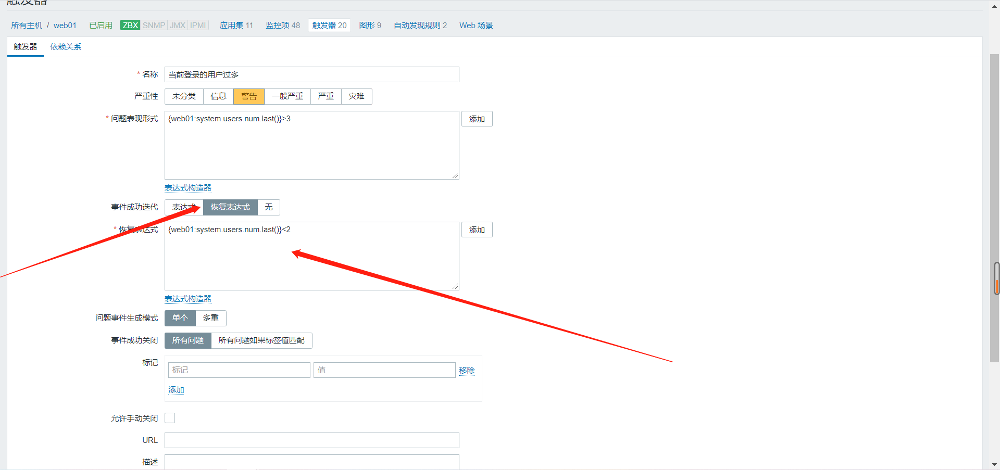


```bash
常用于周期内波动值的检测
```

