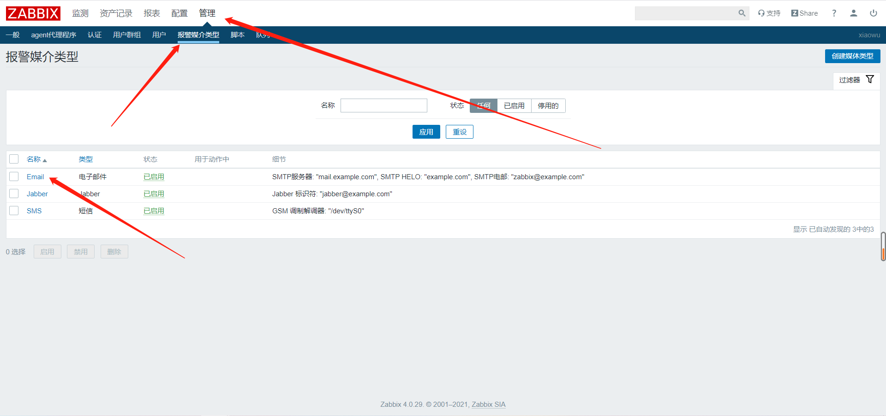
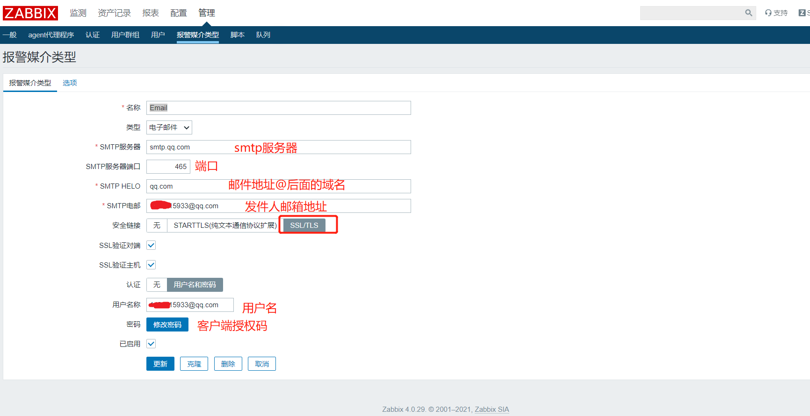
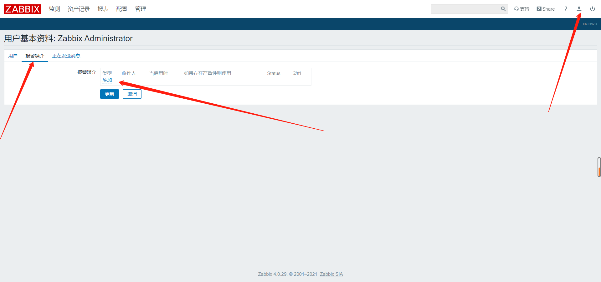
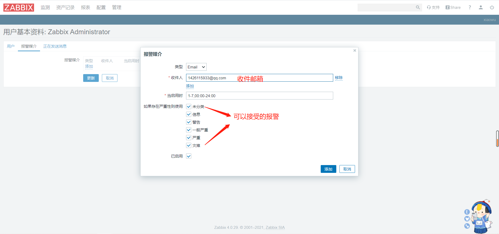
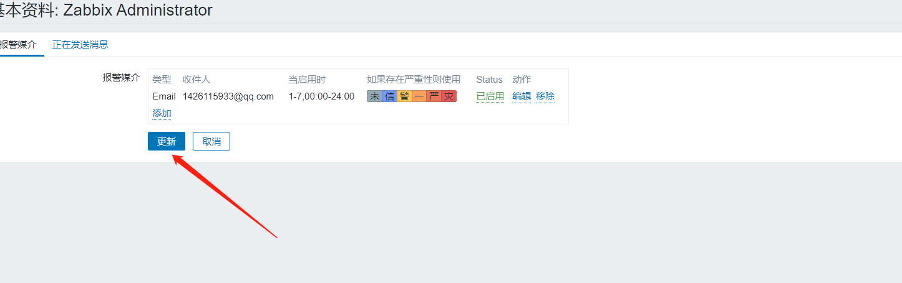
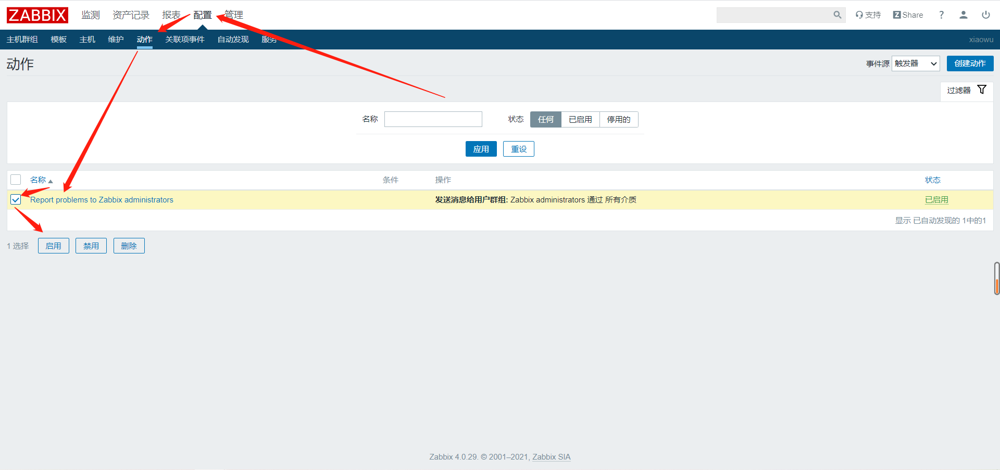
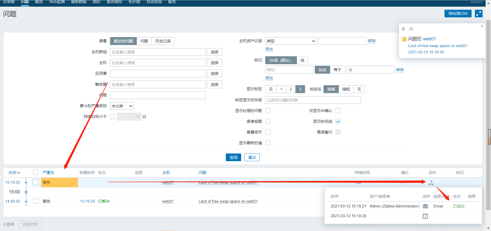
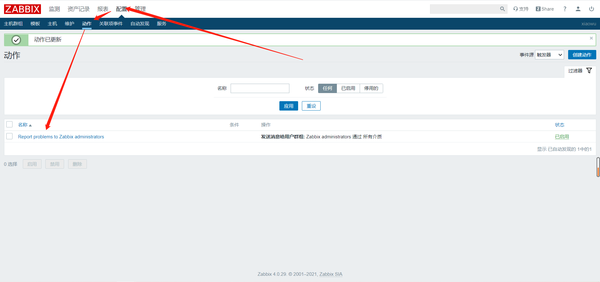
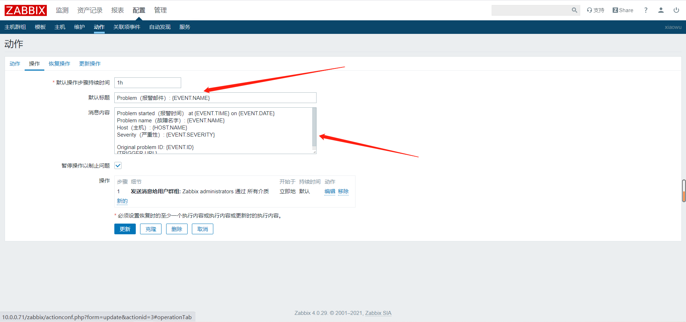
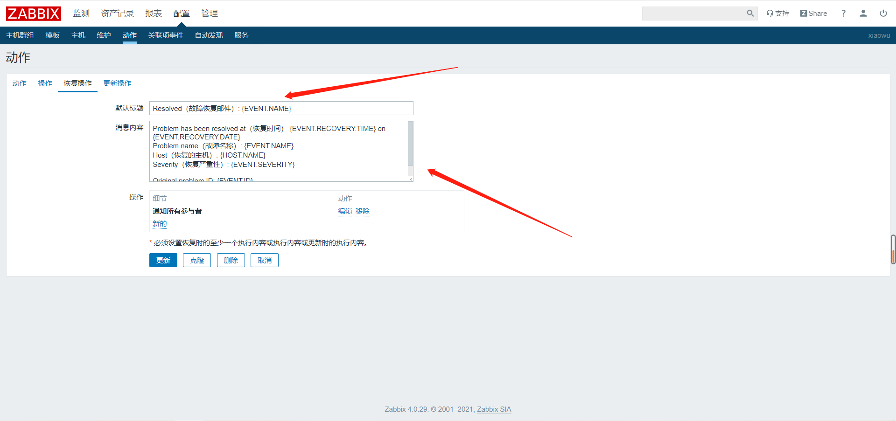

# 邮件报警

## 一、配置发件人





**获取授权码**


## 二、配置收件人








## 三、添加发送邮件的动作




## 四、测试

```bash
[root@web01 ~]# swapoff -a
```




## 五、自定义报警信息







其他常见变量：

https://www.zabbix.com/documentation/4.0/manual/appendix/macros/supported_by_location


注：任何修改操作需要更新的一定要更新保存


