# 微信告警

## 一、企业微信号申请

https://work.weixin.qq.com/

### 1、注册

因为我们没有企业，所以我们选择组织。

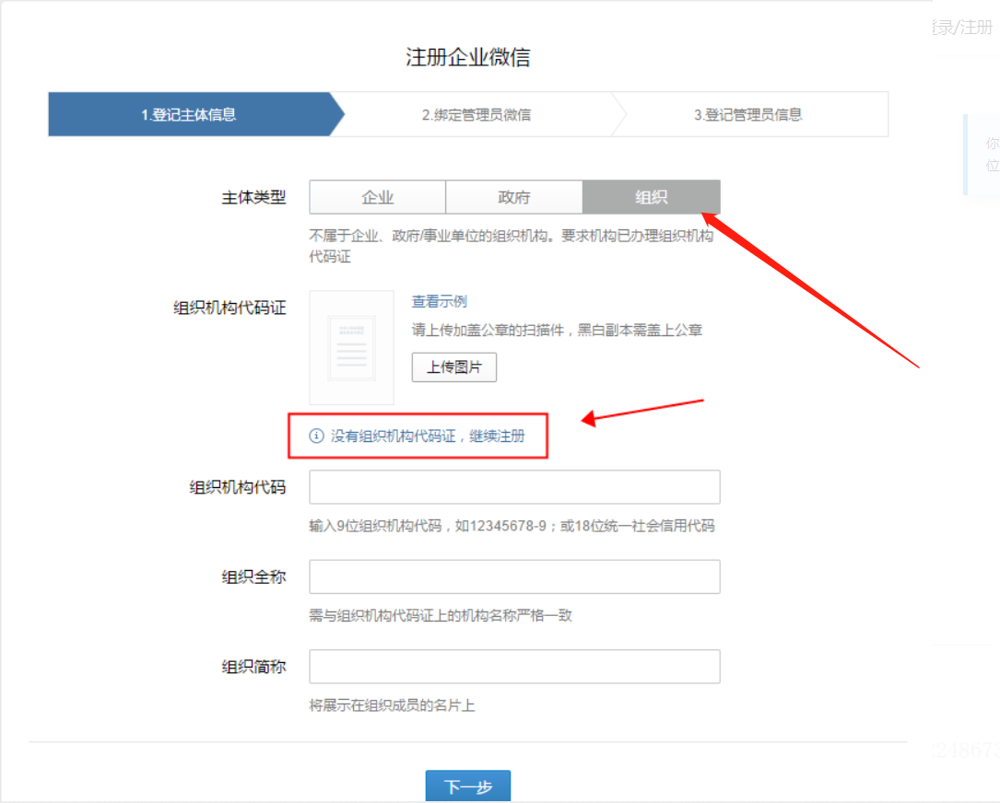

下一步，

按需填好相应信息


## 二、配置微信企业号

设置好相应信息，后记录下企业id

ps：我的企业微信早就注册了，所以中间步骤不全，大体就是信息补充

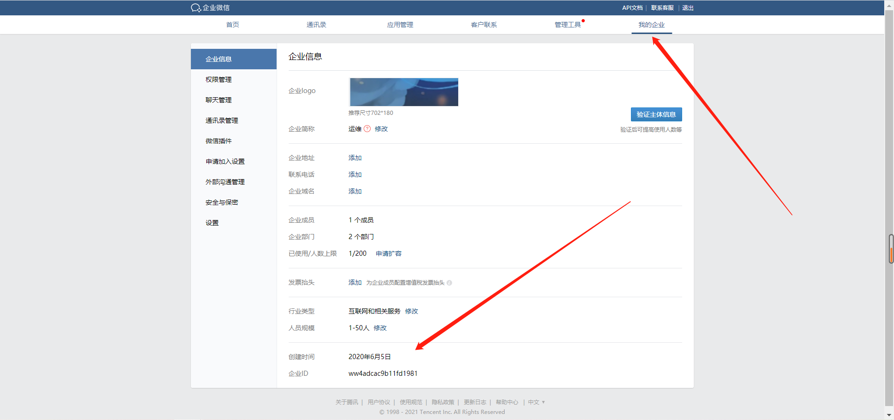

点击通讯录，添加一个组或成员。可以扫码添加或者短信邀请

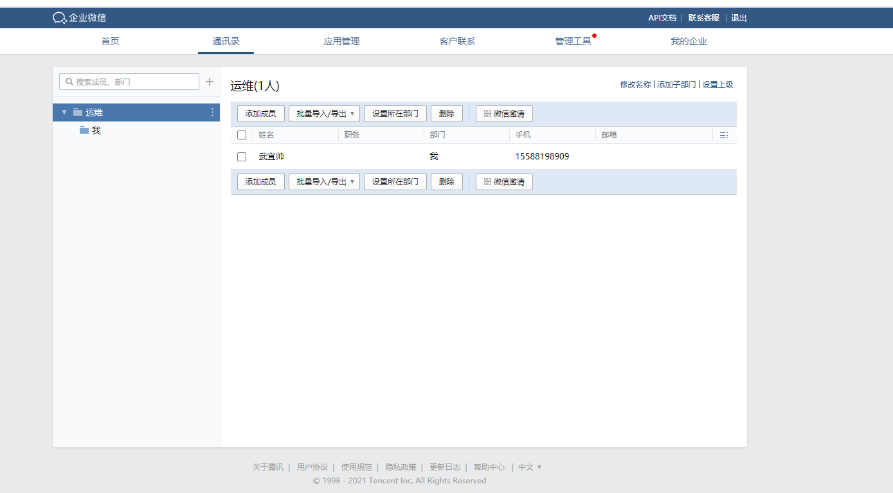

点击用户姓名，记录用户账号

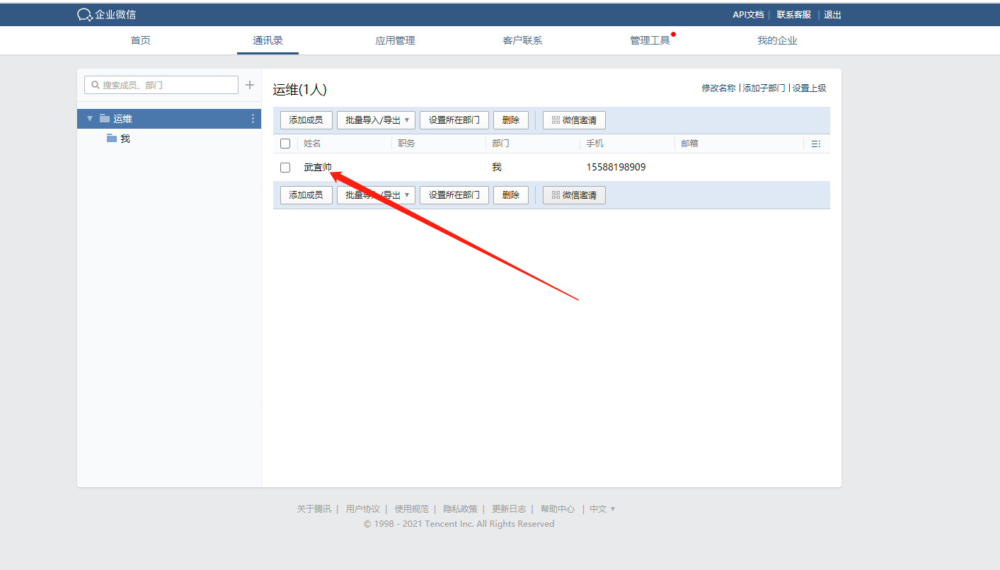

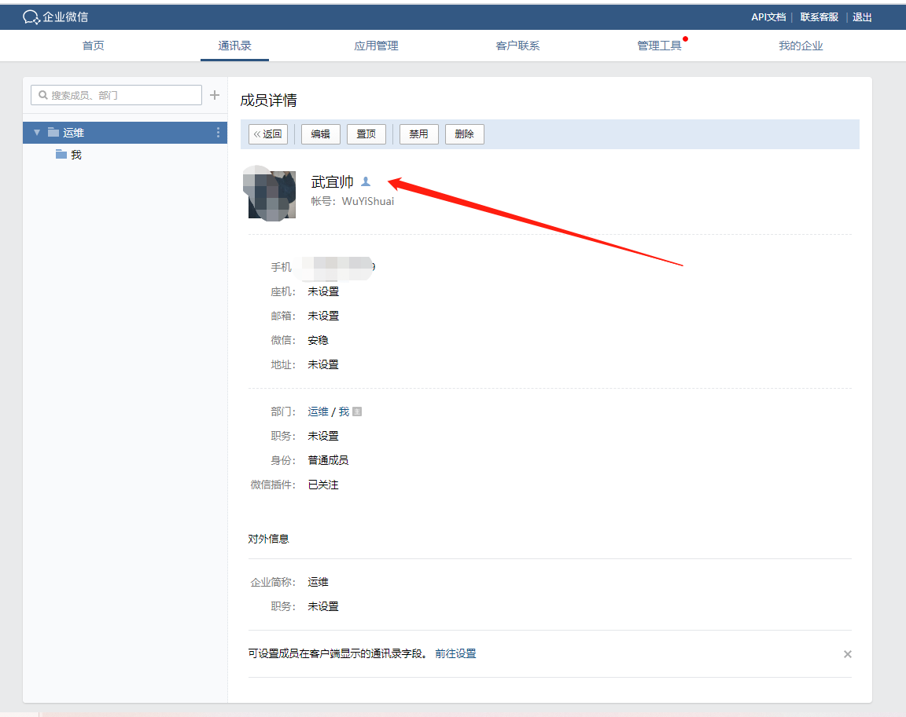


点击企业应用，新增应用

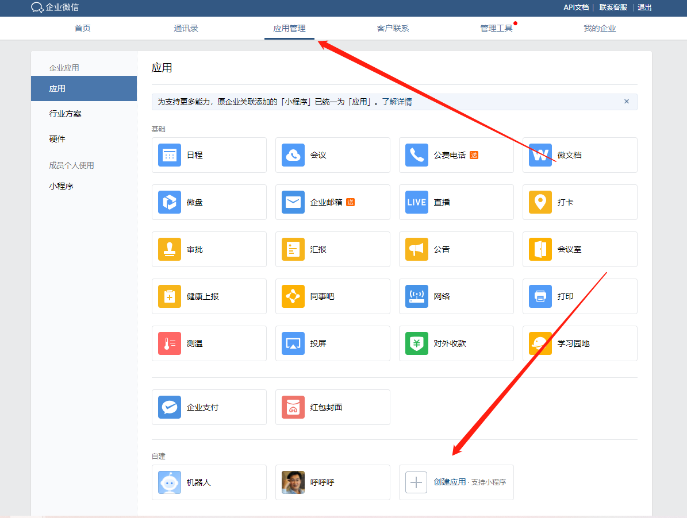

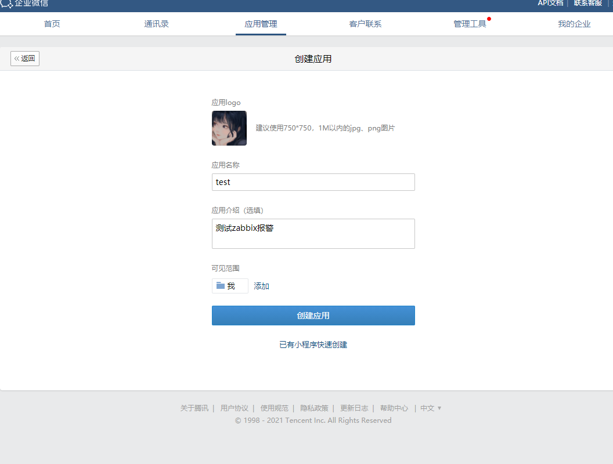

创建完成后记录agentld和secret


准备事项

```bash
微信企业号：
企业号已被部门成员关注
企业号有可以发消息的应用，授权管理员，可以使用应用给成员发送消息

需要的信息：
企业号id
secret
agentld
```


## 三、测试使用命令行发送消息

### 1、下载weixin.py脚本文件

链接：https://pan.baidu.com/s/1CN3CISkbNJwBGq1lepoN4Q 
提取码：952u 

### 2、上传脚本文件到数据库并修改

````bash
[root@zabbix ~]# rz weixin.py
[root@zabbix ~]# vim weixin.py
corpid = 'ww50a15d892a539965'
appsecret = '_eWeLhHDjylIrQoPIE9k2C_w205cWOxL6lmjSB7FMF8'
agentid = 1000003

分别对应刚才记录的值
````


### 3、安装pip

```bash
[root@zabbix ~]# yum install python-pip -y

如果下载不了：
[root@zabbix ~]# curl -o /etc/yum.repos.d/epel.repo http://mirrors.aliyun.com/repo/epel-7.repo
```


### 4、安装requests

```bash
[root@zabbix ~]# pip install -i https://pypi.tuna.tsinghua.edu.cn/simple requests
```


### 5、用命令行发送微信消息

```bash
[root@zabbix ~]# python weixin.py 'WuYiShuai' 'text' 2222

需要传参
第一个参数：企业微信用户名
第二个参数：标题
第三个参数：文章内容

```

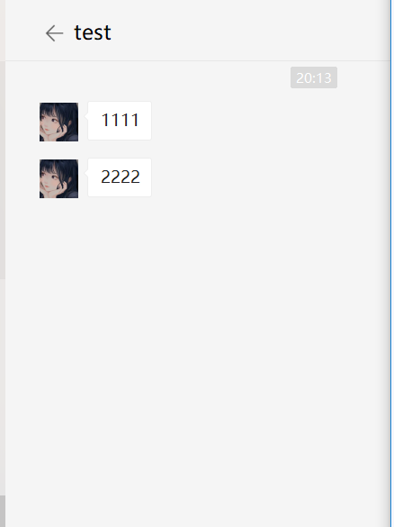

## 四、配置zabbix微信报警

### 1、查看报警脚本存放的目录

```bash
[root@zabbix ~]# grep script /etc/zabbix/zabbix_server.conf|grep Alert
# AlertScriptsPath=${datadir}/zabbix/alertscripts
AlertScriptsPath=/usr/lib/zabbix/alertscripts
```


### 2、将脚本移动到此目录并添加可执行权限

```bash
[root@zabbix ~]# mv weixin.py /usr/lib/zabbix/alertscripts/
[root@zabbix /usr/lib/zabbix/alertscripts]# chmod +x weixin.py 
```


### 3、给微信告警日志授予zabbix用户

```bash
[root@zabbix ~]# chown zabbix.zabbix /tmp/weixin.log 
```


### 4、创建报警媒介类型（发件人）

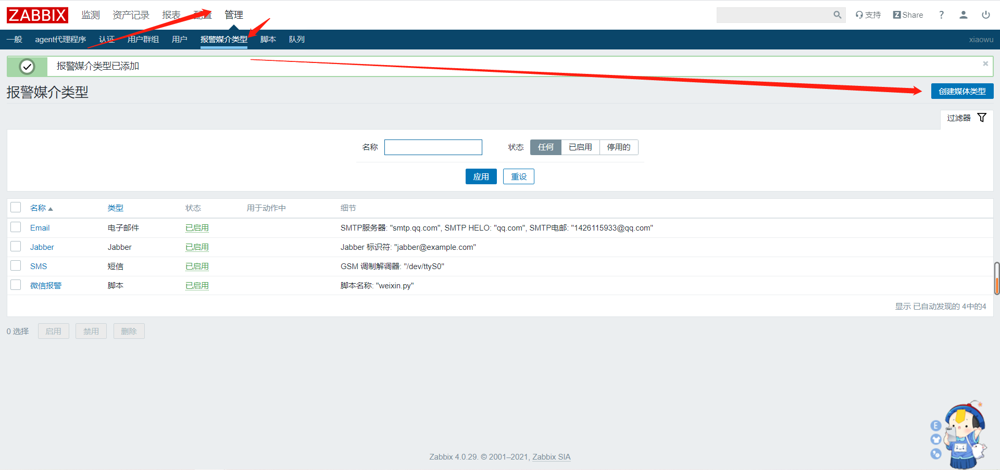

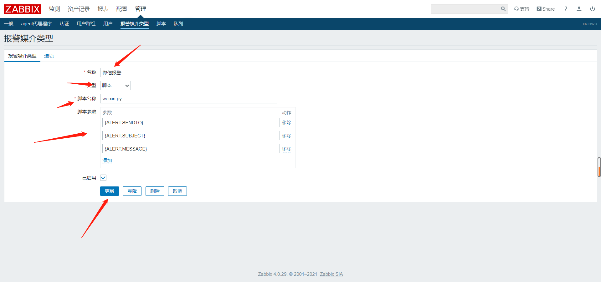

```bash
{ALERT.SENDTO}
{ALERT.SUBJECT}
{ALERT.MESSAGE}
```

**注：尽量不要手敲，括号两边不能有空格**


### 5、创建报警媒介（收件人）

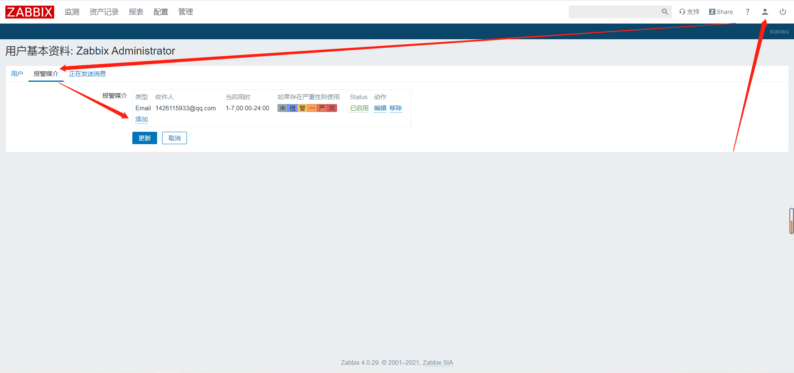

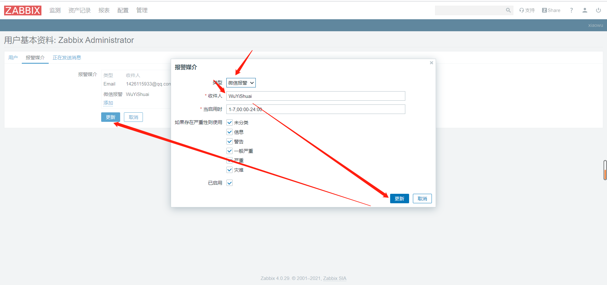


### 6、触发测试

```bash
[root@web01 ~]# swapoff -a
```

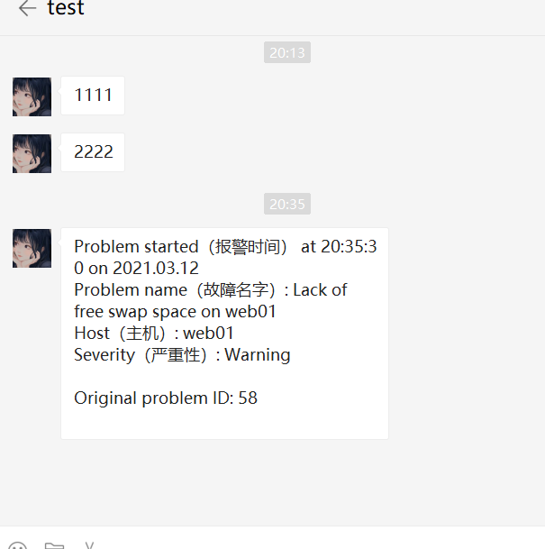

**恢复**

```bash
[root@web01 ~]# swapon -a
```

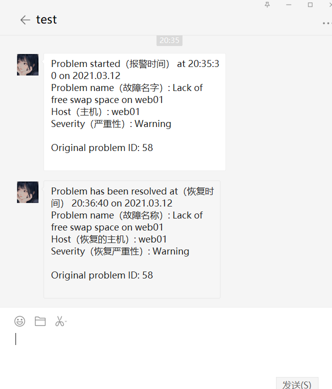


