# 报警升级

## 一、简介

```bash
一定时间未解决问题时，发报警给上司。报警升级
```

## 二、步骤

### 1、创建上司用户

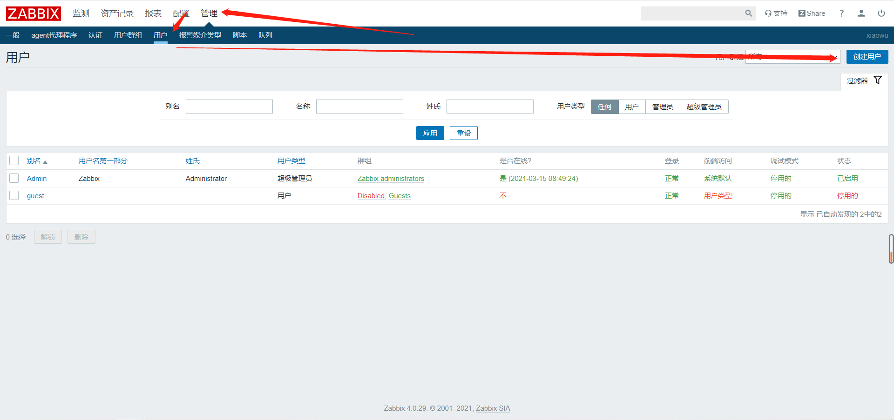

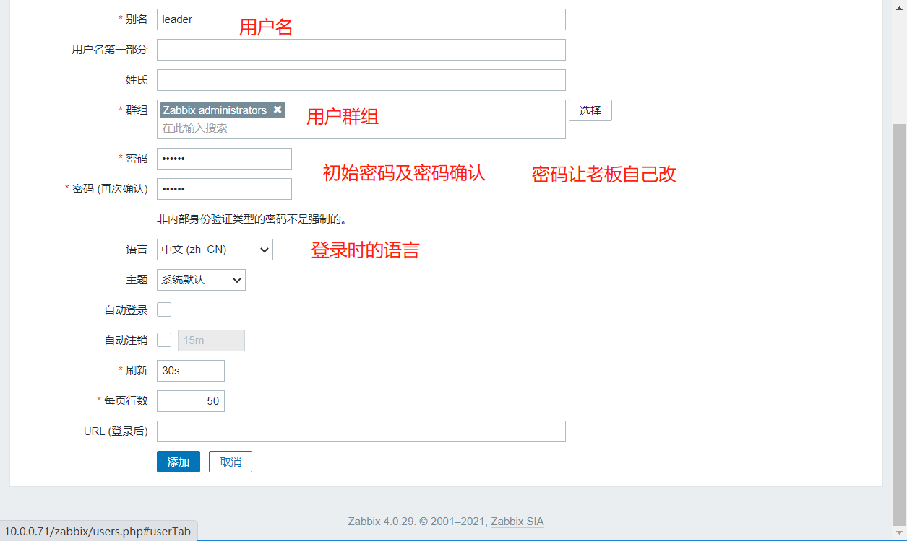

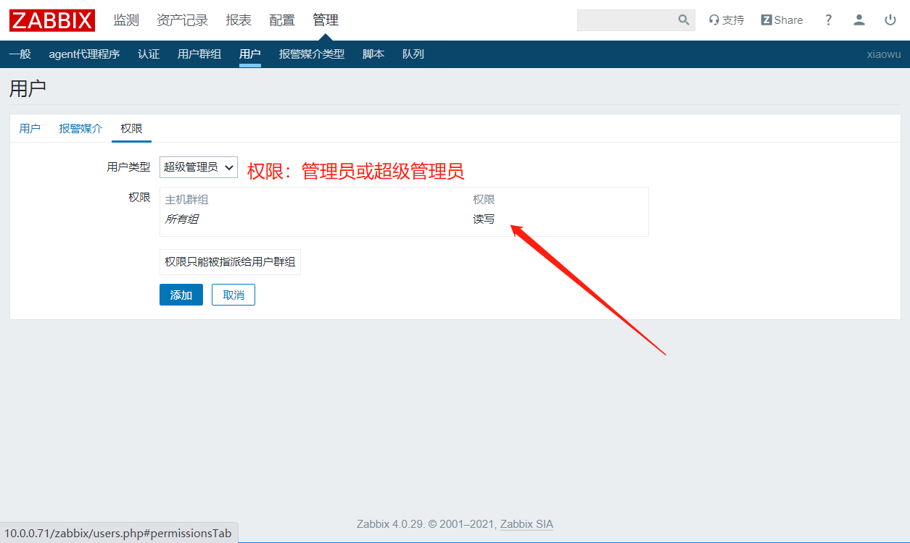

点击添加

### 2、设置事件刚发生仅运维用户收到邮件（admin）

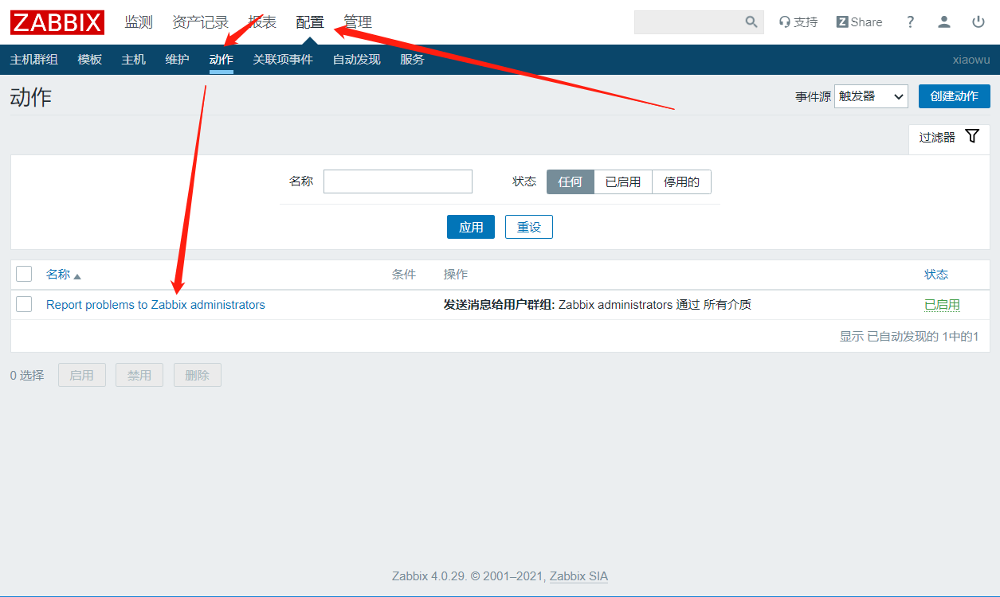

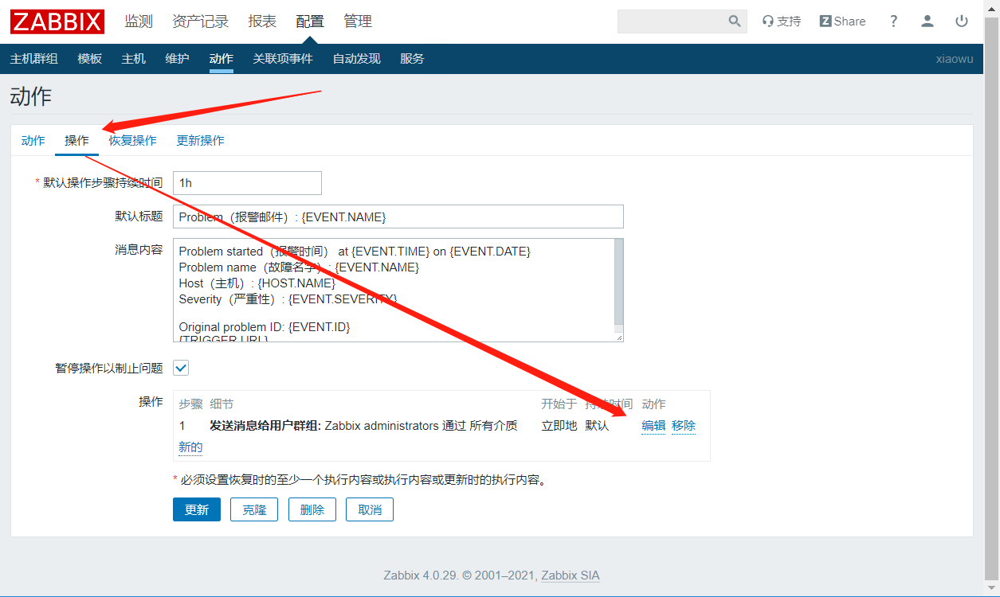

移除报警到用户组，添加报警到个体用户

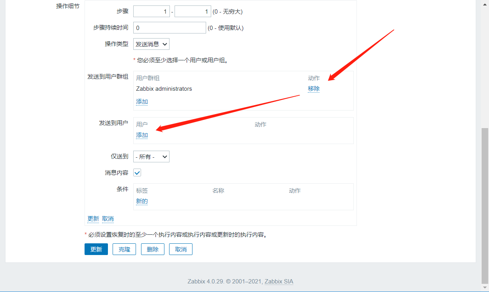

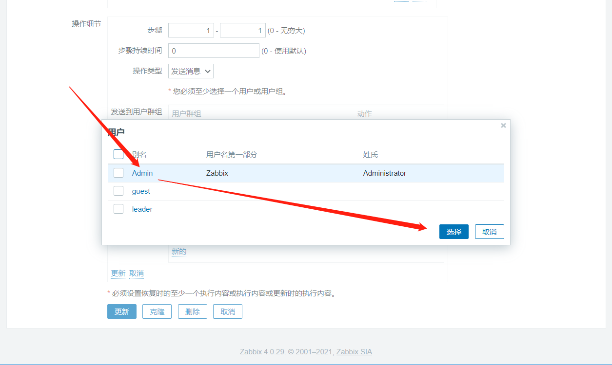

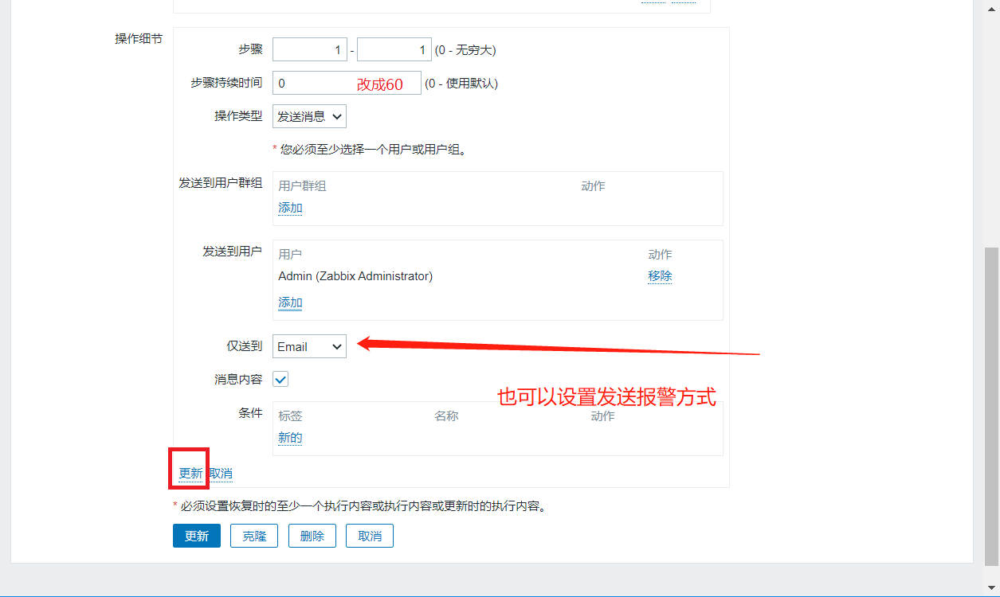

点击更新

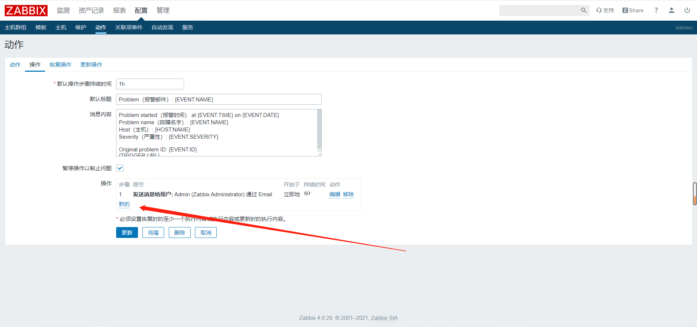

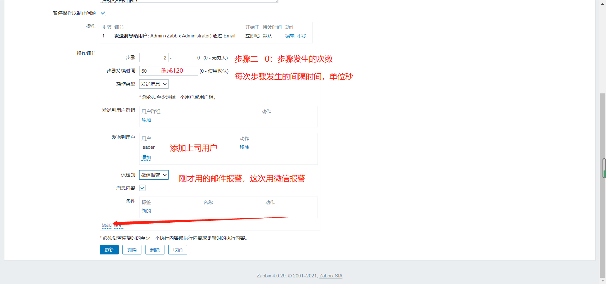

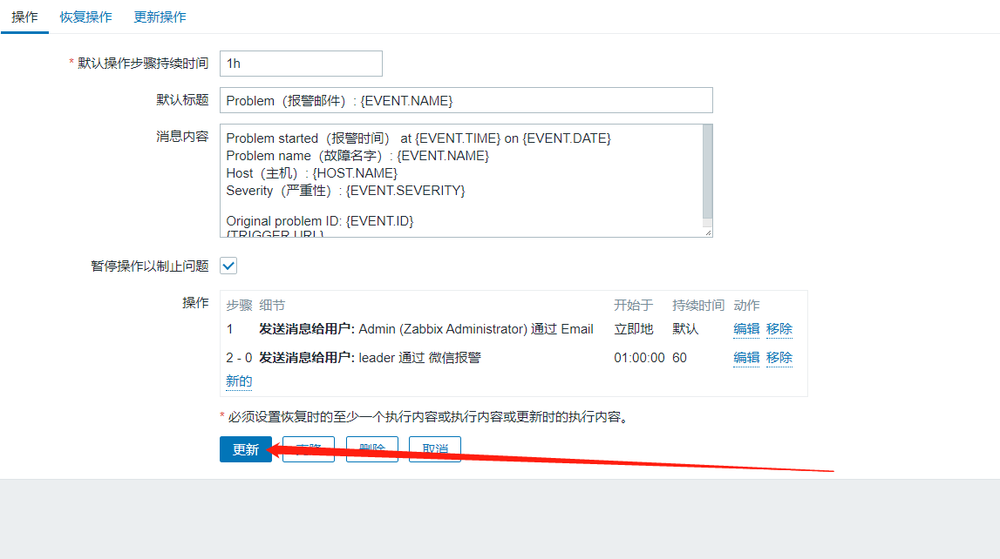


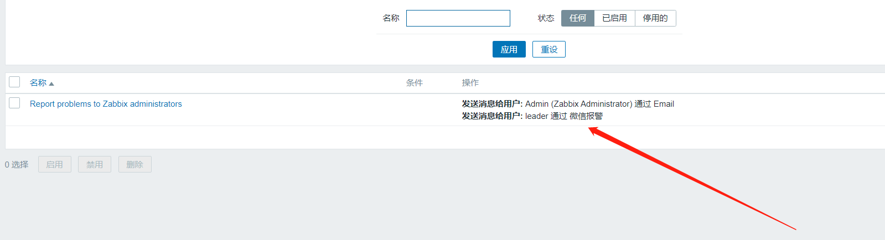

### 3、给上司用户创建报警媒介

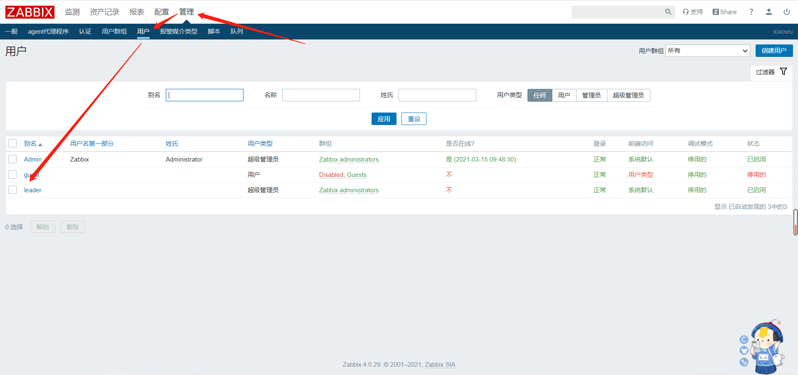

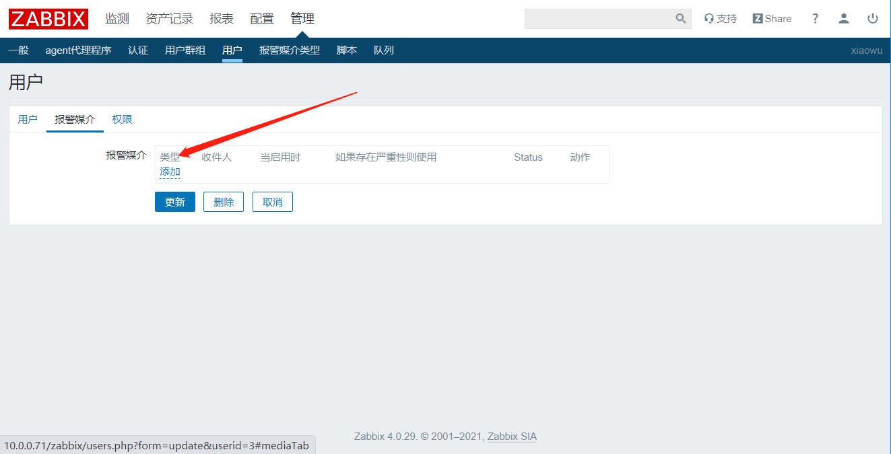

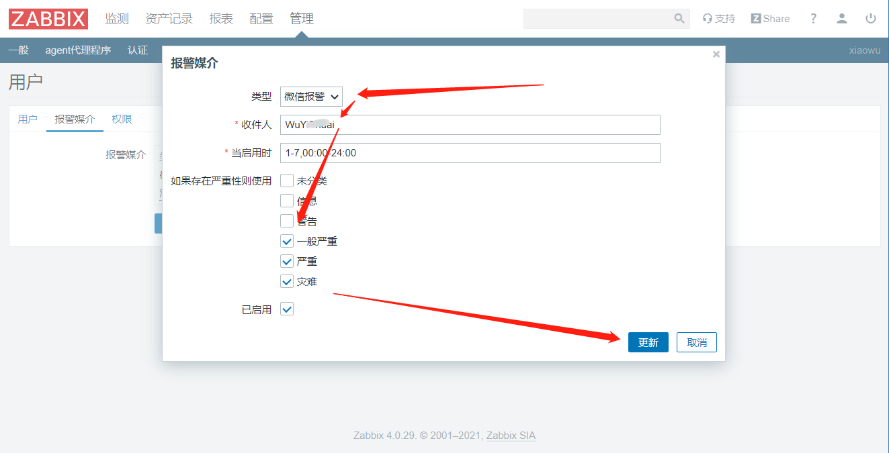

### 4、测试

```bash
[root@web01 ~]# swapoff -a
```

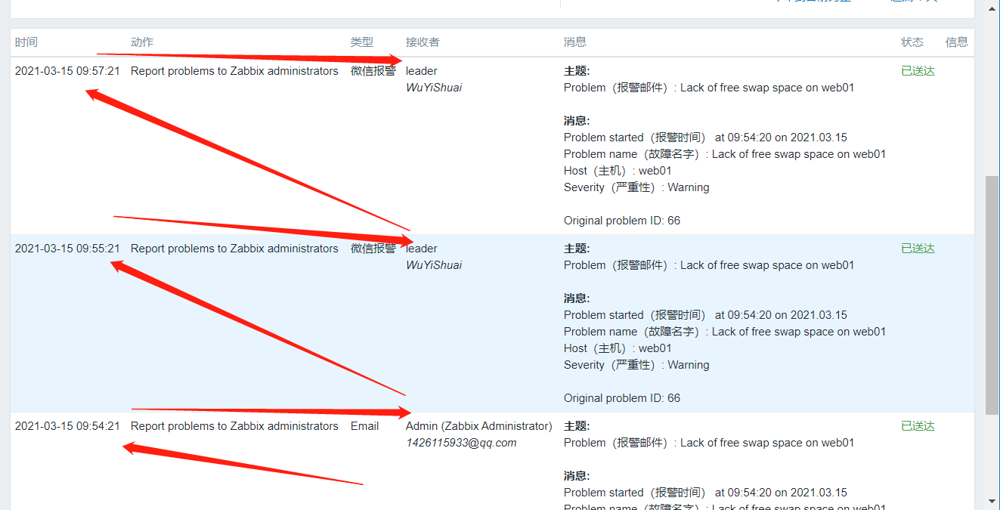


## 三、补充：报警自动执行命令

文章来源：

https://oldqiang.com/archives/505.html

### 1、修改客户端启用远程命令功能

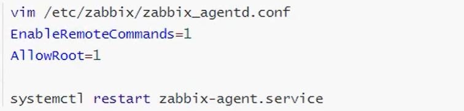

```mysql
EnableRemoteCommands=1	启用远程没命了
AllowRoot=1		已root身份运行
```

### 2、添加动作操作


