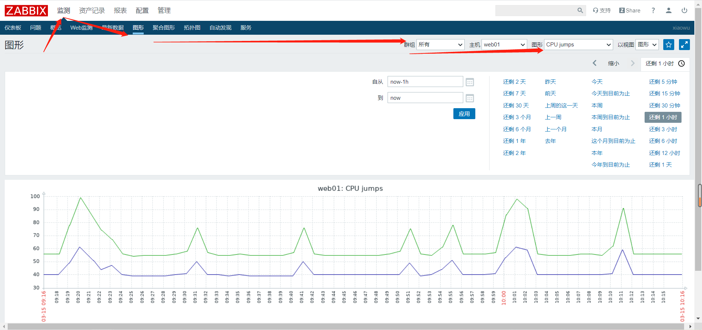
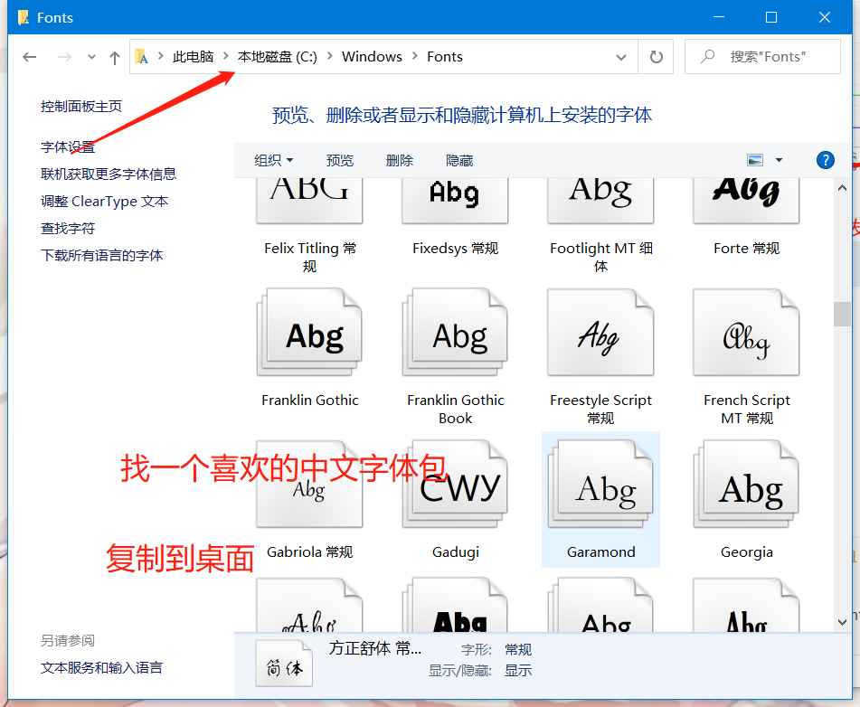
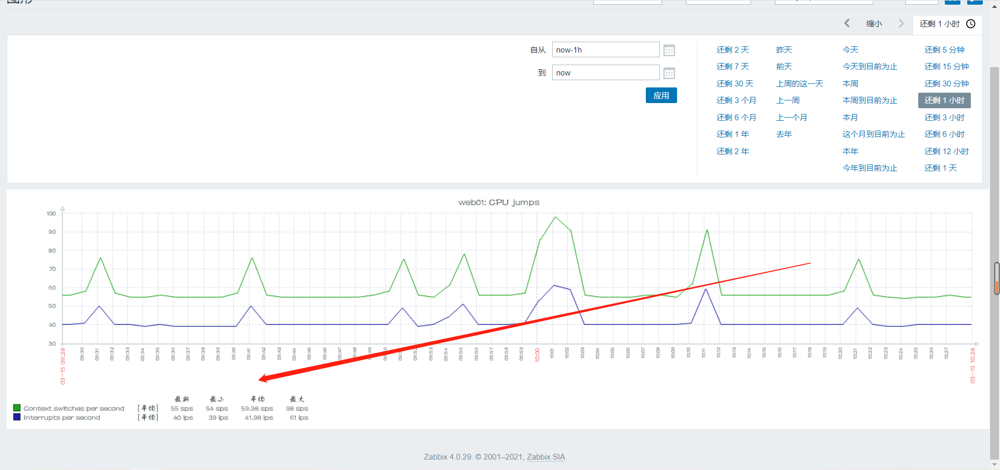
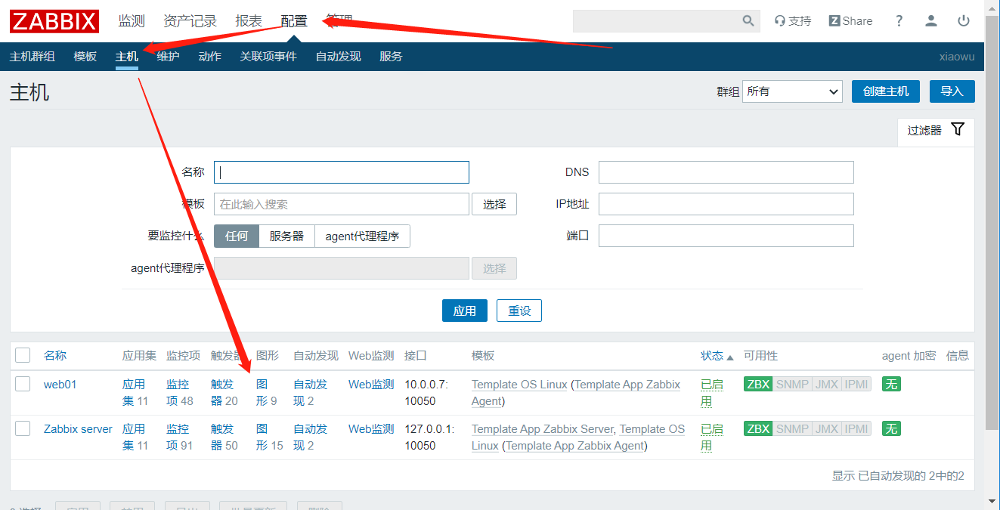
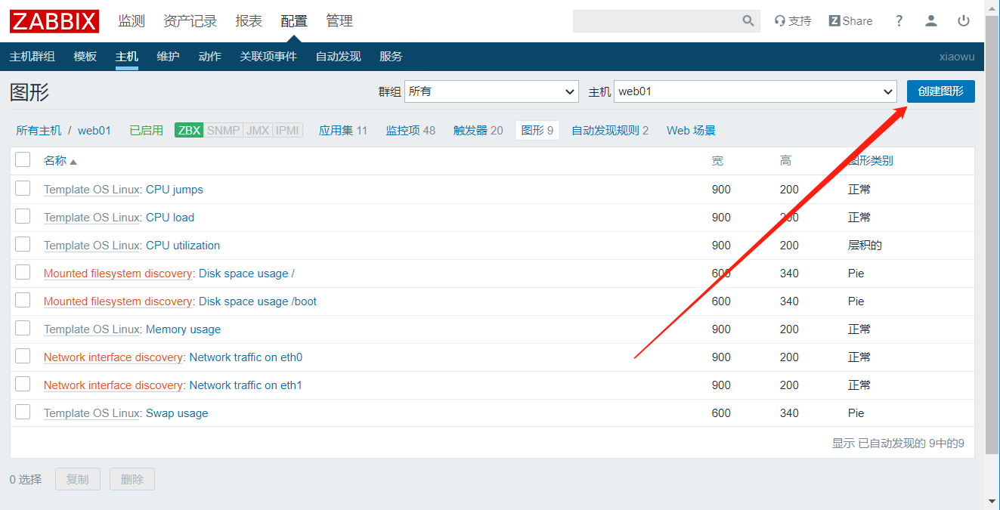
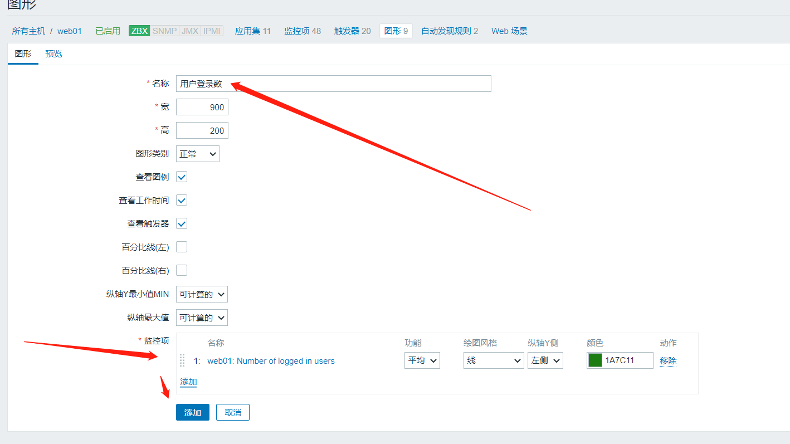
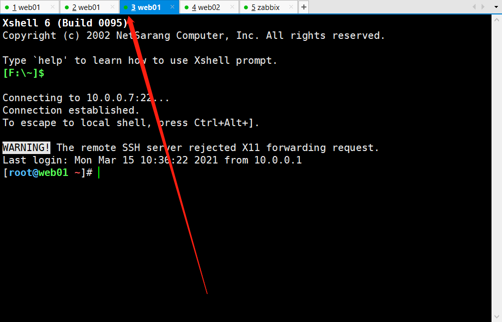
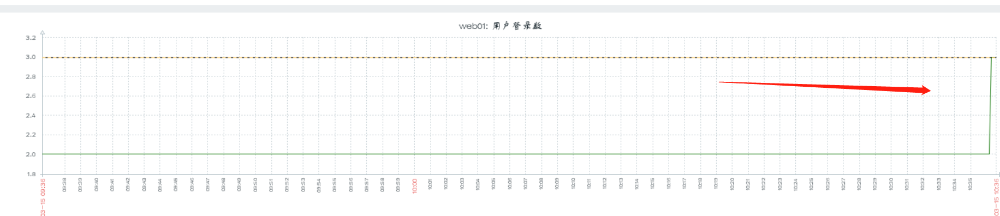

# 自定义图形

## 一、查看自带图形




### 字体更换




```bash
1.找到字体文件位置
[root@zabbix /usr/share/zabbix/assets/fonts]# ll
total 0
lrwxrwxrwx 1 root root 33 Mar 11 12:20 graphfont.ttf -> /etc/alternatives/zabbix-web-font

2.修改原字体文件名
[root@zabbix /usr/share/zabbix/assets/fonts]# mv graphfont.ttf graphfont.ttf.bak
[root@zabbix /usr/share/zabbix/assets/fonts]# ll
total 0
lrwxrwxrwx 1 root root 33 Mar 11 12:20 graphfont.ttf.bak -> /etc/alternatives/zabbix-web-font


3.上传桌面的字体文件

4.重命名
[root@zabbix /usr/share/zabbix/assets/fonts]# mv FZSTK.TTF graphfont.ttf
[root@zabbix /usr/share/zabbix/assets/fonts]# ll
total 7400
-rw-r--r-- 1 root root 7574196 Sep  8  2020 graphfont.ttf
lrwxrwxrwx 1 root root      33 Mar 11 12:20 graphfont.ttf.bak -> /etc/alternatives/zabbix-web-font

5.刷新页面
```




**随便自己看看图，QAQ不太好看**


## 二、自定义图形

### 1、创建过程








### 2、测试

**开个窗口**



**查看**

