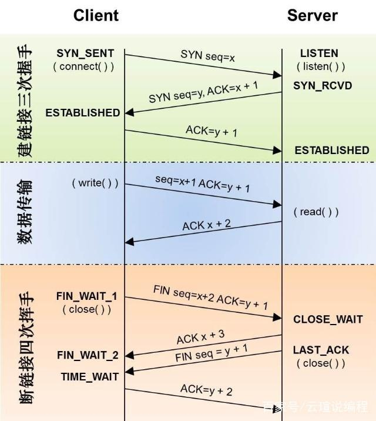

# tcp的十一种状态



```bash
LISTEN 			- 侦听来自远方TCP端口的连接请求； 
SYN-SENT 		- 在发送连接请求后等待匹配的连接请求； 
SYN-RECEIVED 	- 在收到和发送一个连接请求后等待对连接请求的确认； 
ESTABLISHED		- 代表一个打开的连接，数据可以传送给用户； 
FIN-WAIT-1 		- 等待远程TCP的连接中断请求，或先前的连接中断请求的确认；
FIN-WAIT-2 		- 从远程TCP等待连接中断请求； 
CLOSE-WAIT 		- 等待从本地用户发来的连接中断请求； 
CLOSING 		- 等待远程TCP对连接中断的确认； 
LAST-ACK 		- 等待原来发向远程TCP的连接中断请求的确认； 
TIME-WAIT 		- 等待足够的时间以确保远程TCP接收到连接中断请求的确认； 
CLOSED 			- 没有任何连接状态；
```


上图主要包括三部分：**建立连接、传输数据、断开连接。**

​	建立TCP连接很简单，通过三次握手便可建立连接。建立好连接后，开始传输数据。TCP数据传输牵涉到的概念很多：超时重传、快速重传、流量控制、拥塞控制等等。断开连接的过程也很简单，通过四次握手完成断开连接的过程。**三次握手建立连接：**

​	**第一次握手：**客户端发送syn包(seq=x)到服务器，并进入SYN_SEND状态，等待服务器确认;**第二次握手：**服务器收到syn包，必须确认客户的SYN(ack=x+1)，同时自己也发送一个SYN包(seq=y)，即SYN+ACK包，此时服务器进入SYN_RECV状态;**第三次握手：**客户端收到服务器的SYN+ACK包，向服务器发送确认包ACK(ack=y+1)，此包发送完毕，客户端和服务器进入ESTABLISHED状态，完成三次握手。

​	握手过程中传送的包里不包含数据，三次握手完毕后，客户端与服务器才正式开始传送数据。理想状态下，TCP连接一旦建立，在通信双方中的任何一方主动关闭连接之前，TCP 连接都将被一直保持下去。

​	SYN洪水攻击：根据TCP三次握手有始有终的特性，进行大规模SYN请求，但不返回ACK。导致服务端内存缓冲（有限的）被占用。如果恶意攻击方快速连续地发送此类连接请求，该[服务器](https://baike.baidu.com/item/服务器)可用的TCP连接队列将很快被阻塞，系统可用资源急剧减少，网络可用带宽迅速缩小，长此下去，除了少数幸运用户的请求可以插在大量虚假请求间得到应答外，服务器将无法向用户提供正常的合法服务。


​	dos攻击：denied of service 即拒绝服务，造成DoS的攻击行为被称为DoS攻击，其目的是使计算机或网络无法提供正常的服务。最常见的DoS攻击有计算机网络宽带攻击和连通性攻击。SYN洪水攻击就属于Dos攻击的一种

​	直接禁攻击IP


​	Ddos攻击（Distributed Denial of Service）：分布式dos攻击

方法：

买阿里云高防ip		最有效

恶意请求拦截	防火墙  wen服务deny 效果不大

cdn、带宽扩容					有一定效果


​	**传输数据过程：**

**a.超时重传**超时重传机制用来保证TCP传输的可靠性。每次发送数据包时，发送的数据报都有seq号，接收端收到数据后，会回复ack进行确认，表示某一seq 号数据已经收到。发送方在发送了某个seq包后，等待一段时间，如果没有收到对应的ack回复，就会认为报文丢失，会重传这个数据包。**b.快速重传**接受数据一方发现有数据包丢掉了。就会发送ack报文告诉发送端重传丢失的报文。如果发送端连续收到标号相同的ack包，则会触发客户端的快速重 传。比较超时重传和快速重传，可以发现超时重传是发送端在傻等超时，然后触发重传;而快速重传则是接收端主动告诉发送端数据没收到，然后触发发送端重传。**c.流量控制**这里主要说TCP滑动窗流量控制。TCP头里有一个字段叫Window，又叫Advertised-Window，这个字段是接收端告诉发送端自己 还有多少缓冲区可以接收数据。于是发送端就可以根据这个接收端的处理能力来发送数据，而不会导致接收端处理不过来。 滑动窗可以是提高TCP传输效率的一种机制。**d.拥塞控制**滑动窗用来做流量控制。流量控制只关注发送端和接受端自身的状况，而没有考虑整个网络的通信情况。拥塞控制，则是基于整个网络来考虑的。考虑一下这 样的场景：某一时刻网络上的延时突然增加，那么，TCP对这个事做出的应对只有重传数据，但是，重传会导致网络的负担更重，于是会导致更大的延迟以及更多 的丢包，于是，这个情况就会进入恶性循环被不断地放大。试想一下，如果一个网络内有成千上万的TCP连接都这么行事，那么马上就会形成“网络风 暴”，TCP这个协议就会拖垮整个网络。为此，TCP引入了拥塞控制策略。拥塞策略算法主要包括：慢启动，拥塞避免，拥塞发生，快速恢复。

**四次握手断开连接：**

​	**第一次挥手：**主动关闭方发送一个FIN，用来关闭主动方到被动关闭方的数据传送，也就是主动关闭方告诉被动关闭方：我已经不会再给你发数据了(当 然，在fin包之前发送出去的数据，如果没有收到对应的ack确认报文，主动关闭方依然会重发这些数据)，但此时主动关闭方还可以接受数据。

​	**第二次挥手：**被动关闭方收到FIN包后，发送一个ACK给对方，确认序号为收到序号+1(与SYN相同，一个FIN占用一个序号)。

​	**第三次挥手：**被动关闭方发送一个FIN，用来关闭被动关闭方到主动关闭方的数据传送，也就是告诉主动关闭方，我的数据也发送完了，不会再给你发数据了。

​	**第四次挥手：**主动关闭方收到FIN后，发送一个ACK给被动关闭方，确认序号为收到序号+1，至此，完成四次挥手。