# 批量创建自定义监控项

## 一、非zabbix监控自定义监控项

### 1、需要监控的tcp十一种状态

```bash
ESTABLISHED
SYN_SENT
SYN_RECV
FIN_WAIT1
FIN_WAIT2
TIME_WAIT
CLOSE
CLOSE_WAIT
LAST_ACK
LISTEN
CLOSING
```

### 2、命令行监控

```bash
[root@web01 ~]# netstat -ant|grep -c ESTABLISHED
1

[root@web01 ~]# netstat -ant|grep -c SYN_SENT
0
....
```


## 二、手动批量创建自定义监控项

### 1）将十一种状态写入一个文件

```bash
[root@zabbix ~]# vim tcps.txt
ESTABLISHED
SYN_SENT
SYN_RECV
FIN_WAIT1
FIN_WAIT2
TIME_WAIT
CLOSE
CLOSE_WAIT
LAST_ACK
LISTEN
CLOSING
```


### 2)使用循环创建子配置文件，自定义监控项key

```bash
[root@zabbix ~]# for n in `cat tcps.txt`; do echo "UserParameter=$n,netstat -ant |grep -c $n">>/etc/zabbix/zabbix_agentd.d/user_def.conf ;done
[root@zabbix ~]# cat /etc/zabbix/zabbix_agentd.d/user_def.conf 
  1 UserParameter=ESTABLISHED,netstat -ant |grep -c ESTABLISHED
  2 UserParameter=SYN_SENT,netstat -ant |grep -c SYN_SENT
  3 UserParameter=SYN_RECV,netstat -ant |grep -c SYN_RECV
  4 UserParameter=FIN_WAIT1,netstat -ant |grep -c FIN_WAIT1
  5 UserParameter=FIN_WAIT2,netstat -ant |grep -c FIN_WAIT2
  6 UserParameter=TIME_WAIT,netstat -ant |grep -c TIME_WAIT
  7 UserParameter=CLOSE,netstat -ant |grep -c CLOSE
  8 UserParameter=CLOSE_WAIT,netstat -ant |grep -c CLOSE_WAIT
  9 UserParameter=LAST_ACK,netstat -ant |grep -c LAST_ACK
 10 UserParameter=LISTEN,netstat -ant |grep -c LISTEN
 11 UserParameter=CLOSING,netstat -ant |grep -c CLOSING


格式：UserParameter=名,值
```


### 3）重启测试

```bash
[root@zabbix ~]# systemctl restart zabbix-agent.service 
[root@zabbix ~]# zabbix_get -s 127.0.0.1 -k TIME_WAIT
42
```


### 4）web页面添加自定义监控项

#### 1.创建应用集

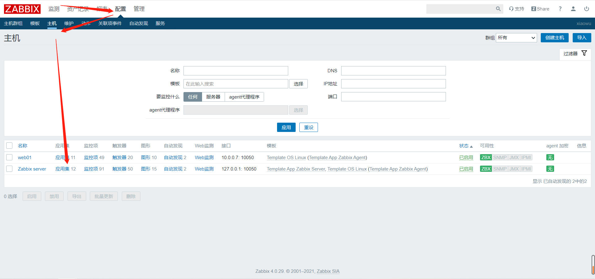

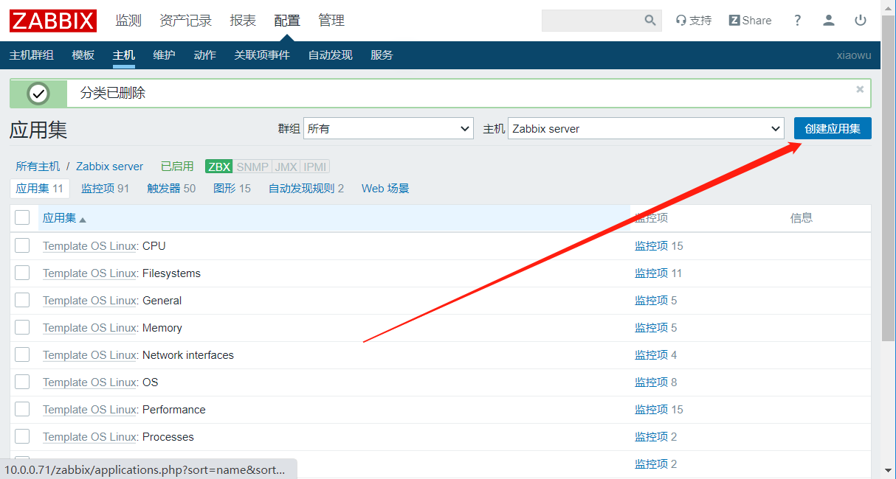

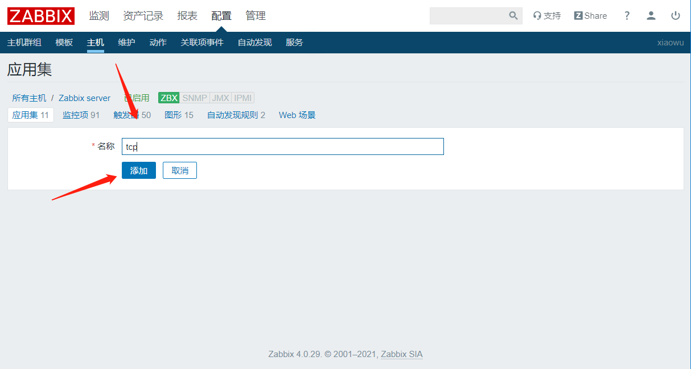


#### 2.创建监控项

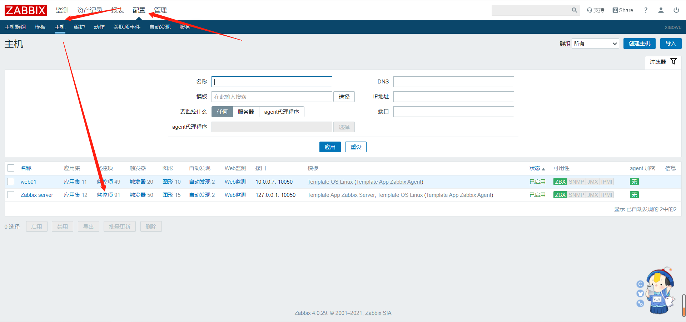

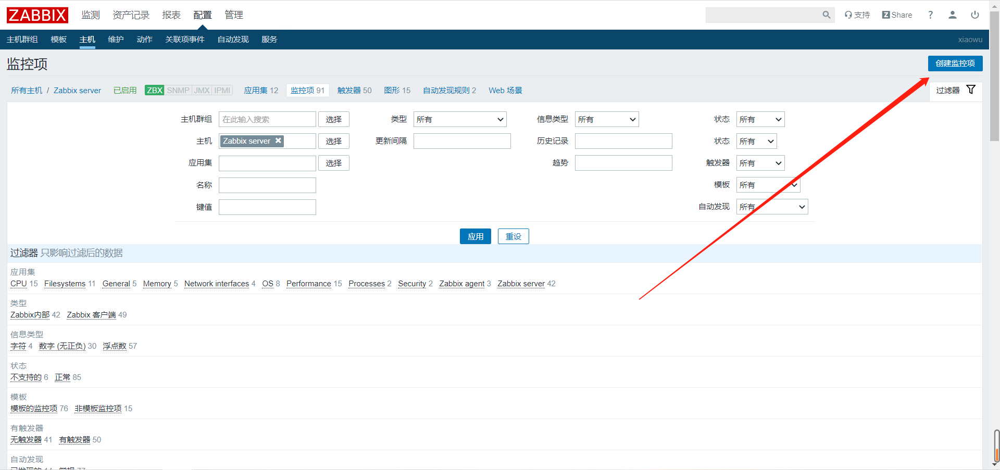

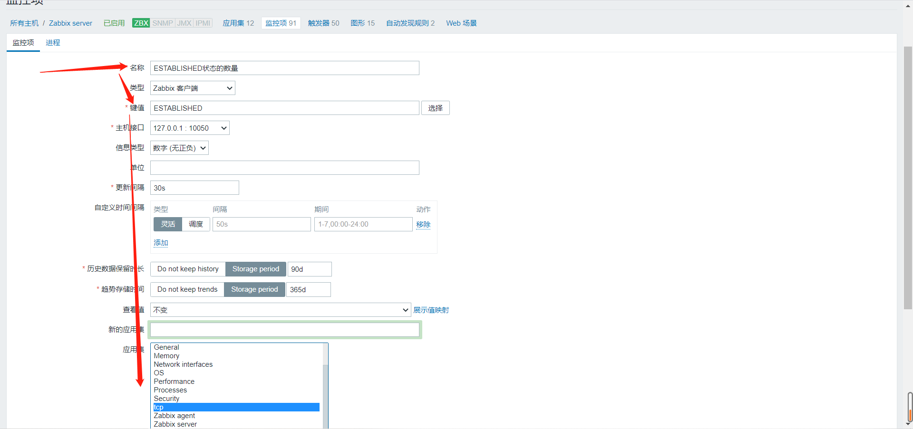

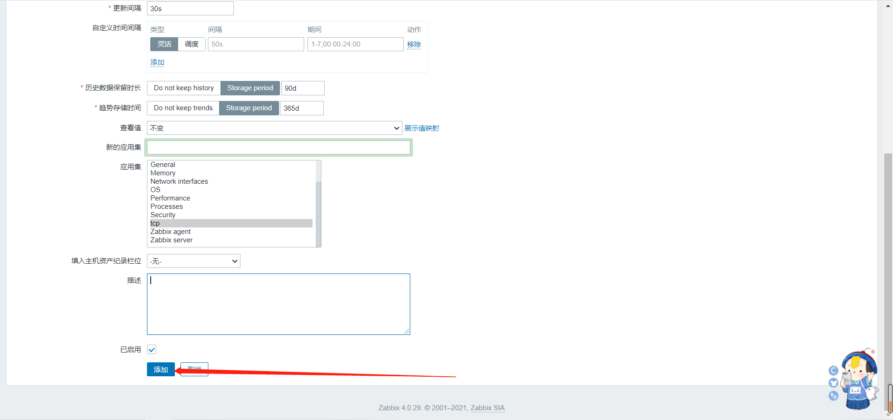

**剩下十个同上**


## 三、抓包循环创建自定义监控项

### 1、获取添加监控项请求数据

#### 1) 添加监控项请求url：

```bash
http://10.0.0.71/zabbix/items.php
```

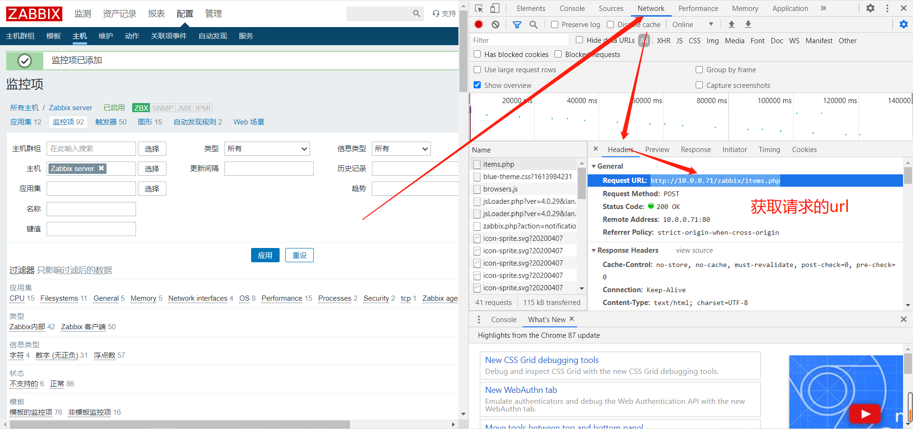


#### 2）添加监控项请求原始数据

```bash
sid=fe3fd5f8f595d727&form_refresh=1&form=create&hostid=10084&selectedInterfaceId=0&name=ESTABLISHED%E7%8A%B6%E6%80%81%E7%9A%84%E6%95%B0%E9%87%8F&type=0&key=ESTABLISHED&url=&query_fields%5Bname%5D%5B1%5D=&query_fields%5Bvalue%5D%5B1%5D=&timeout=3s&post_type=0&posts=&headers%5Bname%5D%5B1%5D=&headers%5Bvalue%5D%5B1%5D=&status_codes=200&follow_redirects=1&retrieve_mode=0&http_proxy=&http_username=&http_password=&ssl_cert_file=&ssl_key_file=&ssl_key_password=&interfaceid=1&snmpv3_authprotocol=0&snmpv3_privprotocol=0&params_es=&params_ap=&params_f=&value_type=3&units=&delay=30s&delay_flex%5B0%5D%5Btype%5D=0&delay_flex%5B0%5D%5Bdelay%5D=&delay_flex%5B0%5D%5Bschedule%5D=&delay_flex%5B0%5D%5Bperiod%5D=&history_mode=1&history=90d&trends_mode=1&trends=365d&valuemapid=0&new_application=&applications%5B%5D=1162&inventory_link=0&description=&status=0&add=%E6%B7%BB%E5%8A%A0
```

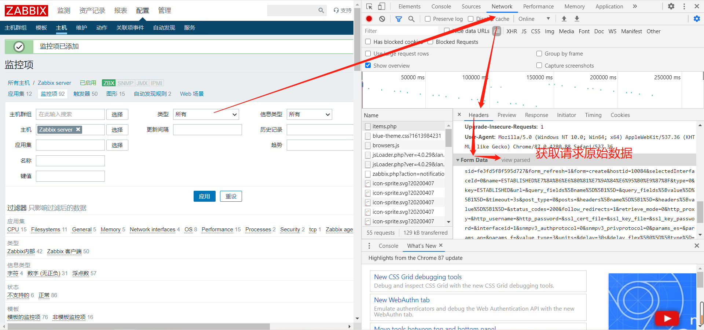


### 2、获取登录请求数据

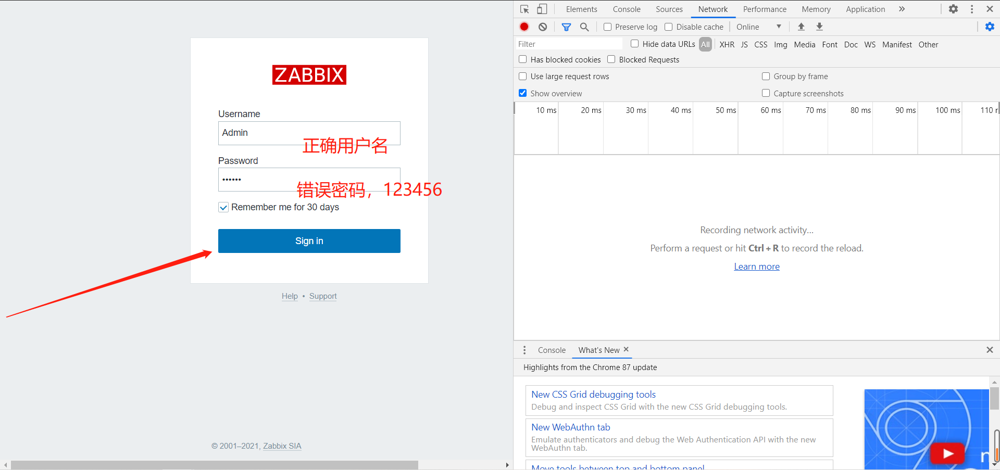

#### 1）登录的url

```bash
http://10.0.0.71/zabbix/index.php
```

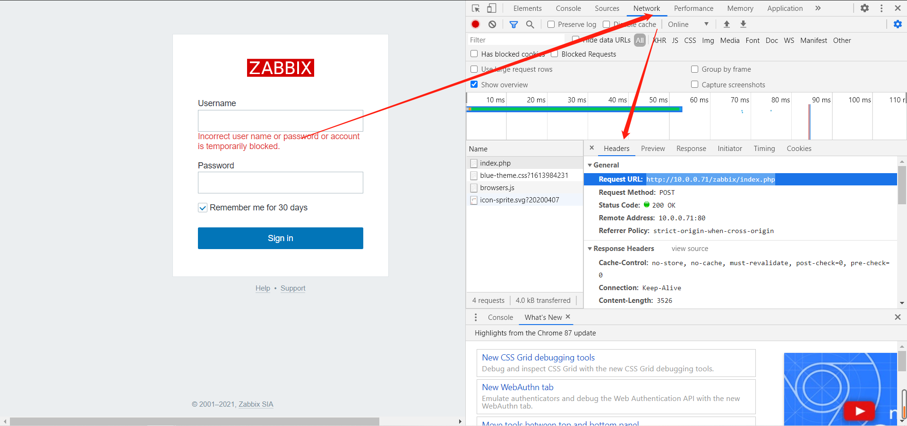


#### 2）登录请求原始数据

```bash
name=Admin&password=123456&autologin=1&enter=Sign+in
改成正确密码
name=Admin&password=zabbix&autologin=1&enter=Sign+in
```

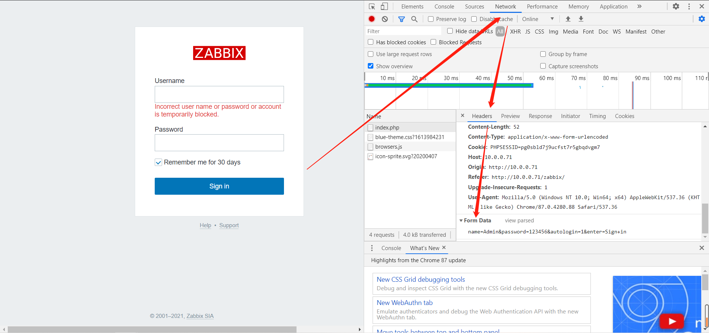


### 3、获取cookie和sid

#### 1）安装apache,启动

```bash
yum install -y httpd
[root@zabbix ~]# systemctl start httpd
```


#### 2）获取html页面，保留cookie

```bash
[root@zabbix /var/www/html]# curl -X POST -c cookie -b cookie -L -d "name=Admin&password=zabbix&autologin=1&enter=Sign+in" http://10.0.0.71/zabbix/index.php >test.html 

-X			指定请求方式
-d			发送post请求
-b			读取cookie
-c			保存cookie
-L			强制重定向
```


#### 3）通过apache查看页面

```bash
http://10.0.0.71/test.html
```


#### 4）查看cookie

```bash
[root@zabbix /var/www/html]# ll
total 28
-rw-r--r-- 1 root root   312 Mar 16 11:56 cookie
-rw-r--r-- 1 root root 21557 Mar 16 11:56 test.html
[root@zabbix /var/www/html]# cat cookie 
# Netscape HTTP Cookie File
# http://curl.haxx.se/docs/http-cookies.html
# This file was generated by libcurl! Edit at your own risk.

#HttpOnly_10.0.0.71	FALSE	/zabbix	FALSE	1618545372	zbx_sessionid	e15e458110be68fa45568f5905d1f740
#HttpOnly_10.0.0.71	FALSE	/zabbix	FALSE	0	PHPSESSID	npi4ldtf3giko03mr00mvlnf67
```


#### 5）获取新的sid

```bash
[root@zabbix /var/www/html]# curl POST -c cookie -b cookie -L -d "name=Admin&password=zabbix&autologin=1&enter=Sign+in" http://10.0.0.71/zabbix/items.php >123.html

[root@zabbix /var/www/html]# grep -i sid test.html
```


#### 6）替换添加监控项请求数据的sid、key值为$n

```bash
sid=50abf6594d1b16df&form_refresh=1&form=create&hostid=10084&selectedInterfaceId=0&name=${n}%E7%8A%B6%E6%80%81%E7%9A%84%E6%95%B0%E9%87%8F&type=0&key=${n}&url=&query_fields%5Bname%5D%5B1%5D=&query_fields%5Bvalue%5D%5B1%5D=&timeout=3s&post_type=0&posts=&headers%5Bname%5D%5B1%5D=&headers%5Bvalue%5D%5B1%5D=&status_codes=200&follow_redirects=1&retrieve_mode=0&http_proxy=&http_username=&http_password=&ssl_cert_file=&ssl_key_file=&ssl_key_password=&interfaceid=1&snmpv3_authprotocol=0&snmpv3_privprotocol=0&params_es=&params_ap=&params_f=&value_type=3&units=&delay=30s&delay_flex%5B0%5D%5Btype%5D=0&delay_flex%5B0%5D%5Bdelay%5D=&delay_flex%5B0%5D%5Bschedule%5D=&delay_flex%5B0%5D%5Bperiod%5D=&history_mode=1&history=90d&trends_mode=1&trends=365d&valuemapid=0&new_application=&applications%5B%5D=1162&inventory_link=0&description=&status=0&add=%E6%B7%BB%E5%8A%A0
```


#### 7）将剩下的key值写到一个文件当中

```bash
[root@zabbix /var/www/html]# vim tcp.txt
SYN_SENT
SYN_RECV
FIN_WAIT1
FIN_WAIT2
TIME_WAIT
CLOSE
CLOSE_WAIT
LAST_ACK
LISTEN
CLOSING
```


#### 8）书写for循环

```bash
[root@zabbix /var/www/html]# for n in `cat tcp.txt`; do curl -X POS cookie -d "sid=50abf6594d1b16df&form_refresh=1&form=create&hostid=10084&selectedInterfaceId=0&name=${n}%E7%8A%B6%E6%80%81%E7%9A%84%E6%95%B0%E9%87%8F&type=0&key=${n}&url=&query_fields%5Bname%5D%5B1%5D=&query_fields%5Bvalue%5D%5B1%5D=&timeout=3s&post_type=0&posts=&headers%5Bname%5D%5B1%5D=&headers%5Bvalue%5D%5B1%5D=&status_codes=200&follow_redirects=1&retrieve_mode=0&http_proxy=&http_username=&http_password=&ssl_cert_file=&ssl_key_file=&ssl_key_password=&interfaceid=1&snmpv3_authprotocol=0&snmpv3_privprotocol=0&params_es=&params_ap=&params_f=&value_type=3&units=&delay=30s&delay_flex%5B0%5D%5Btype%5D=0&delay_flex%5B0%5D%5Bdelay%5D=&delay_flex%5B0%5D%5Bschedule%5D=&delay_flex%5B0%5D%5Bperiod%5D=&history_mode=1&history=90d&trends_mode=1&trends=365d&valuemapid=0&new_application=&applications%5B%5D=1162&inventory_link=0&description=&status=0&add=%E6%B7%BB%E5%8A%A0" http://10.0.0.71/zabbix/items.php ;done
```


#### 9）刷新页面查看监控项

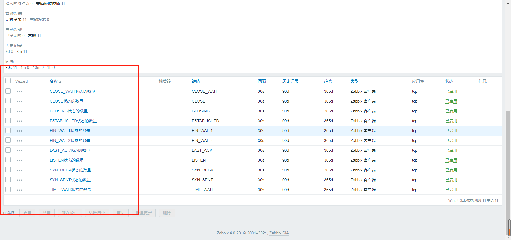