# 使用模板监控nginx

## 一、安装nginx并开启监控取值页面

### 1、安装nginx

```bash
[root@web01 ~]# yum install -y nginx
```


### 2、配置nginx状态页

```bash
[root@web01 ~]# vim /etc/nginx/nginx.conf
.....
        include /etc/nginx/default.d/*.conf;

        location / {
        }

        location /nginx_status {
               stub_status;
        }

        error_page 404 /404.html;
        location = /404.html {
        }
...            
[root@web01 ~]# 
```


### 3、启动nginx并设置为开机自启

```bash
[root@web01 ~]# systemctl start nginx.service 
[root@web01 ~]# systemctl enable nginx.service 
```


### 4、查看nginx状态页

```bash
http://10.0.0.7/nginx_status
```

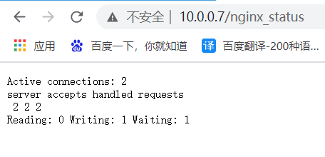

### 5、监控指标介绍

```bash
Active connections(活动连接数): 2 			
server accepts（接受的） handled（已处理） requests（接收到的请求）
 		2 					2 				2 
Reading: 0 Writing: 1 Waiting: 1 
```


## 二、命令行取值

### 1、命令行获取状态

```bash
[root@web01 ~]# curl http://127.0.0.1/nginx_status
```


### 2、取值

```mysql
[root@web01 ~]# curl http://127.0.0.1/nginx_status 2>/dev/null|awk 'NR==1{print $NF}'
。。。
```


## 三、添加zabbix模板

### 1、导入nginx监控模板

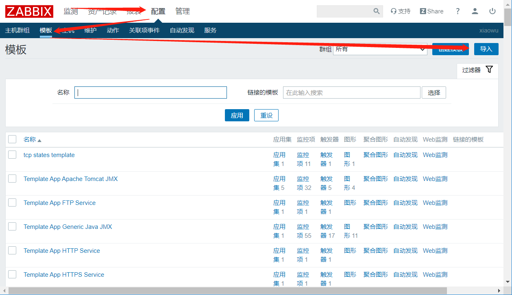

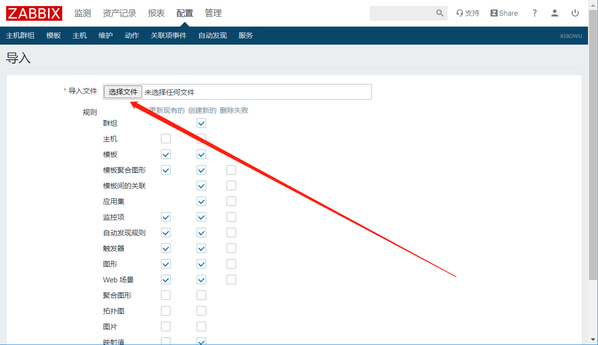

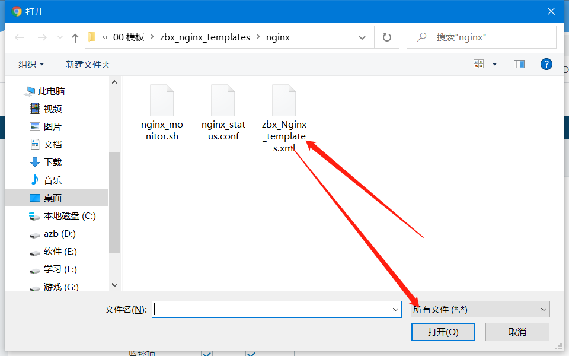

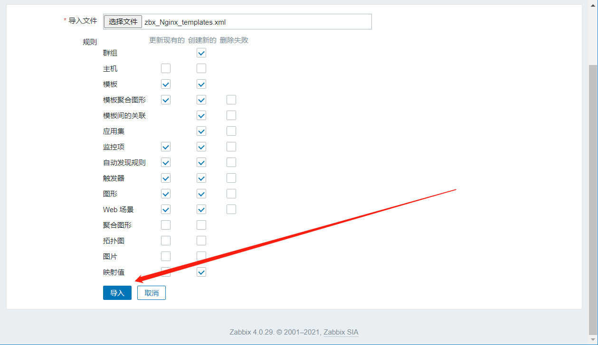

### 2、查看导入的模板

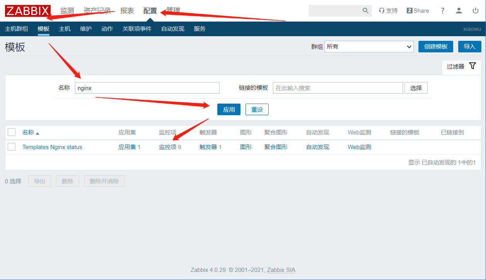


### 3、上传zbx_nginx配置文件及脚本

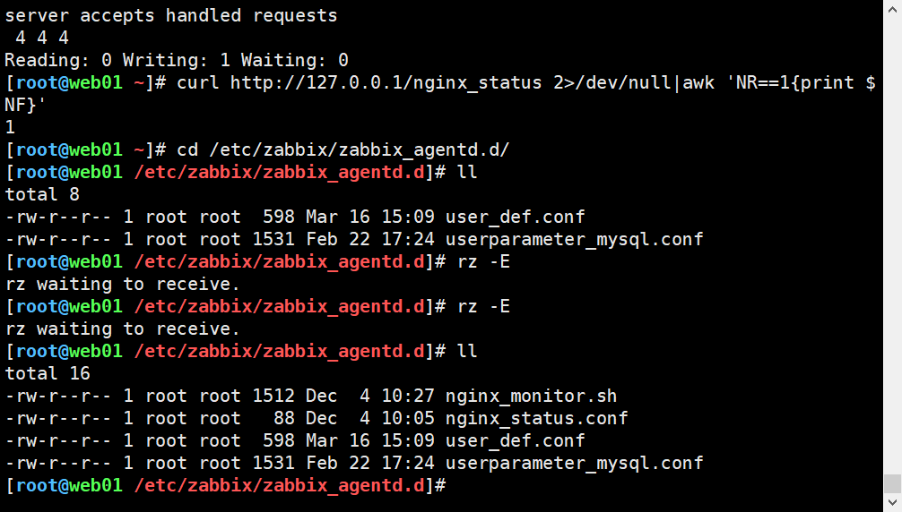

### 4、确认配置文件指定位置与脚本相同

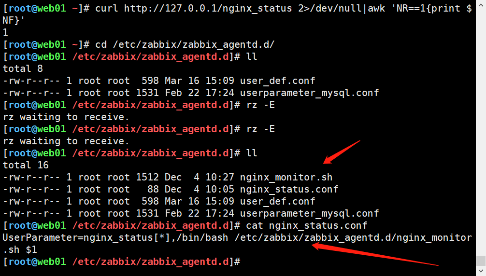


### 5、重启zabbix-agent

```bash
[root@web01 ~]# systemctl restart zabbix-agent.service 
```


### 6、zabbix服务端get取值

```bash
[root@zabbix ~]# zabbix_get -s 10.0.0.7 -k nginx_status[active]
```


### 7、主机关联模板

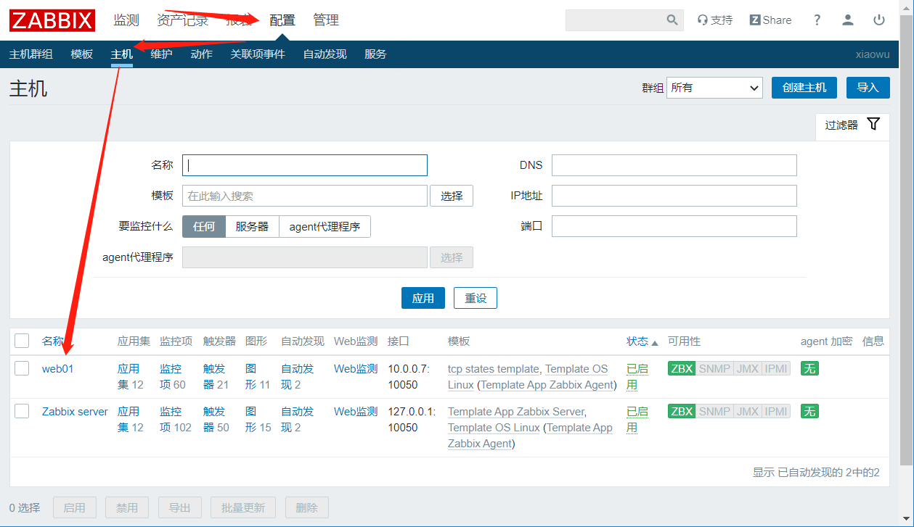

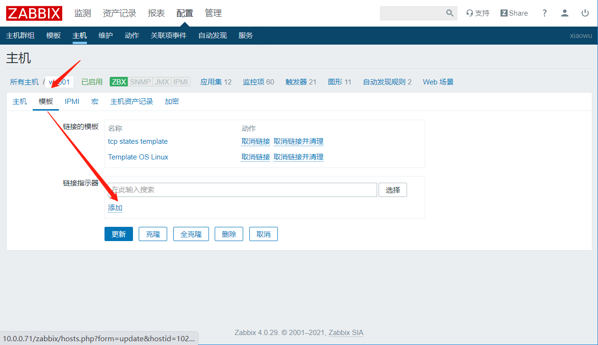

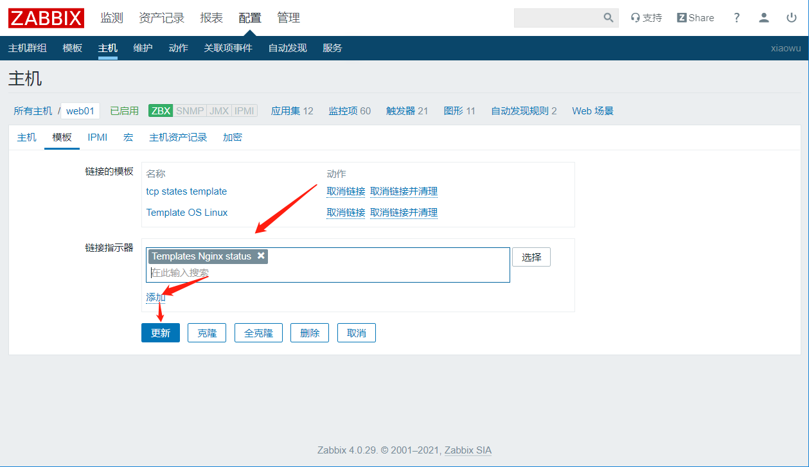


### 8、查看最新数据

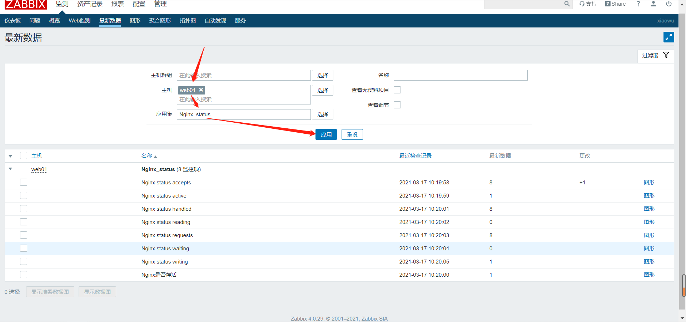


