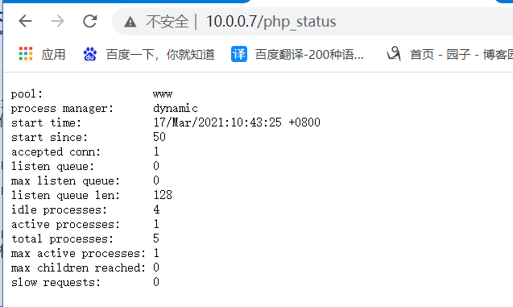
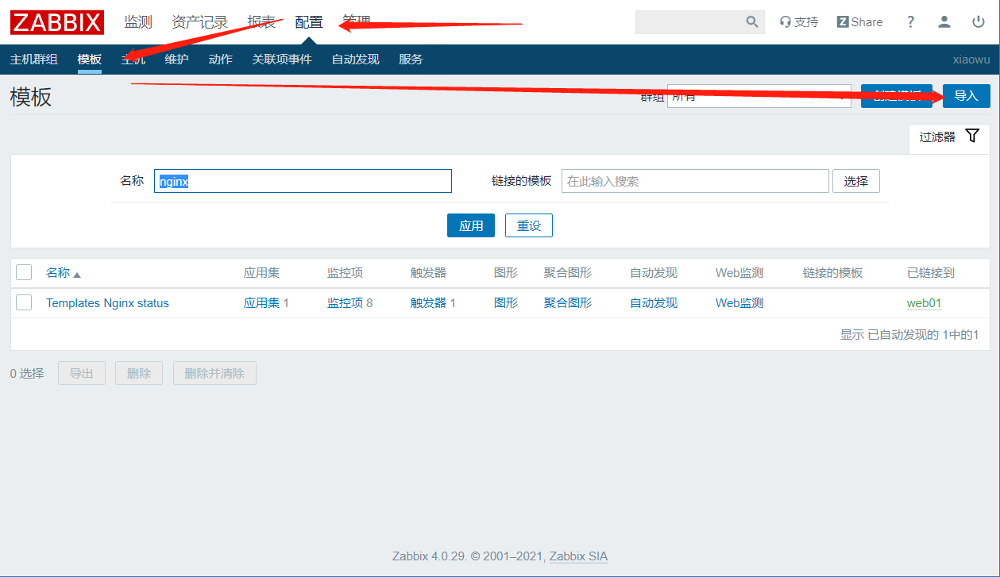
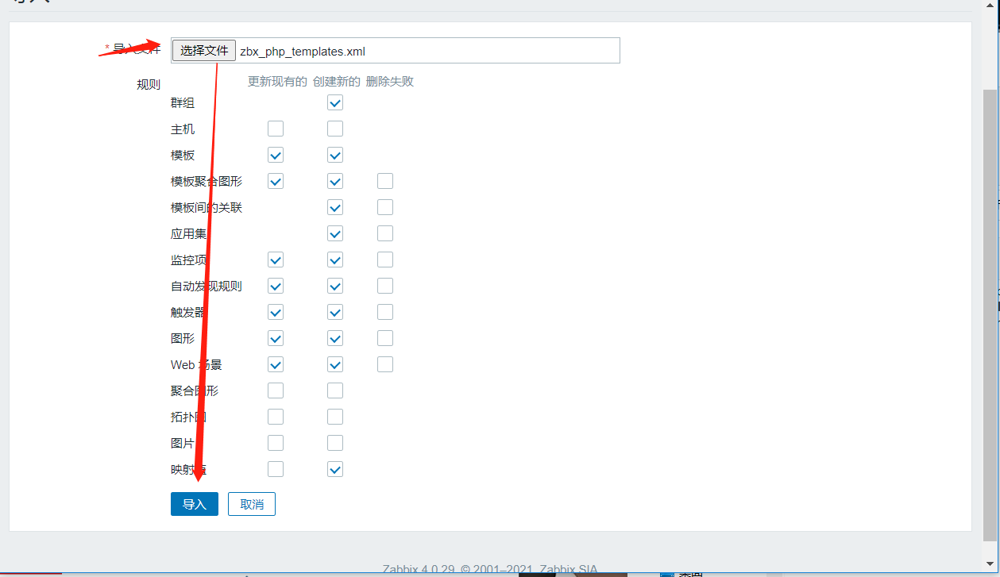
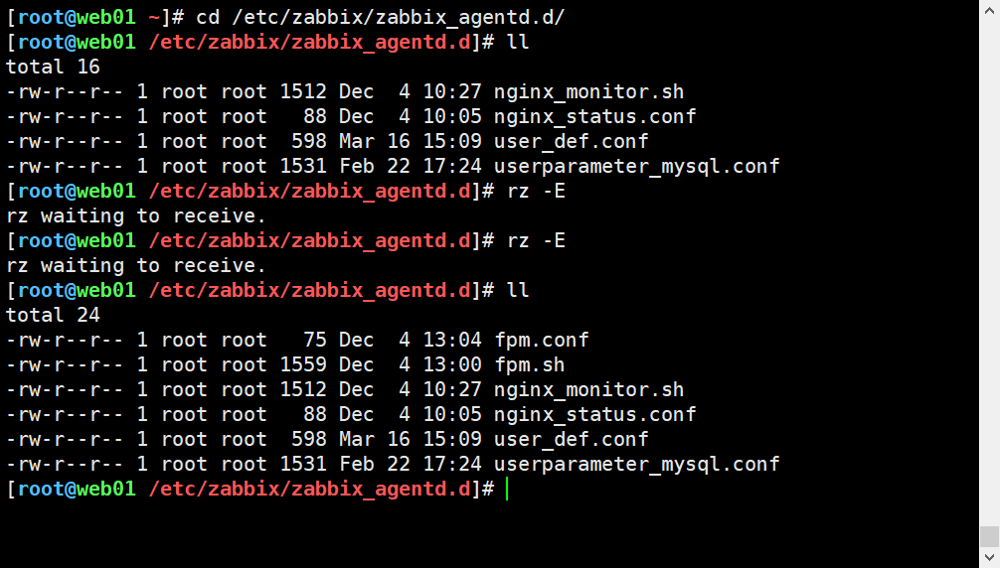
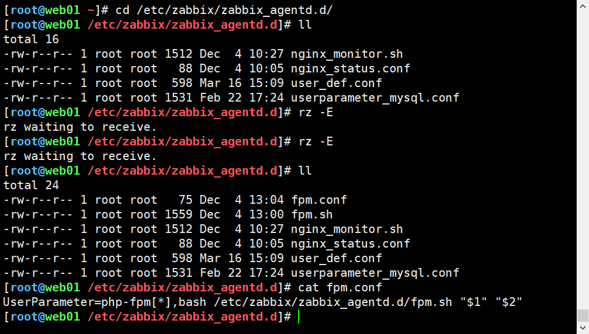
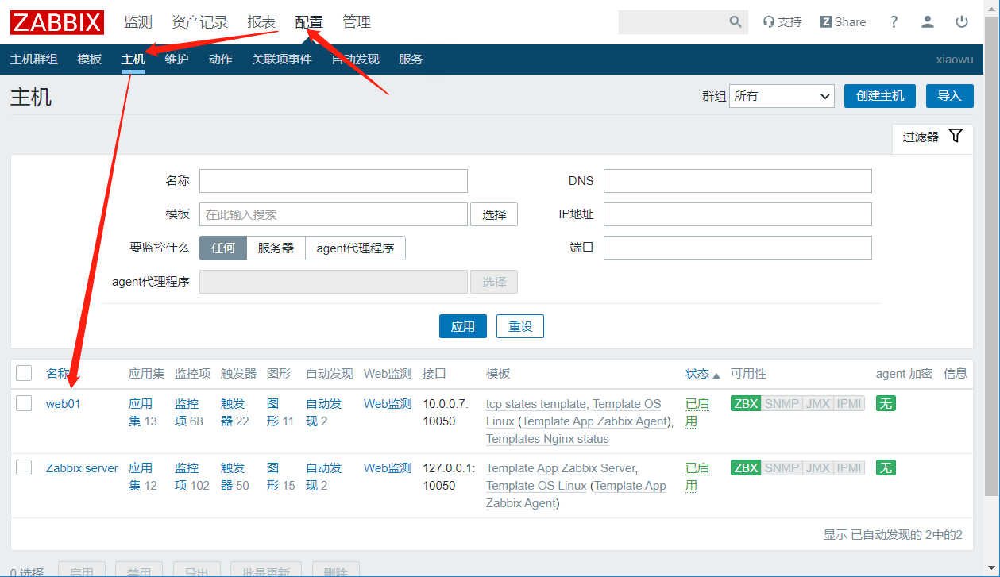
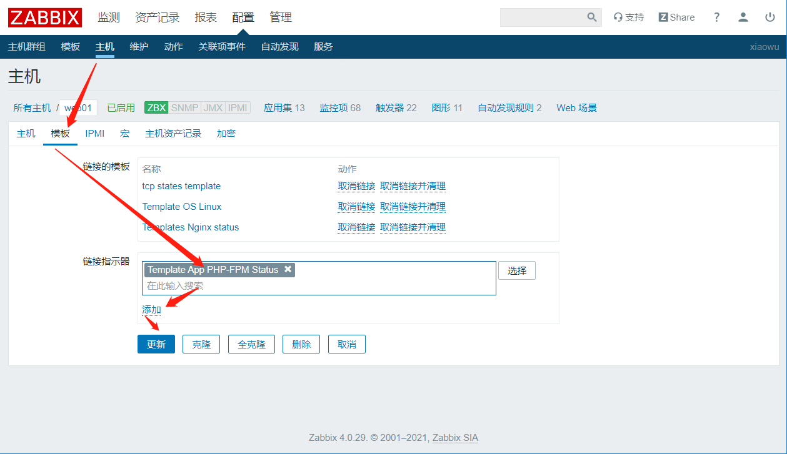
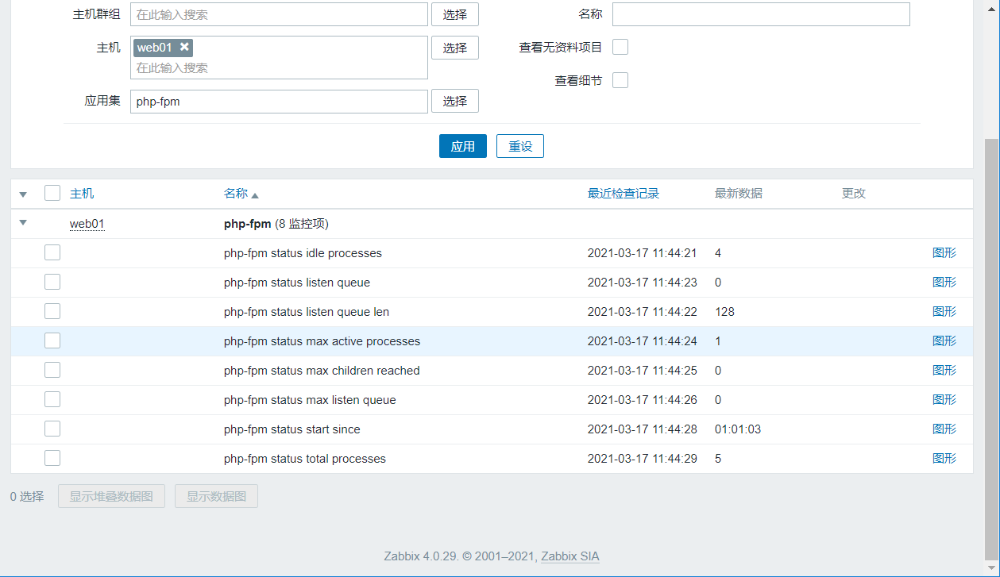

# 使用模板监控php

## 一、安装php并开启监控页面

### 1、安装php

```bash
[root@web01 ~]# yum install -y php-fpm
```


### 2、修改配置文件开启监控页面

```bash
[root@web01 ~]# vim /etc/php-fpm.d/www.conf 
...
; Default Value: not set
pm.status_path = /php_status

; The ping URI to call the monitoring page of FPM. If this value is not set, no
; URI will be recognized as a ping page. This could be used to test from outside
; that FPM is alive and responding, or to
....
```

```bash
[root@web01 ~]# vim /etc/nginx/nginx.conf
...
        location /nginx_status {
            stub_status;
        }

        location /php_status {
            fastcgi_pass 127.0.0.1:9000;
            fastcgi_index index.php;
            fastcgi_param SCRIPT_FILENAME $document_root$fastcgi_script_name;
            include fastcgi_params;
        }

        error_page 404 /404.html;
...
```


### 3、测试语法并重启

```bash
[root@web01 ~]# nginx -t
nginx: the configuration file /etc/nginx/nginx.conf syntax is ok
nginx: configuration file /etc/nginx/nginx.conf test is successful
[root@web01 ~]# systemctl restart nginx.service php-fpm.service 
```


### 4、查看php状态页

```bash
http://10.0.0.7/php_status
```




### 5、监控指标介绍

```bash
pool（资源池名）:                 www
process manager（进程管理方式）:      dynamic（动态）
start time（启动时间）:           17/Mar/2021:10:43:25 +0800
start since（持续运行时间）:          50
accepted conn（接受的请求次数）:        1
listen queue（请求队列）:         0
max listen queue（最大队列值）:     0
listen queue len（监听的队列长度）:     128
idle processes（空闲进程）:       4
active processes（当前活动进程）:     1
total processes（进程总数）:      5
max active processes（最大活动进程数）: 1
max children reached（达到最大进程数）: 0
slow requests（慢请求）:        0
```


## 二、导入模板

### 1、导入模板





### 2、上传zbx_nginx配置文件及脚本



### 3、确认配置文件指定位置与脚本相同




### 4、重启zabbix-agent

```bash
[root@web01 ~]# systemctl restart zabbix-agent.service 
```


### 5、zabbix服务端取值

```bash
[root@zabbix ~]# zabbix_get -s 10.0.0.7 -k php-fpm["accepted conn",http://10.0.0.7/php_status]
2
```


### 7、主机关联模板





### 8、查看最新数据

