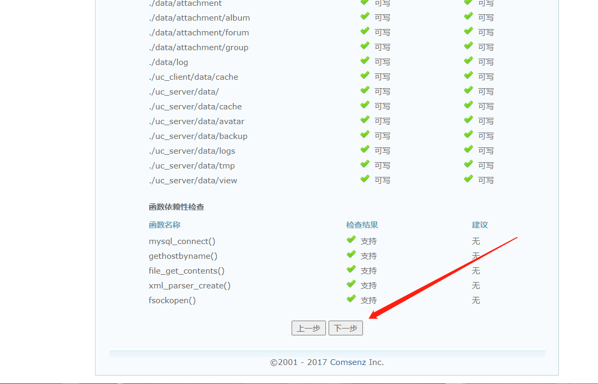
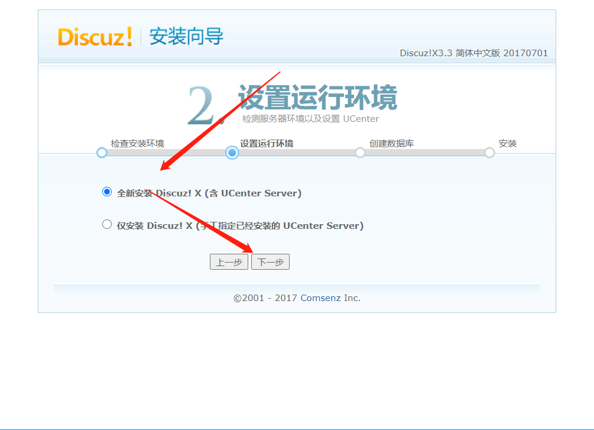
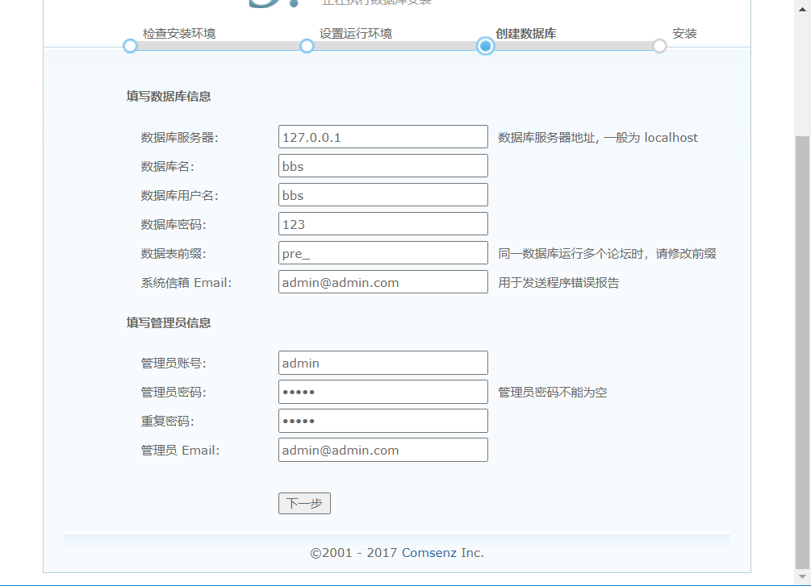
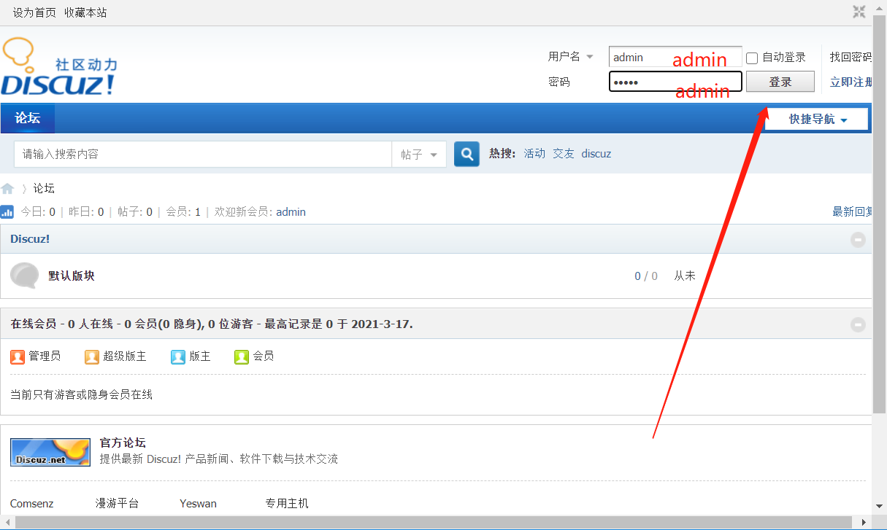
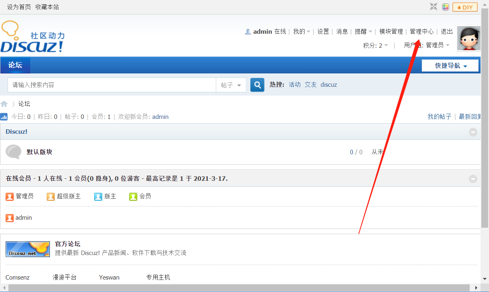
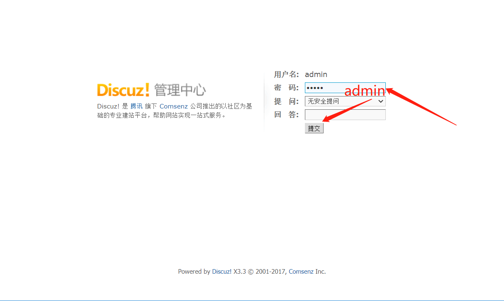
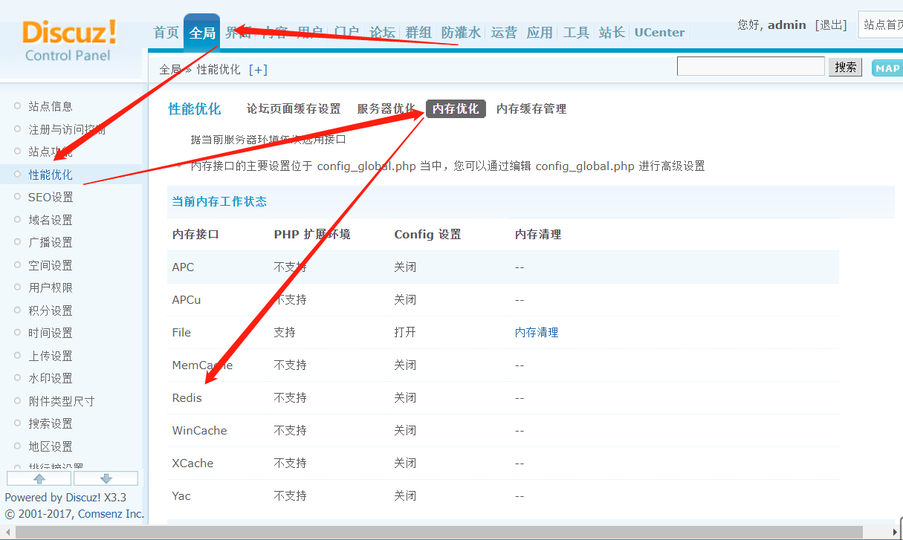
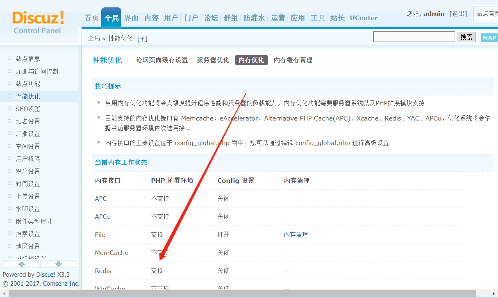
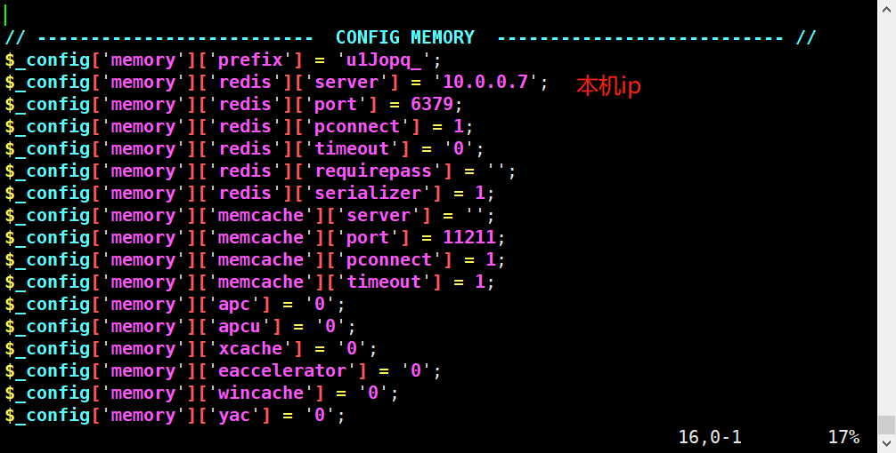
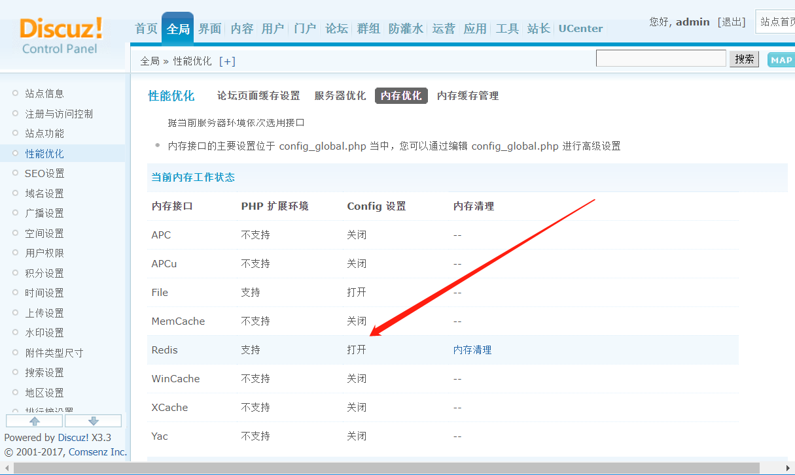

# 搭建discuz论坛使用redis加速

## 一、修改nginx配置文件

```bash
[root@web01 ~]# vim /etc/nginx/nginx.conf
...
        root         /code;
        index index.php index.html index.htm;

...
		location ~ \.php$ {
            fastcgi_pass 127.0.0.1:9000;
            fastcgi_index index.php;
            fastcgi_param SCRIPT_FILENAME $document_root$fastcgi_script_name;
            include fastcgi_params;
        }
...
```

**检查重启**

```bash
[root@web01 ~]# nginx -t
nginx: the configuration file /etc/nginx/nginx.conf syntax is ok
nginx: configuration file /etc/nginx/nginx.conf test is successful

[root@web01 /code]# systemctl restart nginx.service
```


## 二、根据配置文件创建代码目录并上传网站代码

```bash
[root@web01 ~]# mkdir /code
[root@web01 ~]# cd /code/
[root@web01 /code]# rz -E
rz waiting to receive.
[root@web01 /code]# ll
total 10580
-rw-r--r-- 1 root root 10829853 Dec  7 20:29 Discuz_X3.3_SC_GBK.zip
```


## 三、解压代码

```bash
[root@web01 /code]# unzip Discuz_X3.3_SC_GBK.zip 
```


## 四、移出站点目录在code目录下

```bash
[root@web01 /code]# mv upload/* .
```


## 五、当前code目录授权

```bash
[root@web01 /code]# chown -R nginx.nginx .
```


## 六、修改php启动用户,重启php

```bash
[root@web01 /code]# vim /etc/php-fpm.d/www.conf 
...
user = nginx
; RPM: Keep a group allowed to write in log dir.
group = nginx
...
[root@web01 /code]# systemctl restart php-fpm.service 

#检查

[root@web01 /code]# ps -ef |grep php
root      34025      1  0 12:12 ?        00:00:00 php-fpm: master process (/etc/php-fpm.conf)
nginx     34026  34025  0 12:12 ?        00:00:00 php-fpm: pool www
nginx     34027  34025  0 12:12 ?        00:00:00 php-fpm: pool www
nginx     34028  34025  0 12:12 ?        00:00:00 php-fpm: pool www
nginx     34029  34025  0 12:12 ?        00:00:00 php-fpm: pool www

```


## 七、安装php-mysqli和php-gd

```bash
[root@web01 /code]# yum install -y php-gd php-mysqli
```


## 八、重启php生效

```bash
[root@web01 /code]# systemctl restart php-fpm.service 
```


## 九、访问安装向导

```bash
http://10.0.0.7/index.php
```





## 十、下载、创建数据库

### 1、创建数据库工作目录，上传、解压mysql安装包（二进制）

```bash
[root@web01 ~]# mkdir /service
[root@web01 ~]# cd /service/
[root@web01 /service]# rz -E
rz waiting to receive.
[root@web01 /service]# tar xf mysql-5.7.32-linux-glibc2.12-x86_64.tar.gz 

```


### 2、改名并创建软连接

```bash
[root@web01 /service]# mv mysql-5.7.32-linux-glibc2.12-x86_64 mysql-5.7.32
[root@web01 /service]# ln -s mysql-5.7.32 mysql
```


### 3、创建MySQL用户

```bash
[root@web01 /service]# useradd mysql -s /sbin/nologin -M
```


### 4、添加环境变量

```bash
[root@web01 /service]# vim /etc/profile.d/mysql.sh
export PATH=/service/mysql/bin:$PATH
[root@web01 /service]# source /etc/profile
```


### 5、创建数据目录，授权mysql目录

```mysql
[root@web01 /service]# mkdir /service/mysql/data
[root@web01 /service]# chown -R mysql.mysql /service/mysql
[root@web01 /service]# chown -R mysql.mysql /service/mysql-5.7.32/
```


### 6、拷贝启动脚本

```bash
[root@web01 /service]# cp /service/mysql/support-files/mysql.server /etc/init.d/mysqld
```


### 7、修改脚本目录

```bash
[root@web01 /service]# sed -i 's#/usr/locval#/service#g' /etc/init.d/mysqld /service/mysql/bin/mysqld_saf
```


### 8、数据库初始化

```mysql
mysqld --initialize-insecure --user=mysql --basedir=/service/mysql --datadir=/service/mysql/data
```


### 9、加入system管理

```bash
[root@web01 /service]# vim /usr/lib/systemd/system/mysqld.service
[Unit]
Description=MySQL Server
Documentation=man:mysqld(8)
Documentation=https://dev.mysql.com/doc/refman/en/using-systemd.html
After=network.target
After=syslog.target
[Install]
WantedBy=multi-user.target
[Service]
User=mysql
Group=mysql
ExecStart=/service/mysql/bin/mysqld --defaults-file=/etc/my.cnf
LimitNOFILE = 5000

#2.重新加载启动文件列表
[root@web01 /service]# systemctl daemon-reload
```


### 10、准备配置文件

```bash
[root@web01 /service]# vim /etc/my.cnf
[mysqld]
basedir=/service/mysql
datadir=/service/mysql/data
socket=/tmp/mysql.sock
[mysql]
socket=/tmp/mysql.sock
```


### 11、启动并加入开机自启

```bash
[root@web01 /service]# systemctl start mysqld.service 
[root@web01 /service]# systemctl enable mysqld.service 
[root@web01 /service]# netstat -lntup
```


### 12、进入mysql并修改密码

```bash
[root@web01 /service]# mysql
mysql> SET PASSWORD=PASSWORD('123');
[root@web01 /service]# mysql -p
123
```


## 十一、创建discuz数据库

```mysql
[root@web01 /service]# mysql -p
123
mysql> grant all on bbs.* to bbs@'127.0.0.1' identified by '123';
```


## 十二、安装向导继续填写数据库信息




## 十三、访问论坛并登陆

```mysql
http://10.0.0.7/forum.php
```




## 十四、登陆管理中心







发现不支持redis


## 十五、安装redis服务端、配置、启动、自启

```bash
[root@web01 ~]# yum install -y redis
[root@web01 ~]# vim /etc/redis.conf
bind 0.0.0.0
[root@web01 ~]# systemctl start redis
[root@web01 ~]# systemctl enable redis
```


## 十六、安装php-redis客户端

```bash
#查找一下
[root@web01 ~]# yum list|grep php|grep redis
php-nrk-Predis.noarch                    1.0.4-1.el7                   epel     
php-pecl-redis.x86_64                    2.2.8-1.el7                   epel     
php-phpiredis.x86_64                     1.0.0-2.el7                   epel 

#安装
[root@web01 ~]# yum install -y php-pecl-redis
```


## 十七、安装php-mysql 

```mysql
[root@web01 ~]# yum install php-mysql -y
```


## 十八、重启php服务

```mysql
[root@web01 ~]# systemctl restart php-fpm.service 
```


## 十九、重新查看是否支持redis




## 二十、打开redis的config设置

```bash
[root@web01 ~]# vim /code/config/config_global.php 
```



**刷新页面查看**



