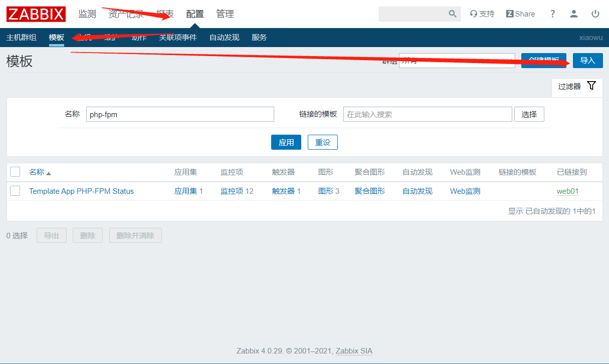
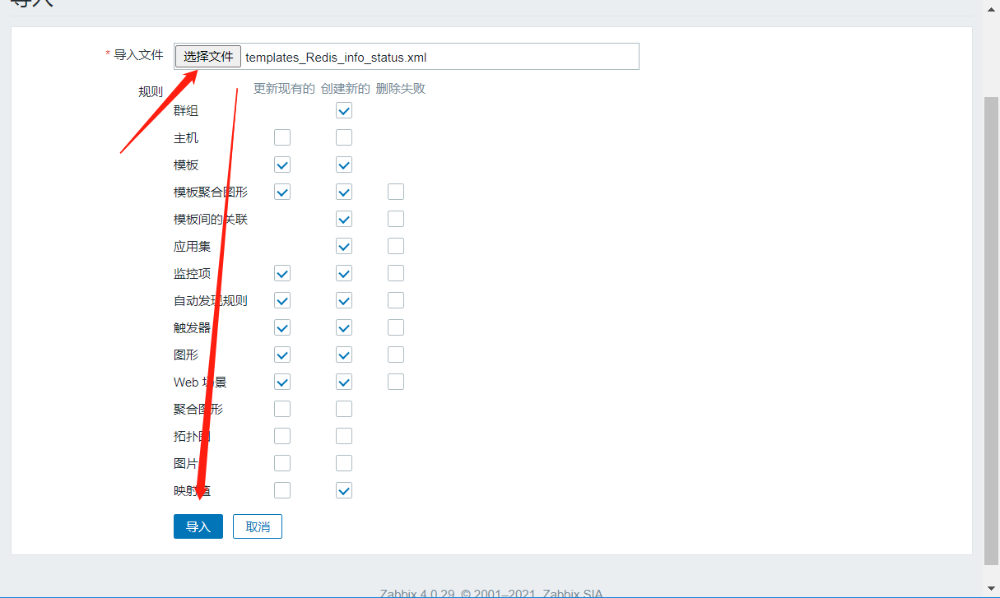
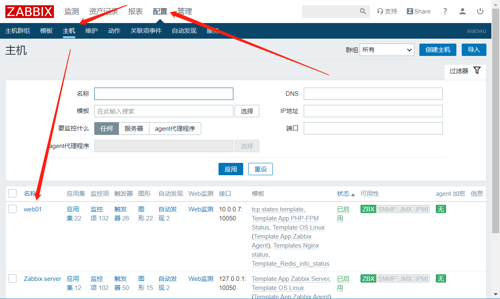
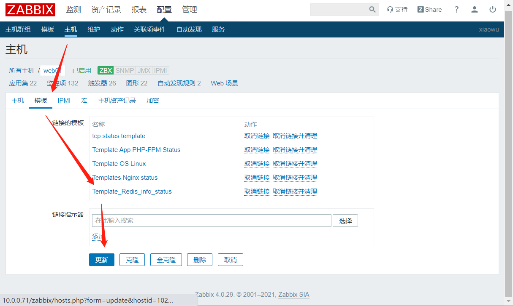

# 使用模板监控redis服务

## 一、查看redis状态

```bash
交互式
[root@web01 ~]# redis-cli 
127.0.0.1:6379> info

非交互式
[root@web01 ~]# redis-cli info

```


## 二、导入模板






## 三、上传配置文件、脚本

```bash
[root@web01 /etc/zabbix/zabbix_agentd.d]# rz -E
rz waiting to receive.
[root@web01 /etc/zabbix/zabbix_agentd.d]# rz -E
rz waiting to receive.
[root@web01 /etc/zabbix/zabbix_agentd.d]# ll
total 40
-rw-r--r-- 1 root root   75 Dec  4 13:04 fpm.conf
-rw-r--r-- 1 root root 1559 Dec  4 13:00 fpm.sh
-rw-r--r-- 1 root root 1512 Dec  4 10:27 nginx_monitor.sh
-rw-r--r-- 1 root root   88 Dec  4 10:05 nginx_status.conf
-rw-r--r-- 1 root root  292 Dec  4 16:03 redis.conf
-rw-r--r-- 1 root root 9604 Dec  4 16:17 redis.sh
-rw-r--r-- 1 root root  598 Mar 16 15:09 user_def.conf
-rw-r--r-- 1 root root 1531 Feb 22 17:24 userparameter_mysql.conf

重启zabbix-agent服务
[root@web01 ~]# systemctl restart zabbix-agent.service 

```


## 四、服务端测试取值

```bash
[root@zabbix ~]# zabbix_get -s 10.0.0.7 -k redis_info[used_memory_rss]
 5.67M2
```


## 五、主机关联模板






