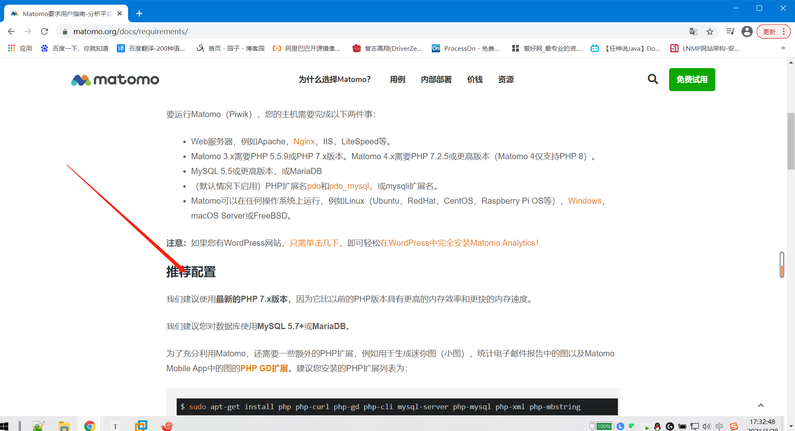
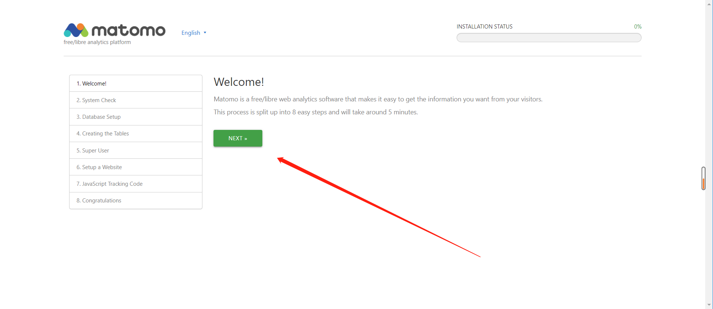
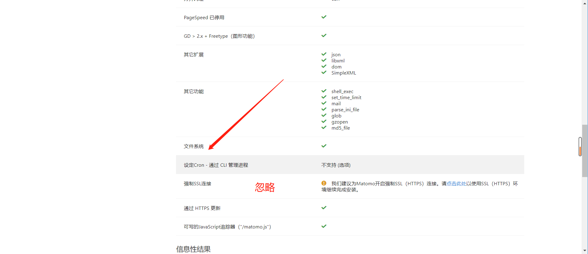
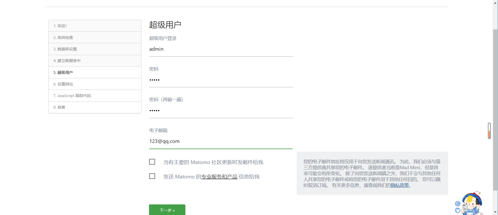
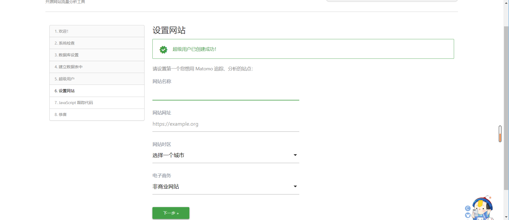
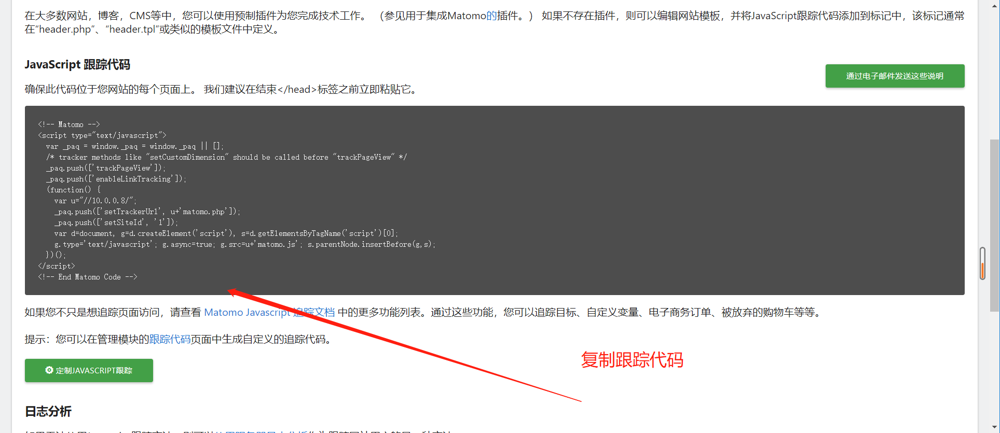
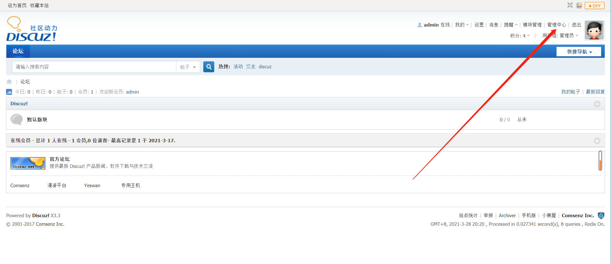
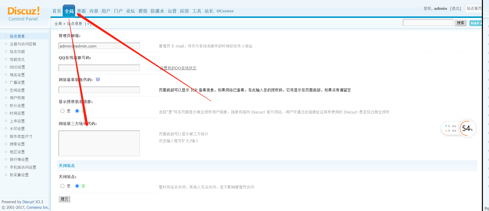
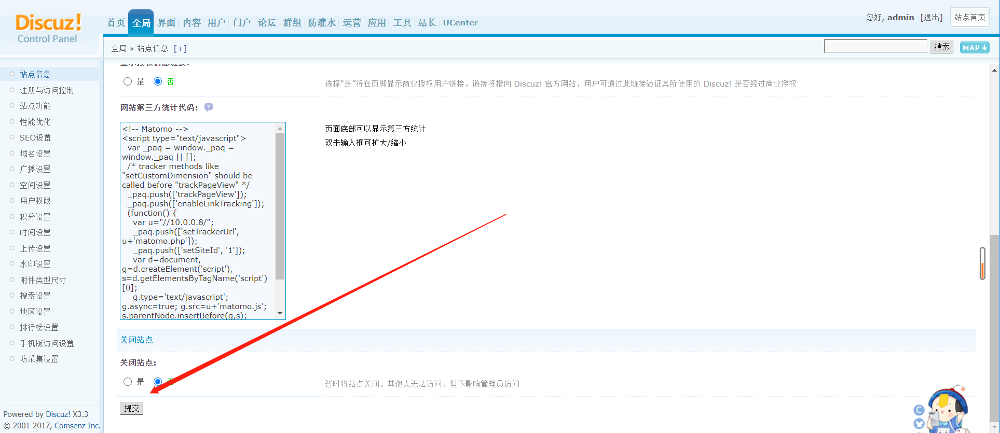
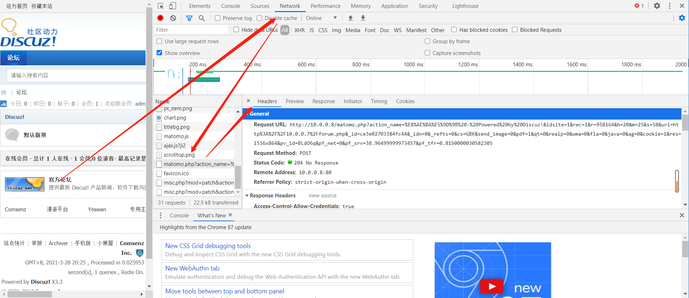

# matomo监控pv、uv、ip

```bash
PV，UV，IP监控：
页面访问次数、
终端访问个数（user-agent），
公网IP访问次数
```

## 一、监控方式

### 1、开源软件

```bash
piwik-->matomo
AWstates
```


### 2、第三方统计

```bash
腾讯分析	#推荐使用
百度统计
谷歌分析

#复制代码：
添加到网站模板
wp：
	wordpress/wp-content/themes/../footer.php
```


## 二、使用matomo统计分析web网站

### 1、网站需求




## 三、搭建基础环境

### 1、安装nginx

#### 1）配置官方源

```bash
[root@web02 ~]# vim /etc/yum.repos.d/nginx.repo
[nginx-stable]
name=nginx stable repo
baseurl=http://nginx.org/packages/centos/$releasever/$basearch/
gpgcheck=1
enabled=1
gpgkey=https://nginx.org/keys/nginx_signing.key
module_hotfixes=true
```


#### 2）安装

```bash
[root@web02 ~]# yum install -y nginx
```


### 2、安装PHP7.4

#### 1）卸载旧版php

```bash
yum list installed | grep php  #查看已安装的PHP，查到后rpm -e 卸载
```


#### 2）安装epel源，配置REMI源

```bash
yum install epel-release -y
rpm -ivh https://mirrors.tuna.tsinghua.edu.cn/remi/enterprise/remi-release-7.rpm
```


#### 3）查看可以安装的PHP版本

```bash
yum repolist all | grep php
```


#### 4）设置默认安装的版本

```bash
yum-config-manager --enable remi-php74
#若提示：-bash: yum-config-manager: 未找到命令表明未安装yum-utlis包，yum -y install yum-utils 即可
```


#### 5）安装php

```bash
yum -y install php  
#查看PHP版本	php -v
#查看已安装的模块	php -m
```


#### 6）查看可以安装的php插件

```bash
yum search php74-php
```


#### 7）安装PHP扩展

```bash
示例：安装php74-php-fpm扩展，则执行：（不用加php74-）
yum -y install php-fpm

#官方推荐及常用模块
yum -y install php-cli php-common php-devel php-embedded php-gd php-mcrypt php-mbstring php-pdo php-xml php-fpm php-mysqlnd php-opcache php-pecl-memcached php-pecl-redis php-pecl-mongodb php-curl mysql-server php-mysql 
```


### 3、安装mysql8.0

#### 1）创建数据库目录

```bash
[root@web02 ~]# mkdir /service
[root@web02 ~]# cd /service/
```


#### 2）下载数据库二进制安装包

```bash
wget https://downloads.mysql.com/archives/get/p/23/file/mysql-8.0.20-linux-glibc2.12-x86_64.tar.xz

#使用迅雷下载会快点
```


#### 3）解压并重命名、软连接

```bash
[root@web02 /service]# tar xf mysql-8.0.20-linux-glibc2.12-x86_64.tar.xz
[root@web02 /service]# mv mysql-8.0.20-linux-glibc2.12-x86_64 mysql-8.0.20
[root@web02 /service]# ln -s mysql-8.0.20 mysql
```


#### 4）添加环境变量

```bash
[root@web02 /service]# vim /etc/profile.d/mysql.sh
export PATH=/service/mysql/bin:$PATH

#刷新
[root@web02 /service]# source /etc/profile

#确认
[root@web02 /service]# mysql -V
```


#### 5）卸载无用软件

```bash
[root@web02 /service]# yum remove -y mariadb-libs
```


#### 6）创建用户

```bash
[root@web02 /service]# useradd mysql
```


#### 7）创建数据库目录、对整个mysql授权

```bash
[root@web02 /service]# mkdir /service/mysql/data/
[root@web02 /service]# chown -R mysql.mysql mysql
[root@web02 /service]# chown -R mysql.mysql mysql-8.0.20
```


#### 8）准备配置文件

```bash
[root@web02 /usr/lib/systemd/system]# vim /etc/my.cnf
[mysqld]
user=mysql
basedir=/service/mysql
datadir=/service/mysql/data
socket=/tmp/mysql.sock
[mysql]
socket=/tmp/mysql.sock
```


#### 9）下载异步IO接口

```bash
[root@web02 /service]# yum install -y libaio-devel
```


#### 10）初始化数据库

```bash
[root@web02 /service]# mysqld --initialize-insecure --user=mysql --basedir=/service/mysql --datadir=/service/mysql/data
```


#### 11）复制启动脚本

```bash
[root@web02 /service]# cp /service/mysql/support-files/mysql.server /etc/init.d/mysqld
```


#### 12）修改脚本目录

```bash
[root@web02 ~]# sed -i 's#/usr/local#/service#g' /etc/init.d/mysqld /service/mysql/bin/mysqld_safe
```


#### 12）添加systemd管理

```bash
[root@web02 /service]# vim /usr/lib/systemd/system/mysqld.server
[Unit]
Description=MySQL Server
Documentation=man:mysqld(8)
Documentation=https://dev.mysql.com/doc/refman/en/using-systemd.html
After=network.target
After=syslog.target
[Install]
WantedBy=multi-user.target
[Service]
User=mysql
Group=mysql
ExecStart=/service/mysql/bin/mysqld --defaults-file=/etc/my.cnf
LimitNOFILE = 5000
[root@web02 /service]# systemctl daemon-reload
```


## 四、部署matomo

### 1、nginx

#### 1）matomo.conf

```bash
[root@web02 ~]# vim /etc/nginx/conf.d/matomo.conf
server {
    listen       80;
    server_name  localhost;
        root /code/;

    location / {
        index  index.php index.html index.htm;
        root /code/;
    }

    location ~ \.php$ {
        fastcgi_pass  127.0.0.1:9000;
        fastcgi_index index.php;
        fastcgi_param SCRIPT_FILENAME /code$fastcgi_script_name;
        include       fastcgi_params;
    }
}
```

**练习**

```nginx
    location /matomo {
        index  index.php index.html index.htm;
        root /www/wwwroot/blog.sholdboyedu.com/matomo/matomo/;
    }

    location ~ \.php$ {
        fastcgi_pass  127.0.0.1:9000;
        fastcgi_index index.php;
        fastcgi_param SCRIPT_FILENAME /www/wwwroot/blog.sholdboyedu.com/matomo/matomo$fastcgi_script_name;
        include       fastcgi_params;
    }
}
```


#### 2）注释默认站点

```bash
[root@web02 /code]# mv /etc/nginx/conf.d/default.conf /etc/nginx/conf.d/default.conf.bak

#检测语法
[root@web02 /code]# nginx -t
nginx: the configuration file /etc/nginx/nginx.conf syntax is ok
nginx: configuration file /etc/nginx/nginx.conf test is successful

```


#### 2）建立站点

```bash
[root@web02 ~]# mkdir /code/
[root@web02 /code]# wget https://builds.matomo.org/matomo.zip
[root@web02 /code]# mv matomo/* ./
[root@web02 /code]# chown -R nginx.nginx /code/
```


### 2、php

#### 1）修改配置文件

````bash
[root@web02 /code]# vim /etc/php-fpm.d/www.conf
user = nginx
group = nginx
````


### 3、启动和开机自启nginx，php，mysql

```bash
[root@web02 /code]# systemctl start nginx php-fpm.service mysqld
[root@web02 /code]# systemctl enable nginx php-fpm.service mysqld
```


### 4、mysql创建库

```bash
mysql> create database matomo;
mysql> create user matomo identified by '123';
mysql> grant all on matomo.* to matomo;
```


## 五、页面操作





















