# 使用percona插件监控mysql

## 一、下载插件

https://www.percona.com/downloads/percona-monitoring-plugins/LATEST/

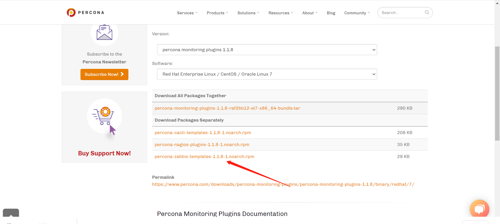


## 二、安装在有数据库的机器上

### 1、上传、安装

```bash
[root@zabbix ~]# rz percona-zabbix-templates-1.1.8-1.noarch.rpm


[root@zabbix ~]# rpm -ivh percona-zabbix-templates-1.1.8-1.noarch.rpm
warning: percona-zabbix-templates-1.1.8-1.noarch.rpm: Header V4 DSA/SHA1 Signature, key ID cd2efd2a: NOKEY
Preparing...                          ################################# [100%]
Updating / installing...
   1:percona-zabbix-templates-1.1.8-1 ################################# [100%]

Scripts are installed to /var/lib/zabbix/percona/scripts
Templates are installed to /var/lib/zabbix/percona/templates

#####
模板：Templates are installed to /var/lib/zabbix/percona/templates
[root@zabbix /var/lib/zabbix/percona/templates]# ll
total 284
-rw-r--r-- 1 root root  18866 Jan 10  2018 userparameter_percona_mysql.conf
-rw-r--r-- 1 root root 269258 Jan 10  2018 zabbix_agent_template_percona_mysql_server_ht_2.0.9-sver1.1.8.xml


```


## 三、添加mysql监控

### 1、下载xml模板文件

```bash
链接：https://pan.baidu.com/s/1SHwNNRTfVNVmp9T5o3upxQ 
提取码：agu8 
```


### 2、导入模板

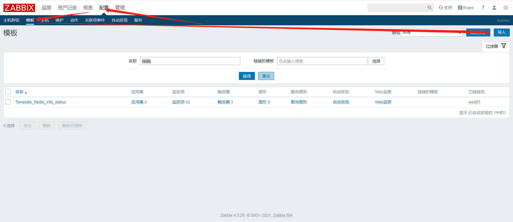

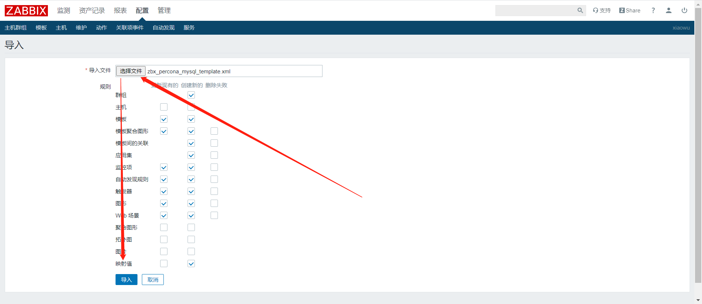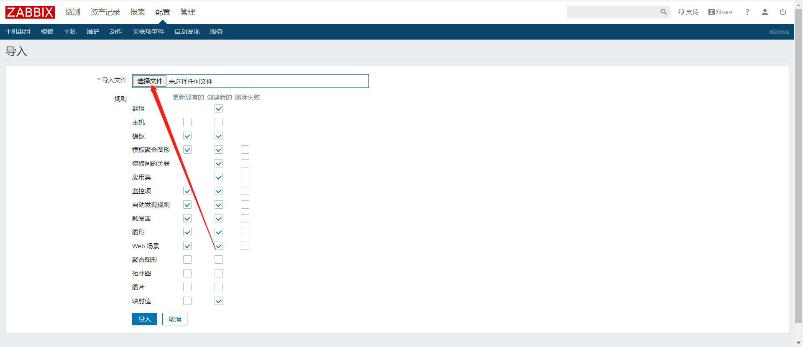


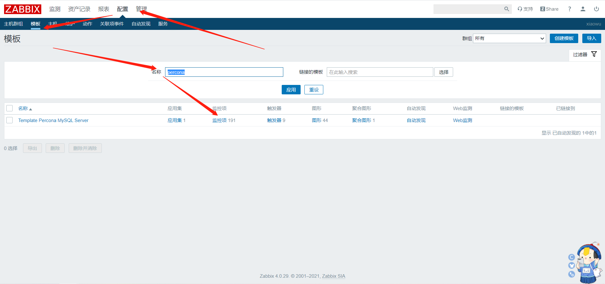

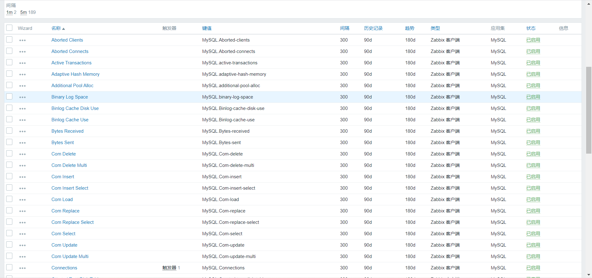


### 3、添加修改配置文件

#### 1）查看

```bash
[root@zabbix /var/lib/zabbix/percona/templates]# ll
total 284
-rw-r--r-- 1 root root  18866 Jan 10  2018 userparameter_percona_mysql.conf
-rw-r--r-- 1 root root 269258 Jan 10  2018 zabbix_agent_template_percona_mysql_server_ht_2.0.9-sver1.1.8.xml
```


#### 2）mv移动配置文件

```bash
[root@zabbix /var/lib/zabbix/percona/templates]# mv userparameter_percona_mysql.conf /etc/zabbix/zabbix_agentd.d/
```


#### 3）重启zabbix客户端

```bash
systemctl restart zabbix-agent.service
```


#### 4）修改php文件用户及密码

```bash
vim /var/lib/zabbix/percona/scripts/ss_get_mysql_stats.php
...
$mysql_user = 'zabbix';
$mysql_pass = '123456';
....
```


### 4、命令行取值

```bash
[root@zabbix /etc/zabbix/zabbix_agentd.d]# zabbix_get -s 127.0.0.1 -k MySQL.Open-files
21
```


### 5、关联模板

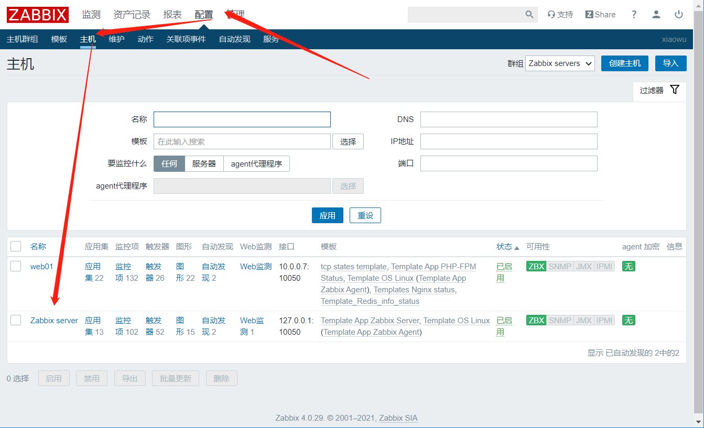

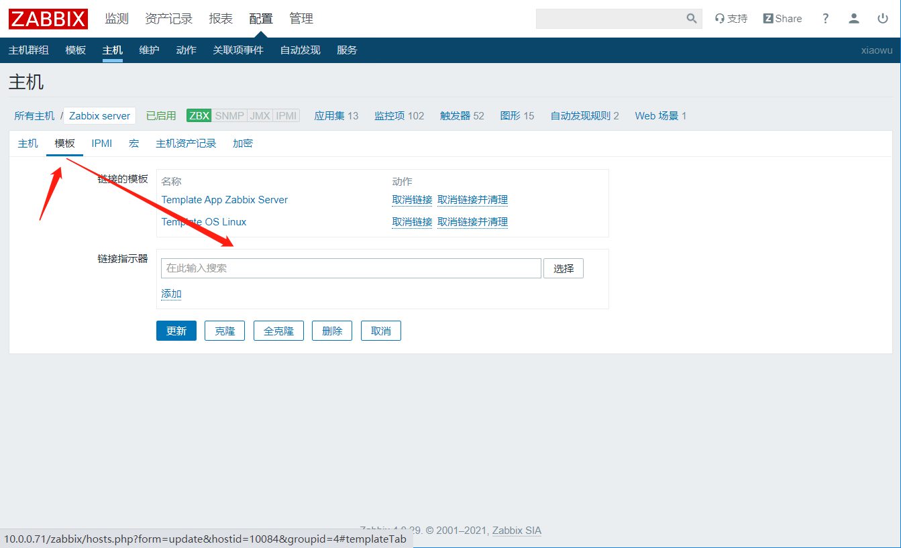

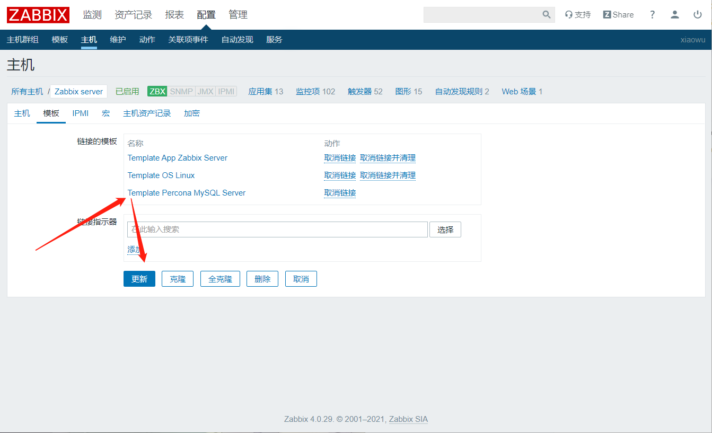


### 6、查看数据

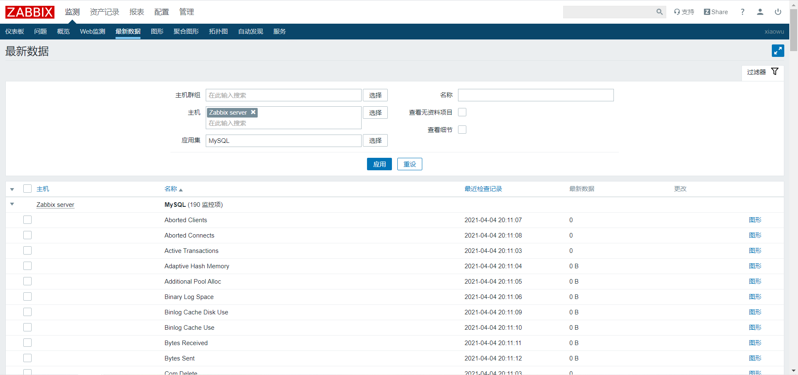


### 7、发现少一个监控项关于主从的

#### 1）手动执行脚本

```bash
[root@zabbix /etc/zabbix/zabbix_agentd.d]# sh -x /var/lib/zabbix/percona/scripts/get_mysql_stats_wrapper.sh running-slave
+ ITEM=running-slave
+ HOST=localhost
++ dirname /var/lib/zabbix/percona/scripts/get_mysql_stats_wrapper.sh
+ DIR=/var/lib/zabbix/percona/scripts
+ CMD='/usr/bin/php -q /var/lib/zabbix/percona/scripts/ss_get_mysql_stats.php --host localhost --items gg'
+ CACHEFILE=/tmp/localhost-mysql_cacti_stats.txt
+ '[' running-slave = running-slave ']'
++ HOME=/var/lib/zabbix
++ mysql -e 'SHOW SLAVE STATUS\G'
++ egrep '(Slave_IO_Running|Slave_SQL_Running):'
++ awk -F: '{print $2}'
++ tr '\n' ,
ERROR 1045 (28000): Access denied for user 'root'@'localhost' (using password: NO)
+ RES=
+ '[' '' = ' Yes, Yes,' ']'
+ echo 0
0
+ exit
```


#### 2）原因

```bash
zabbix没有查看主从状态的权限
```


#### 3）脚本添加权限

```bash
[root@zabbix ~]# vim /var/lib/zabbix/percona/scripts/get_mysql_stats_wrapper.sh
...
if [ "$ITEM" = "running-slave" ]; then
    # Check for running slave
    RES=`HOME=~zabbix mysql -uroot -p123 -e 'SHOW SLAVE STATUS\G' | egrep '(Slave_IO_Running|Slave_SQL_Running):' | awk -F: '{print $2}' | tr '\n' ','`
    if [ "$RES" = " Yes, Yes," ]; then
        echo 1
    else
...
```


#### 4）再次测试

```bash
[root@zabbix /etc/zabbix/zabbix_agentd.d]# sh -x /var/lib/zabbix/percona/scripts/get_mysql_stats_wrapper.sh running-slave
+ ITEM=running-slave
+ HOST=localhost
++ dirname /var/lib/zabbix/percona/scripts/get_mysql_stats_wrapper.sh
+ DIR=/var/lib/zabbix/percona/scripts
+ CMD='/usr/bin/php -q /var/lib/zabbix/percona/scripts/ss_get_mysql_stats.php --host localhost --items gg'
+ CACHEFILE=/tmp/localhost-mysql_cacti_stats.txt
+ '[' running-slave = running-slave ']'
++ HOME=/var/lib/zabbix
++ mysql -uroot -p123 -e 'SHOW SLAVE STATUS\G'
++ egrep '(Slave_IO_Running|Slave_SQL_Running):'
++ awk -F: '{print $2}'
++ tr '\n' ,
+ RES=
+ '[' '' = ' Yes, Yes,' ']'
+ echo 0
0
+ exit


[root@zabbix /etc/zabbix/zabbix_agentd.d]# zabbix_get -s 127.0.0.1 -k MySQL.running-slave
0
```

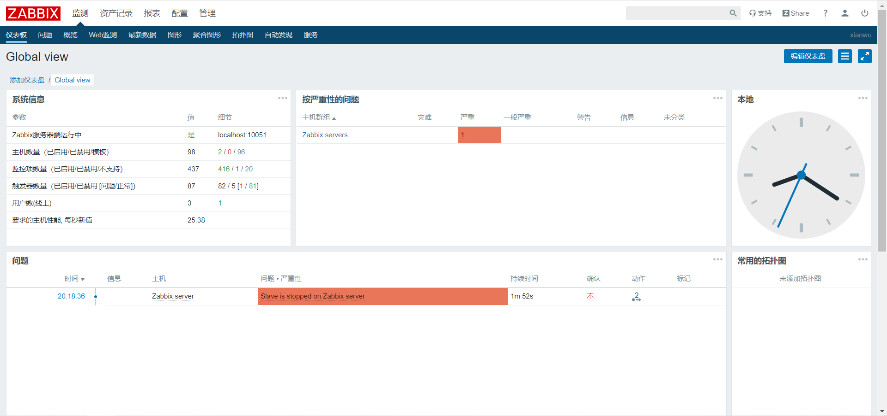

**没有主从可以禁用监控项，有主从时再启用**