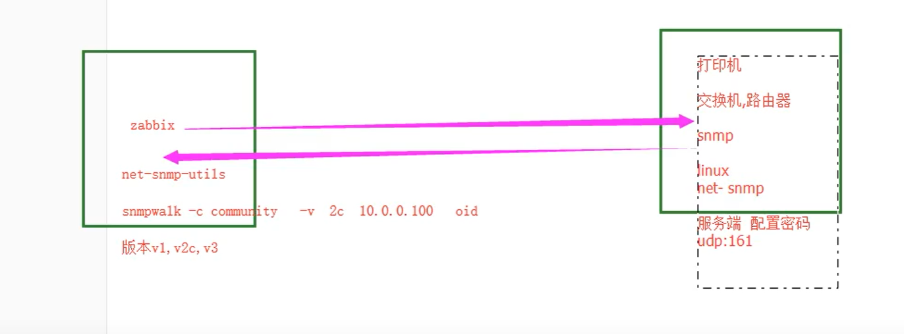
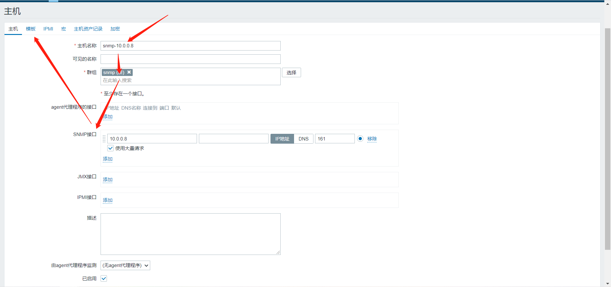

# snmp监控linux

## 一、介绍

```bash
simple network manager pretocol		简单网络管理协议

华三、华为、思科、锐捷
打印机
linux
windows
unix

zabbix支持snmp
```

````bash
oid: object id
监控第一个cpu核心，使用率，空闲值，iowait

MIB：所有oid信息
````




## 二、服务端安装

### 1、下载安装

```bash
[root@web02 ~]# yum install -y net-snmp
```


### 2、修改配置文件

```bash
[root@web02 ~]# vim /etc/snmp/snmpd.conf
...
#       sec.name  source          community
com2sec notConfigUser  default       123456
...
# Make at least  snmpwalk -v 1 localhost -c public system fast again.
#       name           incl/excl     subtree         mask(optional)
view    systemview    included   .1
...
```


### 3、服务启动

```bash
[root@web02 ~]# systemctl restart snmpd.service
[root@web02 ~]# systemctl enable snmpd.service
```


## 三、zabbix-server安装sump客户端

### 1、下载安装客户端

```bash
[root@zabbix ~]# yum install net-snmp-utils.x86_64 -y
```


### 2、命令行取值测试

```bash
[root@zabbix ~]# snmpwalk -v 2c -c 123456 10.0.0.8 .1.3.6.1.4.1.2021.11.11.0
UCD-SNMP-MIB::ssCpuIdle.0 = INTEGER: 97

[root@zabbix ~]# snmpwalk -v 2c -c 123456 10.0.0.8 .1.3.6.1.2.1.25.2.2.0
HOST-RESOURCES-MIB::hrMemorySize.0 = INTEGER: 995684 KBytes
```


## 四、web页面操作




