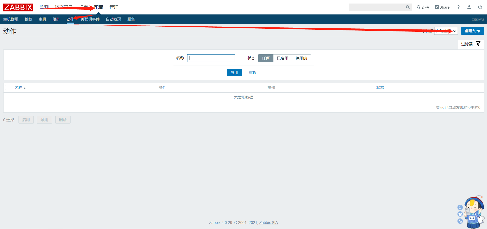
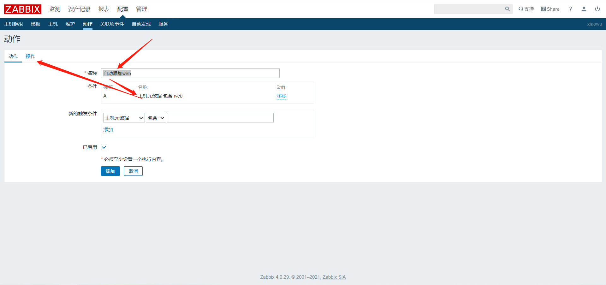
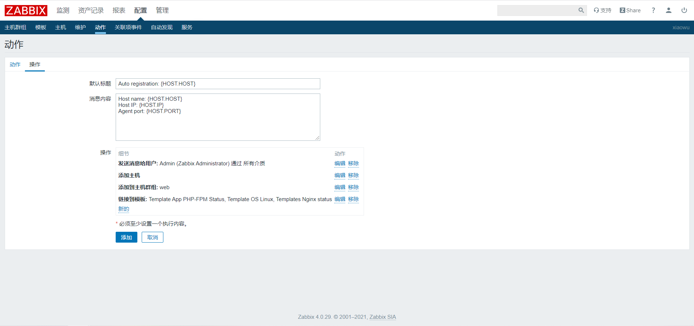
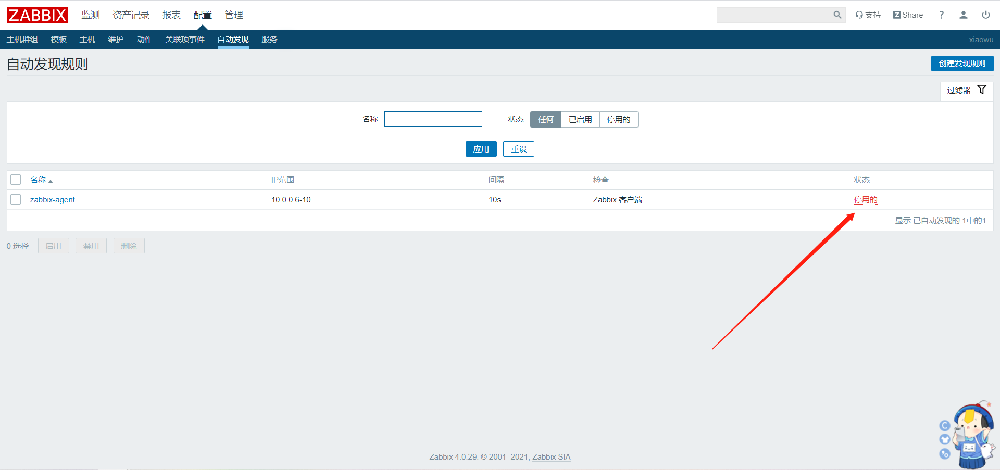
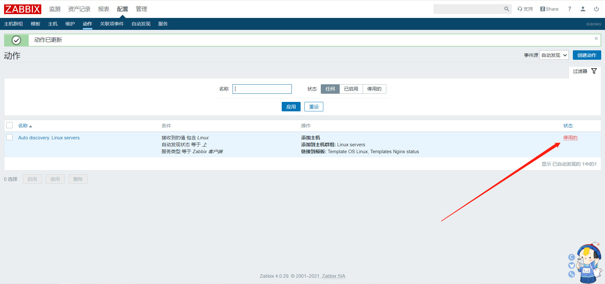
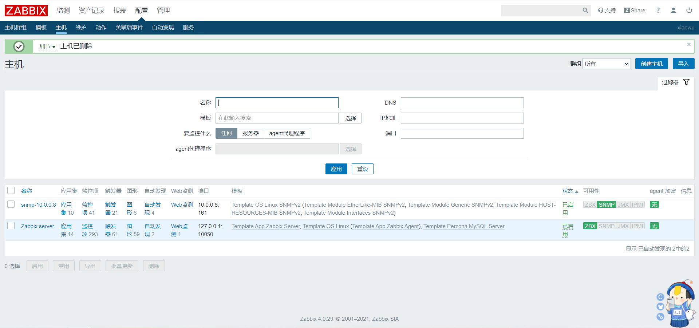
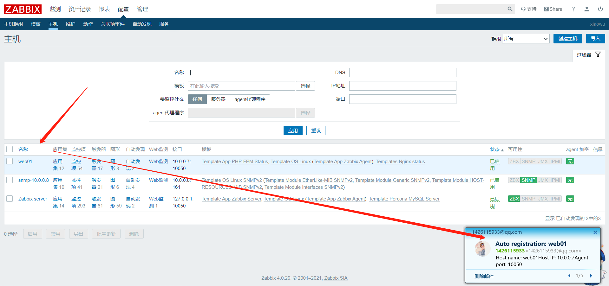

# zabbix自动注册

## 一、介绍

```bash
zabbix-agent主动注册
```


## 二、配置服务端自动注册动作








## 三、禁用自动发现








## 四、修改客户端配置文件


```bash
[root@web01 ~]# vim /etc/zabbix/zabbix_agentd.conf
...
Server=10.0.0.71
ServerActive=10.0.0.71
Hostname=web01
HostMetadata=web
...

[root@web01 ~]# grep -Ev '^$|#' /etc/zabbix/zabbix_agentd.conf
PidFile=/var/run/zabbix/zabbix_agentd.pid
LogFile=/var/log/zabbix/zabbix_agentd.log
LogFileSize=0
Server=10.0.0.71
ServerActive=10.0.0.71
Hostname=web01
HostMetadata=web
Include=/etc/zabbix/zabbix_agentd.d/*.conf
```


**重启**

```bash
[root@web01 ~]# systemctl restart zabbix-agent.service
```




