# zabbix-agent主动和被动区别

## 一、介绍

```bash
默认是被动：

被动：如果有100个监控项，zabbix-server对agent进行100次取值
主动：如果有100个监控项，agent主动向zabbix-server索要任务清单，根
据清单采集所有监控项，一次性发送给zabbix-server
```


## 二、zabbix server配置主动模板

### 1、克隆模板

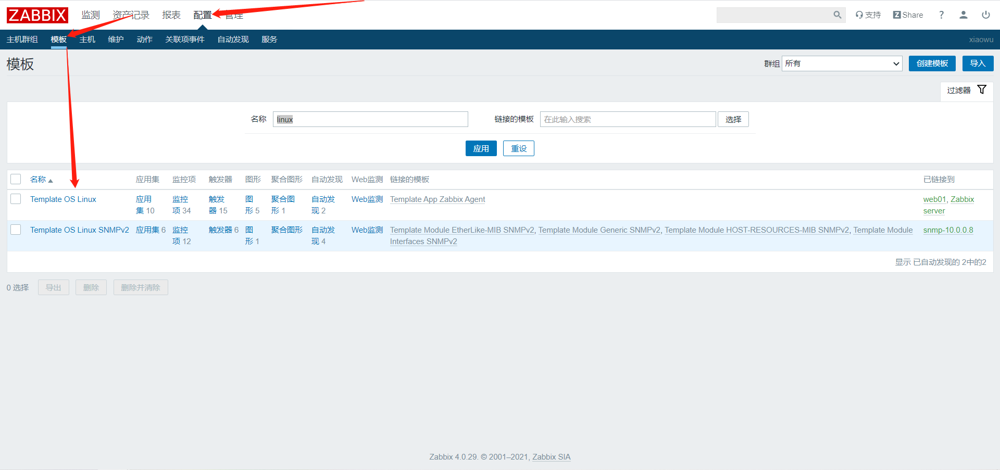

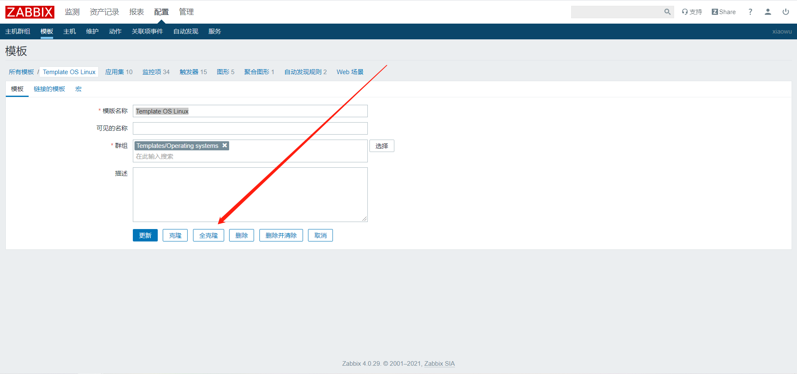

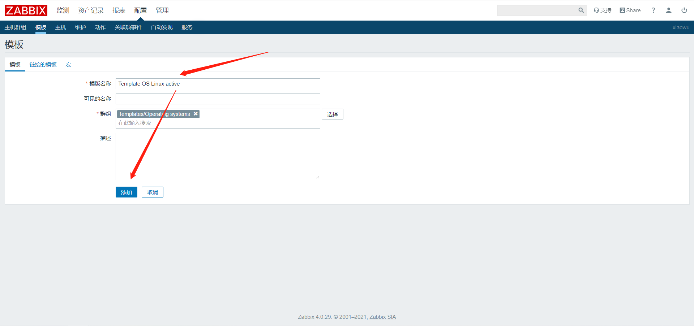


### 2、模板批量更新主动模式

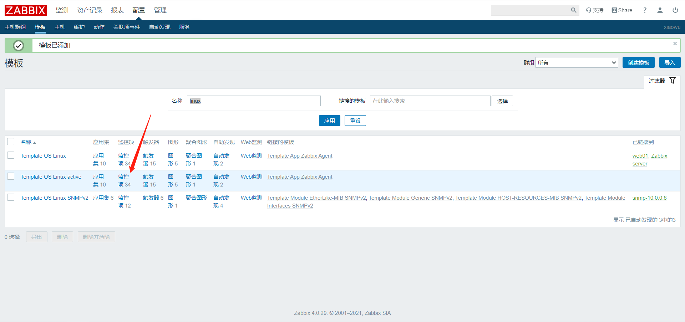

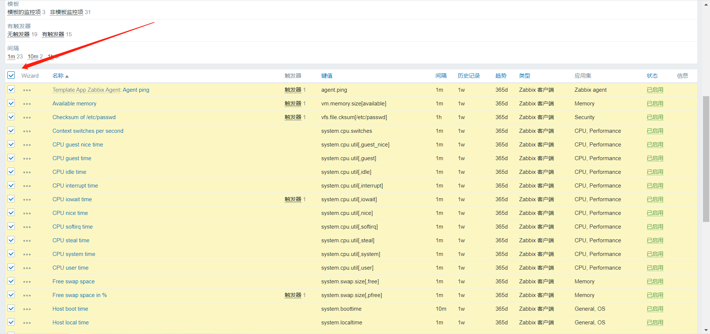

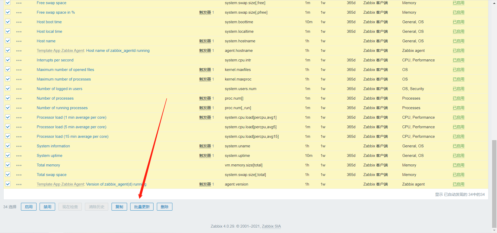

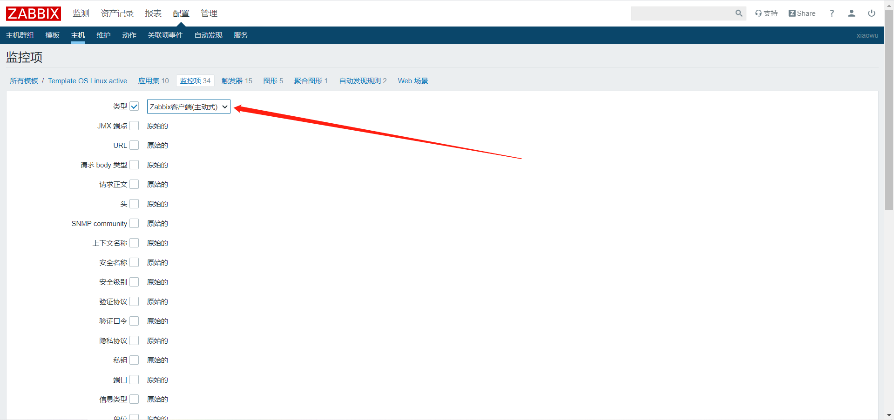

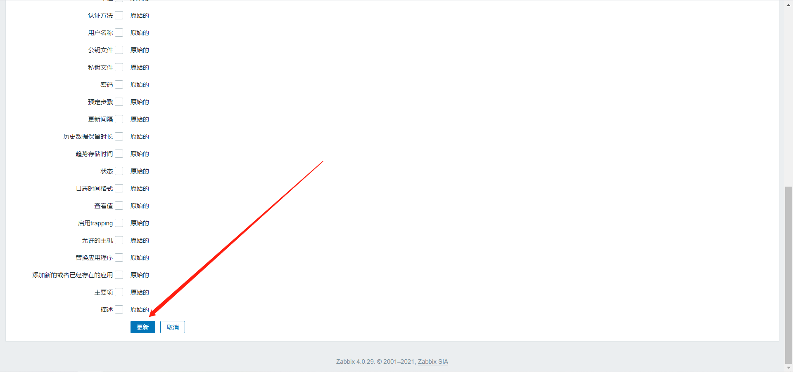


### 3、修改自动注册

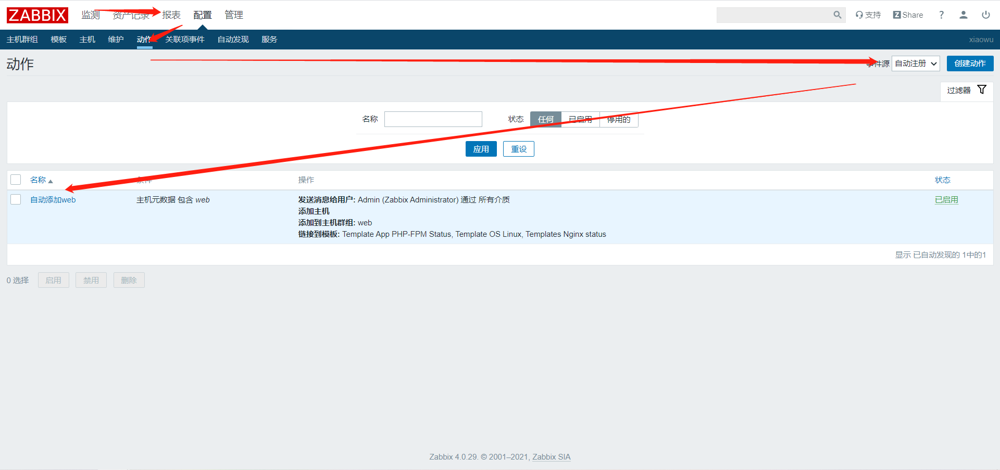

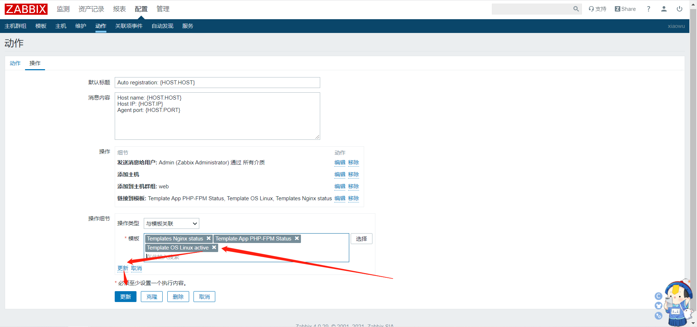


## 三、zabbix-agent配置文件配置

```bash
[root@web01 ~]# vim /etc/zabbix/zabbix_agentd.conf
...
Server=10.0.0.71				#允许谁来找我取值
ServerActive=10.0.0.71			#我主动向谁汇报
Hostname=web01					#主机名，唯一，区分每一个agent节点
...
```


**确认**

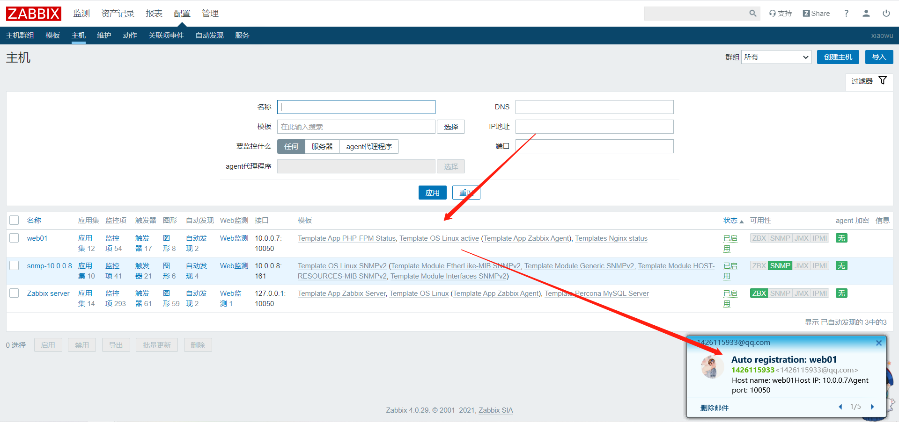


**注意**

```bash
监控项全部设置成主动后，虽然监控项有数据，但是主机可用性zbx不会绿。可以默认两个为被动模式
```

