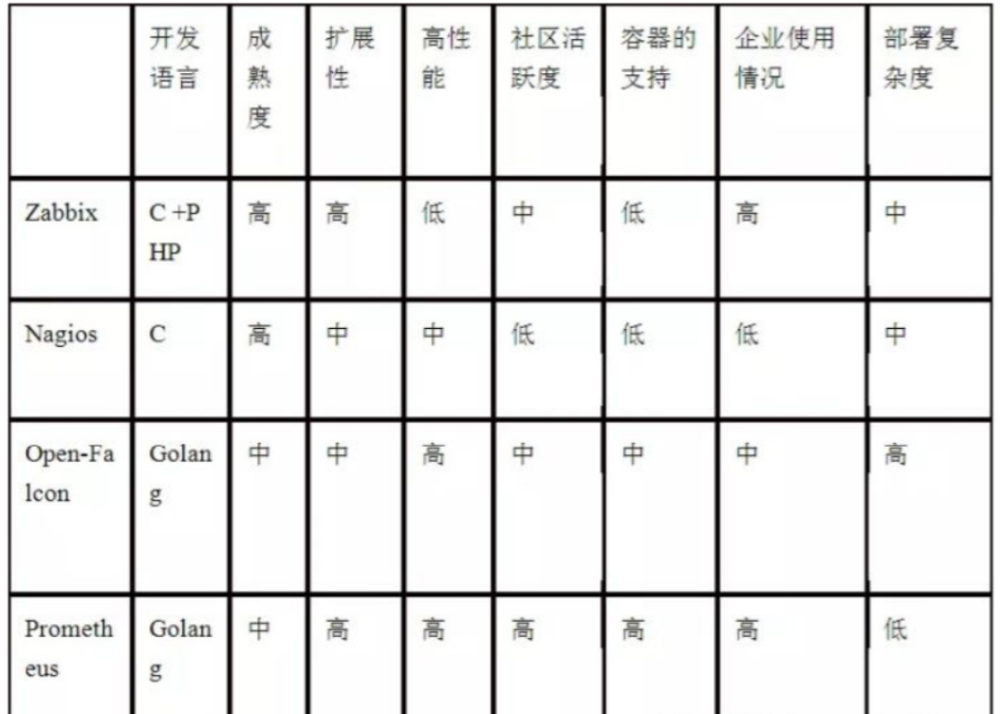
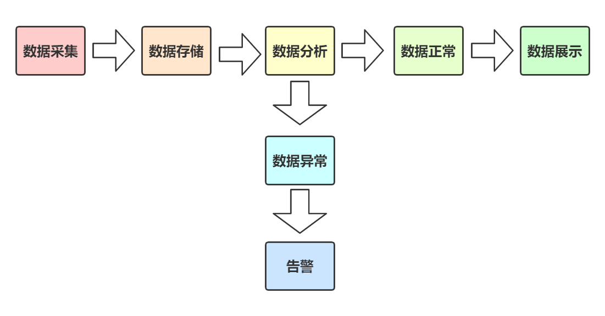
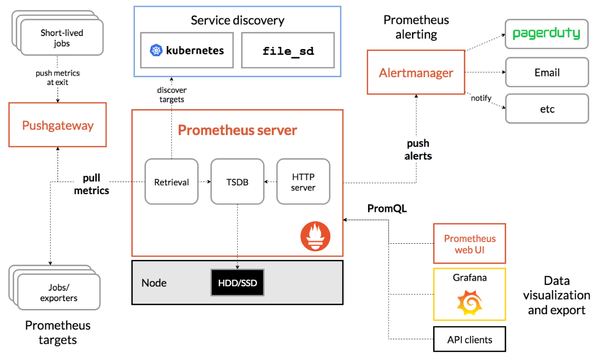

# prometheus监控介绍

## 一、什么是监控

```bash
监控===监测+控制
    生活中的监控：事故追责
    运维中的监控：事后追责，事前预警，性能分析，实时报警
```


## 二、为什么要监控

### 1、没有监控会怎样？

```bash
	监控是整个产品周期中最重要的一环，及时预警减少故障避免影响扩大，根据历史数据可以追溯问题根源，并且分析监控数据，可以找出用户体验优化方案。
	
	随着用户的增多，服务随时可能会被系统oom（out of memory内存溢出）
后果：kill -9 mysql
	如何判断?,web服务是因为用户访问过多，达到了瓶颈? 还是程序代码bug导致的，内存过多？
	上线一个新网站：压力测试 2000并发，oom（out of memeory）
```

### 2、监控的重要性


>通过业务监控系统，全⾯掌握业务环境的运⾏状态，通过⽩盒监控能够提前预知业务瓶颈，通过⿊盒监控能够第⼀时间发现业务故障并通过告警通告运维⼈员进⾏紧急恢复，从⽽将业务影响降到最低。
>
>>⿊盒监控，关注的是时时的状态，⼀般都是正在发⽣的事件，⽐如nginx web界⾯打开的是界⾯报错503、磁盘⽆法报错数据等，即⿊盒监控重点在于能对正在发⽣的故障进⾏通知告警。
>
>>⽩盒监控，关注的是原因，也就是系统内部暴露的⼀些指标数据，⽐如nginx 后端服务器的响应时⻓、磁盘的I/O负载值等。

>监控系统需要能够有效的⽀持⽩盒监控和⿊盒监控，通过⽩盒能够了解其内部的实际运⾏状态，以及对监控指标的观察能够预判可能出现的潜在问题，从⽽对潜在的不确定因素进⾏提前优化并避免问题的发⽣，⽽通过⿊盒监控，⽐如常⻅的如HTTP探针、TCP探针等，可以在系统或者服务在发⽣故障时能够快速通知相关的⼈员进⾏处理，通过建⽴完善的监控体系，从⽽达到以下⽬的：
>
>>⻓期趋势分析：通过对监控样本数据的持续收集和统计，对监控指标进⾏⻓期趋势分析。例如，通过对磁盘空间增⻓率的判断，我们可以提前预测在未来什么时间节点上需要对资源进⾏扩容。
>>
>>对照分析：两个版本的系统运⾏资源使⽤情况的差异如何？在不同容量情况下系统的并发和负载变化如何？通过监控能够⽅便的对系统进⾏跟踪和⽐较。
>>
>>告警：当系统出现或者即将出现故障时，监控系统需要迅速反应并通知管理员，从⽽能够对问题进⾏快速的处理或者提前预防问题的发⽣，避免出现对业务的影响。
>>
>>故障分析与定位：当问题发⽣后，需要对问题进⾏调查和处理。通过对不同监控监控以及历史数据的分析，能够找到并解决根源问题。
>>
>>数据可视化：通过可视化仪表盘能够直接获取系统的运⾏状态、资源使⽤情况、以及服务运⾏状态等直观的信息。


## 三、监控类型

```bash
按照层次划分可简单分为：
    应用层：nginx，mysql，java。。
    运行层：Windows，linux。。
    硬件层：内存，cpu，磁盘，网络。。
```


## 四、linux常见监控方式

### 1、命令

cpu、内存、磁盘、网络

```bash
1.top 			系统时间 登录用户  负载 进程 cpu 内存 swap  进程详细信息
2.htop（eple）  系统时间 登录用户  负载 进程 cpu 内存 swap  进程详细信息 支持鼠标 树状 快捷键
3.uptime 	当前系统时间、登录用户、负载 
4.free			监控内存
5.vmstat		程、虚存、页面交换空间及 CPU
5.iostat		磁盘I/O统计
6.df			硬盘 -h block	-i inode
7.iftop			流量监控工具
8.nethogs		查看进程占用的网络带宽
9.iotop			进程占用的硬盘I/O
```


### 2、脚本

没有监控工具的时候，shell脚本+定时任务

```bash
[root@k8s ~]# cat mem_alter.sh
#!/bin/bash
MEM=`free -m|awk 'NR==2{print $NF}'`
if [ $MEM -lt 100 ];then
echo "web服务器 192.168.15.1 可用内存不足,当前可用内存
$MEM" | mail -s "web服务器内存不足" 212121@qq.com
fi
```

缺点：效率低，不能实现集中报警，不能分析历史数据

什么时候用shell：我只有一台云主机需要监控，适合shell脚本+定时任务


### 3、监控工具

>开源监控软件：cacti、nagios、zabbix、smokeping、open-falcon等



#### 1.**Cacti**

>https://www.cacti.net/
>
>https://github.com/Cacti/cacti
>
>>Cacti是基于LAMP平台展现的⽹络流量监测及分析⼯具，通过SNMP技术或⾃定义脚本从⽬标设备/主机获取监控指标信息；其次进⾏数据存储，调⽤模板将数据存到数据库，使⽤rrdtool存储和更新数据，通过rrdtool绘制结果图形；最后进⾏数据展现，通过Web⽅式将监控结果呈现出来，常⽤于在数据中⼼监控⽹络设备。

#### 2.**Nagios**

>https://www.nagios.org/
>
>>Nagios⽤来监视系统和⽹络的开源应⽤软件，利⽤其众多的插件实现对本机和远端服务的监控，当被监控对象发⽣异常时，会及时向管理员告警，提供⼀批预设好的监控插件，⽤户可以之间调⽤，也可以⾃定义Shell脚本来监控服务，适合各企业的业务监控，可通过Web⻚⾯显示对象状态、⽇志、告警信息，分层告警机制及⾃定义监控相对薄弱。

#### 3.**SmokePing**

>https://oss.oetiker.ch/smokeping/
>
>http://blogs.studylinux.net/?p=794
>
>>Smokeping是⼀款⽤于⽹络性能监测的开源监控软件，主要⽤于对IDC的⽹络状况，⽹络质量，稳定性等做检测，通过rrdtool制图⽅式，图形化地展示⽹络的时延情况，进⽽能够清楚的判断出⽹络的即时通信情况。

#### 4.**Open-falcon**

>https://www.open-falcon.org/
>
>https://github.com/XiaoMi/open-falcon
>
>>⼩⽶公司开源出来的监控软件open-falcon(猎鹰)，监控能⼒和性能较强。

#### 5.夜莺

>https://n9e.didiyun.com/
>
>>⼀款经过⼤规模⽣产环境验证的、分布式⾼性能的运维监控系统，由滴滴基于open-falcon⼆次开发后开源出来的分布式监控系统。

#### 6.zabbix

>https://www.zabbix.com/cn/
>
>>⽬前使⽤较多的开源监控软件，可横向扩展、⾃定义监控项、⽀持多种监控⽅式、可监控⽹络与服务等。

#### 7.商用监控解决方案

>监控宝(https://www.jiankongbao.com/)
>
>听云(https://www.tingyun.com/)

#### 8.Prometheus

>针对容器环境的开源监控软件

## 五、监控流程



## 六、监控指标

| 监控项目 | 监控内容                                                     |
| -------- | ------------------------------------------------------------ |
| 主机     | 内存，磁盘（使用空间/剩余空间），系统启动时间，进程数，负载等 |
| 网卡     | ping的响应时间，数据包的收发成功率，网卡的流入&流出量和错误的数据包数量 |
| 文件     | 大小，文件指纹信息等                                         |
| URL      | 指定URL访问过程中的返回码，下载时间及文件大小等              |
| 应用程序 | 服务状态，端口和内存使用率，cpu使用率，请求数量，并发访问请求等 |
| 数据库   | 指定数据库中的表空间，数据库的游标数，会话数，事务数等       |
| 日志     | 错误日志，特定字符串匹配                                     |
| 硬件     | 温度，风扇转速，电压，电源，主板控制器，磁盘阵列等           |


# promethus介绍

## 一、介绍

### 1、概述

```bash
	Prometheus是最初在SoundCloud上构建的开源系统监视和警报工具包 。自2012年成立以来，许多公司和组织都采用了Prometheus，该项目拥有非常活跃的开发人员和用户社区。现在，它是一个独立的开源项目，并且独立于任何公司进行维护。为了强调这一点并阐明项目的治理结构，Prometheus 在2016年加入了 Cloud Native Computing Foundation，这是继Kubernetes之后的第二个托管项目
	
	Prometheus(由go语言(golang)开发)是一套开源的监控&报警&时间序列数据库的组合。
	
	Prometheus 是一款基于时序数据库的开源监控告警系统，非常适合Kubernetes集群的监控。Prometheus的基本原理是通过HTTP协议周期性抓取被监控组件的状态，任意组件只要提供对应的HTTP接口就可以接入监控。不需要任何SDK或者其他的集成过程。这样做非常适合做虚拟化环境监控系统，比如VM、Docker、Kubernetes等。输出被监控组件信息的HTTP接口被叫做exporter 。目前互联网公司常用的组件大部分都有exporter可以直接使用，比如Varnish、Haproxy、Nginx、MySQL、Linux系统信息(包括磁盘、内存、CPU、网络等等)。

	prometheus和K8S一样属于CNCF
    官网地址：https://prometheus.io/
    github地址：https://github.com/prometheus
```

### 2、特点

>- 使⽤key-value的多维度(多个⻆度，多个层⾯，多个⽅⾯)格式保存数据
>
>- 数据不使⽤MySQL这样的传统数据库，⽽是使⽤时序数据库，⽬前是使⽤的TSDB
>
>- ⽀持第三⽅dashboard实现更绚丽的图形界⾯，如grafana(Grafana 2.5.0版本及以上)
>
>- 组件模块化
>
>- 不需要依赖存储，数据可以本地保存也可以远程保存
>
>- 平均每个采样点仅占3.5 bytes，且⼀个Prometheus server可以处理数百万级别的的metrics指标数据。
>
>- ⽀持服务⾃动化发现(基于consul等⽅式动态发现被监控的⽬标服务)
>
>- 强⼤的数据查询语句功(PromQL,Prometheus Query Language)
>
>- 数据可以直接进⾏算术运算
>
>- 易于横向伸缩
>
>- 众多官⽅和第三⽅的exporter实现不同的指标数据收集

### 3、为什么使用Prometheus？

>容器监控的实现⽅对⽐虚拟机或者物理机来说⽐⼤的区别，⽐如容器在k8s环境中可以任意横向扩容与缩容，那么就需要监控服务能够⾃动对新创建的容器进⾏监控，当容器删除后⼜能够及时的从监控服务中删除，⽽传统的zabbix的监控⽅式需要在每⼀个容器中安装启动agent，并且在容器⾃动发现注册及模板关联⽅⾯并没有⽐较好的实现⽅式。

## 二、工作流程

### 1、架构图




### 2、组件介绍

>prometheus server：主服务，接受外部http请求，收集、存储与查询数据等
>
>prometheus targets: 静态收集的⽬标服务数据
>
>service discovery：动态发现服务
>
>prometheus alerting：报警通知
>
>push gateway：数据收集代理服务器(类似于zabbix proxy)
>
>data visualization and export： 数据可视化与数据导出(访问客户端)


#### 1.Prometheus Server

```bash
Retrieval
获取监控数据

TSDB: 
时间序列数据库(Time Series Database)，我们可以简单的理解为一个优化后用来处理时间序列数据的软件，并且数据中的数组是由时间进行索引的。具备以下特点：
	大部分时间都是顺序写入操作，很少涉及修改数据
    删除操作都是删除一段时间的数据，而不涉及到删除无规律数据
    读操作一般都是升序或者降序
    
HTTP Server
为告警和出图提供查询接口
```


#### 2.Pull metrics 指标采集

```bash
Exporters:
	Prometheus的一类数据采集组件的总称。它负责从目标处搜集数据，并将其转化为Prometheus支持的格式。与传统的数据采集组件不同的是，它并不向中央服务器发送数据，而是等待中央服务器主动前来抓取
	用于暴露已有的第三方服务的 metrics 给 Prometheus。

Pushgateway
	用于网络不可直达或者生命周期比较短的数据采集job，居于exporter与server端的中转站,将多个节点数据汇总到Push Gateway，再统一推送到server。
```


#### 3. service discovery 服务发现

```bash
Kubernetes_sd
	支持从Kubernetes中自动发现服务和采集信息。而Zabbix监控项原型就不适合Kubernets，因为随着Pod的重启或者升级，Pod的名称是会随机变化的。

file_sd
	通过配置文件来实现服务的自动发现
```


#### 4.Alertmanager 单独抽离的告警组件

```bash
	从 Prometheus server 端接收到 alerts(告警) 后，会进行去除重复数据，分组，并路由到对收的接受方式，发出报警。常见的接收方式有：电子邮件，pagerduty，OpsGenie, webhook 等。
```


#### 5. 图形化展示

```bash
通过ProQL语句查询指标信息，并在页面展示。虽然Prometheus自带UI界面，但是大部分都是使用Grafana出图。另外第三方也可以通过 API 接口来获取监控指标。
```


### 3、工作流程

```bash
1、Prometheus server 定期从配置好的 jobs 或者 exporters（出口） 中拉metrics（指标），或者接收来自 Pushgateway 发过来的 metrics（指标），或者从其他的 Prometheus server 中拉 metrics（指标）。
2、默认使用的拉取方式是pull，也可以使用pushgateway提供的push方式获取各个监控节点的数据。
3、将获取到的数据存入TSDB，一款时序型数据库。
4、此时prometheus已经获取到了监控数据，可以使用内置的PromQL进行查询。
5、它的报警功能使用Alertmanager提供，Alertmanager是prometheus的告警管理和发送报警的一个组件。
6、prometheus原生的图标功能过于简单，可将prometheus数据接入grafana，由grafana进行统一管理。
```


## 三、promethus的优缺点及特点

### 1、优点

```bash
1、非常少的外部依赖，安装使用超简单
2、已经有非常多的系统集成 例如：docker HAProxy Nginx JMX等等
3、服务自动化发现
4、直接集成到代码
5、设计思想是按照分布式、微服务架构来实现的
```


### 2、特点

```bash
1、一个多维数据模型，其中包含通过度量标准名称和键/值对标识的时间序列数据

2、PromQL，一种灵活的查询语言 ，可利用此维度

3、不依赖分布式存储；单服务器节点是自治的

4、时间序列收集通过HTTP上的拉模型进行

5、通过中间网关支持推送时间序列

6、通过服务发现或静态配置发现目标

7、多种图形和仪表板支持模式
```


### 3、不足

```bash
1、Prometheus 是基于 Metric 的监控，不适用于日志（Logs）、事件（Event）、调用链（Tracing）。

2、Prometheus 默认是 Pull 模型，合理规划你的网络，尽量不要转发。

3、对于集群化和水平扩展，官方和社区都没有银弹，需要合理选择 Federate、Cortex、Thanos 等方案。

4、监控系统一般情况下可用性大于一致性，容忍部分副本数据丢失，保证查询请求成功。这个后面说 Thanos 去重的时候会提到。

5、Prometheus 不一定保证数据准确，这里的不准确一是指 rate、histogram_quantile 等函数会做统计和推断，产生一些反直觉的结果，这个后面会详细展开。二来查询范围过长要做降采样，势必会造成数据精度丢失，不过这是时序数据的特点，也是不同于日志系统的地方。
```

## 四、Kubernetes Operator 介绍

>​    在 Kubernetes 的支持下，管理和伸缩 Web 应用、移动应用后端以及 API 服务都变得比较简单了。其原因是这些应用一般都是无状态的，所以 Deployment 这样的基础 Kubernetes API 对象就可以在无需附加操作的情况下，对应用进行伸缩和故障恢复了。
>
>​    而对于数据库、缓存或者监控系统等有状态应用的管理，就是个挑战了。这些系统需要应用领域的知识，来正确的进行伸缩和升级，当数据丢失或不可用的时候，要进行有效的重新配置。我们希望这些应用相关的运维技能可以编码到软件之中，从而借助 Kubernetes 的能力，正确的运行和管理复杂应用。
>
>​    Operator 这种软件，使用 TPR(第三方资源，现在已经升级为 CRD) 机制对 Kubernetes API 进行扩展，将特定应用的知识融入其中，让用户可以创建、配置和管理应用。和 Kubernetes 的内置资源一样，Operator 操作的不是一个单实例应用，而是集群范围内的多实例。

> Kubernetes 的 Prometheus Operator 为 Kubernetes 服务和 Prometheus 实例的部署和管理提供了简单的监控定义。

>安装完毕后，Prometheus Operator提供了以下功能：
>
>- 创建/毁坏： 在 Kubernetes namespace 中更容易启动一个 Prometheus 实例，一个特定的应用程序或团队更容易使用Operator。
>- 简单配置: 配置 Prometheus 的基础东西，比如在 Kubernetes 的本地资源 versions, persistence, retention policies, 和 replicas。
>- Target Services 通过标签： 基于常见的Kubernetes label查询，自动生成监控target 配置；不需要学习普罗米修斯特定的配置语言。

## 五、Prometheus Operator 系统架构图


>- Operator： Operator 资源会根据自定义资源（Custom Resource Definition / CRDs）来部署和管理 Prometheus Server，同时监控这些自定义资源事件的变化来做相应的处理，是整个系统的控制中心。
>- Prometheus： Prometheus 资源是声明性地描述 Prometheus 部署的期望状态。
>- Prometheus Server： Operator 根据自定义资源 Prometheus 类型中定义的内容而部署的 Prometheus Server 集群，这些自定义资源可以看作是用来管理 Prometheus Server 集群的 StatefulSets 资源。
>- ServiceMonitor： ServiceMonitor 也是一个自定义资源，它描述了一组被 Prometheus 监控的 targets 列表。该资源通过 Labels 来选取对应的 Service Endpoint，让 Prometheus Server 通过选取的 Service 来获取 Metrics 信息。
>- Service： Service 资源主要用来对应 Kubernetes 集群中的 Metrics Server Pod，来提供给 ServiceMonitor 选取让 Prometheus Server 来获取信息。简单的说就是 Prometheus 监控的对象，例如 Node Exporter Service、Mysql Exporter Service 等等。
>- Alertmanager： Alertmanager 也是一个自定义资源类型，由 Operator 根据资源描述内容来部署 Alertmanager 集群。


