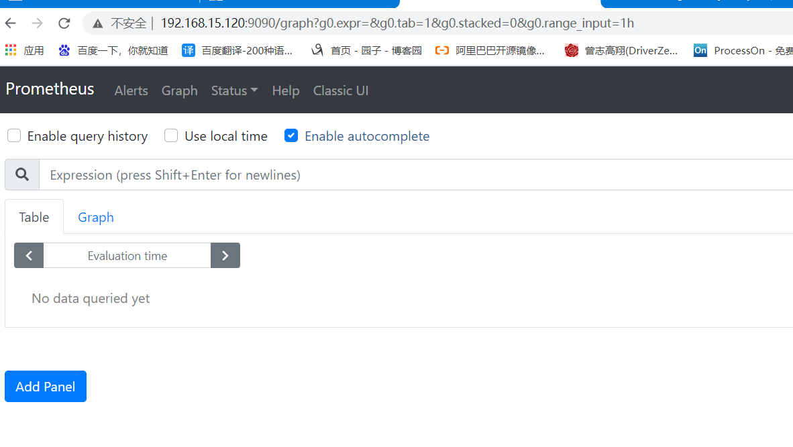
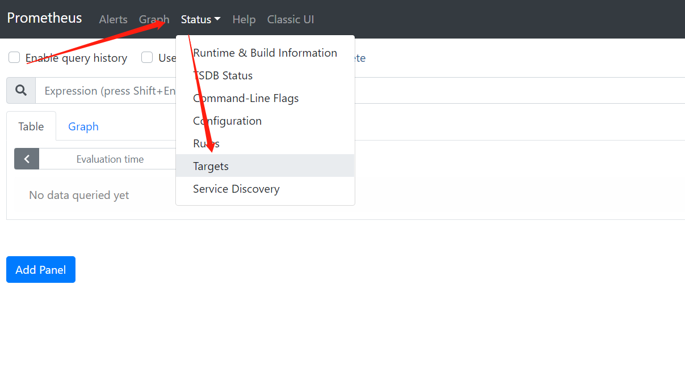
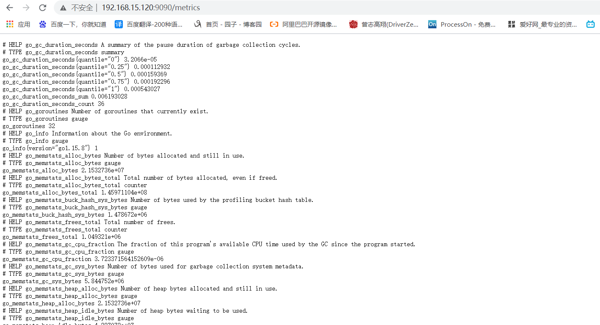
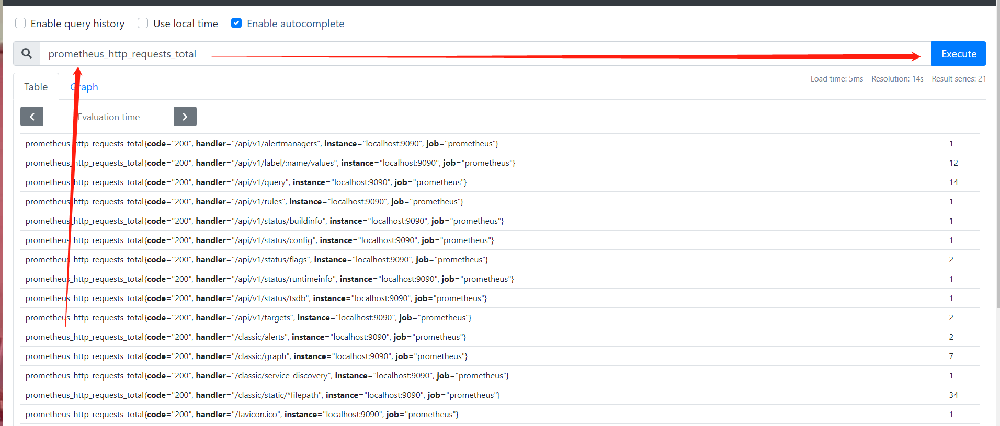
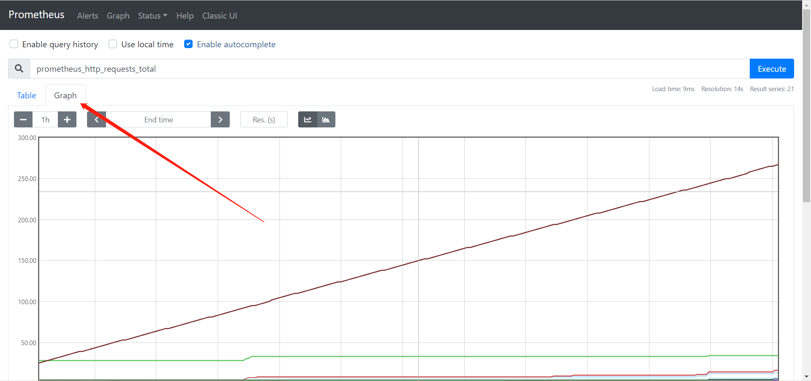
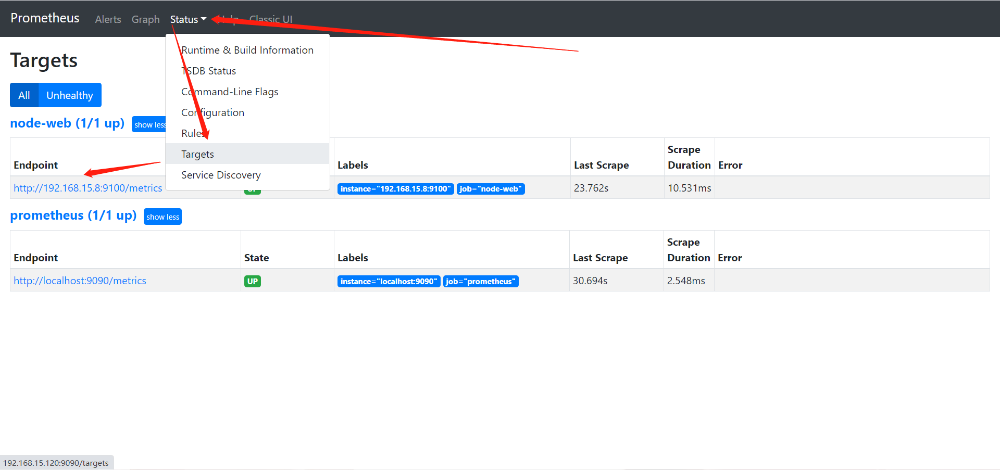

## 一、prometheus基础使用

### 1、访问

http://192.168.15.120:9090/



### 2、查看监控的主机

默认只监控了本机一台，点`Status -->`点`Targets -->`可以看到只监控了本机。



### 3、查看监控数据

通过`http://服务器IP:9090/metrics`可以查看到监控的数据，在web主界面可以通过关键字查询监控项



**查看数据**




**查看图形**




# 监控远程linux主机

## 一、被监控点部署node_exporter

### 1、下载

```bash
[root@web02 /opt]# wget https://github.com/prometheus/node_exporter/releases/download/v1.1.1/node_exporter-1.1.1.linux-amd64.tar.gz
```


### 2、解压

```bash
[root@web02 /opt]# mkdir /prometheus_node/
[root@web02 /opt]# tar xf node_exporter-1.1.1.linux-amd64.tar.gz -C /prometheus_node/
[root@web02 /prometheus_node]# mv node_exporter-1.1.1.linux-amd64/* ./
```


### 3、加入systemd管理

```bash
[root@web02 /prometheus_node]# vim /usr/lib/systemd/system/node_exporter.service

[Unit]
Description=prometheus server daemon

[Service]
ExecStart=/prometheus_node/node_exporter
Restart=on-failure

[Install]
WantedBy=multi-user.target

# 重载
systemctl daemon-reload
```


### 4、启动且加入开机自启

```bash
[root@web02 ~]# systemctl enable node_exporter.service --now
```


### 5、检查

```bash
[root@web02 ~]# netstat -lntup|grep 9100
tcp6       0      0 :::9100                 :::*                    LISTEN      3224/node_exporter  
[root@web02 ~]# curl 127.0.0.1:9100/metrics
...
好多监控数据啊
...
```


## 二、配置prometheus连接node

### 1、修改配置文件

```bash
[root@promethus /prometheus]# vim prometheus.yml 
...
  - job_name: 'node-web'
    static_configs:
    - targets: ['192.168.15.8:9100']
```


### 2、重启服务

```bash
[root@promethus /prometheus]# systemctl restart prometheus.service
```


### 3、检查




## 三、获取远程linux监控指标

```bash
http://IP:9100/metrics
```

