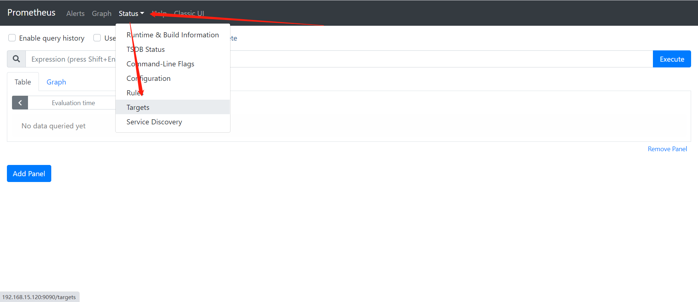
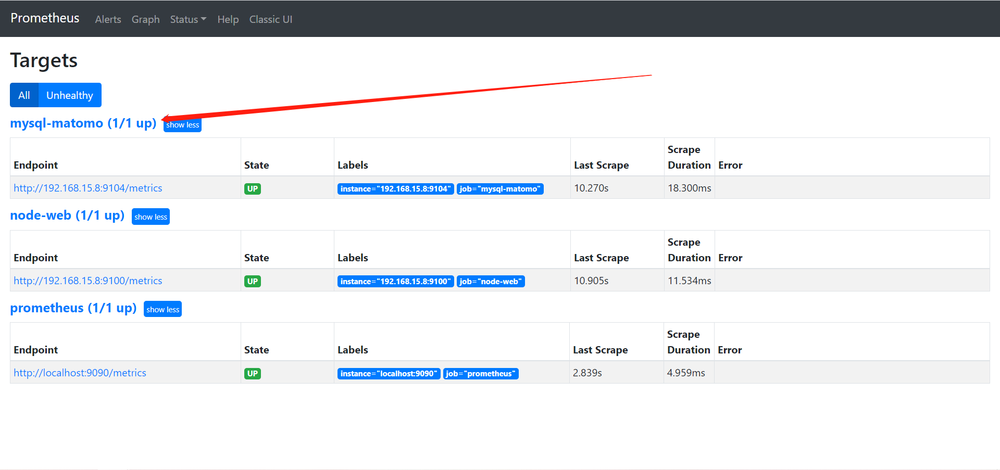

# 监控远程mysql服务

## 一、被监控点部署mysql_exporter

### 1、下载

````bash
[root@web02 /opt]# wget https://github.com/prometheus/mysqld_exporter/releases/download/v0.12.1/mysqld_exporter-0.12.1.linux-amd64.tar.gz
````


### 2、解压

```bash
[root@web02 /opt]# mkdir /prometheus_mysql/
[root@web02 /opt]# tar xf mysqld_exporter-0.12.1.linux-amd64.tar.gz -C /prometheus_mysql/
[root@web02 /opt]# cd /prometheus_mysql/
[root@web02 /prometheus_mysql]# mv mysqld_exporter-0.12.1.linux-amd64/* ./
[root@web02 /prometheus_mysql]# rm -rf mysqld_exporter-0.12.1.linux-amd64/
```


### 3、mysql创建监控用户并授权

```bash
# 8.0之前
 grant select,replication client,process ON *.* to 'mysql_monitor'@'localhost' identified by 'abc123';

# 8.0之后
create user 'mysql_monitor'@'localhost' identified by 'abc123';
 grant select,replication client,process ON *.* to 'mysql_monitor'@'localhost';
 
#刷新权限
flush privileges;

# (注意:授权ip为localhost，因为不是prometheus服务器来直接找mariadb 获取数据，⽽是prometheus服务器找mysql_exporter,mysql_exporter 再找mariadb。所以这个localhost是指的mysql_exporter的IP)
```


### 4、创建客户端配置文件

```bash
[root@web02 ~]# cat /prometheus_mysql/.my.cnf
[client]
user=mysql_monitor
password=abc123
```


### 5、加入systemd管理

```bash
[root@web02 /prometheus_mysql]# vim /usr/lib/systemd/system/mysqld_exporter.service

[Unit]
Description=prometheus server daemon

[Service]
ExecStart=/prometheus_mysql/mysqld_exporter  --config.my-cnf=/prometheus_mysql/.my.cnf
Restart=on-failure

[Install]
WantedBy=multi-user.target

# 重载
[root@web02 /prometheus_mysql]# systemctl daemon-reload
```


### 6、启动mysql_exporter

```bash
[root@web02 ~]# systemctl enable mysqld_exporter.service --now
```


### 7、检查

```bash
[root@web02 ~]# netstat -lntup|grep 9104
tcp6       0      0 :::9104                 :::*                    LISTEN      2046/mysqld_exporte 

[root@web02 ~]# curl 127.0.0.1:9104/metrics
```


## 二、配置prometheus连接node

### 1、修改配置文件

```bash
[root@promethus ~]# vim /prometheus/prometheus.yml
...
  - job_name: 'mysql-matomo'
    static_configs:
    - targets: ['192.168.15.8:9104']
```


### 2、重启服务

```bash
[root@promethus ~]# systemctl restart prometheus.service 
```


## 三、检查





