# prometheus集成grafana

## 一、什么是grafana

```bash
	Grafana是一款用Go语言开发的开源数据可视化工具，可以做数据监控和数据统计，带有告警功能。目前使用grafana的公司有很多，如paypal、ebay、intel等。
```


## 二、特点

### 1、可视化

```bash
快速和灵活的客户端图形具有多种选项。面板插件为许多不同的方式可视化指标和日志。
```


### 2、报警

```bash
可视化地为最重要的指标定义警报规则。Grafana将持续评估它们，并发送通知。
```


### 3、通知

```bash
警报更改状态时，它会发出通知。接收电子邮件通知。
```


### 4、动态仪表盘

```bash
使用模板变量创建动态和可重用的仪表板，这些模板变量作为下拉菜单出现在仪表板顶部。
```


### 5、混合数据源

```bash
在同一个图中混合不同的数据源!可以根据每个查询指定数据源。这甚至适用于自定义数据源。
```


### 6、注释

```bash
注释来自不同数据源图表。将鼠标悬停在事件上可以显示完整的事件元数据和标记。
```


### 7、过滤器

```bash
过滤器允许您动态创建新的键/值过滤器，这些过滤器将自动应用于使用该数据源的所有查询。
```


## 三、安装

### 1、下载

```bash
[root@promethus /prometheus]# cd /opt/
[root@promethus /opt]# wget https://mirrors.tuna.tsinghua.edu.cn/grafana/yum/rpm/grafana-7.4.3-1.x86_64.rpm
```


### 2、安装

```bash
[root@promethus /opt]# yum localinstall grafana-7.4.3-1.x86_64.rpm -y
```


### 3、启动并加入开机自启

```bash
[root@promethus /opt]# systemctl start grafana-server.service 
[root@promethus /opt]# systemctl enable grafana-server.service 
```


### 4、检查

```bash
[root@promethus /opt]# netstat -lntup |grep grafana
tcp6       0      0 :::3000                 :::*                    LISTEN      18889/grafana-serve 
```


### 5、访问测试

http://10.0.0.71:3000/


## 四、grafana连接到prometheus

### 1、添加数据源

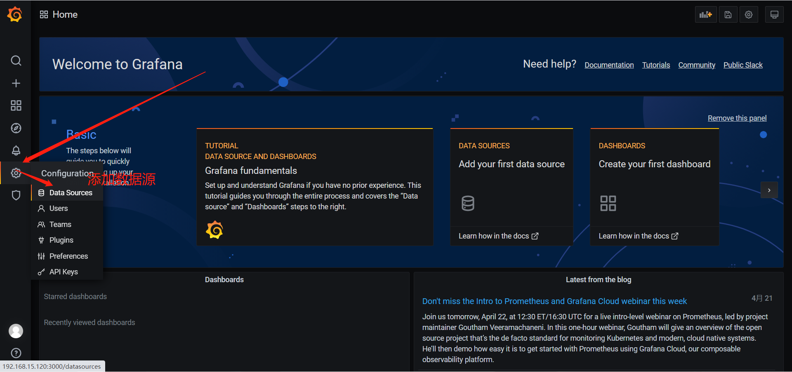

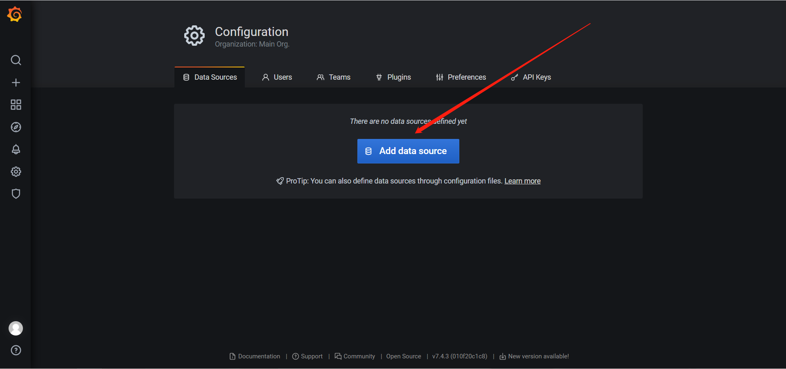

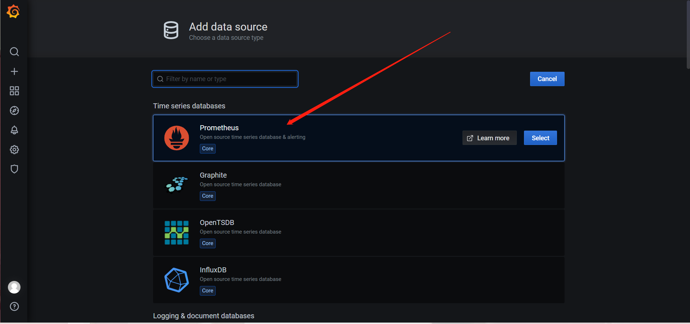

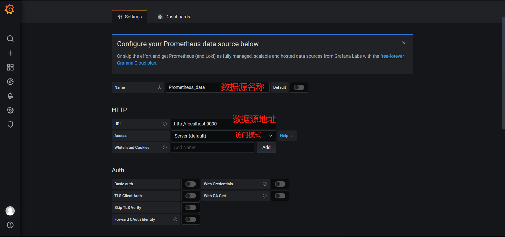

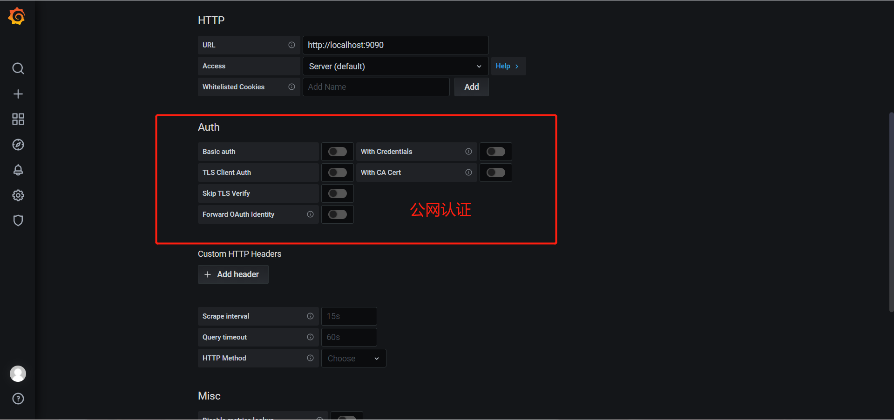

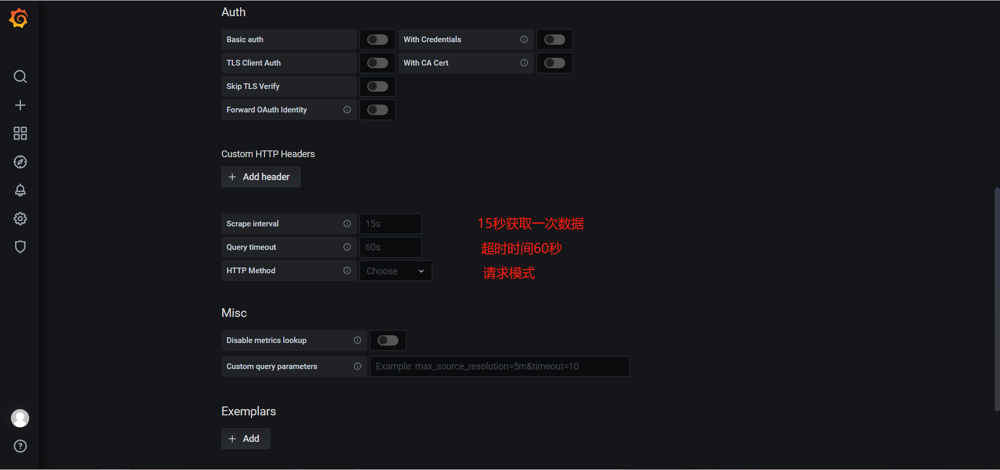

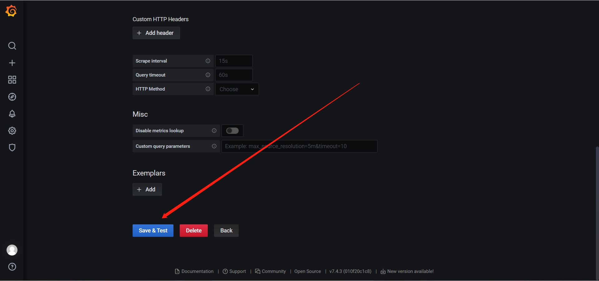


## 五、简单出图测试

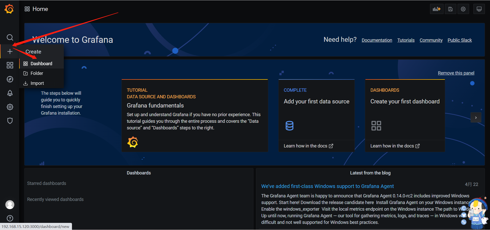

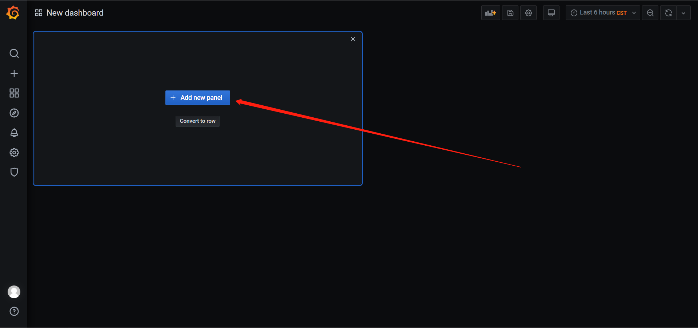

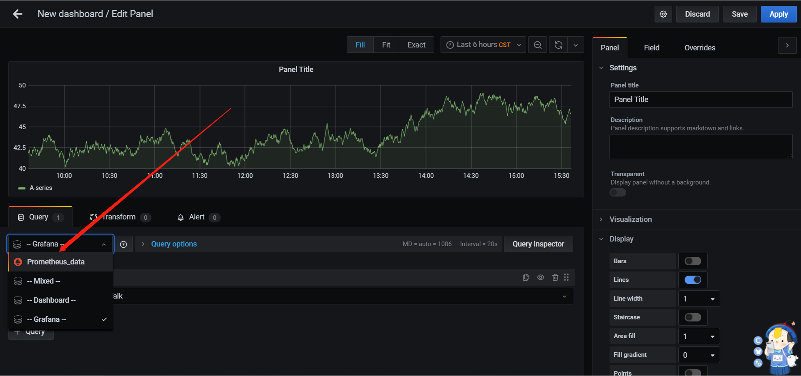

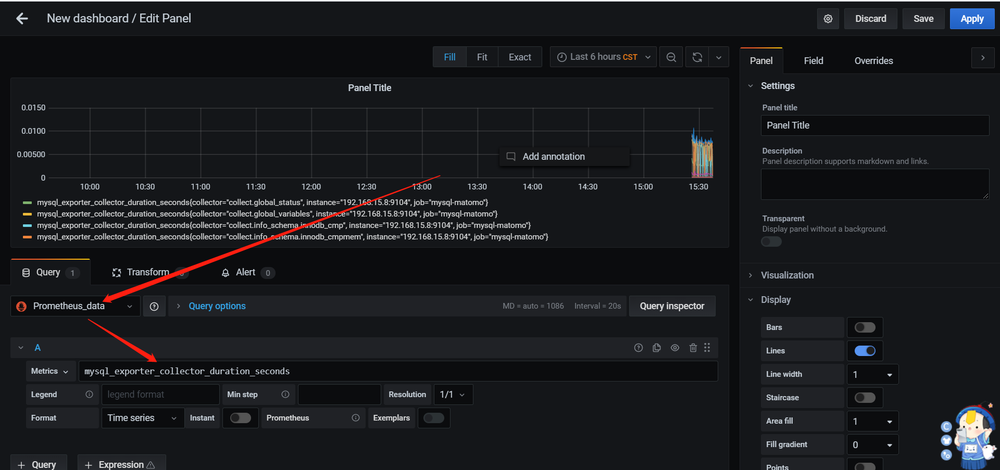


