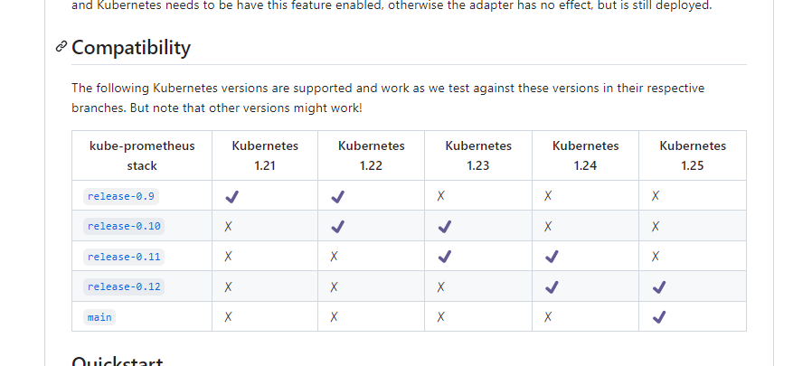

# k8s部署prometheus集群

## 一、部署prometheus

### 1、查看集群状态

```bash
root@k8s-master1:~# kubectl get nodes
NAME          STATUS                     ROLES    AGE    VERSION
172.16.3.11   Ready                      node     153d   v1.23.1
172.16.3.12   Ready                      node     153d   v1.23.1
172.16.3.13   Ready                      node     153d   v1.23.1
172.16.3.3    Ready,SchedulingDisabled   master   154d   v1.23.1
172.16.3.4    Ready,SchedulingDisabled   master   154d   v1.23.1
```


### 2、查看版本对应

> https://github.com/prometheus-operator/kube-prometheus




### 2、下载代码

```bash
[root@k8s-master-01 ~]# wget https://github.com/prometheus-operator/kube-prometheus/archive/refs/tags/v0.11.0.tar.gz
```

### 3、解压

```bash
[root@k8s-master-01 ~]# tar xf kube-prometheus-0.11.0.tar.gz
```

### 4、部署

```bash
# cd kube-prometheus-0.11.0/manifests/setup
# kubectl apply -f ./
# 如果提示某些资源部署失败
kubectl create -f ./0prometheusCustomResourceDefinition.yaml
# 部署普罗米修斯
[root@k8s-master-01 ~/kube-prometheus-0.11.0/manifests/setup]# cd ..
[root@k8s-master-01 ~/kube-prometheus-0.11.0/manifests]# kubectl apply -f ./
```

## 二、prometheus数据持久化

>使用kube-[prometheus](https://so.csdn.net/so/search?q=prometheus&spm=1001.2101.3001.7020)安装的prometheus，默认是没有将数据持久化的，也是就是pod 重启数据就没了。

### 1、prometheus特定的资源

#### 1.查看部署prometheus创建的pod

```bash
root@k8s-master1:~# kubectl get pods -n monitoring
NAME                                  READY   STATUS    RESTARTS   AGE
alertmanager-main-0                   2/2     Running   0          41d
alertmanager-main-1                   2/2     Running   0          41d
alertmanager-main-2                   2/2     Running   0          41d
blackbox-exporter-746c64fd88-n5trb    3/3     Running   0          41d
grafana-5fc7f9f55d-srrlx              1/1     Running   0          41d
kube-state-metrics-6d7746678c-6trk2   3/3     Running   0          40d
node-exporter-dd9xh                   2/2     Running   0          41d
node-exporter-gwdkk                   2/2     Running   0          41d
node-exporter-v899h                   2/2     Running   0          41d
node-exporter-wn5xv                   2/2     Running   0          41d
node-exporter-x86tk                   2/2     Running   0          41d
prometheus-adapter-c76fb84d7-d4wkl    1/1     Running   0          40d
prometheus-adapter-c76fb84d7-nwjxd    1/1     Running   0          40d
prometheus-k8s-0                      2/2     Running   0          41d  #这个就是真正在跑prometheus-server的pod
prometheus-k8s-1                      2/2     Running   0          41d  #这个就是真正在跑prometheus-server的pod
prometheus-operator-f59c8b954-g5z6f   2/2     Running   0          41d
```

>#由此知prometheus的主服务其实就是使用pod启动的，其实就是prometheus-k8s-0、prometheus-k8s-1，而这种pod一看有序号就知道是sts创建的

#### 2.查看prometheus的sts资源

```bash
root@k8s-master1:~# kubectl get sts -n monitoring
NAME                READY   AGE
alertmanager-main   3/3     41d
prometheus-k8s      2/2     41d
```

>查了一遍，发现当初创建kube-prometheus的yaml文件里面并没有创建StatefulSet资源，很奇怪。后来百度发现，其实官方定义了一种叫做prometheus的资源，该资源创建了StatefulSet，如下：

```bash
root@k8s-master1:~# kubectl get prometheus -n monitoring
NAME   VERSION   REPLICAS   AGE
k8s    2.36.1    2          41d  #这种prometheus资源，由其创建的sts，创建k8s资源的文件是prometheus-prometheus.yaml
root@k8s-master1:~# kubectl get Alertmanager -n monitoring
NAME   VERSION   REPLICAS   AGE
main   0.24.0    3          41d  #这种Alertmanager资源，由其创建的sts，创建k8s资源的文件是alertmanager-alertmanager.yaml
```

### 2、prometheus数据持久化

>prometheus-prometheus.yaml
>
>目录权限：1001或1000

```yaml
  ...
  podMonitorNamespaceSelector: {}
  podMonitorSelector: {}
  probeNamespaceSelector: {}
  probeSelector: {}
  replicas: 2
  resources:
    requests:
      memory: 400Mi
  # prometheus数据保留的天数，默认：24h
  retention: 30d
  ruleNamespaceSelector: {}
  ruleSelector: {}
  securityContext:
    fsGroup: 2000
    runAsNonRoot: true
    runAsUser: 1000
  serviceAccountName: prometheus-k8s
  serviceMonitorNamespaceSelector: {}
  serviceMonitorSelector: {}
  # 数据持久化
  storage:
    volumeClaimTemplate:
      spec:
        accessModes:
          - ReadWriteOnce
        resources:
          requests:
            storage: 60Gi
        storageClassName: nfs-storage
  version: 2.36.1
```

### 3、grafana数据持久化

>grafana-deployment.yaml
>
>目录权限：472 或者 chmod 777 /k8s-data/grafana_data

```yaml
...
      volumes:
      - name: grafana-storage
        nfs:
          server: 172.16.3.21
          path: /k8s-data/grafana_data
...
```

## 三、prometheus访问

### 1、配置nodeport

#### 1.alertmanager-service.yaml

```yaml
apiVersion: v1
kind: Service
metadata:
  labels:
    app.kubernetes.io/component: alert-router
    app.kubernetes.io/instance: main
    app.kubernetes.io/name: alertmanager
    app.kubernetes.io/part-of: kube-prometheus
    app.kubernetes.io/version: 0.24.0
  name: alertmanager-main
  namespace: monitoring
spec:
  type: NodePort
  ports:
  - name: web
    port: 9093
    targetPort: web
    nodePort: 9093
  - name: reloader-web
    port: 8080
    targetPort: reloader-web
  selector:
    app.kubernetes.io/component: alert-router
    app.kubernetes.io/instance: main
    app.kubernetes.io/name: alertmanager
    app.kubernetes.io/part-of: kube-prometheus
  sessionAffinity: ClientIP
```

#### 2.grafana-service.yaml

```yaml
apiVersion: v1
kind: Service
metadata:
  labels:
    app.kubernetes.io/component: grafana
    app.kubernetes.io/name: grafana
    app.kubernetes.io/part-of: kube-prometheus
    app.kubernetes.io/version: 8.5.5
  name: grafana
  namespace: monitoring
spec:
  type: NodePort
  ports:
  - name: http
    port: 3000
    targetPort: http
    nodePort: 3000
  selector:
    app.kubernetes.io/component: grafana
    app.kubernetes.io/name: grafana
    app.kubernetes.io/part-of: kube-prometheus
```

#### 3.prometheus-service.yaml

```yaml
apiVersion: v1
kind: Service
metadata:
  labels:
    app.kubernetes.io/component: prometheus
    app.kubernetes.io/instance: k8s
    app.kubernetes.io/name: prometheus
    app.kubernetes.io/part-of: kube-prometheus
    app.kubernetes.io/version: 2.36.1
  name: prometheus-k8s
  namespace: monitoring
spec:
  type: NodePort
  ports:
  - name: web
    port: 9090
    targetPort: web
    nodePort: 9090
  - name: reloader-web
    port: 8080
    targetPort: reloader-web
  selector:
    app.kubernetes.io/component: prometheus
    app.kubernetes.io/instance: k8s
    app.kubernetes.io/name: prometheus
    app.kubernetes.io/part-of: kube-prometheus
  sessionAffinity: ClientIP
```

### 2、删除网络策略

>执行下这个就好了，删除所有网络策略

```bash
kubectl delete networkpolicy --all -n monitoring
```

## 四、配置钉钉告警

### 1、01_dingtalk-webhook.yaml

```yaml
---
apiVersion: v1
kind: ConfigMap
metadata:
  name: dingtalk-config
  namespace: monitoring
data:
  config.yml: |-
    templates:
      - /etc/prometheus-webhook-dingtalk/dingding.tmpl
    targets:
      webhook:
        url: https://oapi.dingtalk.com/robot/send?access_token=xxxxxxxxxxxxxxxxxxxxxxxxxx
        message:
          text: '{{ template "dingtalk.to.message" . }}'
  dingding.tmpl: |-
    {{ define "dingtalk.to.message" }}
    {{- if gt (len .Alerts.Firing) 0 -}}
    {{- range $index, $alert := .Alerts -}}

    ========= <font color="red">**监控告警**</font> =========

    **告警集群:**     k8s</br>
    **告警类型:**    {{ $alert.Labels.alertname }}</br>
    **告警级别:**    {{ $alert.Labels.severity }}</br>
    **告警状态:**    {{ .Status }}</br>
    **故障主机:**    {{ $alert.Labels.instance }} {{ $alert.Labels.device }}</br>
    **告警主题:**    {{ .Annotations.summary }}</br>
    **告警详情:**    {{ $alert.Annotations.message }}{{ $alert.Annotations.description}}</br>
    **主机标签:**    {{ range .Labels.SortedPairs  }}  </br> [{{ .Name }}: {{ .Value | markdown | html }} ]
    {{- end }} </br>

    **故障时间:**    {{ ($alert.StartsAt.Add 28800e9).Format "2006-01-02 15:04:05" }}</br>
    ========== <font color="red">**end**</font> ==========</br>
    {{- end }}
    {{- end }}

    {{- if gt (len .Alerts.Resolved) 0 -}}
    {{- range $index, $alert := .Alerts -}}

    ========= <font color="green">**故障恢复**</font> =========</br>
    **告警集群:**     k8s</br>
    **告警主题:**    {{ $alert.Annotations.summary }}</br>
    **告警主机:**    {{ .Labels.instance }}</br>
    **告警类型:**    {{ .Labels.alertname }}</br>
    **告警级别:**    {{ $alert.Labels.severity }}</br>
    **告警状态:**    {{ .Status }}</br>
    **告警详情:**    {{ $alert.Annotations.message }}{{ $alert.Annotations.description}}</br>
    **故障时间:**    {{ ($alert.StartsAt.Add 28800e9).Format "2006-01-02 15:04:05" }}</br>
    **恢复时间:**    {{ ($alert.EndsAt.Add 28800e9).Format "2006-01-02 15:04:05" }}</br>
    ========== <font color="green">**end**</font> ==========</br>
    {{- end }}
    {{- end }}
    {{- end }}
---
apiVersion: v1
kind: Service
metadata:
  name: dingtalk
  namespace: monitoring
  labels:
    app: dingtalk
  annotations:
    prometheus.io/scrape: 'false'
spec:
  selector:
    app: dingtalk
  ports:
  - name: dingtalk
    port: 8060
    protocol: TCP
    targetPort: 8060

---
apiVersion: apps/v1
kind: Deployment
metadata:
  name: dingtalk
  namespace: monitoring
  annotations:
    reloader.stakater.com/auto: "true"
spec:
  replicas: 1
  selector:
    matchLabels:
      app: dingtalk
  template:
    metadata:
      name: dingtalk
      labels:
        app: dingtalk
    spec:
      containers:
      - name: dingtalk
        image: timonwong/prometheus-webhook-dingtalk:v2.1.0
        imagePullPolicy: IfNotPresent
        ports:
        - containerPort: 8060
          name: http
          protocol: TCP
        volumeMounts:
        - name: config
          mountPath: /etc/prometheus-webhook-dingtalk/
        resources:
          limits:
            cpu: "400m"
            memory: "500Mi"
          requests:
            cpu: "100m"
            memory: "100Mi"
        readinessProbe:
          failureThreshold: 3
          periodSeconds: 5
          initialDelaySeconds: 30
          successThreshold: 1
          tcpSocket:
            port: 8060
        livenessProbe:
          tcpSocket:
            port: 8060
          initialDelaySeconds: 30
          periodSeconds: 10
      volumes:
      - name: config
        configMap:
          name: dingtalk-config
```

### 2、alertmanager-secret.yaml

```yaml
apiVersion: v1
kind: Secret
metadata:
  labels:
    app.kubernetes.io/component: alert-router
    app.kubernetes.io/instance: main
    app.kubernetes.io/name: alertmanager
    app.kubernetes.io/part-of: kube-prometheus
    app.kubernetes.io/version: 0.24.0
  name: alertmanager-main
  namespace: monitoring
stringData:
  alertmanager.yaml: |-
    global:
      resolve_timeout: 5m    # 解析超时时间，也就是报警恢复不是立马发送的，而是在一个时间范围内不在触发报警，才能发送恢复报警，默认为5分钟
    receivers:
    - name: 'null'    # 定义一个为null的接受者， 用于过滤掉级别为info和none的告警
    - name: 'Webhook'
      webhook_configs:
      - url: 'http://dingtalk:8060/dingtalk/webhook/send'
    route:
      group_by:
      - 'job' #采用哪个标签作为分组
      group_wait: 30s    # 当一个新的报警分组被创建后，需要等待至少group_wait时间来初始化通知，这种方式可以确保您能有足够的时间为同一分组来获取多个警报，然后一起触发这个报警信息
      group_interval: 5m    # 当第一个报警发送后，等待'group_interval'时间来发送新的一组报警信息
      receiver: 'Webhook'     #默认的receiver：如果一个报警没有被一个route匹配，则发送给默认的接收器
      repeat_interval: 12h    # 如果一个报警信息已经发送成功了，等待'repeat_interval'时间来重新发送他们
      routes:  #子路由
      - match:
          severity: 'info'
        continue: true
        receiver: 'null'
      - match:
          severity: 'none'
        continue: true
        receiver: 'null'  #过滤级别为info和none的告警
type: Opaque
```

## 五、监控二进制组件

>部署prometheus后你会发现有告警，KubeControllerManager和KubeScheduler没有被监控到

### 1、KubeControllerManager

#### 1.确认服务监听地址

>1、确定监听地址是否正确
>
>2、新增两条配置
>       --authentication-kubeconfig=/etc/kubernetes/kube-controller-manager.kubeconfig \
>       --authorization-kubeconfig=/etc/kubernetes/kube-controller-manager.kubeconfig \

```bash
root@k8s-master1:~# systemctl status kube-controller-manager.service
● kube-controller-manager.service - Kubernetes Controller Manager
     Loaded: loaded (/etc/systemd/system/kube-controller-manager.service; enabled; vendor p>
     Active: active (running) since Thu 2023-11-02 11:20:36 CST; 1 weeks 4 days ago
       Docs: https://github.com/GoogleCloudPlatform/kubernetes
   Main PID: 1884079 (kube-controller)
      Tasks: 13 (limit: 9429)
     Memory: 99.5M
     CGroup: /system.slice/kube-controller-manager.service
             └─1884079 /opt/kube/bin/kube-controller-manager --bind-address=0.0.0.0 --alloc>


root@k8s-master1:~# cat /etc/systemd/system/kube-controller-manager.service
[Unit]
Description=Kubernetes Controller Manager
Documentation=https://github.com/GoogleCloudPlatform/kubernetes

[Service]
ExecStart=/opt/kube/bin/kube-controller-manager \
  --bind-address=0.0.0.0 \                    # 重点确认配置
  --authentication-kubeconfig=/etc/kubernetes/kube-controller-manager.kubeconfig \   # 重点确认配置
  --authorization-kubeconfig=/etc/kubernetes/kube-controller-manager.kubeconfig \    # 重点确认配置
  --allocate-node-cidrs=true \
  --cluster-cidr=10.200.0.0/16 \
  --cluster-name=kubernetes \
  --cluster-signing-cert-file=/etc/kubernetes/ssl/ca.pem \
  --cluster-signing-key-file=/etc/kubernetes/ssl/ca-key.pem \
  --kubeconfig=/etc/kubernetes/kube-controller-manager.kubeconfig \
  --leader-elect=true \
  --node-cidr-mask-size=16 \
  --root-ca-file=/etc/kubernetes/ssl/ca.pem \
  --service-account-private-key-file=/etc/kubernetes/ssl/ca-key.pem \
  --service-cluster-ip-range=10.100.0.0/16 \
  --use-service-account-credentials=true \
  --v=2
Restart=always
RestartSec=5

[Install]
WantedBy=multi-user.target

```

#### 2.创建svc和ep

>KubeControllerManager.yaml
>>kubectl get ServiceMonitor -n monitoring kube-controller-manager -o json    # 查看查找的ns和lable

```yaml
apiVersion: v1
kind: Service
metadata:
  name: kube-controller-manager
  namespace: kube-system
  labels:
    app.kubernetes.io/name: kube-controller-manager
spec:
  type: ClusterIP
  clusterIP: None
  ports:
  - name: https-metrics
    port: 10257
    targetPort: 10257
    protocol: TCP
---
apiVersion: v1
kind: Endpoints
metadata:
  name: kube-controller-manager
  namespace: kube-system
  labels:
    app.kubernetes.io/name: kube-controller-manager
subsets:
- addresses:
  - ip: 172.16.3.3
    targetRef:
      kind: Node
      name: k8s-master1
  - ip: 172.16.3.4
    targetRef:
      kind: Node
      name: k8s-master2
  ports:
    - name: https-metrics
      port: 10257
      protocol: TCP
```

### 2、KubeScheduler

#### 1.确认服务监听地址

```bash
root@k8s-master1:~# systemctl status kube-scheduler.service
● kube-scheduler.service - Kubernetes Scheduler
     Loaded: loaded (/etc/systemd/system/kube-scheduler.service; enabled; vendor preset: enabled)
     Active: active (running) since Thu 2023-11-02 11:20:35 CST; 1 weeks 4 days ago
       Docs: https://github.com/GoogleCloudPlatform/kubernetes
   Main PID: 1884070 (kube-scheduler)
      Tasks: 10 (limit: 9429)
     Memory: 40.8M
     CGroup: /system.slice/kube-scheduler.service
             └─1884070 /opt/kube/bin/kube-scheduler --authentication-kubeconfig=/etc/kubernetes/kube-scheduler.kubeconfig --authorization-kubeconfig=/etc/kubernetes/kube-scheduler.kubeconf>

root@k8s-master1:~# cat /etc/systemd/system/kube-scheduler.service
[Unit]
Description=Kubernetes Scheduler
Documentation=https://github.com/GoogleCloudPlatform/kubernetes

[Service]
ExecStart=/opt/kube/bin/kube-scheduler \
  --authentication-kubeconfig=/etc/kubernetes/kube-scheduler.kubeconfig \
  --authorization-kubeconfig=/etc/kubernetes/kube-scheduler.kubeconfig \
  --bind-address=0.0.0.0 \    # 重点确认配置
  --kubeconfig=/etc/kubernetes/kube-scheduler.kubeconfig \
  --leader-elect=true \
  --v=2
Restart=always
RestartSec=5

[Install]
WantedBy=multi-user.target
```

#### 2.创建svc和ep

>KubeScheduler.yaml
>
>>kubectl get ServiceMonitor -n monitoring kube-scheduler -o json    # 查看查找的ns和lable

```yaml
apiVersion: v1
kind: Service
metadata:
  name: kube-scheduler
  namespace: kube-system
  labels:
    app.kubernetes.io/name: kube-scheduler
spec:
  type: ClusterIP
  clusterIP: None
  ports:
  - name: https-metrics
    port: 10259
    targetPort: 10259
    protocol: TCP
---
apiVersion: v1
kind: Endpoints
metadata:
  name: kube-scheduler
  namespace: kube-system
  labels:
    app.kubernetes.io/name: kube-scheduler
subsets:
- addresses:
  - ip: 172.16.3.3
    targetRef:
      kind: Node
      name: k8s-master1
  - ip: 172.16.3.4
    targetRef:
      kind: Node
      name: k8s-master2
  ports:
    - name: https-metrics
      port: 10259
      protocol: TCP
```

## 六、配置grafana时间

>kube-prometheus项目中，默认dashboard时区是UTC，比中国时间慢了8小时，很不便于日常监控查看

```bash
grep -i timezone grafana-dashboardDefinitions.yaml
          "timezone": "UTC",
          "timezone": "UTC",
          "timezone": "UTC",
          "timezone": "UTC",
          "timezone": "UTC",
          "timezone": "UTC",
          "timezone": "UTC",
          "timezone": "UTC",
          "timezone": "UTC",
          "timezone": "UTC",
          "timezone": "UTC",
          "timezone": "UTC",
          "timezone": "UTC",
          "timezone": "UTC",
          "timezone": "UTC",
          "timezone": "UTC",
          "timezone": "UTC",
          "timezone": "browser",
          "timezone": "utc",
          "timezone": "UTC",
          "timezone": "UTC",
          "timezone": "UTC",
          "timezone": "UTC",
```

```bash
sed -i 's/UTC/UTC+8/g'  grafana-dashboardDefinitions.yaml
sed -i 's/utc/utc+8/g'  grafana-dashboardDefinitions.yaml

grep -i timezone grafana-dashboardDefinitions.yaml
          "timezone": "utc+8",
          "timezone": "UTC+8",
          "timezone": "UTC+8",
          "timezone": "UTC+8",
          "timezone": "UTC+8",
          "timezone": "UTC+8",
          "timezone": "UTC+8",
          "timezone": "UTC+8",
          "timezone": "UTC+8",
          "timezone": "UTC+8",
          "timezone": "UTC+8",
          "timezone": "UTC+8",
          "timezone": "UTC+8",
          "timezone": "utc+8",
          "timezone": "utc+8",
          "timezone": "utc+8",
          "timezone": "UTC+8",
          "timezone": "UTC+8",
          "timezone": "browser",
          "timezone": "utc+8",
          "timezone": "UTC+8",
          "timezone": "UTC+8",
          "timezone": "UTC+8",

kubectl apply -f grafana-dashboardDefinitions.yaml    # 使修改的配置生效
```


