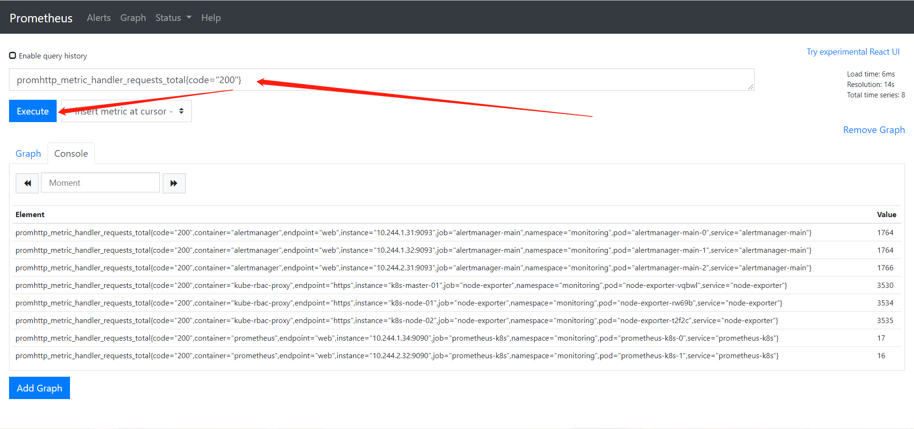
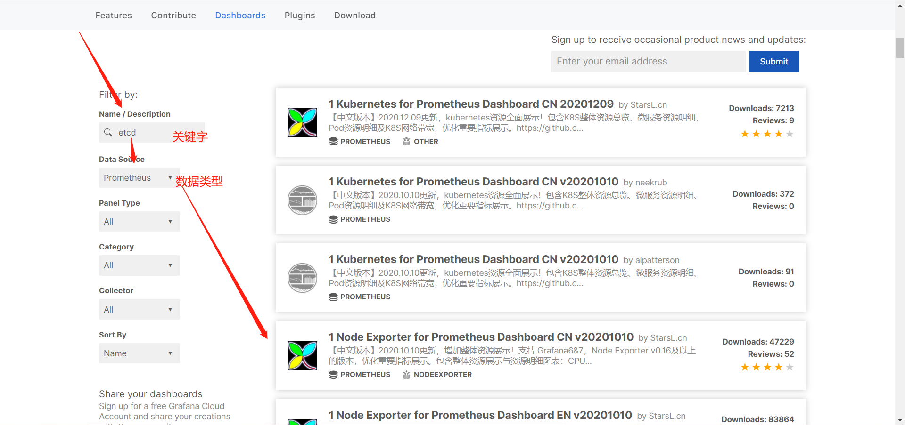
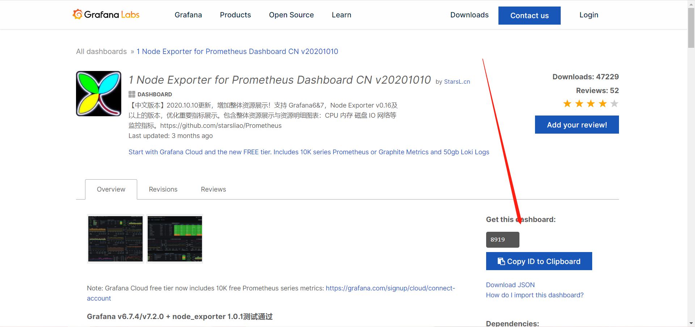
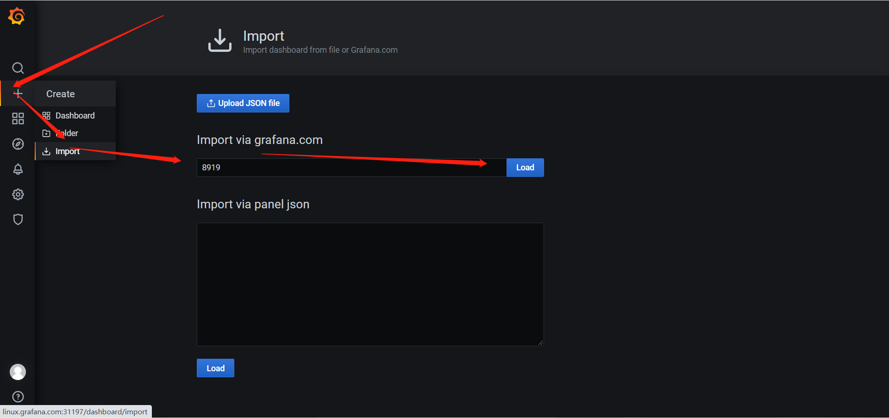
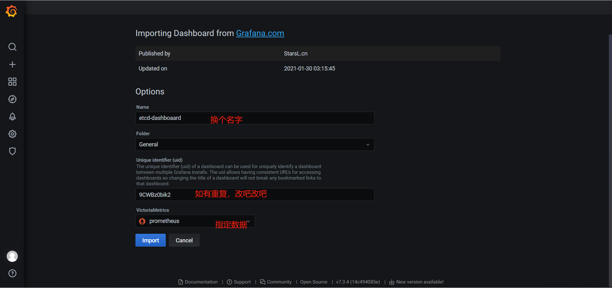
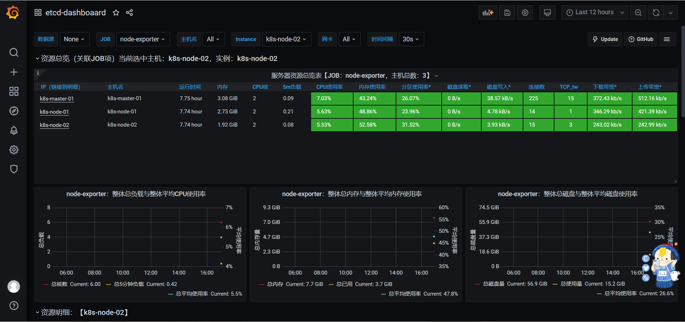

# 监控携带metric接口服务

## 一、prometheus监控分类

>​	1、携带metric接口的服务
>
>​	2、不携带metric接口的服务

## 二、监控携带metrics接口服务

> 携带metric接口的服务就表示可以通过metric接口获取服务的监控项和监控信息。本次以ETCD作为案例。

## 三、监控ETCD的流程

```bash
1、通过EndPrints获取需要监控的ETCD的地址

2、创建Service，给予集群内部的ServiceMoniter使用

3、创建ServiceMoniter，部署需要访问证书，给予prometheus-k8s-0来使用

4、重启普罗米修斯监控Pod（prometheus-k8s-0）,载入监控项
```


## 四、通过普罗米修斯监控ETCD的过程

### 1、测试ETCD服务的metrics接口是否可用

```bash
[root@k8s-master-01 ~]# curl -k --cert /etc/kubernetes/pki/apiserver-etcd-client.crt --key /etc/kubernetes/pki/apiserver-etcd-client.key https://127.0.0.1:2379/metrics
```


### 2、通过EndPrints获取需要监控的ETCD的地址

> endpoint是k8s集群中的一个资源对象，存储在etcd中，用来记录一个service对应的所有pod的访问地址。service配置selector，endpoint controller才会自动创建对应的endpoint对象；否则，不会生成endpoint对象。我们可以手动创建。

**准备**

```bash
# 创建目录
[root@k8s-master-01 /]# mkdir etcd-monitor
[root@k8s-master-01 /]# cd etcd-monitor/
```


```bash
[root@k8s-master-01 /etcd-monitor]# cat 1_etcd-endpoints.yaml 
kind: Endpoints
apiVersion: v1
metadata:
  namespace: kube-system
  name: etcd-moniter
  labels:
    k8s: etcd
subsets:
  - addresses:
      - ip: "192.168.15.31"
    ports:
      - port: 2379
        protocol: TCP
        name: etcd

```

**解释**

```bash
# 创建一个endpoints资源用于指定ETCD地址
kind: EndPoints
apiVersion: v1
metadata:
  # etcd所在的名称空间
  namespace: kube-system
  # 给endpoints资源起个名字
  name: etcd-moniter
  # 标签
  labels:
    k8s: etcd
# 指定pod地址
subsets:
  # 就绪的IP地址
  - addresses:
      - ip: "192.168.15.31"
    # ip地址可用的端口号
    ports:
      - port: 2379
        # 指定端口协议
        protocol: TCP
        name: etcd
```

**创建结果**

```bash
[root@k8s-master-01 ~]# kubectl get endpoints -n kube-system 
NAME           ENDPOINTS                                                                 AGE
etcd-moniter   192.168.15.31:2379 														 5s
...
```


### 3、创建Service，给予集群内部的ServiceMoniter使用

>serviceMonitor 是通过对service 获取数据的一种方式。

```bash
1. promethus-operator可以通过serviceMonitor 自动识别带有某些 label 的service ，并从这些service 获取数据。
2. serviceMonitor 也是由promethus-operator 自动发现的。
```

```bash
[root@k8s-master-01 /etcd-monitor]# vi 2_etcd-service.yaml
kind: Service
apiVersion: v1
metadata:
  namespace: kube-system
  name: etcd-moniter
  labels:
    k8s: etcd
spec:
  ports:
    - port: 2379
      targetPort: 2379
      name: etcd
      protocol: TCP
```

**解释**

```bash
kind: Service
apiVersion: v1
metadata:
  # 指定名称空间
  namespace: kube-system
  # 要和上面的endpoints名字一样这样才能连接到一起
  name: etcd-moniter
  # 标签
  labels:
    k8s: etcd
spec:
  ports:
    # 要Service暴露的端口
    - port: 2379
      # pod暴露的端口
      targetPort: 2379
      name: etcd
      # 指定端口协议
      protocol: TCP
```

**查看**

```bash
[root@k8s-master-01 ~]# kubectl get svc -n kube-system 
NAME           TYPE        CLUSTER-IP       EXTERNAL-IP   PORT(S)                        AGE
etcd-moniter   ClusterIP   10.108.221.188   <none>        2379/TCP                       36s
...
```

**测试**

```bash
[root@k8s-master-01 ~]# curl -k --cert /etc/kubernetes/pki/apiserver-etcd-client.crt --key /etc/kubernetes/pki/apiserver-etcd-client.key https://10.108.221.188:2379/metrics
```


### 4、创建ServiceMoniter部署需要访问证书

```bash
[root@k8s-master-01 /etcd-monitor]# vim 3_etcd-Moniter.yaml
kind: ServiceMonitor
apiVersion: monitoring.coreos.com/v1
metadata:
  labels:
    k8s: etcd
  name: etcd-monitor
  namespace: monitoring
spec:
  endpoints:
  - interval: 3s
    port: etcd
    scheme: https
    tlsConfig:
      caFile: /etc/prometheus/secrets/etcd-certs/ca.crt
      certFile: /etc/prometheus/secrets/etcd-certs/peer.crt
      keyFile: /etc/prometheus/secrets/etcd-certs/peer.key
      insecureSkipVerify: true
  selector:
    matchLabels:
      k8s: etcd
  namespaceSelector:
    matchNames:
      - "kube-system"
```


**解释**

```bash
kind: ServiceMonitor
apiVersion: monitoring.coreos.com/v1
metadata:
  # 标签
  labels:
    k8s: etcd
  name: etcd-monitor
  # 给prometheus使用所以和prometheus同命名空间
  namespace: monitoring
spec:
  endpoints:
  #抓取数据频率
  - interval: 3s
    # 和endpoins端口名相同
    port: etcd
    scheme: https
    # 设置证书
    tlsConfig:
      caFile: /etc/prometheus/secrets/etcd-certs/ca.crt
      certFile: /etc/prometheus/secrets/etcd-certs/peer.crt
      keyFile: /etc/prometheus/secrets/etcd-certs/peer.key
      # 禁用目标证书验证
      insecureSkipVerify: true
  # 选择endpoints
  selector:
    # endpoints标签
    matchLabels:
      k8s: etcd
  # 选择endpoints所在的命名空间
  namespaceSelector:
    matchNames:
      - "kube-system"
```

**查看**

```bash
[root@k8s-master-01 ~]# kubectl get ServiceMonitor -n monitoring 
NAME                      AGE
etcd-monitor              3m3s
```


### 5、重启普罗米修斯监控Pod（prometheus-k8s-0）,载入监控项

#### 1）创建一个secrets，用来保存prometheus监控的etcd的证书

```bash
[root@k8s-master-01 ~]# kubectl create secret generic etcd-certs -n monitoring --from-file=/etc/kubernetes/pki/etcd/ca.crt --from-file=/etc/kubernetes/pki/etcd/peer.crt --from-file=/etc/kubernetes/pki/etcd/peer.key
```

**检查**

```bash
[root@k8s-master-01 ~]# kubectl get secrets -n monitoring 
NAME                              TYPE                                  DATA   AGE
...
etcd-certs                        Opaque                                3      32s
...
```

#### 2）修改prometheus的yaml

##### ①复制yaml配置文件

```bash
[root@k8s-master-01 ~]# cd kube-prometheus-0.7.0/manifests/
[root@k8s-master-01 ~/kube-prometheus-0.7.0/manifests]# cp prometheus-prometheus.yaml /etcd-monitor/
[root@k8s-master-01 ~/kube-prometheus-0.7.0/manifests]# cd /etcd-monitor/
```


##### ②修改配置文件

```bash
[root@k8s-master-01 /etcd-monitor]# vim prometheus-prometheus.yaml
apiVersion: monitoring.coreos.com/v1
kind: Prometheus
metadata:
  labels:
    prometheus: k8s
  name: k8s
  namespace: monitoring
spec:
  alerting:
    alertmanagers:
    - name: alertmanager-main
      namespace: monitoring
      port: web
    - name: alertmanager-main-etcd
      namespace: kube-system
      port: etcd
  image: quay.io/prometheus/prometheus:v2.22.1
  nodeSelector:
    kubernetes.io/os: linux
  podMonitorNamespaceSelector: {}
  podMonitorSelector: {}
  probeNamespaceSelector: {}
  probeSelector: {}
  replicas: 2
  resources:
    requests:
      memory: 400Mi
  ruleSelector:
    matchLabels:
      prometheus: k8s
      role: alert-rules
  securityContext:
    fsGroup: 2000
    runAsNonRoot: true
    runAsUser: 1000
  serviceAccountName: prometheus-k8s
  serviceMonitorNamespaceSelector: {}
  serviceMonitorSelector: {}
  version: v2.22.1
  secrets:
    - etcd-certs
```


**解释**

```bash
apiVersion: monitoring.coreos.com/v1
kind: Prometheus
metadata:
  # 标签
  labels:
    prometheus: k8s
  name: k8s
  namespace: monitoring
spec:
  # 定义有关警报的详细信息
  alerting:
    alertmanagers:
    - name: alertmanager-main
      namespace: monitoring
      port: web
    - name: alertmanager-main-etcd
      namespace: kube-system
      port: etcd
  image: quay.io/prometheus/prometheus:v2.22.1
  nodeSelector:
    kubernetes.io/os: linux
  podMonitorNamespaceSelector: {}
  podMonitorSelector: {}
  probeNamespaceSelector: {}
  probeSelector: {}
  replicas: 2
  resources:
    requests:
      memory: 400Mi
  ruleSelector:
    matchLabels:
      prometheus: k8s
      role: alert-rules
  securityContext:
    fsGroup: 2000
    runAsNonRoot: true
    runAsUser: 1000
  serviceAccountName: prometheus-k8s
  serviceMonitorNamespaceSelector: {}
  serviceMonitorSelector: {}
  version: v2.22.1
  # 指定secrets对象
  secrets:
    - etcd-certs
```

##### ③重启

```bash
[root@k8s-master-01 /etcd-monitor]# kubectl apply -f prometheus-prometheus.yaml 
prometheus.monitoring.coreos.com/k8s unchanged

## 检查
[root@k8s-master-01 /etcd-monitor]# kubectl get pods -n monitoring
NAME                                   READY   STATUS    RESTARTS   AGE
...
prometheus-k8s-0                       2/2     Running   5          47h
prometheus-k8s-1                       2/2     Running   5          47h
...
```

**检查**

```bash
1、访问
	http://linux.prometheus.com:31197/
2、获取指标
	promhttp_metric_handler_requests_total{code="200"}
```



## 五、grafana出图

### 1、随机选择一个dashboards

https://grafana.com/grafana/dashboards





### 2、grafana添加根据ID添加dashboard



**import**

### 3、撒花撒花



