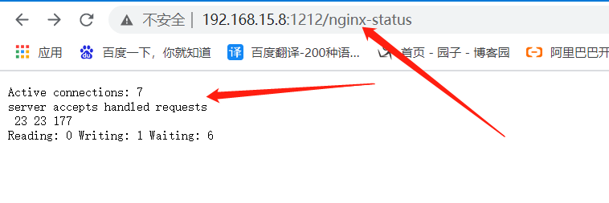
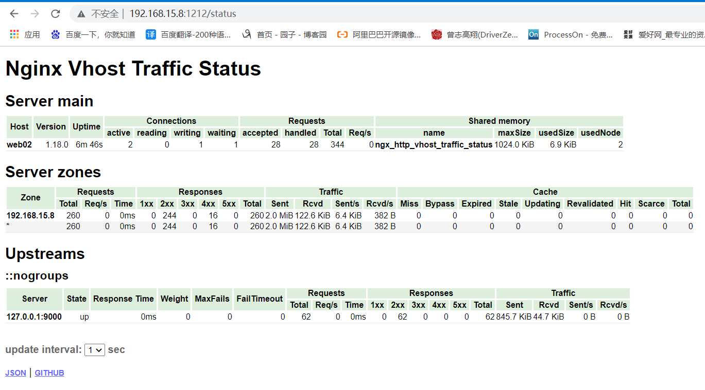
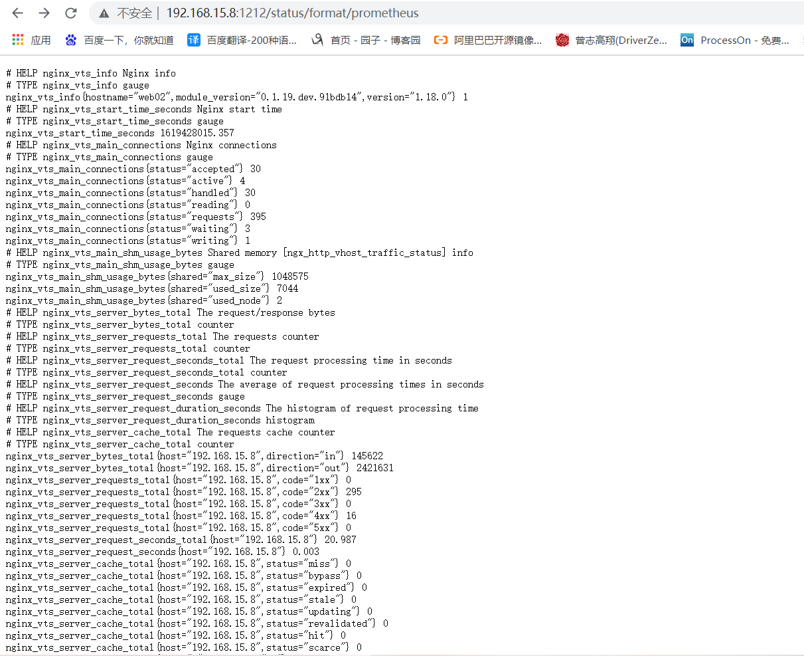
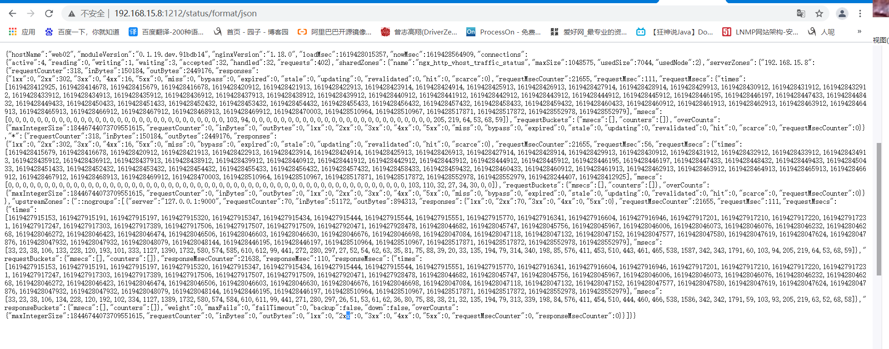
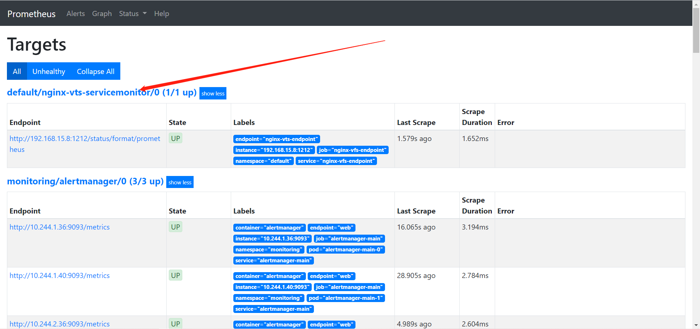
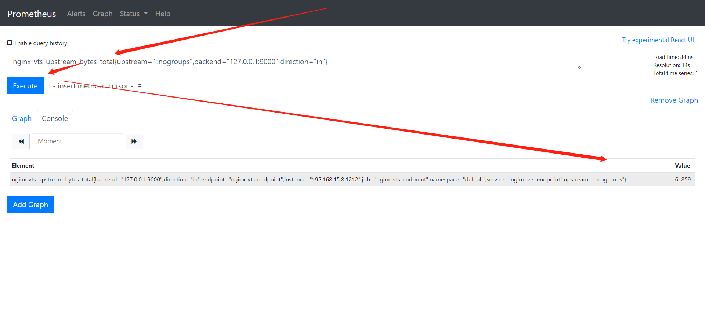

# 监控非携带metrics服务

## 一、怎么监控？

### 1、expertor

```bash
	前面的系列中，我们在主机上面安装了node_exporter程序，该程序对外暴露一个用于获取当前监控样本数据的http的访问地址， 这个的一个程序成为exporter,Exporter的实例称为一个target， prometheus通过轮训的方式定时从这些target中获取监控数据。
```


### 2、什么是expertor？

```bash
	广义上向prometheus提供监控数据的程序都可以成为一个exporter的，一个exporter的实例称为target, exporter来源主要2个方面，一个是社区提供的，一种是用户自定义的。
```


### 3、常用exporter

```bash
官方的exporter地址： https://prometheus.io/docs/instrumenting/exporters/
```


### 4、nginx监控

```bash
prometheus监控nginx使用nginx-vts-exporter采集数据。同时，需要nginx支持nginx-module-vts模块获取nginx自身的一些数据。
```


## 二、监控流程

```bash
1、部署nginx添加nginx-module-vts
2、部署EndPrints，链接expertor暴露出来的metrics接口
3、部署Service，基于ServiceMonitor使用
4、创建ServiceMonitor，注入promethues
5、测试
6、加入grafana，做大屏展示
```


## 三、部署nginx-module-vts

### 1、获取第三方模块代码

```bash
[root@web02 ~]# mkdir /nginx_module
[root@web02 ~]# cd /nginx_module/
[root@web02 /nginx_module]# wget https://github.com/vozlt/nginx-module-vts/archive/refs/heads/master.zip
```


### 2、解压

```bash
[root@web02 /nginx_module]# unzip nginx-module-vts-master.zip
```


### 3、下载安装包

```bash
[root@web02 ~]# wget https://nginx.org/download/nginx-1.18.0.tar.gz
```


### 4、解压源码包

```bash
tar xf nginx-1.18.0.tar.gz 
```


### 5、配置安装的环境（运行用户、安装目录等）

```bash
1.创建用户和组，且不创建用户的家目录
[root@web03 ~]# groupadd www -g 666
[root@web03 ~]# useradd www -u 666 -g 666 -s /sbin/nologin -M

2.创建一个安装目录
公司不指定安装目录时，默认安装到/usr/local/软件名/
公司指定的话，就要按照公司要求来
```


### 6、生成Makefile

```bash
[root@web02 ~/nginx-1.18.0]# ./configure --prefix=/usr/local/nginx-1.18.0 --user=www --group=www --without-http_gzip_module --with-compat --with-file-aio --with-threads --with-http_addition_module --with-http_auth_request_module --with-http_dav_module --with-http_flv_module --with-http_gunzip_module --with-http_gzip_static_module --with-http_mp4_module --with-http_random_index_module --with-http_realip_module --with-http_secure_link_module --with-http_slice_module --with-http_ssl_module --with-http_stub_status_module --with-http_sub_module --with-http_v2_module --with-mail --with-mail_ssl_module --with-stream --with-stream_realip_module --add-module=/nginx_module/nginx-module-vts-master --with-stream_ssl_module --with-stream_ssl_preread_module --with-cc-opt='-O2 -g -pipe -Wall -Wp,-D_FORTIFY_SOURCE=2 -fexceptions -fstack-protector-strong --param=ssp-buffer-size=4 -grecord-gcc-switches -m64 -mtune=generic -fPIC' --with-ld-opt='-Wl,-z,relro -Wl,-z,now -pie'
```


### 7、编译安装

```bash
[root@web02 ~/nginx-1.18.0]# make && make install
```


### 8、查看安装结果

```bash
[root@web02 ~/nginx-1.18.0]# ll /usr/local/nginx-1.18.0/
total 0
drwxr-xr-x 2 root root 333 Apr 26 16:21 conf
drwxr-xr-x 2 root root  40 Apr 26 16:21 html
drwxr-xr-x 2 root root   6 Apr 26 16:21 logs
drwxr-xr-x 2 root root  19 Apr 26 16:21 sbin

[root@web02 ~]# cd /usr/local/nginx-1.18.0/sbin
[root@web02 /usr/local/nginx-1.18.0/sbin]# ./nginx -V
...
--add-module=/nginx_module/nginx-module-vts-master
...
```


### 9、做软连接

```bash
[root@web02 /usr/local]# ln -s /usr/local/nginx-1.18.0 /usr/local/nginx
```


### 10、配置环境变量

```bash
[root@web02 /usr/local]# vim /etc/profile.d/nginx.sh
export PATH=$PATH:/usr/local/nginx/sbin

[root@web02 /usr/local]# source /etc/profile	#在当前bash环境下读取并执行/etc/profile中的命令
```


### 11、加入system管理配置

```bash
[root@web02 /usr/local]# cat /usr/lib/systemd/system/nginx.service
[Unit]
Description=nginx - high performance web server
Documentation=http://nginx.org/en/docs/
After=network-online.target remote-fs.target nss-lookup.target
Wants=network-online.target

[Service]
Type=forking
PIDFile=/usr/local/nginx/logs/nginx.pid
ExecStart=/usr/local/nginx/sbin/nginx -c /usr/local/nginx/conf/nginx.conf
ExecReload=/usr/local/nginx/sbin/nginx -s reload
ExecStop=/usr/local/nginx/sbin/nginx -s stop

[Install]
WantedBy=multi-user.target

#重载
[root@web02 /usr/local]# systemctl daemon-reload
```


### 12、添加子配置文件夹

```bash
[root@web02 ~]# cd /usr/local/nginx/conf
[root@web02 /usr/local/nginx/conf]# mkdir conf.d
```


### 13、修改主配置文件

```bash
[root@web02 /usr/local/nginx/conf]# vim nginx.conf
...
user  nginx;
...
include /usr/local/nginx/conf/conf.d/*.conf;
...:
```


### 14、配置业务配置文件

> 这里我用了以前做的php业务，随便找个服务或者静态页面代替即可

```bash
server {
    listen       80;
    server_name  localhost;
        root /code/;

    location / {
        index  index.php index.html index.htm;
        root /code/;
    }

    location ~ \.php$ {
        fastcgi_pass  127.0.0.1:9000;
        fastcgi_index index.php;
        fastcgi_param SCRIPT_FILENAME /code$fastcgi_script_name;
        include       fastcgi_params;
    }
}
```


### 15、配置监控配置文件

```bash
http {
    vhost_traffic_status_zone;
    vhost_traffic_status_filter_by_host on;
    server {
        listen 1212;
        allow 127.0.0.1;
        allow 192.168.15.1;
        allow prometheus_server_ip;

    location /nginx-status {
        stub_status on;
        access_log off;
    }


        location /status {
        vhost_traffic_status_display;    
        vhost_traffic_status_display_format html;
        }
                }
        }
```


```bash
http {
    vhost_traffic_status_zone;
    vhost_traffic_status_filter_by_host on;   #开启此功能，会根据不同的server_name进行流量的统计，否则默认会把流量全部计算到第一个上。
    server {
        listen 1212；
        allow 127.0.0.1；
        allow 192.168.15.1；
        allow prometheus_server_ip;  #替换为你的prometheus ip；

    location /nginx-status {
        stub_status on;
        access_log off;
    }

        location /status {
        vhost_traffic_status_display;    
        vhost_traffic_status_display_format html;
        }
                }
        }
```


### 16、访问nginx-status



```bash
Active connections: 当前nginx正在处理的活动连接数.

Server accepts handled requests: 
	nginx启动以来总共处理了23个连接
	成功创建23握手(证明中间没有失败的)
	总共处理了177个请求。

Reading: nginx读取到客户端的Header信息数.
Writing: nginx返回给客户端的Header信息数.
Waiting: 开启keep-alive的情况下,这个值等于 active – (reading + writing),意思就是nginx已经处理完成,正在等候下一次请求指令的驻留连接。
所以,在访问效率高,请求很快被处理完毕的情况下,Waiting数比较多是正常的.如果reading +writing数较多,则说明并发访问量非常大,正在处理过程中。
```


### 17、访问status



```bash
Server main
    hostName, nginxVersion, uptimeSec 等信息
    {NAMESPACE}_server_info
    连接数 status [active, reading, writing, waiting, accepted, handled]
    {NAMESPACE}_server_connections

Server zones
    每个请求响应码的数量
    {NAMESPACE}_server_requests
    每个服务的字节数
    {NAMESPACE}_server_bytes
    每个服务的缓存
    {NAMESPACE}_server_cache

Filter zones
    过滤掉的请求数量
    {NAMESPACE}_filter_requests
    过滤掉的字节数
    {NAMESPACE}_filter_bytes
    各个server请求转发的平均处理时间
    {NAMESPACE}_filter_responseMsec

Upstreams
    upstream的请求数
    {NAMESPACE}_upstream_requests
    upstream的字节数
    {NAMESPACE}_upstream_bytes
    统计各个upstream平均响应时长，精确到每个节点
    {NAMESPACE}_upstream_responseMsec

```


#### 1）直接获得prometheus格式数据

>http://192.168.15.8:1212/status/format/prometheus





#### 2)直接获得json格式数据

>http://192.168.15.8:1212/status/format/json



### ps:接入prometheus有两种方式

#### 1.直接用上图数据源

> 将http://IP:1212/status/format/prometheus数据源直接接入prometheus（适合prometueus物理机）

```bash
vim /usr/local/prometheus/prometheus.yml
- job_name: 'vts'
  metrics_path: /status/format/prometheus
  file_sd_configs:
  - refresh_interval: 1m
    files:
    - "targets/vts.json"


cat targets/vts.json
[
   {
    "labels": {
      "machine_room": "roomone",
      "job": "proxyone",
      "type": "vts"
    },
    "targets": [
      "1.1.1.1:1212",
      "1.1.1.2:1212"
    ]
  },
  {
    "labels": {
      "machine_room": "roomtwo",
      "job": "proxytwo",
      "type": "vts"
    },
    "targets": [
      "1.1.2.1:1212",
      "1.1.2.2:1212"
    ]
  }
]
```


#### 2.nginx-vts-exporter 抓取vts数据传向prometheus（适合容器prometheus）

> 指标会变少，不建议使用


## 四、k8s-prometheus监控nginx

### 1、创建yaml存放目录

```bash
[root@k8s-master-01 /]# mkdir nginx-vts
[root@k8s-master-01 /]# cd nginx-vts
```


### 2、创建endpoints监控nginx-vfs

```bash
kind: Endpoints
apiVersion: v1
metadata:
  name: nginx-vfs-endpoint
  labels:
    k8s: nginx-vts-endpoint
subsets:
  - addresses:
      - ip: "192.168.15.8"
    ports:
      - port: 1212
        protocol: TCP
        name: nginx-vts-endpoint
```

**检查**

```bash
[root@k8s-master-01 /nginx-vts]# kubectl get endpoints
NAME                                              ENDPOINTS            AGE
cluster.local-nfs-client-nfs-client-provisioner   <none>               15d
kubernetes                                        192.168.15.31:6443   20d
nginx-vfs-endpoint                                192.168.15.8:1212    24s

```


### 3、创建Service，给予集群内部的ServiceMoniter使用

```bash
[root@k8s-master-01 /nginx-vts]# vim 2_nginx-vts-service.yaml 

kind: Service
apiVersion: v1
metadata:
  name: nginx-vfs-endpoint
  labels:
    k8s: nginx-vts-endpoint
spec:
  ports:
    - port: 9913
      targetPort: 1212
      name: nginx-vts-endpoint
      protocol: TCP

```

**检查**

```bash
[root@k8s-master-01 /nginx-vts]# kubectl get svc
...
nginx-vfs-endpoint   ClusterIP   10.99.54.39   <none>        9913/TCP   2m10s
...

[root@k8s-master-01 /nginx-vts]# curl 10.99.54.39:9913/status/format/prometheus
...
好多指标啊
...
```


### 4、创建serviceMonitor 获取service 数据

```bash
[root@k8s-master-01 /nginx-vts]# cat 3_vts-ServiceMonitor.yaml 
kind: ServiceMonitor
apiVersion: monitoring.coreos.com/v1
metadata:
  labels:
    k8s: nginx-vts-endpoint
  name: nginx-vts-servicemonitor
spec:
  endpoints:
  - interval: 3s
    port: nginx-vts-endpoint
    path: /status/format/prometheus
    scheme: http
  selector:
    matchLabels:
      k8s: nginx-vts-endpoint
  namespaceSelector:
    matchNames:
      - "default"
```


**注释**

```bash
kind: ServiceMonitor
apiVersion: monitoring.coreos.com/v1
metadata:
  labels:
    k8s: nginx-vts-endpoint
  name: nginx-vts-servicemonitor
spec:
  endpoints:
  - interval: 3s
    port: nginx-vts-endpoint
    # 指定访问的路径
    path: /status/format/prometheus
    scheme: http
  selector:
    matchLabels:
      k8s: nginx-vts-endpoint
  namespaceSelector:
    matchNames:
      - "default"
```


### 5、测试



**随便查询个指标**



### 6、grafana出图

这个图没有找到支持的，需要自己做


