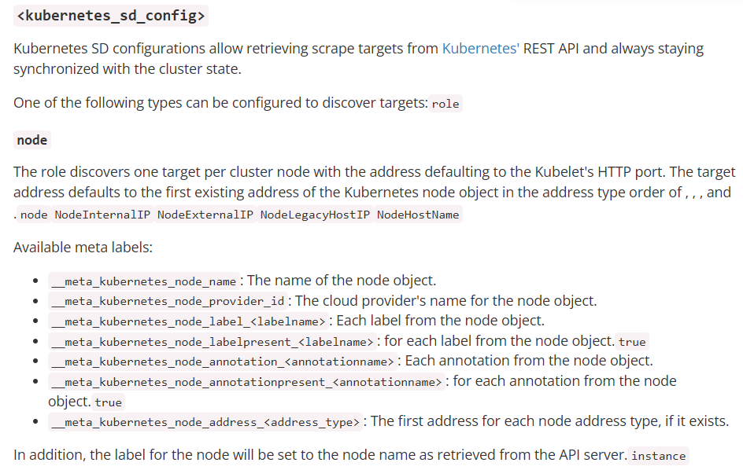
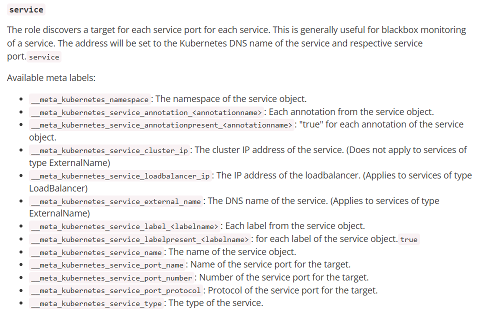
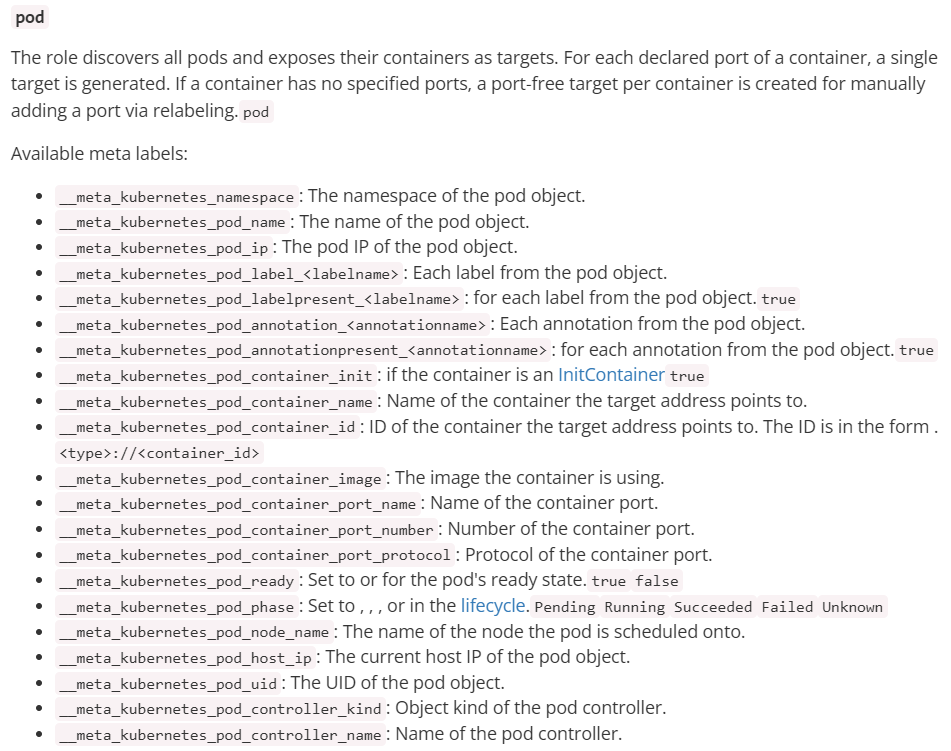
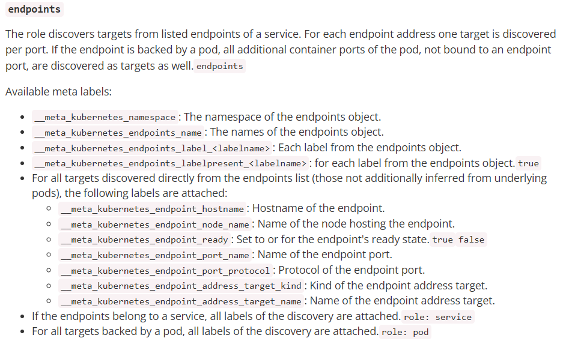
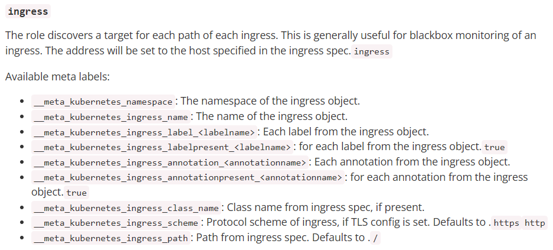

# prometheus服务发现机制

## 一、为什么要使用动态服务发现

>​     prometheus 默认是采用 pull 方式拉取监控数据的，也就是定时去目标主机上抓取 metrics 数据，每一个被抓取的目标需要暴露一个 HTTP 接口，prometheus通过这个暴露的接口就可以获取到相应的指标数据，这种方式需要由目标服务决定采集的目标有哪些，通过配置在 scrape_configs 中的各种 job 来实现，无法动态感知新服务，如果后面增加了节点或者组件信息，就得手动修 promrtheus配置，并重启 promethues，很不方便，所以出现了动态服务发现，动态服务发现能够自动发现集群中的新端点，并加入到配置中，通过服务发现，Prometheus能查询到需要监控的 Target 列表，然后轮询这些 Target 获取监控数据。

## 二、什么是Prometheus服务发现？

>​     prometheus获取数据源target的方式主要有两种模式，一种是静态配置，一种是动态服务发现配置，promethues的静态服务发现static_configs或者是ServiceMonitor 通过标签匹配Service：每当有一个新的目标实例需要监控，都需要手动修改配置文件配置目标target或者修改ServiceMonitor CRD配置文件.

>​     那么面对现如今动不动就成百上千台节点的集群来说，静态服务发现这种纯手动配置很显然是不切实际的，然而现在的集群往往都有一个很重要的功能叫做服务发现，例如在现在常用的微服务SpringCloud架构的中，Eureka组件作为服务注册和发现的中心，在Kubernetes这类容器管理平台中，Kubernetes也具有服务发现的功能，它们都掌握并管理着所有的容器或者是服务的相关信息，于是Prometheus通过这个中间的代理人（服务发现和注册中心）来获取集群当中监控目标的信息，从而巧妙地实现了prometheus的动态服务发现。

## 三、prometheus常见的服务发现

>- kubernetes_sd_configs: #基于 Kubernetes API 实现的服务发现，让 prometheus 动态发现 kubernetes 中被监控的目标
>
>- dns_sd_configs: #DNS 服务发现监控目标
>
>- file_sd_configs: #基于指定的文件实现服务发现，基于指定的文件发现监控目标

>- promethues 的 k8s 服务发现 kubernetes_sd_configs：Prometheus 与 Kubernetes 的 API 进行交互，动态的发现 Kubernetes 中部署的所有可监控的目标资源。

### 1、ServiceMonitor

>​    通过配置prometheus-operator的CRD ServiceMonitor来达到K8S集群相关组件和微服务的监控的目的，可以在ServiceMonitor的配置文件中以手动方式通过match lable和想要监控的Service进行匹配（**这里相当于是手动进行服务注册和服务发现的作用，也可以将这种模式称为静态服务发现**），以此来完成对想要监控的服务和组件进行监控
>
>​     但这种方式进行监控配置，只能手工一个一个的增加，如果在k8s集群规模较大的情况下，或者是集群后面又增加了节点或者组件信息，这种方式就会很麻烦也不现实

```yaml
apiVersion: monitoring.coreos.com/v1
kind: ServiceMonitor
metadata:
  name: example-app
spec:
  selector:
    matchLabels:
      app: example-app
  endpoints:
    - port: web
      path: /custom-metrics
  jobLabel: custom-job-label
```

### 2、static_configs

>- 静态服务发现，基于 prometheus 配置文件指定的监控目标
>
>- promethues 的静态静态服务发现 static_configs：每当有一个新的目标实例需要监控，都需要手动修改配置文件配置目标 target。

```yaml
# A scrape configuration containing exactly one endpoint to scrape: #端点的抓取配置
# Here it's Prometheus itself. #prometheus 的默认配置
scrape_configs:
#作业名称 job=<job_name>会自动添加到此配置的时间序列数据中
# The job name is added as a label `job=<job_name>` to any timeseries scraped from this config. 
  - job_name: "prometheus" #job 名称
# metrics_path defaults to '/metrics' #默认 uri
# scheme defaults to 'http'. #协议
    static_configs: #静态服务配置
      - targets: ["localhost:9090"] #目标端点地址
  - job_name: 'promethues-node' 
    static_configs: 
      - targets: ['172.30.7.101:9100','172.30.7.111:9100'] 
  - job_name: 'prometheus-containers'
    static_configs: 
      - targets: ["172.30.7.101:8080","172.30.7.111:8080"]
```

### 3、consul_sd_configs

>https://www.consul.io/
>
>Consul 是分布式 k/v 数据存储集群，目前常用于服务的服务注册和发现。

>- Consul 服务发现，基于 consul 服务动态发现监控目标
>
>- promethues 的 consul 服务发现 consul_sd_configs：Prometheus 一直监视 consul 服务，当发现在 consul中注册的服务有变化，prometheus 就会自动监控到所有注册到 consul 中的目标资源。
>- 但是需要你多维护一套服务

#### 1.部署

>https://releases.hashicorp.com/consul/

```bash
172.31.2.181
172.31.2.182
172.31.2.183
Node1:
# unzip consul_1.11.1_linux_amd64.zip
# cp consul /usr/local/bin/
# scp consul 172.31.2.182:/usr/local/bin/
# scp consul 172.31.2.183:/usr/local/bin/
# consul -h #验证可执行
分别创建数据目录：
# mkdir /data/consul/ -p
启动服务：
node1:
nohup consul agent -server -bootstrap -bind=172.31.2.181 -client=172.31.2.181 -data-dir=/data/consul -ui -node=172.31.2.181 &
node2:
nohup consul agent -bind=172.31.2.182 -client=172.31.2.182 -data-dir=/data/consul -node=172.31.2.182 -join=172.31.2.181 &
node3:
nohup ./consul agent -bind=172.31.2.183 -client=172.31.2.183 -data-dir=/data/consul -node=172.31.2.183 -join=172.31.2.181 &
```

#### 2.服务注册到consul

```bash
curl -X PUT -d '{"id": "node-exporter181","name": "node-exporter181","address": "172.31.2.181","port":9100,"tags": ["node-exporter"],"checks": [{"http": "http://172.31.2.181:9100/","interval": "5s"}]}' http://172.31.2.181:8500/v1/agent/service/register 
curl -X PUT -d '{"id": "node-exporter182","name": "node-exporter182","address": "172.31.2.182","port":9100,"tags": ["node-exporter"],"checks": [{"http": "http://172.31.2.182:9100/","interval": "5s"}]}' http://172.31.2.181:8500/v1/agent/service/register
```

#### 3.配置 prometheus 到 consul 发现服务

##### 1）主要配置字段

```bash
static_configs: #配置数据源
consul_sd_configs: #指定基于 consul 服务发现的配置
relabel_configs：#重新标记
services: [] #表示匹配 consul 中所有的 service
```

##### 2）配置

```yaml
- job_name: 'nginx-monitor-serverA'
   static_configs:
   - targets: ['172.30.7.201:9913'] 
- job_name: consul
  honor_labels: true
  metrics_path: /metrics
  scheme: http
  consul_sd_configs: 
    - server: 172.31.2.181:8500
      services: [] 
    - server: 172.31.2.182:8500
      services: []
    - server: 172.31.2.183:8500
      services: []
  relabel_configs:
    - source_labels: ['__meta_consul_tags']
      target_label: 'product' 
    - source_labels: ['__meta_consul_dc']
      target_label: 'idc' 
    - source_labels: ['__meta_consul_service']
      regex: "consul"
      action: drop
```

### 4、file_sd_configs

#### 1.编辑 sd_configs 文件

```bash
# pwd
/apps/prometheus
#mkdir file_sd
#vim file_sd/sd_my_server.json
[
  { 
    "targets": ["172.31.2.181:9100","172.31.2.182:9100","172.31.2.183:9100"]
  }
]
```

#### 2.prometheus 调用 sd_configs

```bash
- job_name: 'file_sd_my_server' 
  file_sd_configs:
    - files: 
      - /apps/prometheus/file_sd/sd_my_server.json
      refresh_interval: 10s
```

### 5、DNS 服务发现

>- 基于 DNS 的服务发现允许配置指定一组 DNS 域名，这些域名会定期查询以发现目标列表,域名需要可以被配置的 DNS 服务器解析为 IP。
>
>- 此服务发现方法仅支持基本的 DNS A、AAAA 和 SRV 记录查询。
>
>> A 记录： 域名解析为 IP
>
>> SRV**：**SRV **记录了哪台计算机提供了具体哪个服务，格式为：自定义的服务的名字**.**协议的类型**.域名（例如：example-server._tcp.www.mydns.com)
>
>prometheus 会对收集的指标数据进行重新打标，重新标记期间，可以使用以下元标签：
>
>   __meta_dns_name：产生发现目标的记录名称。
>
>   __meta_dns_srv_record_target: SRV 记录的目标字段
>
>   __meta_dns_srv_record_port: SRV 记录的端口字段

#### 1.A记录服务发现

```bash
# vim /etc/hosts
172.31.2.181 node1.example.com
172.31.2.182 node2.example.com
# vim /apps/prometheus/prometheus.yml 
- job_name: 'dns-server-name-monitor' 
  metrics_path: "/metrics" 
  dns_sd_configs: 
  - names: ["node1.example.com", "node2.example.com"]
    type: A
    port: 9100
```

#### 2.SRV 服务发现

>需要有 DNS 服务器实现域名解析

```bash
- job_name: 'dns-node-monitor-srv' 
  metrics_path: "/metrics" 
  dns_sd_configs: 
  - names: ["_prometheus._tcp.node.example.com"]
    type: SRV
    port: 9100
```

## 四、kubernetes_sd_configs详解

>https://prometheus.io/docs/prometheus/latest/configuration/configuration/#kubernetes_sd_config

### 1、promethues 的 relabeling功能

#### 1.介绍

>promethues 的 relabeling（重新修改标签）功能很强大，它能够在抓取到目标实例之前把目标实例的元数据标签动态重新修改，动态添加或者覆盖标签
>
>prometheus 从 Kubernetes API 动态发现目标(targer)之后，在被发现的 target 实例中，都包含一些原始的Metadata 标签信息，默认的标签有：
>
>​    `__address__`：以<host>:<port> 格式显示目标 targets 的地址
>
>​    `__scheme__`：采集的目标服务地址的 Scheme 形式，HTTP 或者 HTTPS
>
>​    `__metrics_path__`：采集的目标服务的访问路径

#### 2.目的

>为了更好的识别监控指标,便于后期调用数据绘图、告警等需求，prometheus 支持对发现的目标进行 label 修改，在两个阶段可以重新标记：
>
>- relabel_configs ： 在对 target 进行数据采集之前（比如在采集数据之前重新定义标签信息，如目的 IP、目的端口等信息），可以使用 relabel_configs 添加、修改或删除一些标签、也可以只采集特定目标或过滤目标。
>
>- metric_relabel_configs：在对 target 进行数据采集之后，即如果是已经抓取到指标数据时，可以使用metric_relabel_configs 做最后的重新标记和过滤。

>配置--》重新标签relabel_configs--》抓取--》重新标签metric_relabel_configs--》TSDB

```yaml
- job_name: 'kubernetes-apiserver' #job 名称
  kubernetes_sd_configs: #基于 kubernetes_sd_configs 实现服务发现
  - role: endpoints #发现 endpoints
  scheme: https #当前 jod 使用的发现协议
  tls_config: #证书配置
    ca_file: /var/run/secrets/kubernetes.io/serviceaccount/ca.crt #容器里的证书路径
  bearer_token_file: /var/run/secrets/kubernetes.io/serviceaccount/token #容器里的 token 路径
  relabel_configs: #重新 re 修改标签 label 配置 configs
    - source_labels: [__meta_kubernetes_namespace, __meta_kubernetes_service_name, __meta_kubernetes_endpoint_port_name] #源标签,即对哪些标签进行操作
      action: keep #action 定义了 relabel 的具体动作，action 支持多种
      regex: default;kubernetes;https #发现了 default 命名空间的 kubernetes 服务切是 https 协议
```

#### 3.label详解

>source_labels：源标签，没有经过 relabel 处理之前的标签名字
>
>target_label：通过 action 处理之后的新的标签名字
>
>regex：给定的值或正则表达式匹配，匹配源标签
>
>replacement：通过分组替换后标签（target_label）对应的值

#### 4.action详解

>https://prometheus.io/docs/prometheus/latest/configuration/configuration/#kubernetes_sd_config

>- replace: 替换标签值，根据** regex 正则匹配到源标签的值，使用 replacement 来引用表达式匹配的分组
>
>- keep: 满足** regex 正则条件的实例进行采集，把*source_labels 中没有匹配到 regex 正则内容的Target实例丢掉，即只采集匹配成功的实例。
>
>- drop：满足 regex 正则条件的实例不采集，把 source_labels 中匹配到 regex 正则内容的 Target 实例丢掉，
>
>即只采集没有匹配到的实例。
>
>- hashmod：使用 hashmod 计算 source_labels 的 Hash 值并进行对比，基于自定义的模数取模，以实现对目标进行分类、重新赋值等功能：

```yaml
scrape_configs: 
  - job_name: ip_job
    relabel_configs: 
    - source_labels: [__address__]
      modulus: 4
      target_label: __ip_hash
      action: hashmod
    - source_labels: [__ip_hash]
      regex: ^1$
      action: keep
      
      
labelmap：匹配 regex 所有标签名称,然后复制匹配标签的值进行分组，通过 replacement 分组引用
（${1},${2},…）替代
labelkeep：匹配 regex 所有标签名称,其它不匹配的标签都将从标签集中删除
labeldrop：匹配 regex 所有标签名称,其它匹配的标签都将从标签集中删除
```

### 2、支持服务发现的目标类型

>发现类型可以配置以下类型之一来发现目标：
>
>https://prometheus.io/docs/prometheus/latest/configuration/configuration/#kubernetes_sd_config
>
>node
>
>service
>
>pod
>
>endpoints
>
>Endpointslice #对 endpoint 进行切片
>
>ingress

>不同的服务发现模式适用于不同的场景，例如：node适用于与主机相关的监控资源，如节点中运行的Kubernetes 组件状态、节点上运行的容器状态等；service 和 ingress 适用于通过黑盒监控的场景，如对服务的可用性以及服务质量的监控；endpoints 和 pod 均可用于获取 Pod 实例的监控数据，如监控用户或者管理员部署的支持 Prometheus 的应用。

#### 1.node

>node角色可以发现集群中每个node节点的地址端口，默认为Kubelet的HTTP端口。目标地址默认为Kubernetes节点对象的第一个现有地址，地址类型顺序为NodeInternalIP、NodeExternalIP、NodeLegacyHostIP和NodeHostName。

>作用：监控K8S的node节点的服务器相关的指标数据。



#### 2.service

>service角色可以发现每个service的ip和port,将其作为target。这对于黑盒监控(blackbox)很有用。



#### 3.pod

>pod角色可以发现所有pod并将其中的pod ip作为target。如果有多个端口或者多个容器，将生成多个target(例如:80,443这两个端口,pod ip为10.0.244.22,则将10.0.244.22:80,10.0.244.22:443分别作为抓取的target)。
>如果容器没有指定的端口，则会为每个容器创建一个无端口target，以便通过relabel手动添加端口。



#### 4.endpoints

>endpoints角色可以从ep（endpoints）列表中发现所有targets。



>**- 如果ep是属于service的话,则会附加service角色的所有标签**
>**- 对于ep的后端节点是pod，则会附加pod角色的所有标签(即上边介绍的pod角色可用标签)**
>**比如我么手动创建一个ep，这个ep关联到一个pod，则prometheus的标签中会包含这个pod角色的所有标签**

#### 5.**ingress**

>ingress角色发现ingress的每个路径的target。这通常对黑盒监控很有用。该地址将设置为ingress中指定的host。




### 3、kubernetes_sd_configs配置文件详解

>为解决服务发现的问题，kube-prometheus 为我们提供了一个额外的抓取配置来解决这个问题，我们可以通过添加额外的配置来进行服务发现进行自动监控。我们可以在 kube-prometheus 当中去自动发现并监控具有 prometheus.io/scrape=true 这个 annotations 的 Service。
>其中通过 kubernetes_sd_configs 支持监控其各种资源。kubernetes SD 配置允许从 kubernetes REST API 接受搜集指标，且总是和集群保持同步状态，任何一种 role 类型都能够配置来发现我们想要的对象。
>
>规则配置使用 yaml 格式，下面是文件中一级配置项。自动发现 k8s Metrics 接口是通过 scrape_configs 来实现的:

```yaml
＃全局配置
global:

＃规则配置主要是配置报警规则
rule_files:

＃抓取配置，主要配置抓取客户端相关
scrape_configs:

＃报警配置
alerting:

＃用于远程存储写配置
remote_write:

＃用于远程读配置
remote_read:
```

**举例**

```bash
# Kubernetes的API SERVER会暴露API服务，Promethues集成了对Kubernetes的自动发现，它有5种模式：Node、Service
# 、Pod、Endpoints、ingress，下面是Prometheus官方给出的对Kubernetes服务发现的实例。这里你会看到大量的relabel_configs，
# 其实你就是把所有的relabel_configs去掉一样可以对kubernetes做服务发现。relabel_configs仅仅是对采集过来的指标做二次处理，比如
# 要什么不要什么以及替换什么等等。而以__meta_开头的这些元数据标签都是实例中包含的，而relabel则是动态的修改、覆盖、添加删除这些标签
# 或者这些标签对应的值。而且以__开头的标签通常是系统内部使用的，因此这些标签不会被写入样本数据中，如果我们要收集这些东西那么则要进行
# relabel操作。当然reabel操作也不仅限于操作__开头的标签。
#
# action的行为：
# replace：默认行为，不配置action的话就采用这种行为，它会根据regex来去匹配source_labels标签上的值，并将并将匹配到的值写入target_label中
# labelmap：它会根据regex去匹配标签名称，并将匹配到的内容作为新标签的名称，其值作为新标签的值
# keep：仅收集匹配到regex的源标签，而会丢弃没有匹配到的所有标签，用于选择
# drop：丢弃匹配到regex的源标签，而会收集没有匹配到的所有标签，用于排除
# labeldrop：使用regex匹配标签，符合regex规则的标签将从target实例中移除，其实也就是不收集不保存
# labelkeep：使用regex匹配标签，仅收集符合regex规则的标签，不符合的不收集

global:
  # 间隔时间
  scrape_interval: 30s
  # 超时时间
  scrape_timeout: 10s
  # 另一个独立的规则周期，对告警规则做定期计算
  evaluation_interval: 30s
  # 外部系统标签
  external_labels:
	prometheus: monitoring/k8s
	prometheus_replica: prometheus-k8s-1

# 抓取服务端点，整个这个任务都是用来发现node-exporter和kube-state-metrics-service的，这里用的是endpoints角色，这是通过这两者的service来发现
# 的后端endpoints。另外需要说明的是如果满足采集条件，那么在service、POD中定义的labels也会被采集进去
scrape_configs: 
  # 定义job名称，是一个拉取单元 
- job_name: "kubernetes-endpoints"
  # 发现endpoints，它是从列出的服务端点发现目标，这个endpoints来自于Kubernetes中的service，每一个service都有对应的endpoints，这里是一个列表
  # 可以是一个IP:PORT也可以是多个，这些IP:PORT就是service通过标签选择器选择的POD的IP和端口。所以endpoints角色就是用来发现server对应的pod的IP的
  # kubernetes会有一个默认的service，通过找到这个service的endpoints就找到了api server的IP:PORT，那endpoints有很多，我怎么知道哪个是api server呢
  # 这个就靠source_labels指定的标签名称了。
  kubernetes_sd_configs:
	# 角色为 endpoints
	- role: endpoints

  relabel_configs:
	# 重新打标仅抓取到的具有 "prometheus.io/scrape: true" 的annotation的端点，意思是说如果某个service具有prometheus.io/scrape = true annotation声明则抓取
 # annotation本身也是键值结构，所以这里的源标签设置为键，而regex设置值，当值匹配到regex设定的内容时则执行keep动作也就是保留，其余则丢弃.
 # node-exporter这个POD的service里面就有一个叫做prometheus.io/scrape = true的annotations所以就找到了node-exporter这个POD
	- source_labels: [__meta_kubernetes_service_annotation_prometheus_io_scrape]
	  # 动作 删除 regex 与串联不匹配的目标 source_labels
	  action: keep
	  # 通过正式表达式匹配 true
	  regex: true
	# 重新设置scheme
 # 匹配源标签__meta_kubernetes_service_annotation_prometheus_io_scheme也就是prometheus.io/scheme annotation
 # 如果源标签的值匹配到regex则把值替换为__scheme__对应的值
	- source_labels: [__meta_kubernetes_service_annotation_prometheus_io_scheme]
	  action: replace
	  target_label: __scheme__
	  regex: (https?)
	# 匹配来自 pod annotationname prometheus.io/path 字段
	- source_labels: [__meta_kubernetes_service_annotation_prometheus_io_path]
	  # 获取POD的 annotation 中定义的"prometheus.io/path: XXX"定义的值，这个值就是你的程序暴露符合prometheus规范的metrics的地址
   # 如果你的metrics的地址不是 /metrics 的话，通过这个标签说，那么这里就会把这个值赋值给 __metrics_path__这个变量，因为prometheus
	  # 是通过这个变量获取路径然后进行拼接出来一个完整的URL，并通过这个URL来获取metrics值的，因为prometheus默认使用的就是 http(s)://X.X.X.X/metrics
	  # 这样一个路径来获取的。
	  action: replace
	  # 匹配目标指标路径
	  target_label: __metrics_path__
	  # 匹配全路径
	  regex: (.+)
	# 匹配出 Pod ip地址和 Port
	- source_labels:
		[__address__, __meta_kubernetes_service_annotation_prometheus_io_port]
	  action: replace
	  target_label: __address__
	  regex: ([^:]+)(?::d+)?;(d+)
	  replacement: $1:$2
	# 下面主要是为了给样本添加额外信息
	- action: labelmap
	  regex: __meta_kubernetes_service_label_(.+)
	# 元标签 服务对象的名称空间
	- source_labels: [__meta_kubernetes_namespace]
	  action: replace
	  target_label: kubernetes_namespace
	# service 对象的名称
	- source_labels: [__meta_kubernetes_service_name]
	  action: replace
	  target_label: kubernetes_name
	# pod对象的名称
	- source_labels: [__meta_kubernetes_pod_name]
	  action: replace
	  target_label: kubernetes_pod_name

```

### 4、Kubernetes 下的自动服务发现创建

#### 1.确定prometheus集群权限

>prometheus-clusterRole.yaml

```yaml
apiVersion: rbac.authorization.k8s.io/v1
kind: ClusterRole
metadata:
  labels:
    app.kubernetes.io/component: prometheus
    app.kubernetes.io/name: prometheus
    app.kubernetes.io/part-of: kube-prometheus
    app.kubernetes.io/version: 2.29.1
  name: prometheus-k8s
rules:
- apiGroups:
  - ""
  resources:
  - nodes
  - services
  - endpoints
  - pods
  - nodes/proxy
  verbs:
  - get
  - list
  - watch
- apiGroups:
  - ""
  resources:
  - nodes/metrics
  - configmaps
  verbs:
  - get
- nonResourceURLs:
  - /metrics
  - /actuator/prometheus
  verbs:
  - get
```

#### 2.配置kubernetes_sd_configs

##### 1）编写配置文件

>prometheus-additional.yaml

```yaml
- job_name: 'kubernetes-endpoints-endpoints'
  kubernetes_sd_configs:
    - role: endpoints
  relabel_configs:
    - source_labels: [__meta_kubernetes_service_annotation_prometheus_io_scrape]
      action: keep
      regex: true
    - source_labels: [__meta_kubernetes_service_annotation_prometheus_io_scheme]
      action: replace
      target_label: __scheme__
      regex: (https?)
    - source_labels: [__meta_kubernetes_service_annotation_prometheus_io_path]
      action: replace
      target_label: __metrics_path__
      regex: (.+)
    - source_labels: [__address__, __meta_kubernetes_service_annotation_prometheus_io_port]
      action: replace
      target_label: __address__
      regex: ([^:]+)(?::\d+)?;(\d+)
      replacement: $1:$2
    - action: labelmap
      regex: __meta_kubernetes_service_label_(.+)
    - source_labels: [__meta_kubernetes_namespace]
      action: replace
      target_label: kubernetes_namespace
    - source_labels: [__meta_kubernetes_service_name]
      action: replace
      target_label: kubernetes_name
    - source_labels: [__meta_kubernetes_pod_annotation_prometheus_io_bearer_token]
      action: replace
      target_label: __bearer_token__
      regex: "(.+)"
- job_name: 'kubernetes-pod-endpoints'
  kubernetes_sd_configs:
    - role: pod
  relabel_configs:
    - source_labels: [__meta_kubernetes_pod_annotation_prometheus_io_scrape]
      action: keep
      regex: true
    - source_labels: [__meta_kubernetes_pod_annotation_prometheus_io_path]
      action: replace
      target_label: __metrics_path__
      regex: (.+)
    - source_labels: [__address__, __meta_kubernetes_pod_annotation_prometheus_io_port]
      action: replace
      target_label: __address__
      regex: ([^:]+)(?::\d+)?;(\d+)
      replacement: $1:$2
    - action: labelmap
      regex: __meta_kubernetes_pod_label_(.+)
    - source_labels: [__meta_kubernetes_namespace]
      action: replace
      target_label: kubernetes_namespace
    - source_labels: [__meta_kubernetes_pod_name]
      action: replace
      target_label: kubernetes_pod_name
    - source_labels: [__meta_kubernetes_pod_annotation_prometheus_io_bearer_token]
      action: replace
      target_label: __bearer_token__
      regex: "(.+)"
```

##### 2）创建Secret 对象

>将上面文件直接保存为 prometheus-additional.yaml，然后通过这个文件创建一个对应的 Secret 对象

```bash
kubectl create secret generic additional-configs --from-file=prometheus-additional.yaml -n monitoring
```

#### 3.prometheus引用额外配置

>然后我们需要在声明 prometheus 的资源对象文件中通过 additionalScrapeConfigs 属性添加上这个额外的配置：

>prometheus-prometheus.yaml

```yaml
apiVersion: monitoring.coreos.com/v1
kind: Prometheus
metadata:
  labels:
    app.kubernetes.io/component: prometheus
    app.kubernetes.io/instance: k8s
    app.kubernetes.io/name: prometheus
    app.kubernetes.io/part-of: kube-prometheus
    app.kubernetes.io/version: 2.36.1
  name: k8s
  namespace: monitoring
spec:
  alerting:
    alertmanagers:
    - apiVersion: v2
      name: alertmanager-main
      namespace: monitoring
      port: web
  enableFeatures: []
  externalLabels: {}
  image: quay.io/prometheus/prometheus:v2.36.1
  nodeSelector:
    kubernetes.io/os: linux
  podMetadata:
    labels:
      app.kubernetes.io/component: prometheus
      app.kubernetes.io/instance: k8s
      app.kubernetes.io/name: prometheus
      app.kubernetes.io/part-of: kube-prometheus
      app.kubernetes.io/version: 2.36.1
  podMonitorNamespaceSelector: {}
  podMonitorSelector: {}
  probeNamespaceSelector: {}
  probeSelector: {}
  replicas: 2
  resources:
    requests:
      memory: 400Mi
  # prometheus数据保留的天数，默认：24h
  retention: 30d
  ruleNamespaceSelector: {}
  ruleSelector: {}
  securityContext:
    fsGroup: 2000
    runAsNonRoot: true
    runAsUser: 1000
  serviceAccountName: prometheus-k8s
  serviceMonitorNamespaceSelector: {}
  serviceMonitorSelector: {}
  # 数据持久化
  storage:
    volumeClaimTemplate:
      spec:
        accessModes:
          - ReadWriteOnce
        resources:
          requests:
            storage: 60Gi
        storageClassName: nfs-storage-ssd
  version: 2.36.1
  #以下为新增的配置项
  additionalScrapeConfigs:
    name: additional-configs
    key: prometheus-additional.yaml
    optional: true
```

#### 4.pod或者svc配置自动发现

>配置注释即可

```bash
annotations:
  prometheus.io/path: /actuator/prometheus
  prometheus.io/port: "7070"
  prometheus.io/scheme: http
  prometheus.io/scrape: "true"
  prometheus.io/bearer_token: "token"
```