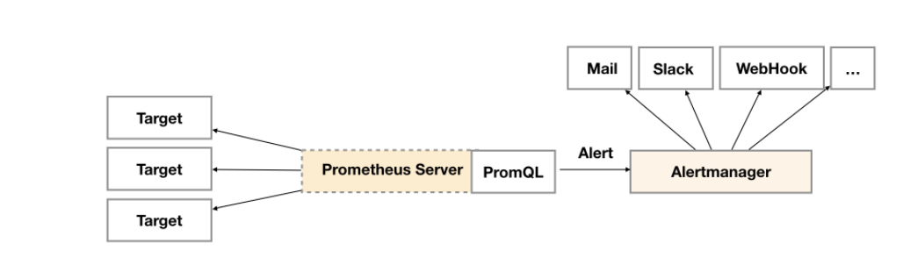
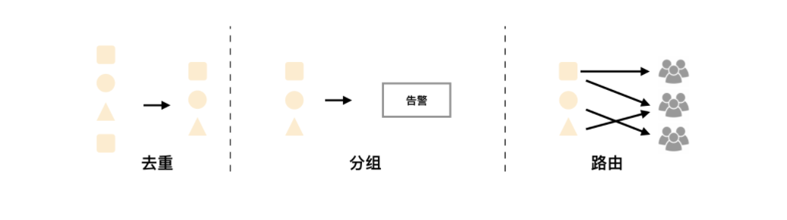

# AlertManager

>altermanager是普罗米修斯的报警组件，主要是用针对异常数据进行报警。首先创建一个报警的规则，其次创建路由（给谁发报警信息）。

## 一、安装部署

### 1、容器

#### 1.部署Alertmanager（安装监控时自动部署了）

````bash
apiVersion: monitoring.coreos.com/v1
kind: Alertmanager
metadata:
  labels:
    alertmanager: main
  name: main
  namespace: monitoring
spec:
  image: quay.io/prometheus/alertmanager:v0.20.0
  nodeSelector:
    kubernetes.io/os: linux
  replicas: 3
  securityContext:
    fsGroup: 2000
    runAsNonRoot: true
    runAsUser: 1000
  serviceAccountName: alertmanager-main
  version: v0.20.0
````

#### 2.查看部署结果

```bash
[root@kubernetes-master-01 manifests]# kubectl get pod -n monitoring 
NAME                                   READY   STATUS    RESTARTS   AGE
alertmanager-main-0                    2/2     Running   0          4d23h
alertmanager-main-1                    2/2     Running   0          4d23h
alertmanager-main-2                    2/2     Running   0          4d23h
```


#### 3.增加一个ingress暴露服务

```bash
kind: Ingress
apiVersion: extensions/v1beta1
metadata:
  name: alertmanager
  namespace: monitoring
spec:
  rules:
    - host: "www.altermanager.cluster.local.com"
      http:
        paths:
          - backend:
              serviceName: alertmanager-main
              servicePort: 9093
            path: /
```


### 2、物理机部署

#### 1.下载安装包

```bash
[root@promethus ~]# cd /opt/
[root@promethus /opt]# wget https://github.com/prometheus/alertmanager/releases/download/v0.21.0/alertmanager-0.21.0.linux-amd64.tar.gz
```


#### 2.创建解压目录并解压

```bash
[root@promethus /prometheus]# mkdir alertmanager
[root@promethus /opt]# tar xf alertmanager-0.21.0.linux-amd64.tar.gz -C /prometheus/alertmanager
[root@promethus /prometheus/alertmanager]# mv alertmanager-0.21.0.linux-amd64/* ./
```


#### 3.授权

```bash
[root@promethus /prometheus/alertmanager]# chown -R prometheus.prometheus /prometheus
```


#### 4.添加环境变量

```bash
[root@promethus /prometheus/alertmanager]# vim /etc/profile.d/prometheus.sh

export PATH=/prometheus:$PATH
export PATH=/prometheus/alertmanager:$PATH
```


#### 5.加入systemd管理

```bash
[root@promethus ~]# vim /usr/lib/systemd/system/prometheus-alertmanager.service 

[Unit]
Description=prometheus-alertmanager server daemon

[Service]
ExecStart=/prometheus/alertmanager/alertmanager --config.file=/prometheus/alertmanager/alertmanager.yml
Restart=on-failure

[Install]
WantedBy=multi-user.target
```


#### 6.启动并加入开机自启

```bash
[root@promethus ~]# systemctl start prometheus-alertmanager.service
[root@promethus ~]# systemctl enable prometheus-alertmanager.service
```


## 二、AlertManager告警简介

### 1、简介

>告警能力在Prometheus的架构中被划分成两个独立的部分。如下所示，通过在Prometheus中定义AlertRule（告警规则），Prometheus会周期性的对告警规则进行计算，如果满足告警触发条件就会向Alertmanager发送告警信息。



### 2、告警规则组成

#### 1.告警名称

```bash
	用户需要为告警规则命名，当然对于命名而言，需要能够直接表达出该告警的主要内容
```


#### 2.告警规则

```bash
	告警规则实际上主要由PromQL进行定义，其实际意义是当表达式（PromQL）查询结果持续多长时间（During）后出发告警
```

```bash
	Alertmanager作为一个独立的组件，负责接收并处理来自Prometheus Server(也可以是其它的客户端程序)的告警信息。Alertmanager可以对这些告警信息进行进一步的处理，比如当接收到大量重复告警时能够消除重复的告警信息，同时对告警信息进行分组并且路由到正确的通知方，Prometheus内置了对邮件，Slack等多种通知方式的支持，同时还支持与Webhook的集成，以支持更多定制化的场景。例如，目前Alertmanager还不支持钉钉，那用户完全可以通过Webhook与钉钉机器人进行集成，从而通过钉钉接收告警信息。同时AlertManager还提供了静默和告警抑制机制来对告警通知行为进行优化。
```


#### 3.Alertmanager特性

```bash
Alertmanager除了提供基本的告警通知能力以外，还主要提供了如：分组、抑制以及静默等告警特性：
```



##### 1)分组

```bash
分组机制可以将详细的告警信息合并成一个通知。在某些情况下，比如由于系统宕机导致大量的告警被同时触发，在这种情况下分组机制可以将这些被触发的告警合并为一个告警通知，避免一次性接受大量的告警通知，而无法对问题进行快速定位。

例如，当集群中有数百个正在运行的服务实例，并且为每一个实例设置了告警规则。假如此时发生了网络故障，可能导致大量的服务实例无法连接到数据库，结果就会有数百个告警被发送到Alertmanager。

而作为用户，可能只希望能够在一个通知中中就能查看哪些服务实例收到影响。这时可以按照服务所在集群或者告警名称对告警进行分组，而将这些告警内聚在一起成为一个通知。

告警分组，告警时间，以及告警的接受方式可以通过Alertmanager的配置文件进行配置。
```


##### 2）抑制

```bash
抑制是指当某一告警发出后，可以停止重复发送由此告警引发的其它告警的机制。

例如，当集群不可访问时触发了一次告警，通过配置Alertmanager可以忽略与该集群有关的其它所有告警。这样可以避免接收到大量与实际问题无关的告警通知。

抑制机制同样通过Alertmanager的配置文件进行设置。
```


##### 3）静默

```bash
静默提供了一个简单的机制可以快速根据标签对告警进行静默处理。如果接收到的告警符合静默的配置，Alertmanager则不会发送告警通知。

静默设置需要在Alertmanager的Werb页面上进行设置。
```

