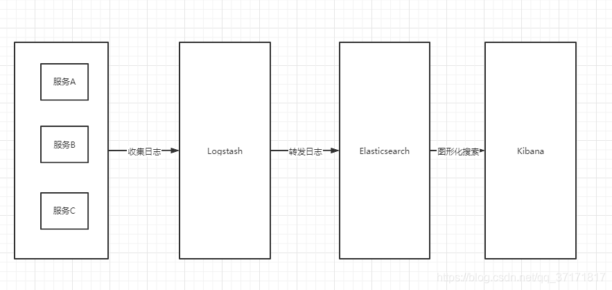
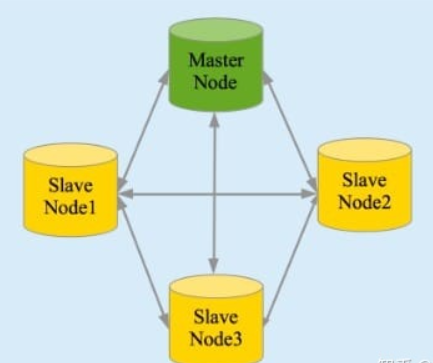
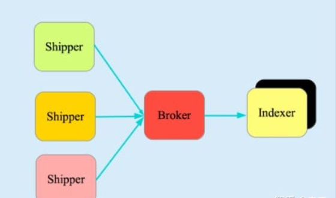
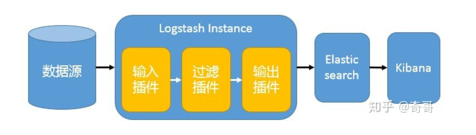
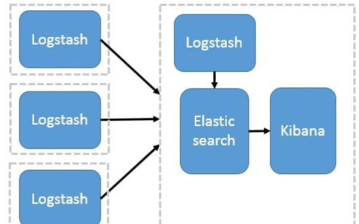
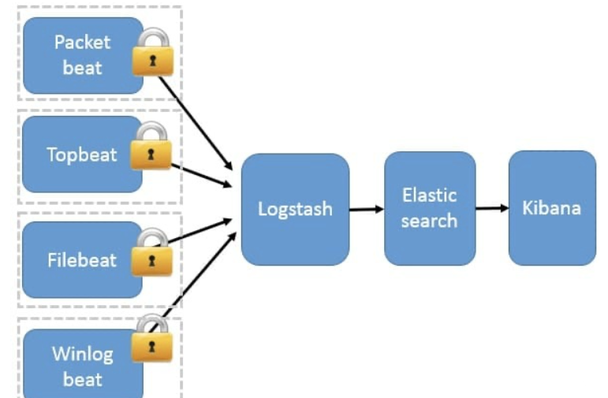
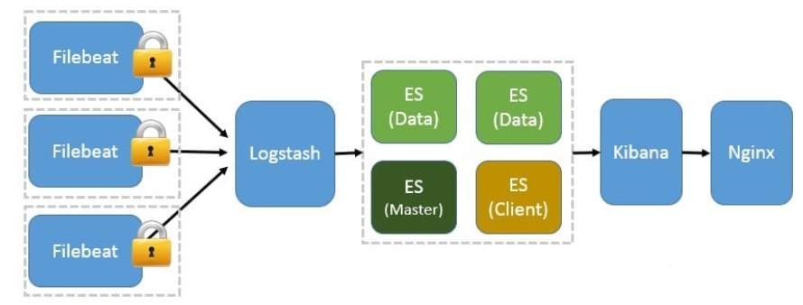
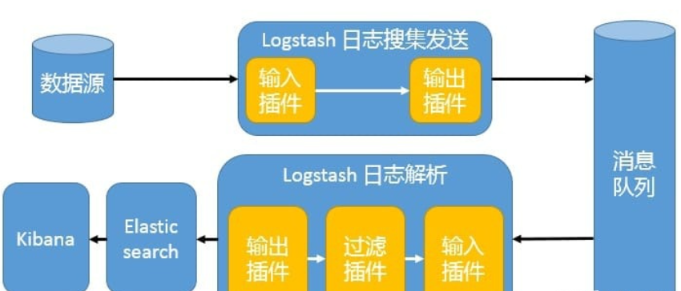

# ELK简介

## 一、ELK起源

### 1、日常工作中会面临很多问题，处理问题时候。怎么解决问题？

```bash
通过工作经验，迅速判断问题出在哪。
通过日志
系统日志：/var/log 目录下的问题的文件
程序日志： 代码日志（项目代码输出的日志）
服务应用日志
    nginx、HAproxy、lvs
    tomcat、php-fpm
    redis、mysql、mongo
    RabbitMq、kafka
    Glusterfs、HDFS、NFS等等
```

**通过日志排除，发现问题根源解决问题**

### 2、面临的问题

> ​	如果1台或者几台服务器，我们可以通过 linux命令，`tail、cat，通过grep、awk等`过滤去查询定位日志查问题

>但是如果几十台、甚至几百台。通过这种方式肯定不现实。


### 3、思路提出

> ​	一些聪明人就提出了建立一套集中式的方法，把不同来源的数据集中整合到一个地方。

**一个完整的集中式日志系统，是离不开以下几个主要特点的。**

```bash
收集－能够采集多种来源的日志数据
传输－能够稳定的把日志数据传输到中央系统
存储－如何存储日志数据
分析－可以支持 UI 分析
警告－能够提供错误报告，监控机制
```


### 4、市场上的产品

**基于上述思路，于是许多产品或方案就应运而生了**

#### 1.简单的

> Rsyslog，Syslog-ng


#### 2.商业化的

>商业化的 Splunk


#### 3.开源的

```bash
FaceBook 公司的 Scribe，
Apache 的 Chukwa，
Linkedin 的 Kafak，
Cloudera 的 Fluentd，
ELK
```


## 二、什么是ELK

>ELK 是由 Elasticsearch、Logstash、Kibana 三个开源软件的组 成的一个组合体，这三个软件当中，每个软件用于完成不同的功能，ELK 又称 为 ELK stack，官方域名为 stactic.co。




## 三、ELK优点

### 1、处理方式灵活

>elasticsearch 是实时全文索引，具有强大的搜索功能 


### 2、配置相对简单

>elasticsearch 全部使用 JSON 接口，logstash 使用模块配置， kibana 的配置文件部分更简单。


### 3、检索性能高效

>基于优秀的设计，虽然每次查询都是实时，但是也可以达到百亿级数据的查询秒级响应。 


### 4、集群线性扩展

> elasticsearch 和 logstash 都可以灵活线性扩展


### 5、前端操作绚丽

>kibana 的前端设计比较绚丽，而且操作简单


## 四、ELK组件介绍

### 1、Elasticsearch

#### 1.介绍

>​	`Elasticsearch` 是一个实时的分布式搜索和分析引擎，它可以用于全文搜索，结构化搜索以及分析。它是一个建立在全文搜索引擎 `Apache Lucene`基础上的搜索引擎，使用`Java`语言编写


#### 2.主要特点

>*实时分析* 分布式实时文件存储，并将每一个字段都编入索引 *文档导向，所有的对象全部是文档* 高可用性，易扩展，支持集群（Cluster）、分片和复制（Shards 和 Replicas）。接口友好，支持 JSON




### 2、Logstash

#### 1.介绍

>`Logstash` 是一个具有实时渠道能力的数据收集引擎。使用 JRuby 语言编写。其作者是世界著名的运维工程师乔丹西塞 (JordanSissel)


#### 2.特点

> 几乎可以访问任何数据

>可以和多种外部应用结合

>支持弹性扩展


#### 3.组成

> Shipper－发送日志数据

> Broker－收集数据

>Indexer－数据写入




### 3、Kibana

>​		`Kibana`是一款基于 `Apache`开源协议，使用 `JavaScript`语言编写，为 `Elasticsearch`提供分析和可视化的 Web 平台。它可以在`Elasticsearch`的索引中查找，交互数据，并生成各种维度的表图.


### 4、Filebeat

>​		`ELK` 协议栈的新成员，一个轻量级开源日志文件数据搜集器，基于 `Logstash-Forwarder`源代码开发，是对它的替代。在需要采集日志数据的 `server` 上安装`Filebea`t，并指定日志目录或日志文件后，`Filebeat`就能读取数据，迅速发送到`Logstash`进行解析，亦或直接发送到 `Elasticsearch`进行集中式存储和分析。


## 五、ELK 协议栈体系结构

### 1、最简单架构

>​		在这种架构中，只有一个 Logstash、Elasticsearch 和 Kibana 实例。Logstash 通过输入插件从多种数据源（比如日志文件、标准输入 Stdin 等）获取数据，再经过滤插件加工数据，然后经 Elasticsearch 输出插件输出到 Elasticsearch，通过 Kibana 展示




### 2、Logstash 作为日志搜集器

> ​		这种架构是对上面架构的扩展，把一个 Logstash 数据搜集节点扩展到多个，分布于多台机器，将解析好的数据发送到 Elasticsearch server 进行存储，最后在 Kibana 查询、生成日志报表等



>​		这种结构因为需要在各个服务器上部署 Logstash，而它比较消耗 CPU 和内存资源，所以比较适合计算资源丰富的服务器，否则容易造成服务器性能下降，甚至可能导致无法正常工作。


### 3、Beats 作为日志搜集器

>这种架构引入 `Beats` 作为日志搜集器。目前 `Beats`包括四种：

```bash
Packetbeat（搜集网络流量数据）；
Topbeat（搜集系统、进程和文件系统级别的 CPU 和内存使用情况等数据）；
Filebeat（搜集文件数据）；
Winlogbeat（搜集 Windows 事件日志数据）。
```

>​	`Beats` 将搜集到的数据发送到 `Logstash`，经 `Logstash` 解析、过滤后，将其发送到 `Elasticsearch`存储，并由 `Kibana` 呈现给用户。



>​	这种架构解决了 `Logstash` 在各服务器节点上占用系统资源高的问题。相比 `Logstash，Beats` 所占系统的 `CPU` 和内存几乎可以忽略不计。另外，`Beats` 和 `Logstash` 之间支持 `SSL/TLS` 加密传输，客户端和服务器双向认证，保证了通信安全。

>​	因此这种架构适合对数据安全性要求较高，同时各服务器性能比较敏感的场景。


### 4、基于 Filebeat 架构的配置部署详解

> ​	前面提到 Filebeat 已经完全替代了 Logstash-Forwarder 成为新一代的日志采集器，同时鉴于它轻量、安全等特点，越来越多人开始使用它。




### 5、引入消息队列机制的架构

>​		Beats 还不支持输出到消息队列，所以在消息队列前后两端只能是 Logstash 实例。这种架构使用 Logstash 从各个数据源搜集数据，然后经消息队列输出插件输出到消息队列中。目前 Logstash 支持 Kafka、Redis、RabbitMQ 等常见消息队列。然后 Logstash 通过消息队列输入插件从队列中获取数据，分析过滤后经输出插件发送到 Elasticsearch，最后通过 Kibana 展示。



>​		这种架构适合于日志规模比较庞大的情况。但由于 `Logstash` 日志解析节点和 `Elasticsearch` 的负荷比较重，可将他们配置为集群模式，以分担负荷。引入消息队列，均衡了网络传输，从而降低了网络闭塞，尤其是丢失数据的可能性，但依然存在 `Logstash` 占用系统资源过多的问题。

