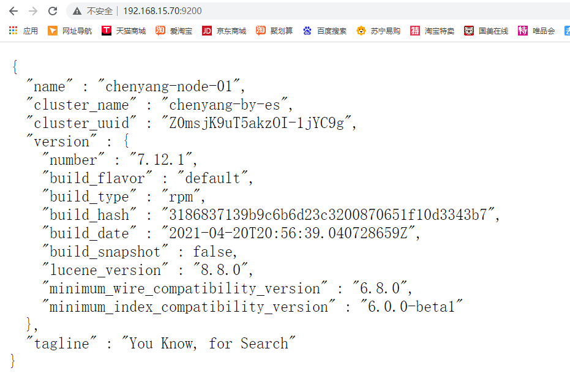
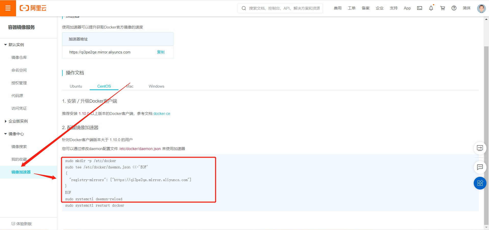
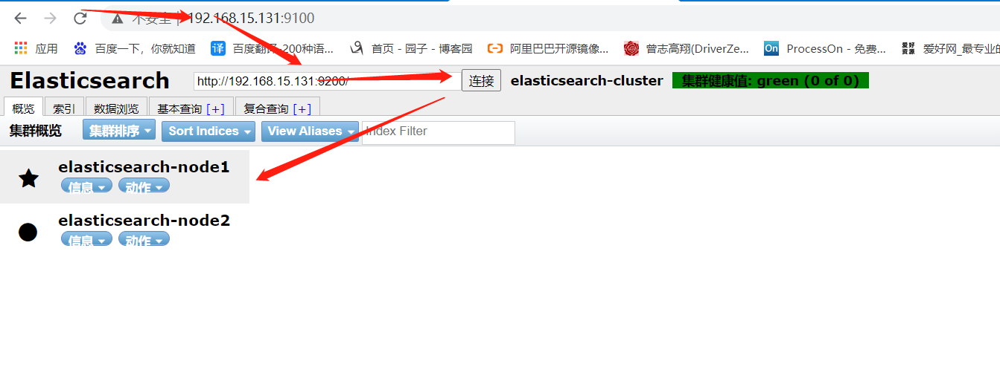
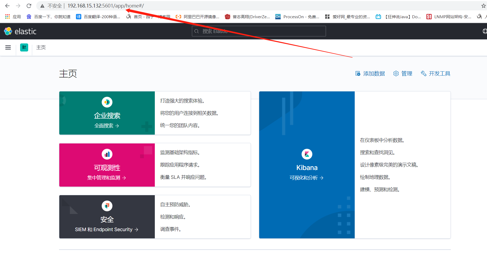

# ELK物理机安装

## 一、集群规划

| 主机名 | 外网IP         | 内网IP       | 配置  |
| ------ | -------------- | ------------ | ----- |
| es-01  | 192.168.15.131 | 172.16.1.132 | 2核4G |
| es-02  | 192.168.15.131 | 172.16.1.132 | 2核4G |


## 二、集群优化

### 1、关闭防火墙

```bash
systemctl disable --now firewalld
```


### 2、关闭selinux

```bash
# 永久关闭
sed -i 's#enforcing#disabled#g' /etc/selinux/config

#临时关闭
setenforce 0
```


### 3、配置本地域名解析

```bash
[root@es-01 ~]# vim /etc/hosts
...
192.168.15.131  es-01
192.168.15.132  es-02
```


### 4、内核优化

>​	默认情况下，Elasticsearch使用mmapfs目录存储其索引，mmap计数的默认操作系统限制可能太低，这可能会导致内存不足，需要将其调至262144。编辑sysctl.conf 文件：

```bash
[root@es-01 ~]# vim /etc/sysctl.conf
vm.max_map_count = 262144

##重载生效
sysctl -p
```


### 5、进程限制优化

```bash
vim /etc/security/limits.conf

# 尾部追加如下内容
root soft nofile 65536
root hard nofile 65536
* soft nofile 65536
* hard nofile 65536
* soft memlock  unlimited
* hard memlock  unlimited
```


### 6、安装jdk

```bash
yum install java-1.8.0* -y

# 确定jdk安装成功
java -version
```


## 三、Elasticsearch部署

### 1、下载地址

> 最新版

https://www.elastic.co/cn/downloads/elasticsearch


> 其他版本

https://www.elastic.co/cn/downloads/past-releases#elasticsearch


### 2、下载

```bash
wget https://artifacts.elastic.co/downloads/elasticsearch/elasticsearch-7.12.1-x86_64.rpm
```


### 3、安装

```bash
yum localinstall elasticsearch-7.12.1-x86_64.rpm -y
```


### 4、设置内存锁定

```bash
vim /usr/lib/systemd/system/elasticsearch.service
# 在[service]下面增加
LimitMEMLOCK=infinity

# 重载
systemctl daemon-reload
```


### 5、修改锁定内存大小

```bash
vim /etc/elasticsearch/jvm.options
...
-Xms1g
-Xmx1g
...
```


### 6、修改配置文件

es-01

```bash
vim /etc/elasticsearch/elasticsearch.yml

#集群名称
cluster.name: elasticsearch-cluster

#节点名称
node.name: elasticsearch-node1

#数据存放路径
path.data: /var/lib/elasticsearch

#日志存放路径
path.logs: /var/log/elasticsearch

#设置内存锁定
bootstrap.memory_lock: true

#ES通讯地址
network.publish_host: 172.16.1.131

#设置监听IP
network.host: 0.0.0.0

#设置监听端口
http.port: 9200

# TCP通讯端口
transport.tcp.port: 9300

# 允许跨域访问
http.cors.enabled: true
http.cors.allow-origin: "*"
http.cors.allow-methods: OPTIONS, HEAD, GET, POST, PUT, DELETE
http.cors.allow-headers: "X-Requested-With, Content-Type, Content-Length, X-User"

# 集群内ES地址
discovery.seed_hosts: ["172.16.1.131:9300","172.16.1.132:9300"]

# 设置主节点
cluster.initial_master_nodes: ["172.16.1.131","172.16.1.132"]

# 配置选举策略,该值为: master候选节点数量/2+1
discovery.zen.minimum_master_nodes: 2
#
# 是否具备选举为主节点资格
node.master: true

# 该节点是否存储数据
node.data: true
```


es-02

```bash
vim /etc/elasticsearch/elasticsearch.yml

#集群名称
cluster.name: elasticsearch-cluster

#节点名称
node.name: elasticsearch-node2

#数据存放路径
path.data: /var/lib/elasticsearch

#日志存放路径
path.logs: /var/log/elasticsearch

#设置内存锁定
bootstrap.memory_lock: true

#ES通讯地址
network.publish_host: 172.16.1.132

#设置监听IP
network.host: 0.0.0.0

#设置监听端口
http.port: 9200

# TCP通讯端口
transport.tcp.port: 9300

# 允许跨域访问
http.cors.enabled: true
http.cors.allow-origin: "*"

# 集群内ES地址
discovery.seed_hosts: ["172.16.1.131:9300","172.16.1.132:9300"]
http.cors.allow-methods: OPTIONS, HEAD, GET, POST, PUT, DELETE
http.cors.allow-headers: "X-Requested-With, Content-Type, Content-Length, X-User"

# 设置主节点
cluster.initial_master_nodes: ["172.16.1.131","172.16.1.132"]

# 配置选举策略,该值为: master候选节点数量/2+1
discovery.zen.minimum_master_nodes: 2
#
# 是否具备选举为主节点资格
node.master: true

# 该节点是否存储数据
node.data: true
```


### 7、启动

```bash
systemctl start elasticsearch.service 
```


### 8、访问测试



### 9、使用elasticsearch-head前端框架做监控（仅01执行）

**使用docker安装**

#### 1.更新yum源

```bash
curl -o /etc/yum.repos.d/CentOS-Base.repo https://mirrors.aliyun.com/repo/Centos-7.repo
```


#### 2.添加docker-ce yum源

```bash
wget -O /etc/yum.repos.d/docker-ce.repo https://repo.huaweicloud.com/docker-ce/linux/centos/docker-ce.repo

# 清除rpm包及header
yum clean all

# 重新缓存远端服务器rpm包信息
yum makecache
```


#### 3.添加阿里云镜像加速器




```bash
mkdir -p /etc/docker
tee /etc/docker/daemon.json <<-'EOF'
{
  "registry-mirrors": ["https://qi3pe2qe.mirror.aliyuncs.com"]
}
EOF
systemctl daemon-reload
```


#### 4.安装docker

```bash
yum install docker-ce -y
```


#### 5.启动并设置开机自启

```bash
systemctl enable --now docker
```


#### 6.安装elasticsearch-head

```bash
docker run -d -p 9100:9100 --name es-manager mobz/elasticsearch-head:

docker run -d -p 9100:9100 --name es-manager push registry.cn-shanghai.aliyuncs.com/wxyuan/elk:elasticsearch-head-v1
```


#### 7.访问测试




## 四、LogStach部署

**部署在任意一台机器，测试环境装在02**

### 1、下载安装包

```bash
cd /opt/
wget https://artifacts.elastic.co/downloads/logstash/logstash-7.12.1-x86_64.rpm
```


### 2、安装

```bash
yum install logstash-7.12.1-x86_64.rpm -y
```


### 3、数据目录授权

```bash
chown -R logstash.logstash /usr/share/logstash/
```


## 五、部署kibana

### 1、下载安装包

```bash
wget https://artifacts.elastic.co/downloads/kibana/kibana-7.12.1-x86_64.rpm
```


### 2、安装

```bash
yum localinstall kibana-7.12.1-x86_64.rpm -y
```


### 3、修改配置文件

```bash
vim /etc/kibana/kibana.yml

server.name: kibana
server.host: "0" 		#监听IP
server.port: 5601 		#监听端口 
#elasticsearch 服务器地址
elasticsearch.hosts: elasticsearch.hosts: ["http://192.168.15.131:9200","http://192.168.15.132:9200"]
xpack.monitoring.ui.container.elasticsearch.enabled: true


#设置为中文界面
i18n.locale: "zh-CN"
```

### 4、启动

```bash
systemctl enable --now kibana
```


### 5、访问



