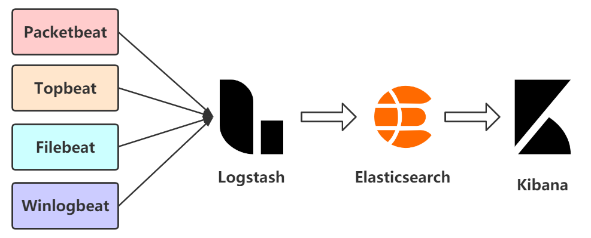
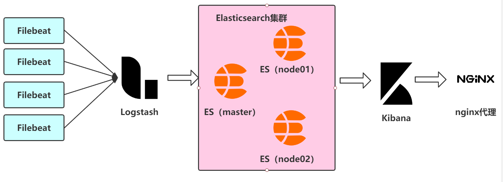
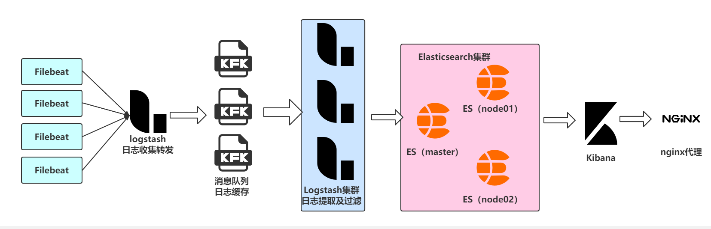

# Beats收集器

## 一、Logstash作为日志收集的缺点

> ​		因为需要在各个服务器上部署 Logstash，而它比较消耗 CPU 和内存资源，所以比较适合计算资源丰富的服务器，否则容易造成服务器性能下降，甚至可能导致无法正常工作。

## 二、Filebeat应运而生

### 1、介绍

> ​		`ELK` 协议栈的新成员，一个轻量级开源日志文件数据搜集器，基于 `Logstash-Forwarder`源代码开发，是对它的替代。在需要采集日志数据的 `server` 上安装`Filebeat`，并指定日志目录或日志文件后，`Filebeat`就能读取数据，迅速发送到`Logstash`进行解析，亦或直接发送到 `Elasticsearch`进行集中式存储和分析。

### 2、其他Beats

- `Packetbeat`（搜集网络流量数据）；
- `Topbeat`（搜集系统、进程和文件系统级别的 CPU 和内存使用情况等数据）；
- `Filebeat`（搜集文件数据）；
- `Winlogbeat`（搜集 Windows 事件日志数据）。
- 

>​		`Beats` 将搜集到的数据发送到 `Logstash`，经 `Logstash` 解析、过滤后，将其发送到 `Elasticsearch`存储，并由 `Kibana` 呈现给用户。

		

>​		这种架构解决了 `Logstash` 在各服务器节点上占用系统资源高的问题。相比 `Logstash，Beats` 所占系统的 `CPU` 和内存几乎可以忽略不计。另外，`Beats` 和 `Logstash` 之间支持 `SSL/TLS` 加密传输，客户端和服务器双向认证，保证了通信安全。
>
>因此这种架构适合对数据安全性要求较高，同时各服务器性能比较敏感的场景。

# 企业级ELK集群介绍

## 一、基于 Filebeat 架构的配置部署详解

>​		前面提到 Filebeat 已经完全替代了 Logstash-Forwarder 成为新一代的日志采集器，同时鉴于它轻量、安全等特点，越来越多人开始使用它。

>KIbana有加密功能的版本是需要购买的，对于我们来说能不用钱的就不用钱。可以通过nginx的auth模块及代理功能实现页面加密。

## 二、引入消息队列架构

> ​		随着日志量的增加发现集群遇到了瓶颈，我们可以根据企业的需要来扩展集群，使用Kafka、Redis、RabbitMQ等常见消息队列。然后 Logstash 通过消息队列输入插件从队列中获取数据，分析过滤后经输出插件发送到Redis或Elasticsearch。

>​		这种架构适合于日志规模比较庞大的情况。但由于 `Logstash` 日志解析节点和 `Elasticsearch` 的负荷比较重，可将他们配置为集群模式，以分担负荷。引入消息队列，均衡了网络传输，从而降低了网络闭塞，尤其是丢失数据的可能性，但依然存在 `Logstash` 占用系统资源过多的问题。

> ​		在性能足够的前提下，两个Redis可以根据生产情况使用一台机器。