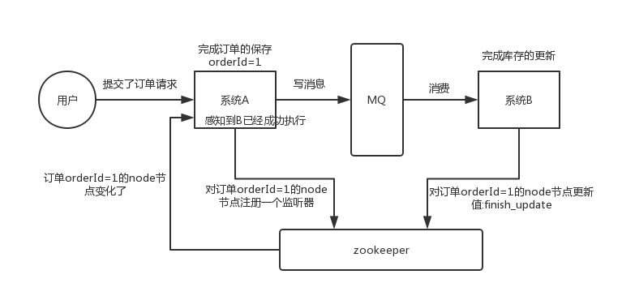
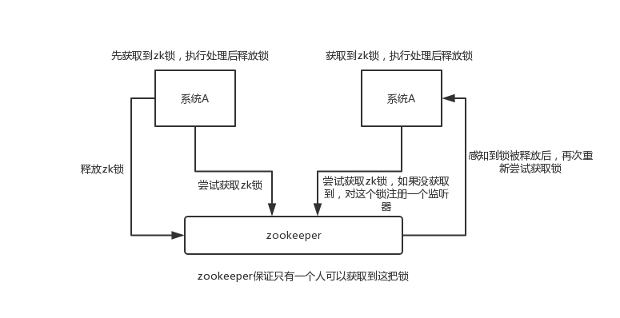
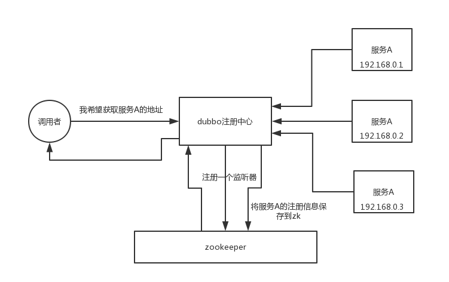
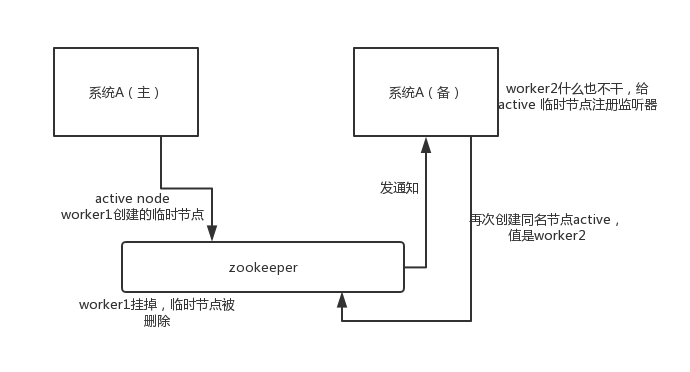
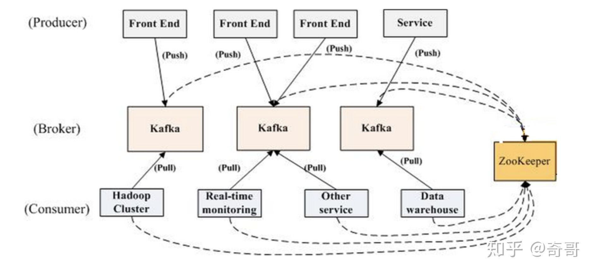
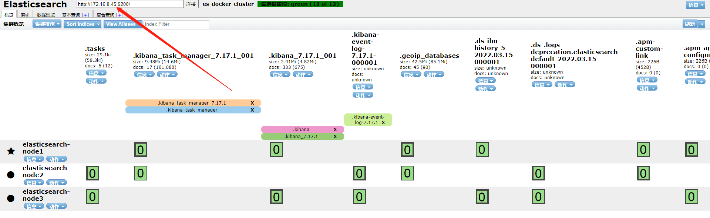
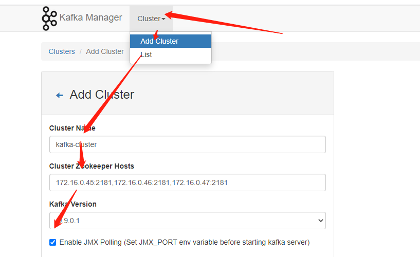

#  企业ELK搭建

## 一、集群规划

### 1、环境要求

```bash
Ubuntu18.4.5
Java 1.8
```


| 主机名 | IP          | 配置           | 组件                                       |
| ------ | ----------- | -------------- | ------------------------------------------ |
| es-01  | 172.16.0.45 | 4核8G 500G存储 | ES、logstash、KFK                          |
| es-02  | 172.16.0.46 | 4核8G 500G存储 | ES、logstash、KFK                          |
| es-03  | 172.16.0.47 | 4核8G 500G存储 | ES、logstash、KFK                          |
| lka-04 | 172.16.0.48 | 4核8G 200G存储 | Kibana、logstash(收集)、elasticsearch-head |
| test   | 172.16.1.13 | 随机           | Filebeat                                   |


### 2、架构图


## 二、集群优化

### 1、关闭防火墙

```bash
ufw disable
```

### 2、配置本地域名解析

```bash
vim /etc/hosts
...
172.16.0.45  es-01
172.16.0.46  es-02
172.16.0.47  es-03
172.16.0.48  lka-04
```

### 3、内核优化

>默认情况下，Elasticsearch使用mmapfs目录存储其索引，mmap计数的默认操作系统限制可能太低，这可能会导致内存不足，需要将其调至262144。编辑sysctl.conf 文件：

```bash
 echo "vm.max_map_count = 262144" >> /etc/sysctl.conf
echo "vm.swappiness=0" >> /etc/sysctl.conf
##临时生效
sysctl -w vm.max_map_count=262144
sysctl -w vm.swappiness=0
##永久生效生效
sysctl -p
```

### 4、进程限制优化

```bash
vim /etc/security/limits.conf

# 尾部追加如下内容
root soft nofile 65536
root hard nofile 65536
* soft nofile 65536
* hard nofile 65536
* soft memlock  unlimited
* hard memlock  unlimited
```

### 5、安装JDK

```bash
apt install openjdk-8-jre -y
```

## 三、选择版本

所有版本统一使用7.17.1版本

## 四、docker-compose安装es集群（es-01、es-02、es-03执行）

### 1、创建数据和日志目录

```bash
mkdir -p /data/es/data
mkdir -p /data/es/plugins
mkdir -p /var/log/elasticsearch/logs

#授权
chmod 777 -R /data/es
chmod 777 -R /var/log/elasticsearch
```

### 2、编写docker-compose配置文件

#### 1.es-01

>vim docker-compose-es01.yml

```yml
version: "3.0"

networks:
  elk:
    driver: bridge
services:
  elasticsearch-01:
    image: docker.elastic.co/elasticsearch/elasticsearch:7.17.1
    restart: always
    container_name: elasticsearch-01
    environment:
      #集群名称
      - cluster.name=es-docker-cluster
      #节点名称
      - node.name=elasticsearch-node1
      #设置内存锁定
      - bootstrap.memory_lock=true
      #ES通讯地址
      - network.publish_host=172.16.0.45
      #设置监听IP
      - network.host=0.0.0.0
      #设置监听端口
      - http.port=9200
      #TCP通讯端口
      - transport.tcp.port=9300
      #允许跨域访问
      - http.cors.enabled=true
      - http.cors.allow-origin=*
      - http.cors.allow-methods=OPTIONS, HEAD, GET, POST, PUT, DELETE
      - http.cors.allow-headers=X-Requested-With, Content-Type, Content-Length, X-User
      #集群内ES地址
      - discovery.seed_hosts=172.16.0.45:9300,172.16.0.46:9300,172.16.0.47:9300
      #设置主节点
      - cluster.initial_master_nodes=172.16.0.45:9300,172.16.0.46:9300,172.16.0.47:9300
      #配置选举策略,该值为: master候选节点数量/2+1
      - discovery.zen.minimum_master_nodes=2
      #是否具备选举为主节点资格
      - node.master:true
      #该节点是否存储数据
      - node.data=true
      - "ES_JAVA_OPTS=-Xms3g -Xmx3g"
      - TZ=Asia/Shanghai
    ulimits:
      memlock: -1
      nproc: 65535
      nofile:
        soft: 65536
        hard: 65536
    volumes:
      - /data/es/data:/usr/share/elasticsearch/data
      - /data/es/plugins:/usr/share/elasticsearch/plugins
      - /var/log/elasticsearch/logs:/usr/share/elasticsearch/logs
    ports:
      - 9200:9200
      - 9300:9300
    networks:
      - elk
```


#### 2.es-02

> vim docker-compose-es02.yml

```yml
version: "3.0"

networks:
  elk:
    driver: bridge
services:
  elasticsearch-02:
    image: docker.elastic.co/elasticsearch/elasticsearch:7.17.1
    restart: always
    container_name: elasticsearch-02
    environment:
      #集群名称
      - cluster.name=es-docker-cluster
      #节点名称
      - node.name=elasticsearch-node2
      #设置内存锁定
      - bootstrap.memory_lock=true
      #ES通讯地址
      - network.publish_host=172.16.0.46
      #设置监听IP
      - network.host=0.0.0.0
      #设置监听端口
      - http.port=9200
      #TCP通讯端口
      - transport.tcp.port=9300
      #允许跨域访问
      - http.cors.enabled=true
      - http.cors.allow-origin=*
      - http.cors.allow-methods=OPTIONS, HEAD, GET, POST, PUT, DELETE
      - http.cors.allow-headers=X-Requested-With, Content-Type, Content-Length, X-User
      #集群内ES地址
      - discovery.seed_hosts=172.16.0.45:9300,172.16.0.46:9300,172.16.0.47:9300
      #设置主节点
      - cluster.initial_master_nodes=172.16.0.45:9300,172.16.0.46:9300,172.16.0.47:9300
      #配置选举策略,该值为: master候选节点数量/2+1
      - discovery.zen.minimum_master_nodes=2
      #是否具备选举为主节点资格
      - node.master:true
      #该节点是否存储数据
      - node.data=true
      - "ES_JAVA_OPTS=-Xms3g -Xmx3g"
      - TZ=Asia/Shanghai
    ulimits:
      memlock: -1
      nproc: 65535
      nofile:
        soft: 65536
        hard: 65536
    volumes:
      - /data/es/data:/usr/share/elasticsearch/data
      - /data/es/plugins:/usr/share/elasticsearch/plugins
      - /var/log/elasticsearch/logs:/usr/share/elasticsearch/logs
    ports:
      - 9200:9200
      - 9300:9300
    networks:
      - elk
```

#### 3.es-03

> vim docker-compose-es03.yml

```bash
version: "3.0"

networks:
  elk:
    driver: bridge
services:
  elasticsearch-03:
    image: docker.elastic.co/elasticsearch/elasticsearch:7.17.1
    restart: always
    container_name: elasticsearch-03
    environment:
      #集群名称
      - cluster.name=es-docker-cluster
      #节点名称
      - node.name=elasticsearch-node3
      #设置内存锁定
      - bootstrap.memory_lock=true
      #ES通讯地址
      - network.publish_host=172.16.0.47
      #设置监听IP
      - network.host=0.0.0.0
      #设置监听端口
      - http.port=9200
      #TCP通讯端口
      - transport.tcp.port=9300
      #允许跨域访问
      - http.cors.enabled=true
      - http.cors.allow-origin=*
      - http.cors.allow-methods=OPTIONS, HEAD, GET, POST, PUT, DELETE
      - http.cors.allow-headers=X-Requested-With, Content-Type, Content-Length, X-User
      #集群内ES地址
      - discovery.seed_hosts=172.16.0.45:9300,172.16.0.46:9300,172.16.0.47:9300
      #设置主节点
      - cluster.initial_master_nodes=172.16.0.45:9300,172.16.0.46:9300,172.16.0.47:9300
      #配置选举策略,该值为: master候选节点数量/2+1
      - discovery.zen.minimum_master_nodes=2
      #是否具备选举为主节点资格
      - node.master:true
      #该节点是否存储数据
      - node.data=true
      - "ES_JAVA_OPTS=-Xms3g -Xmx3g"
      - TZ=Asia/Shanghai
    ulimits:
      memlock: -1
      nproc: 65535
      nofile:
        soft: 65536
        hard: 65536
    volumes:
      - /data/es/data:/usr/share/elasticsearch/data
      - /data/es/plugins:/usr/share/elasticsearch/plugins
      - /var/log/elasticsearch/logs:/usr/share/elasticsearch/logs
    ports:
      - 9200:9200
      - 9300:9300
    networks:
      - elk
```


## 五、kfk集群搭建

### 1、Zookeeper介绍

#### 1.概述

```bash
ZooKeeper 是一个开源的分布式协调服务，是 Hadoop，HBase 和其他分布式框架使用的有组织服务的标准。
分布式应用程序可以基于 ZooKeeper 实现诸如数据发布/订阅、负载均衡、命名服务、分布式协调/通知、集群管理、Master 选举、分布式锁和分布式队列等功能。

ZooKeeper是一个开源的分布式应用程序协调服务，是Google的Chubby一个开源的实现。ZooKeeper为分布式应用提供一致性服务，提供的功能包括：分布式同步（Distributed Synchronization）、命名服务（Naming Service）、集群维护（Group Maintenance）、分布式锁（Distributed Lock）等，简化分布式应用协调及其管理的难度，提供高性能的分布式服务。

ZooKeeper本身可以以单机模式安装运行，不过它的长处在于通过分布式ZooKeeper集群（一个Leader，多个Follower），基于一定的策略来保证ZooKeeper集群的稳定性和可用性，从而实现分布式应用的可靠性。

ZooKeeper在提供分布式锁等服务的时候需要过半数的节点可用。另外高可用的诉求来说节点的个数必须>1，所以ZooKeeper集群需要是>1的奇数节点。例如3、5、7等等。
```

#### 2.集群角色说明

ZooKeeper主要有领导者（Leader）、跟随者（Follower）和观察者（Observer）三种角色。

| 角色               | 说明                                                         |
| ------------------ | ------------------------------------------------------------ |
| 领导者（Leader）   | 为客户端提供读和写的服务，负责投票的发起和决议，更新系统状态 |
| 跟随者（Follower） | 为客户端提供读服务，如果是写服务则转发给Leader，在选举过程中参与投票 |
| 观察者（Observer） | 为客户端提供读服务器，如果是写服务则转发给Leader。不参与选举过程中的投票，也不参与“过半写成功策略”，在不影响性能的情况下提升集群的读性能。此角色与zookeeper3.3系列新增的角色。 |


#### 3.应用场景

```bash
分布式协调
分布式锁
元数据/配置信息管理
HA 高可用性
发布/订阅
负载均衡
Master 选举
```

##### 1)分布式协调

```bash
这个其实是 zookeeper 很经典的一个用法，简单来说，就好比，你 A 系统发送个请求到 mq，然后 B 系统消息消费之后处理了。那 A 系统如何知道 B 系统的处理结果？用 zookeeper 就可以实现分布式系统之间的协调工作。A 系统发送请求之后可以在 zookeeper 上对某个节点的值注册个监听器，一旦 B 系统处理完了就修改 zookeeper 那个节点的值，A 系统立马就可以收到通知，完美解决。
```




##### 2)分布式锁

```bash
举个栗子。对某一个数据连续发出两个修改操作，两台机器同时收到了请求，但是只能一台机器先执行完另外一个机器再执行。那么此时就可以使用 zookeeper 分布式锁，一个机器接收到了请求之后先获取 zookeeper 上的一把分布式锁，就是可以去创建一个 znode，接着执行操作；然后另外一个机器也尝试去创建那个 znode，结果发现自己创建不了，因为被别人创建了，那只能等着，等第一个机器执行完了自己再执行。
```



##### 3)元数据/配置信息管理

```bash
zookeeper 可以用作很多系统的配置信息的管理，比如 kafka、storm 等等很多分布式系统都会选用 zookeeper 来做一些元数据、配置信息的管理，包括 dubbo 注册中心不也支持 zookeeper 么？
```



##### 4)HA高可用性

```bash
这个应该是很常见的，比如 hadoop、hdfs、yarn 等很多大数据系统，都选择基于 zookeeper 来开发 HA 高可用机制，就是一个重要进程一般会做主备两个，主进程挂了立马通过 zookeeper 感知到切换到备用进程。
```



### 2、Kafka介绍

#### 1.概述

```bash
Apache Kafka 是一个快速、可扩展的、高吞吐、可容错的分布式发布订阅消息系统。其具有高吞吐量、内置分区、支持数据副本和容错的特性，适合在大规模消息处理场景中使用。

Kafka是一个开源的分布式消息引擎/消息中间件，同时Kafka也是一个流处理平台。Kakfa支持以发布/订阅的方式在应用间传递消息，同时并基于消息功能添加了Kafka Connect、Kafka Streams以支持连接其他系统的数据(Elasticsearch、Hadoop等)

Kafka最核心的最成熟的还是他的消息引擎，所以Kafka大部分应用场景还是用来作为消息队列削峰平谷。另外，Kafka也是目前性能最好的消息中间件。
```

#### 2.架构

```bash
在Kafka集群(Cluster)中，一个Kafka节点就是一个Broker，消息由Topic来承载，可以存储在1个或多个Partition中。发布消息的应用为Producer、消费消息的应用为Consumer，多个Consumer可以促成Consumer Group共同消费一个Topic中的消息。
```

| 概念/对象      | 说明                                                         |
| -------------- | ------------------------------------------------------------ |
| Broker         | Kafka节点：消息中间件处理结点，一个 Kafka 节点就是一个 broker，多个 broker 可以组成一个 Kafka 集群。 |
| Topic          | 主题，用来承载消息：一类消息，例如 page view 日志、click 日志等都可以以 topic 的形式存在，Kafka 集群能够同时负责多个 topic 的分发。 |
| Partition      | 分区，用于主题分片存储：topic 物理上的分组，一个 topic 可以分为多个 partition，每个 partition 是一个有序的队列。 |
| Producer       | 生产者，向主题发布消息的应用：                               |
| Consumer       | 消费者，从主题订阅消息的应用                                 |
| Consumer Group | 消费者组，由多个消费者组成                                   |
| offset         | 每个 partition 都由一系列有序的、不可变的消息组成，这些消息被连续的追加到 partition 中。partition 中的每个消息都有一个连续的序列号叫做 offset,用于 partition 唯一标识一条消息.每个 partition 中的消息都由 offset=0 开始记录消息。 |



### 3、架构搭建（es-01、es-02、es-03执行）

#### 1.创建数据和日志目录

```bash
mkdir -p /data/zookeeper/data
mkdir -p /var/log/zookeeper/log

mkdir -p /data/kafka/data

#授权
chmod 777 -R /data/zookeeper
chmod 777 -R /var/log/zookeeper

chmod 777 -R /data/kafka
```


#### 2.编写docker-compose配置

##### 1）kfk01

```bash
version: "3.0"

networks:
  zoo:
    driver: bridge
  kfk:
    driver: bridge

services:
  zoo1:
    image: zookeeper:3.7.0
    restart: unless-stopped
    hostname: zoo1
    container_name: zoo1
    ports:
      - 2181:2181
      - 2888:2888
      - 3888:3888
    environment:
      ZOO_MY_ID: 1
      ZOO_SERVERS: quorumListenOnAllIPs:true server.1=172.16.0.45:2888:3888;2181 server.2=172.16.0.46:2888:3888;2181 server.3=172.16.0.47:2888:3888;2181
    volumes:
      - /data/zookeeper/data:/data
      - /var/log/zookeeper/log:/datalog
    networks:
      - zoo

  kafka1:
    image: wurstmeister/kafka:2.13-2.8.1
    restart: unless-stopped
    container_name: kafka1
    ports:
      - 9092:9092
    environment:
      KAFKA_BROKER_ID: 1
      KAFKA_ADVERTISED_HOST_NAME: 172.16.0.45
      KAFKA_ADVERTISED_PORT: 9092
      KAFKA_ADVERTISED_LISTENERS: PLAINTEXT://172.16.0.45:9092
      KAFKA_ZOOKEEPER_CONNECT: "172.16.0.45:2181,172.16.0.46:2181,172.16.0.47:2181"
    volumes:
      - /data/kafka/docker.sock:/var/run/docker.sock
      - /data/kafka/data:/kafka
    networks:
      - kfk
```


##### 2）kfk02

```bash
version: "3.0"

networks:
  zoo:
    driver: bridge
  kfk:
    driver: bridge

services:
  zoo1:
    image: zookeeper:3.7.0
    restart: unless-stopped
    hostname: zoo2
    container_name: zoo2
    ports:
      - 2181:2181
      - 2888:2888
      - 3888:3888
    environment:
      ZOO_MY_ID: 2
      ZOO_SERVERS: quorumListenOnAllIPs:true server.1=172.16.0.45:2888:3888;2181 server.2=172.16.0.46:2888:3888;2181 server.3=172.16.0.47:2888:3888;2181
    volumes:
      - /data/zookeeper/data:/data
      - /var/log/zookeeper/log:/datalog
    networks:
      - zoo

  kafka2:
    image: wurstmeister/kafka:2.13-2.8.1
    restart: unless-stopped
    container_name: kafka2
    ports:
      - 9092:9092
    environment:
      KAFKA_BROKER_ID: 2
      KAFKA_ADVERTISED_HOST_NAME: 172.16.0.46
      KAFKA_ADVERTISED_PORT: 9092
      KAFKA_ADVERTISED_LISTENERS: PLAINTEXT://172.16.0.46:9092
      KAFKA_ZOOKEEPER_CONNECT: "172.16.0.45:2181,172.16.0.46:2181,172.16.0.47:2181"
    volumes:
      - /data/kafka/docker.sock:/var/run/docker.sock
      - /data/kafka/data:/kafka
    networks:
      - kfk
```


##### 3）kfk03

```bash
version: "3.0"

networks:
  zoo:
    driver: bridge
  kfk:
    driver: bridge

services:
  zoo1:
    image: zookeeper:3.7.0
    restart: unless-stopped
    hostname: zoo3
    container_name: zoo3
    ports:
      - 2181:2181
      - 2888:2888
      - 3888:3888
    environment:
      ZOO_MY_ID: 3
      ZOO_SERVERS: quorumListenOnAllIPs:true server.1=172.16.0.45:2888:3888;2181 server.2=172.16.0.46:2888:3888;2181 server.3=172.16.0.47:2888:3888;2181
    volumes:
      - /data/zookeeper/data:/data
      - /var/log/zookeeper/log:/datalog
    networks:
      - zoo

  kafka3:
    image: wurstmeister/kafka:2.13-2.8.1
    restart: unless-stopped
    container_name: kafka3
    ports:
      - 9092:9092
    environment:
      KAFKA_BROKER_ID: 3
      KAFKA_ADVERTISED_HOST_NAME: 172.16.0.47
      KAFKA_ADVERTISED_PORT: 9092
      KAFKA_ADVERTISED_LISTENERS: PLAINTEXT://172.16.0.47:9092
      KAFKA_ZOOKEEPER_CONNECT: "172.16.0.45:2181,172.16.0.46:2181,172.16.0.47:2181"
    volumes:
      - /data/kafka/docker.sock:/var/run/docker.sock
      - /data/kafka/data:/kafka
    networks:
      - kfk
```


#### 3.zookeeper测试

##### 1.zoo1

```bash
root@es-01:/data/kafka# echo srvr | nc localhost 2181
Zookeeper version: 3.7.0-e3704b390a6697bfdf4b0bef79e3da7a4f6bac4b, built on 2021-03-17 09:46 UTC
Latency min/avg/max: 0/0.0/0
Received: 2
Sent: 1
Connections: 1
Outstanding: 0
Zxid: 0x0
Mode: follower
Node count: 5


root@es-01:/data/kafka# docker exec -it zoo1 bash
root@zoo1:/apache-zookeeper-3.7.0-bin# cd bin/
root@zoo1:/apache-zookeeper-3.7.0-bin/bin# zkServer.sh status
ZooKeeper JMX enabled by default
Using config: /conf/zoo.cfg
Client port found: 2181. Client address: localhost. Client SSL: false.
Mode: follower
```

##### 2.zoo2

```bash
root@es-02:/data/kafka# echo srvr | nc localhost 2181
Zookeeper version: 3.7.0-e3704b390a6697bfdf4b0bef79e3da7a4f6bac4b, built on 2021-03-17 09:46 UTC
Latency min/avg/max: 0/0.0/0
Received: 2
Sent: 1
Connections: 1
Outstanding: 0
Zxid: 0x100000000
Mode: leader
Node count: 5
Proposal sizes last/min/max: -1/-1/-1


root@es-02:/data/kafka# docker exec -it zoo2 bash
root@zoo2:/apache-zookeeper-3.7.0-bin# cd bin/
root@zoo2:/apache-zookeeper-3.7.0-bin/bin# zkServer.sh status
ZooKeeper JMX enabled by default
Using config: /conf/zoo.cfg
Client port found: 2181. Client address: localhost. Client SSL: false.
Mode: leader
```

##### 3.zoo3

```bash
root@es-03:/data/kafka# echo srvr | nc localhost 2181
Zookeeper version: 3.7.0-e3704b390a6697bfdf4b0bef79e3da7a4f6bac4b, built on 2021-03-17 09:46 UTC
Latency min/avg/max: 0/0.0/0
Received: 2
Sent: 1
Connections: 1
Outstanding: 0
Zxid: 0x100000000
Mode: follower
Node count: 5


root@es-03:/data/kafka# docker exec -it zoo3 bash
root@zoo3:/apache-zookeeper-3.7.0-bin# cd bin/
root@zoo3:/apache-zookeeper-3.7.0-bin/bin# zkServer.sh status
ZooKeeper JMX enabled by default
Using config: /conf/zoo.cfg
Client port found: 2181. Client address: localhost. Client SSL: false.
Mode: follower
```


## 六、logstash搭建

### 1、下载安装包

```bash
cd /opt/
wget https://artifacts.elastic.co/downloads/logstash/logstash-7.17.1-amd64.deb
```

### 2、安装

```bash
dpkg -i logstash-7.17.1-amd64.deb
#权限更改为 logstash 用户和组，否则启动的时候日志报错
chown -R logstash.logstash /usr/share/logstash/
```

### 3、Logstach守护进程

#### 1.确认配置文件目录

```bash
[root@es-02 ~]# vim /etc/logstash/pipelines.yml 
- pipeline.id: main
  path.config: "/etc/logstash/conf.d/*.conf"
```


#### 2.修改启动选项：

```bash
[root@es-02 ~]# egrep -v "^#|^$" /etc/logstash/startup.options
LS_HOME=/usr/share/logstash
LS_SETTINGS_DIR=/etc/logstash
LS_OPTS="--path.settings ${LS_SETTINGS_DIR}"
LS_JAVA_OPTS=""
LS_PIDFILE=/var/run/logstash.pid
LS_USER=root
LS_GROUP=root
LS_GC_LOG_FILE=/var/log/logstash/gc.log
LS_OPEN_FILES=16384
LS_NICE=19
SERVICE_NAME="logstash"
SERVICE_DESCRIPTION="logstash"
```


#### 3.创建service加入systemd管理

```bash
[root@es-02 /usr/share/logstash/bin]# /usr/share/logstash/bin/system-install /etc/logstash/startup.options
Using bundled JDK: /usr/share/logstash/jdk
Using provided startup.options file: /etc/logstash/startup.options
OpenJDK 64-Bit Server VM warning: Option UseConcMarkSweepGC was deprecated in version 9.0 and will likely be removed in a future release.
/usr/share/logstash/vendor/bundle/jruby/2.5.0/gems/pleaserun-0.0.32/lib/pleaserun/platform/base.rb:112: warning: constant ::Fixnum is deprecated
Successfully created system startup script for Logstash


[root@es-02 /usr/share/logstash/bin]# systemctl daemon-reload 
```


**确认是否生成**

```bash
[root@es-02 ~]# cat /etc/systemd/system/logstash.service

# 重载
[root@es-02 ~]# systemctl daemon-reload 
```


#### 4.启动测试

```bash
[root@es-02 ~]# systemctl enable --now logstash.service
```

**查看是否启动**

```bash
[root@es-02 ~]# ps -elf |grep logstash
```


## 七、LKA机器docker-compose编写

> kibana容器环境变量文档：elastic.co/guide/cn/kibana/current/docker.html#docker-bind-mount-config

```yml
version: "3.0"

networks:
  elk:
    driver: bridge
  kfkm:
    driver: bridge

services:
  es-manager:
    image: registry.cn-shanghai.aliyuncs.com/wxyuan/elk:elasticsearch-head-v1
    restart: always
    container_name: es-manager
    ports:
      - 9100:9100
    networks:
      - elk

  kibana:
    image: docker.elastic.co/kibana/kibana:7.17.1
    restart: always
    container_name: kibana
    ports:
      - 5601:5601
    networks:
      - elk
    environment:
      - SERVER_PUBLICBASEURL="http://172.16.0.48:5601"
      #应用名称
      - SERVER_NAME=kibana
      #监听的IP
      - SERVER_HOST=0.0.0.0
      #elasticsearch 服务器地址
      - ELASTICSEARCH_HOSTS=["http://172.16.0.45:9200","http://172.16.0.46:9200","http://172.16.0.47:9200"]
      - XPACK_MONITORING_UI_CONTAINER_ELASTICSEARCH_ENABLED=true
      - I18N_LOCALE=zh-CN

  kafka-manager:
    image: sheepkiller/kafka-manager:latest
    restart: unless-stopped
    container_name: kafka-manager
    hostname: kafka-manager
    ports:
      - "9000:9000"
    environment:
      ZK_HOSTS: 172.16.0.45:2181,172.16.0.46:2181,172.16.0.47:2181
      TZ: Asia/Shanghai
    networks:
      - kfkm
```






## 八、Filebeat安装

### 1、下载安装

```bash
curl -L -O https://artifacts.elastic.co/downloads/beats/filebeat/filebeat-7.17.1-amd64.deb
sudo dpkg -i filebeat-7.17.1-amd64.deb
```

