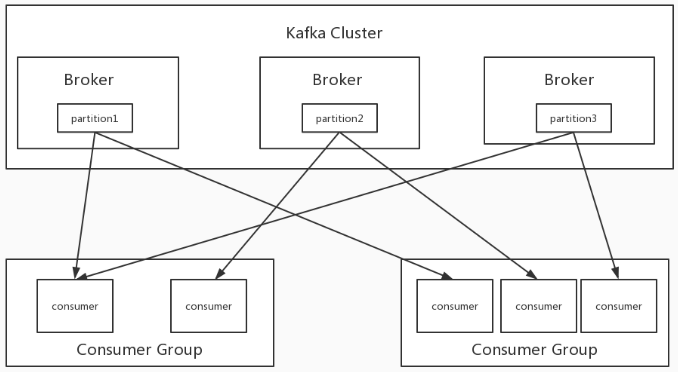
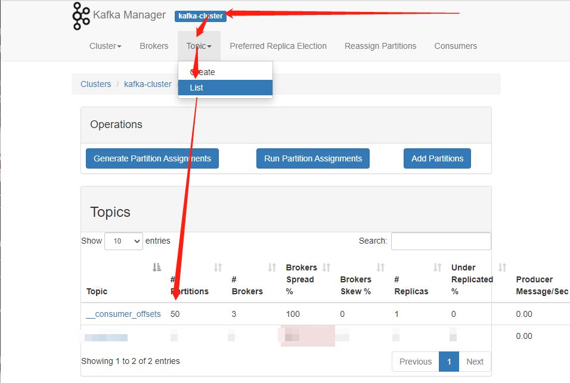

# ELK配置

## 一、收集logstash配置

### 1、logstash收集端配置

```bash
input{
  beats{
    port => 55044
  }
}

output{
  kafka {
    #输出到卡夫卡
    bootstrap_servers => "172.16.0.45:9092,172.16.0.46:9092,172.16.0.47:9092"
    #主题名称
    topic_id => ["mrobot-log"]
    codec => json
  }
}


#验证
/usr/share/logstash/bin/logstash -f /etc/logstash/conf.d/collect.conf -t
systemctl restart logstash
systemctl enable logstash
```

## 二、配置filebeat

### 1.编写配置

```yaml
filebeat.inputs:
#auth-server
  #debug
  - type: log
    #开启采集
    enabled: true
    #标签
    tags: ["auth-server-debug"]
    #日志路径
    paths:
      - /home/mrobot/auth-server/logs/log_debug.log
    #添加字段
    fields:
      host_ip: 172.16.1.13
    #新建字段放在顶级
    fields_under_root: true
    exclude_lines: ["^$"]

  #error
  - type: log
    enabled: true
    tags: ["auth-server-error"]
    paths:
      - /home/mrobot/auth-server/logs/log_error.log
    fields:
      host_ip: 172.16.1.13
    fields_under_root: true
    #多行日志合并采集
    multiline.pattern: '^[[:space:]]'
    multiline.negate: false
    multiline.match: after
    exclude_lines: ["^$"]

  #info
  - type: log
    enabled: true
    tags: ["auth-server-info"]
    paths:
    - /home/mrobot/auth-server/logs/log_info.log
    fields:
      host_ip: 172.16.1.13
    fields_under_root: true
    exclude_lines: ["^$"]

  #warn
  - type: log
    enabled: true
    tags: ["auth-server-warn"]
    paths:
      - /home/mrobot/auth-server/logs/log_warn.log
    fields:
      host_ip: 172.16.1.13
    fields_under_root: true
    exclude_lines: ["^$"]


#elevator-server
 ##api-server
  #common-error
  - type: log
    enabled: true
    tags: ["elevator-api-error"]
    paths:
      - /home/mrobot/elevator-server/api_server_logs/eggjs-mysql-rpc-for-elevatorsys/common-error.log
    fields:
      host_ip: 172.16.1.13
    fields_under_root: true
    exclude_lines: ["^$"]

  #egg-agent
  - type: log
    enabled: true
    tags: [ "elevator-api-agent" ]
    paths:
      - /home/mrobot/elevator-server/api_server_logs/eggjs-mysql-rpc-for-elevatorsys/egg-agent.log
    fields:
      host_ip: 172.16.1.13
    fields_under_root: true
    exclude_lines: [ "^$" ]

  #eggjs-mysql-rpc-for-elevatorsys-web
  - type: log
    enabled: true
    tags: [ "elevator-api-mysqlrpc" ]
    paths:
      - /home/mrobot/elevator-server/api_server_logs/eggjs-mysql-rpc-for-elevatorsys/eggjs-mysql-rpc-for-elevatorsys-web.log
    fields:
      host_ip: 172.16.1.13
    fields_under_root: true
    exclude_lines: [ "^$" ]

  #egg-schedule
  - type: log
    enabled: true
    tags: [ "elevator-api-schedule" ]
    paths:
      - /home/mrobot/elevator-server/api_server_logs/eggjs-mysql-rpc-for-elevatorsys/egg-schedule.log
    fields:
      host_ip: 172.16.1.13
    fields_under_root: true
    exclude_lines: [ "^$" ]

  #web
  - type: log
    enabled: true
    tags: [ "elevator-api-web" ]
    paths:
      - /home/mrobot/elevator-server/api_server_logs/eggjs-mysql-rpc-for-elevatorsys/egg-web.log
    fields:
      host_ip: 172.16.1.13
    fields_under_root: true
    exclude_lines: [ "^$" ]

 ##web-server
  #common-error
  - type: log
    enabled: true
    tags: ["elevator-web-error"]
    paths:
      - /home/mrobot/elevator-server/web_server_logs/eggjs-mysql-rpc-for-elevatorsys/common-error.log
    fields:
      host_ip: 172.16.1.13
    fields_under_root: true
    exclude_lines: ["^$"]

  #egg-agent
  - type: log
    enabled: true
    tags: [ "elevator-web-agent" ]
    paths:
      - /home/mrobot/elevator-server/web_server_logs/eggjs-mysql-rpc-for-elevatorsys/egg-agent.log
    fields:
      host_ip: 172.16.1.13
    fields_under_root: true
    exclude_lines: [ "^$" ]

  #eggjs-mysql-rpc-for-elevatorsys-web
  - type: log
    enabled: true
    tags: [ "elevator-web-mysqlrpc" ]
    paths:
      - /home/mrobot/elevator-server/web_server_logs/eggjs-mysql-rpc-for-elevatorsys/eggjs-mysql-rpc-for-elevatorsys-web.log
    fields:
      host_ip: 172.16.1.13
    fields_under_root: true
    exclude_lines: [ "^$" ]

  #egg-schedule
  - type: log
    enabled: true
    tags: [ "elevator-web-schedule" ]
    paths:
      - /home/mrobot/elevator-server/web_server_logs/eggjs-mysql-rpc-for-elevatorsys/egg-schedule.log
    fields:
      host_ip: 172.16.1.13
    fields_under_root: true
    exclude_lines: [ "^$" ]

  #web
  - type: log
    enabled: true
    tags: [ "elevator-web-web" ]
    paths:
      - /home/mrobot/elevator-server/web_server_logs/eggjs-mysql-rpc-for-elevatorsys/egg-web.log
    fields:
      host_ip: 172.16.1.13
    fields_under_root: true
    exclude_lines: [ "^$" ]

#goor-server
  #debug
  - type: log
    enabled: true
    tags: ["goor-server-debug"]
    paths:
      - /home/mrobot/goor-server/logs/log_debug.log
    fields:
      host_ip: 172.16.1.13
    fields_under_root: true
    exclude_lines: ["^$"]

  #error
  - type: log
    enabled: true
    tags: ["goor-server-error"]
    paths:
      - /home/mrobot/goor-server/logs/log_error.log
    fields:
      host_ip: 172.16.1.13
    fields_under_root: true
    #多行日志合并采集
    multiline.pattern: '^[[:space:]]'
    multiline.negate: false
    multiline.match: after
    exclude_lines: ["^$"]

  #info
  - type: log
    enabled: true
    tags: ["goor-server-info"]
    paths:
    - /home/mrobot/goor-server/logs/log_info.log
    fields:
      host_ip: 172.16.1.13
    fields_under_root: true
    exclude_lines: ["^$"]

  #warn
  - type: log
    enabled: true
    tags: ["goor-server-warn"]
    paths:
      - /home/mrobot/goor-server/logs/log_warn.log
    fields:
      host_ip: 172.16.1.13
    fields_under_root: true
    exclude_lines: ["^$"]

#logistics-platform
  #debug
  - type: log
    enabled: true
    tags: ["logistics-platform-debug"]
    paths:
      - /home/mrobot/logistics-platform/logs/log_debug.log
    fields:
      host_ip: 172.16.1.13
    fields_under_root: true
    exclude_lines: ["^$"]

  #error
  - type: log
    enabled: true
    tags: ["logistics-platform-error"]
    paths:
      - /home/mrobot/logistics-platform/logs/log_error.log
    fields:
      host_ip: 172.16.1.13
    fields_under_root: true
    #多行日志合并采集
    multiline.pattern: '^[[:space:]]'
    multiline.negate: false
    multiline.match: after
    exclude_lines: ["^$"]

  #info
  - type: log
    enabled: true
    tags: ["logistics-platform-info"]
    paths:
    - /home/mrobot/logistics-platform/logs/log_info.log
    fields:
      host_ip: 172.16.1.13
    fields_under_root: true
    exclude_lines: ["^$"]

  #warn
  - type: log
    enabled: true
    tags: ["logistics-platform-warn"]
    paths:
      - /home/mrobot/logistics-platform/logs/log_warn.log
    fields:
      host_ip: 172.16.1.13
    fields_under_root: true
    exclude_lines: ["^$"]

#material-platform
  #debug
  - type: log
    enabled: true
    tags: ["material-platform-debug"]
    paths:
      - /home/mrobot/material-platform/logs/log_debug.log
    fields:
      host_ip: 172.16.1.13
    fields_under_root: true
    exclude_lines: ["^$"]

  #error
  - type: log
    enabled: true
    tags: ["material-platform-error"]
    paths:
      - /home/mrobot/material-platform/logs/log_error.log
    fields:
      host_ip: 172.16.1.13
    fields_under_root: true
    #多行日志合并采集
    multiline.pattern: '^[[:space:]]'
    multiline.negate: false
    multiline.match: after
    exclude_lines: ["^$"]

  #info
  - type: log
    enabled: true
    tags: ["material-platform-info"]
    paths:
    - /home/mrobot/material-platform/logs/log_info.log
    fields:
      host_ip: 172.16.1.13
    fields_under_root: true
    exclude_lines: ["^$"]

  #warn
  - type: log
    enabled: true
    tags: ["material-platform-warn"]
    paths:
      - /home/mrobot/material-platform/logs/log_warn.log
    fields:
      host_ip: 172.16.1.13
    fields_under_root: true
    exclude_lines: ["^$"]

#nginx
  #access
  - type: log
    enabled: true
    tags: [ "nginx-access" ]
    paths:
      - /home/mrobot/nginx-proxy/log/nginxout/access.log
    fields:
      host_ip: 172.16.1.13
    fields_under_root: true
    exclude_lines: [ "^$" ]

  #error
  - type: log
    enabled: true
    tags: [ "nginx-error" ]
    paths:
      - /home/mrobot/nginx-proxy/log/nginxout/error.log
    fields:
      host_ip: 172.16.1.13
    fields_under_root: true
    exclude_lines: [ "^$" ]

#notification-server
 ##api-server
  #common-error
  - type: log
    enabled: true
    tags: ["notification-api-error"]
    paths:
      - /home/mrobot/notification-server/api_server_logs/eggjs-mysql-rpc-for-xiaowunetsys/common-error.log
    fields:
      host_ip: 172.16.1.13
    fields_under_root: true
    exclude_lines: ["^$"]

  #egg-agent
  - type: log
    enabled: true
    tags: [ "notification-api-agent" ]
    paths:
      - /home/mrobot/notification-server/api_server_logs/eggjs-mysql-rpc-for-xiaowunetsys/egg-agent.log
    fields:
      host_ip: 172.16.1.13
    fields_under_root: true
    exclude_lines: [ "^$" ]

  #eggjs-mysql-rpc-for-elevatorsys-web
  - type: log
    enabled: true
    tags: [ "notification-api-mysqlrpc" ]
    paths:
      - /home/mrobot/notification-server/api_server_logs/eggjs-mysql-rpc-for-xiaowunetsys/eggjs-mysql-rpc-for-xiaowunetsys-web.log
    fields:
      host_ip: 172.16.1.13
    fields_under_root: true
    exclude_lines: [ "^$" ]

  #egg-schedule
  - type: log
    enabled: true
    tags: [ "notification-api-schedule" ]
    paths:
      - /home/mrobot/notification-server/api_server_logs/eggjs-mysql-rpc-for-xiaowunetsys/egg-schedule.log
    fields:
      host_ip: 172.16.1.13
    fields_under_root: true
    exclude_lines: [ "^$" ]

  #web
  - type: log
    enabled: true
    tags: [ "notification-api-web" ]
    paths:
      - /home/mrobot/notification-server/api_server_logs/eggjs-mysql-rpc-for-xiaowunetsys/egg-web.log
    fields:
      host_ip: 172.16.1.13
    fields_under_root: true
    exclude_lines: [ "^$" ]

 ##web-server
  #common-error
  - type: log
    enabled: true
    tags: ["notification-web-error"]
    paths:
      - /home/mrobot/notification-server/web_server_logs/eggjs-mysql-rpc-for-xiaowunetsys/common-error.log
    fields:
      host_ip: 172.16.1.13
    fields_under_root: true
    exclude_lines: ["^$"]

  #egg-agent
  - type: log
    enabled: true
    tags: [ "notification-web-agent" ]
    paths:
      - /home/mrobot/notification-server/web_server_logs/eggjs-mysql-rpc-for-xiaowunetsys/egg-agent.log
    fields:
      host_ip: 172.16.1.13
    fields_under_root: true
    exclude_lines: [ "^$" ]

  #eggjs-mysql-rpc-for-elevatorsys-web
  - type: log
    enabled: true
    tags: [ "notification-web-mysqlrpc" ]
    paths:
      - /home/mrobot/notification-server/web_server_logs/eggjs-mysql-rpc-for-elevatorsys/eggjs-mysql-rpc-for-xiaowunetsys-web.log
    fields:
      host_ip: 172.16.1.13
    fields_under_root: true
    exclude_lines: [ "^$" ]

  #egg-schedule
  - type: log
    enabled: true
    tags: [ "notification-web-schedule" ]
    paths:
      - /home/mrobot/notification-server/web_server_logs/eggjs-mysql-rpc-for-xiaowunetsys/egg-schedule.log
    fields:
      host_ip: 172.16.1.13
    fields_under_root: true
    exclude_lines: [ "^$" ]

  #web
  - type: log
    enabled: true
    tags: [ "notification-web-web" ]
    paths:
      - /home/mrobot/notification-server/web_server_logs/eggjs-mysql-rpc-for-xiaowunetsys/egg-web.log
    fields:
      host_ip: 172.16.1.13
    fields_under_root: true
    exclude_lines: [ "^$" ]

#seata-server
  #all
  - type: log
    enabled: true
    tags: [ "seata-server-all" ]
    paths:
      - /home/mrobot/seata-server/logs/seata-server.8091.all.log
    fields:
      host_ip: 172.16.1.13
    fields_under_root: true
    exclude_lines: [ "^$" ]

  #error
  - type: log
    enabled: true
    tags: [ "seata-server-error" ]
    paths:
      - /home/mrobot/seata-server/logs/seata-server.8091.error.log
    fields:
      host_ip: 172.16.1.13
    fields_under_root: true
    exclude_lines: [ "^$" ]

  #warn
  - type: log
    enabled: true
    tags: [ "seata-server-warn" ]
    paths:
      - /home/mrobot/seata-server/logs/seata-server.8091.warn.log
    fields:
      host_ip: 172.16.1.13
    fields_under_root: true
    exclude_lines: [ "^$" ]

#tracer-server
  #debug
  - type: log
    enabled: true
    tags: ["tracer-server-debug"]
    paths:
      - /home/mrobot/tracer-server/logs/log_debug.log
    fields:
      host_ip: 172.16.1.13
    fields_under_root: true
    exclude_lines: ["^$"]

  #error
  - type: log
    enabled: true
    tags: ["tracer-server-error"]
    paths:
      - /home/mrobot/tracer-server/logs/log_error.log
    fields:
      host_ip: 172.16.1.13
    fields_under_root: true
    multiline.pattern: '^[[:space:]]'
    multiline.negate: false
    multiline.match: after
    exclude_lines: ["^$"]

  #info
  - type: log
    enabled: true
    tags: ["tracer-server-info"]
    paths:
    - /home/mrobot/tracer-server/logs/log_info.log
    fields:
      host_ip: 172.16.1.13
    fields_under_root: true
    exclude_lines: ["^$"]

  #warn
  - type: log
    enabled: true
    tags: ["tracer-server-warn"]
    paths:
      - /home/mrobot/tracer-server/logs/log_warn.log
    fields:
      host_ip: 172.16.1.13
    fields_under_root: true
    exclude_lines: ["^$"]

output.logstash:
  hosts: ["172.16.0.48:55044"]
  enabled: true
  #工作线程数
  worker: 4
  #压缩机别
  comperssion_level: 3
processors:
  #删除无用数据
  - drop_fields:
      fields: ["input", "ecs", "agent", "host", "log"]
```


## 三、过滤logstash（三台配置一样）

### 1、配置文件内容

```bash
root@es-01:~# cat  /etc/logstash/conf.d/handle.conf

input {
  kafka {
    #指定卡夫卡服务器
    bootstrap_servers => "172.16.0.45:9092,172.16.0.46:9092,172.16.0.47:9092"
    #logstash集群消费kafka集群的身份标识，必须集群相同且唯一
    group_id => "logstash-handle"
    #要消费的kafka主题，logstash集群相同
    topics => ["mrobot-log"]
    #消费线程数，集群中所有logstash相加最好等于 topic 分区数
    consumer_threads => 17
    #禁止插入元数据字段
    decorate_events => false
    #kafka消费策略，已提交的offset时，从提交的offset开始消费；无提交的offset时，从头开始消费
    auto_offset_reset => "earliest"
    #定义type方便后面选择过滤及输出
    type => "mrobot-log"
    #保持json格式
    codec => json
  }
}

filter {
  #处理日期时区问题
  ruby {
    code => "event.set('timestamp', event.get('@timestamp').time.localtime + 8*60*60)"
  }
  #移除多余tag
  mutate {
    remove_tag => ["beats_input_codec_plain_applied"]
  }
}


output {
  if [type] == "mrobot-log" {
    elasticsearch {
      hosts => ["172.16.0.45:9200","172.16.0.46:9200","172.16.0.47:9200"]
      #禁止使用模板 
      manage_template => false
      index => "%{host_ip}-%{tags}-%{+YYYY.MM.dd}"
    }
  }
}


#验证
/usr/share/logstash/bin/logstash -f /etc/logstash/conf.d/handle.conf -t
systemctl restart logstash
systemctl enable logstash
```

### 2、特殊input.kafka参数解释

#### 1.group_id

```bash
在以上整个架构中，核心的几个组件Kafka、Elasticsearch、Hadoop天生支持高可用，唯独Logstash是不支持的，用单个Logstash去处理日志，不仅存在处理瓶颈更重要的是在整个系统中存在单点的问题，

如果Logstash宕机则将会导致整个集群的不可用，后果可想而知。

如何解决Logstash的单点问题呢？我们可以借助Kafka的Consumer Group来实现。
```



```bash
    Consumer Group： 是个逻辑上的概念，为一组consumer的集合，同一个topic的数据会广播给不同的group，同一个group中只有一个consumer能拿到这个数据。也就是说对于同一个topic，每个group都可以拿到同样的所有数据，但是数据进入group后只能被其中的一个consumer消费，基于这一点我们只需要启动多个logstsh，并将这些logstash分配在同一个组里边就可以实现logstash的高可用了。

    logstash消费kafka集群的配置中，其中加入了group_id参数，group_id是一个的字符串，唯一标识一个group，具有相同group_id的consumer构成了一个consumer group，这样启动多个logstash进程，只需要保证group_id一致就能达到logstash高可用的目的，一个logstash挂掉同一Group内的logstash可以继续消费。除了高可用外同一Group内的多个Logstash可以同时消费kafka内topic的数据，从而提高logstash的处理能力。
    但需要注意的是消费kafka数据时，每个consumer最多只能使用一个partition，当一个Group内consumer的数量大于partition的数量时，只有等于partition个数的consumer能同时消费，其他的consumer处于等待状态。例如一个topic下有3个partition，那么在一个有5个consumer的group中只有3个consumer在同时消费topic的数据，而另外两个consumer处于等待状态，所以想要增加logstash的消费性能，可以适当的增加topic的partition数量，但kafka中partition数量过多也会导致kafka集群故障恢复时间过长，消耗更多的文件句柄与客户端内存等问题，也并不是partition配置越多越好，需要在使用中找到一个平衡。
```

#### 2.consumer_threads（并行传输）

```bash
    Logstash的input读取数的时候可以多线程并行读取，logstash-input-kafka插件中对应的配置项是consumer_threads，默认值为1。一般这个默认值不是最佳选择，那这个值该配置多少呢？这个需要对kafka的模型有一定了解：

    kafka的topic是分区的，数据存储在每个分区内；
    kafka的consumer是分组的，任何一个consumer属于某一个组，一个组可以包含多个consumer，同一个组内的consumer不会重复消费的同一份数据。所以，对于kafka的consumer，一般最佳配置是同一个组内consumer个数（或线程数）等于topic的分区数，这样consumer就会均分topic的分区，达到比较好的均衡效果。

举个例子，比如一个topic有n个分区，consumer有m个线程。那最佳场景就是n=m，此时一个线程消费一个分区。如果n小于m，即线程数多于分区数，那多出来的线程就会空闲。

如果n大于m，那就会存在一些线程同时消费多个分区的数据，造成线程间负载不均衡。
```

**查看分区数**


