# ELKBF使用

## 一、本次安装的web界面介绍

### 1、Elasticsearch-head

```dos
    ealsticsearch只是后端提供各种api，那么怎么直观的使用它呢？elasticsearch-head将是一款专门针对于elasticsearch的客户端工具。
```


> http://172.16.0.48:9100/

### 2、Kafka-manager

```bash
    kafka-manager是目前最受欢迎的kafka集群管理工具，最早由雅虎开源，用户可以在Web界面执行一些简单的集群管理操作。具体支持以下内容：

管理多个集群
轻松检查群集状态（主题，消费者，偏移，代理，副本分发，分区分发）
运行首选副本选举
使用选项生成分区分配以选择要使用的代理
运行分区重新分配（基于生成的分配）
使用可选主题配置创建主题（0.8.1.1具有与0.8.2+不同的配置）
删除主题（仅支持0.8.2+并记住在代理配​​置中设置delete.topic.enable = true）
主题列表现在指示标记为删除的主题（仅支持0.8.2+）
批量生成多个主题的分区分配，并可选择要使用的代理
批量运行重新分配多个主题的分区
将分区添加到现有主题
更新现有主题的配置
```

>http://172.16.0.48:9000/

### 3、kibana

```bash
    Kibana是一个开源的分析与可视化平台，设计出来用于和Elasticsearch一起使用的。你可以用kibana搜索、查看存放在Elasticsearch中的数据。Kibana与Elasticsearch的交互方式是各种不同的图表、表格、地图等，直观的展示数据，从而达到高级的数据分析与可视化的目的。
```

## 二、Elasticsearch单独使用

**有以前操作的url，以本次url为主**

### 1、创建test索引

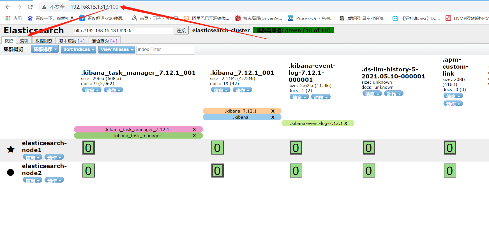

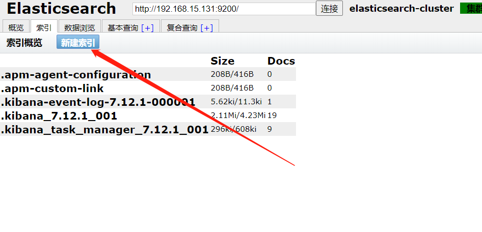

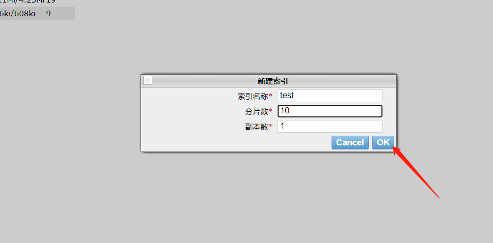


### 2、添加索引类型及内容

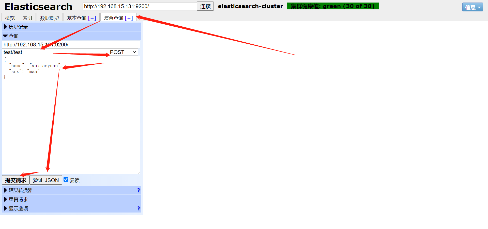

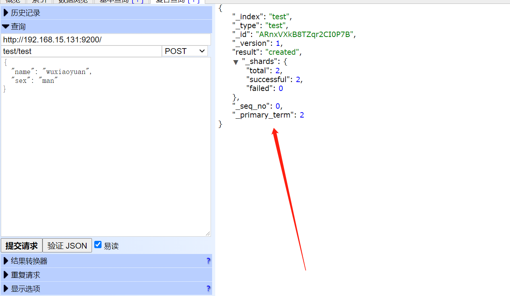


### 3、索引查询

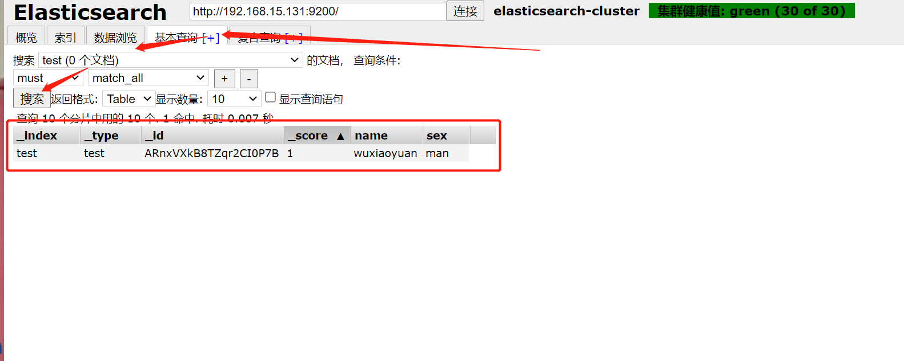


## 三、Elasticsearch监控

>http://172.16.0.45:9200/_cluster/health?pretty=true

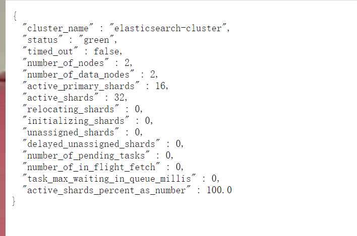

>​		例如对 status 进行分析，如果等于green(绿色)就是运行在正常，等于yellow(黄色)表示副本分片丢失，red(红色)表示主分片丢失。


## 四、Logstach简单使用

### 1、指定输出

>https://www.elastic.co/guide/en/logstash/current/output-plugins.html

#### 1.输出到shell控制台

```bash
[root@es-02 ~]# /usr/share/logstash/bin/logstash -e 'input { stdin{} } output { stdout{ codec => rubydebug }}'
...
待手绾青丝的笔记						#输入
{						  #输出
          "host" => "es-02",
       "message" => "待手绾青丝的笔记",
      "@version" => "1",
    "@timestamp" => 2021-05-10T11:43:10.095Z
}

```


#### 2.输出到指定文件当中

```bash
[root@es-02 ~]# /usr/share/logstash/bin/logstash -e 'input { stdin{} } output { file { path => "/tmp/log-%{+YYYY.MM.dd}-messages.log"}}'
...
xiaowu 					#输入
[INFO ] 2021-05-10 19:46:15.184 [[main]>worker1] file - Opening file {:path=>"/tmp/log-2021.05.10-messages.log"}
[INFO ] 2021-05-10 19:46:29.439 [[main]>worker1] file - Closing file /tmp/log-2021.05.10-messages.log

```

**查看输出**

```bash
[root@es-02 ~]# cat /tmp/log-2021.05.10-messages.log
{"@timestamp":"2021-05-10T11:46:14.698Z","host":"es-02","message":"xiaowu","@version":"1"}
```


#### 3.输出到elasticsearch当中

```bash
[root@es-02 ~]# /usr/share/logstash/bin/logstash -e 'input { stdin{} } output { elasticsearch {hosts => ["172.16.1.131:9200"] index => "mytest-%{+YYYY.MM.dd}" }}'
...
小武						#输入
```

**查看输出**

> 刷新页面

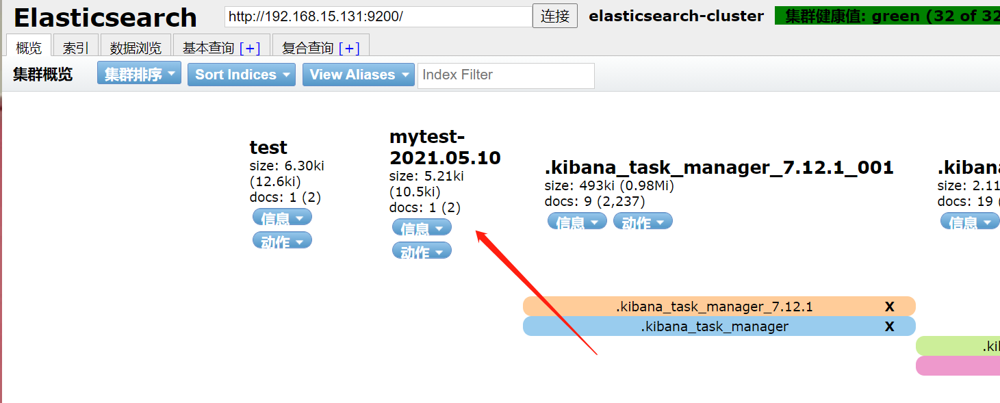

> 索引查询

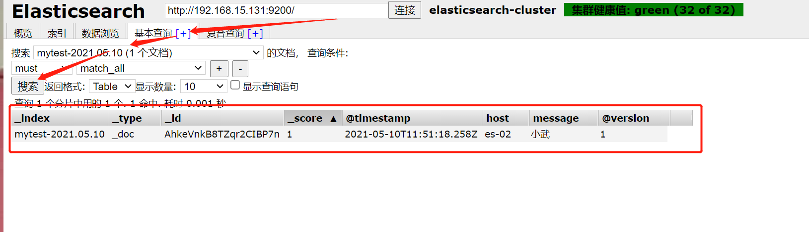

### 2、指定读取源

>https://www.elastic.co/guide/en/logstash/current/input-plugins.html

#### 1.读取某个文件

```bash
[root@es-02 ~]# /usr/share/logstash/bin/logstash -e 'input { file { path => "/var/log/messages" } } output { elasticsearch {hosts => ["172.16.1.131:9200"] index => "system-log-%{+YYYY.MM.dd}" }}'
```


**模拟新日志产生**

```bash
[root@es-02 ~]# tail -f /var/log/messages 

# 新开一个窗口，产生日志：
May 10 20:13:02 es-02 systemd: Started Session 96 of user root.
May 10 20:13:02 es-02 systemd-logind: New session 96 of user root.
```


**查看输出**

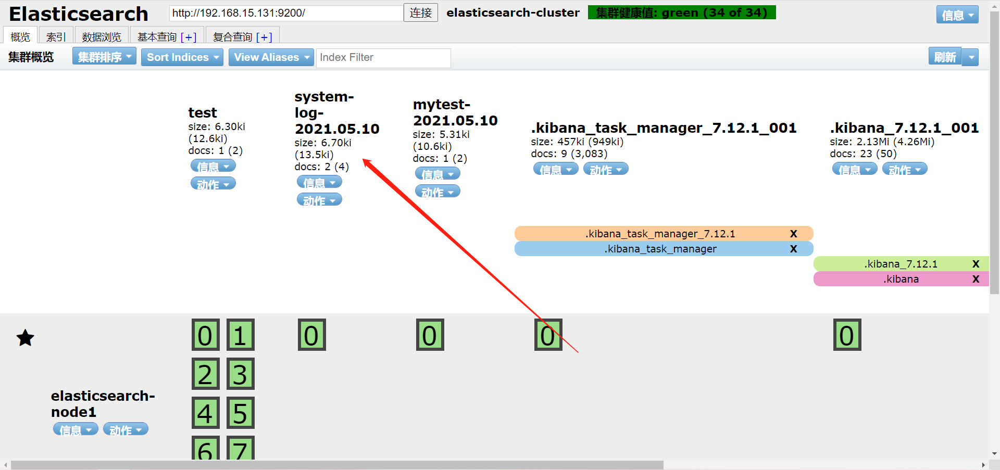

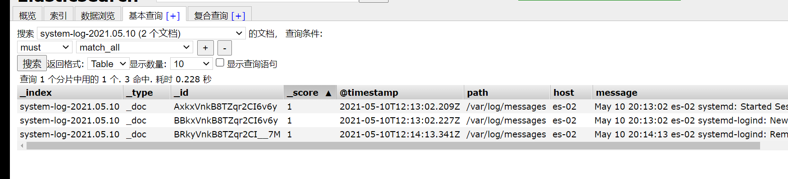

### 3、分类

````bash
path => "/var/log/messages"		 #日志路径
type => "systemlog"				 #事件的唯一类型
start_position => "beginning" 	 #第一次收集日志的位置
stat_interval => "3" 			 #日志收集的间隔时间
````


#### 1.从多个文件中读取文件

```bash
/usr/share/logstash/bin/logstash -e 'input { file{ path => "/var/log/messages" type => "systemlog" start_position => "beginning" stat_interval => "3" } file{ path => "/var/log/cron" type => "systemcron" start_position => "beginning" stat_interval => "3" } } output { elasticsearch {hosts => ["172.16.1.131:9200"] index => "system-stdin-%{+YYYY.MM.dd}" }}'
```


**查看**

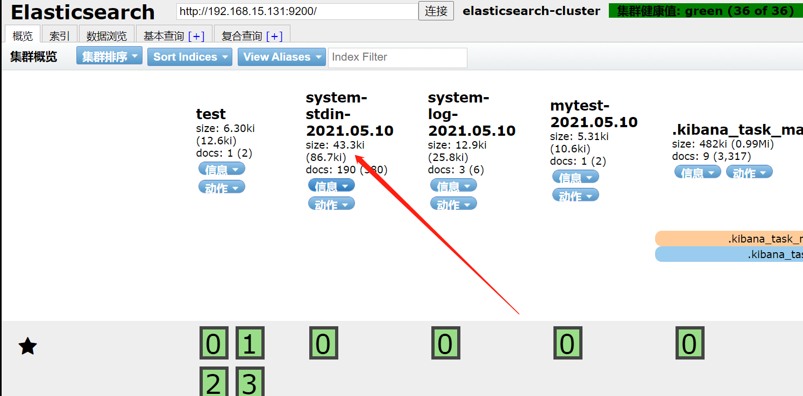

**分类查询**

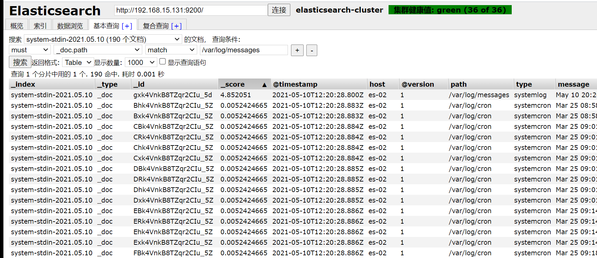

#### 2.分类输出到多个仓库

```bash
[root@es-02 ~]# /usr/share/logstash/bin/logstash -e 'input { file{ path => "/var/log/messages" type => "systemlog" start_position => "beginning" stat_interval => "3" } file{ path => "/var/log/cron" type => "systemcron" start_position => "beginning" stat_interval => "3" } } output { if [type] == "systemlog" { elasticsearch {hosts => ["172.16.1.131:9200"] index => "system-systemlog-%{+YYYY.MM.dd}" }} if [type] == "systemcron" { elasticsearch {hosts => ["172.16.1.131:9200"] index => "system-systemcron-%{+YYYY.MM.dd}" } } }'
```


**模拟日志产生**

```bash
1.开新窗口模拟messages
2.修改/var/log/cron，模拟cron日志
```


**查看**

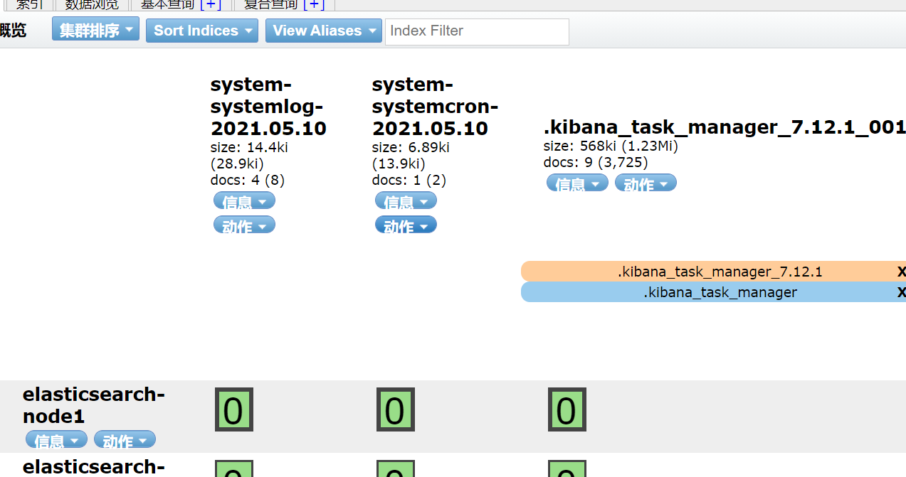


### 4、Logstach配置文件启动

#### 1.解释

```bash
    path => "/var/log/messages" #日志路径
    type => "systemlog"		    #事件的唯一类型
    start_position => "beginning" #第一次收集日志的位置 
    stat_interval => "3"        #日志收集的间隔时间 
```


#### 2.配置文件

```bash
[root@es-02 ~]# vim /etc/logstash/conf.d/system-log.conf
input {
  file {
    path => "/var/log/messages"
    type => "systemlog"
    start_position => "beginning"
    stat_interval => "3"
  }
  
  file {
    path => "/var/log/cron"
    type => "cronlog"
    start_position => "beginning"
    stat_interval => "3" 
  } 
}

output {
  if [type] == "systemlog" {
    elasticsearch { hosts => ["192.168.15.131:9200"]
    index => "system-log-%{+YYYY.MM.dd}"
    }
  } 
  
  if [type] == "cronlog" {
    elasticsearch { hosts => ["192.168.15.131:9200"]  
    index => "cron-log-%{+YYYY.MM.dd}" 
    }
  } 
}
```


#### 3.指定配置文件启动

```bash
-n
logstash实例的名称，如果不设置默认为当前的主机名(比如我的主机名为sqczm)。

-f
配置文件，我们可以指定一个特定的文件，也可以指定一个特定的目录，如果指定的是特定的目录，则logstash会读取该目录下的所有文本文件，将其在内存中拼接成完整的大配置文件，再去执行。

-e
给定的可直接执行的配置内容，也就是说我们可以不指定-f参数，直接把配置文件中的内容作为字符串放到-e参数后面。

-w
指定工作线程的个数

-p
logstash用来加载插件的目录

-l
日志输出文件，如果不设置，logstash将会把日志发送至标准的output

-t
检查配置的语法是否正确并退出

-r
监视配置文件的变化，并且自动重新加载修改后的配置文件

–config.reload.interval RELOAD_INTERVAL
为了检查配置文件是否改变，而去拉取配置文件的频率

–http.host HTTP_HOST
Web API绑定的主机，默认为“127.0.0.1”

–http.port HTTP_PORT
Web API绑定的端口，默认为9600-9700之间

–log.format FORMAT
logstash写它自身日志的时候使用json还是文本格式，默认是“plain”

–path.settings SETTINGS_DIR
设置包含logstash.yml配置文件的目录，比如log4j日志配置。也可以设置LS_SETTINGS_DIR环境变量
```


**检查语法**

```bash
[root@es-02 ~]# /usr/share/logstash/bin/logstash -f /etc/logstash/conf.d/system-log.conf -t
```

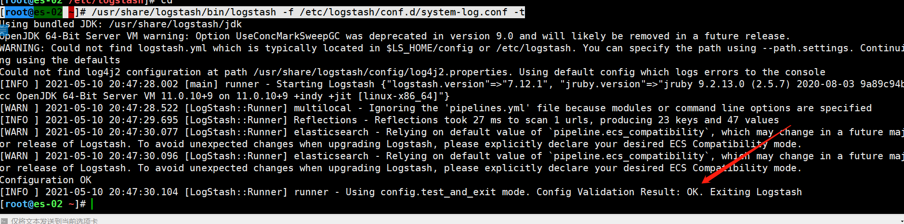


**启动**

```bash
[root@es-02 ~]# /usr/share/logstash/bin/logstash -f /etc/logstash/conf.d/system-log.conf
```


#### 4.模拟日志产生

```bash
1.开新窗口模拟messages
2.修改/var/log/cron，模拟cron日志
```


#### 5.查看

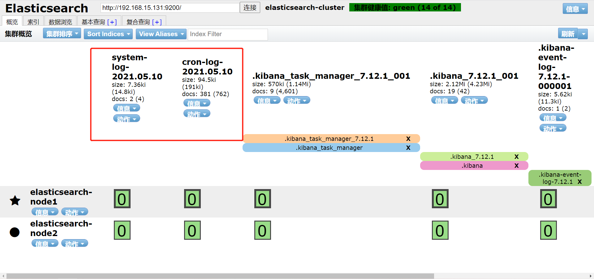

### 5、Logstach过滤filter常用功能

>https://www.elastic.co/guide/en/logstash/7.17/filter-plugins.html

#### 1.grok正则捕获

```bash
grok是一个十分强大的logstash filter插件，他可以通过正则解析任意文本，将非结构化日志数据弄成结构化和方便查询的结构。他是目前logstash 中解析非结构化日志数据最好的方式
```

##### 1)语法规则

```bash
%{语法：语义}
```

“语法”指的是匹配的模式。例如使用NUMBER模式可以匹配出数字，IP模式则会匹配出127.0.0.1这样的IP地址。

##### 2)匹配信息路径

/usr/share/logstash/vendor/bundle/jruby/2.5.0/gems/logstash-patterns-core-4.3.2/patterns/legacy/grok-patterns

/usr/share/logstash/vendor/bundle/jruby/2.5.0/gems/logstash-patterns-core-4.3.2/patterns/ecs-v1/grok-patterns

##### 3)使用

###### ①过滤IP

**实验数据**

```bash
172.16.0.10 [23/Mar/2022:14:37:19 +0800] "GET /HTTP/1.1" 403 5039
```

**配置**

```bash
vim /etc/logstash/conf.d/test.conf
input {
  stdin {
  }
}

filter{
  grok{
    #将匹配message给定模式的字段中的现有值，如果找到匹配项，则将该字段添加到ip的事件中
    match => {"message" => "%{IPV4:ip}"}
  }
}

output {
  stdout {
  }
}
```

**结果**

```bash
/usr/share/logstash/bin/logstash -f /etc/logstash/conf.d/test.conf

172.16.0.10 [23/Mar/2022:14:37:19 +0800] "GET /HTTP/1.1" 403 5039   #手动输入此行信息
{
      "@version" => "1",
    "@timestamp" => 2022-03-23T06:47:53.686Z,
       "message" => "172.16.0.10 [23/Mar/2022:14:37:19 +0800] \"GET /HTTP/1.1\" 403 5039",
          "host" => "lka-04",
            "ip" => "172.16.0.10"
}
```

###### ②过滤时间戳

**配置**

input和output就不写了

```bash
filter{
  grok{
     match => {"message" => "%{IPV4:ip}\ \[%{HTTPDATE:timestamp}\]"}
   }
}
```


**结果**

```bash
/usr/share/logstash/bin/logstash -f /etc/logstash/conf.d/test.conf

172.16.0.10 [23/Mar/2022:14:37:19 +0800] "GET /HTTP/1.1" 403 5039
{
    "@timestamp" => 2022-03-23T06:50:38.657Z,
          "host" => "lka-04",
     "timestamp" => "23/Mar/2022:14:37:19 +0800",
            "ip" => "172.16.0.10",
       "message" => "172.16.0.10 [23/Mar/2022:14:37:19 +0800] \"GET /HTTP/1.1\" 403 5039",
      "@version" => "1"
}

```

###### ③支持正则

在配置文件中grok其实是使用正则表达式来进行过滤的。我们做个小实验，比如我现在在例子中的数据ip后面添加两个“-”

需要注意的是：正则中，匹配空格和中括号要加上转义符。

**实验数据**

```bash
172.16.0.10 - - [23/Mar/2022:14:37:19 +0800] "GET /HTTP/1.1" 403 5039
```

**配置**

```bash
filter{
  grok{
    #将匹配message给定模式的字段中的现有值，如果找到匹配项，则将该字段添加到对应的事件中
    match => {"message" => "%{IPV4:ip}\ -\ -\ \[%{HTTPDATE:timestamp}\]" }
  }
}

```

**结果**

```bash
172.16.0.10 - - [23/Mar/2022:14:37:19 +0800] "GET /HTTP/1.1" 403 5039
{
            "ip" => "172.16.0.10",
       "message" => "172.16.0.10 - - [23/Mar/2022:14:37:19 +0800] \"GET /HTTP/1.1\" 403 5039",
          "host" => "lka-04",
     "timestamp" => "23/Mar/2022:14:37:19 +0800",
      "@version" => "1",
    "@timestamp" => 2022-03-23T06:53:59.775Z
}
```

###### ④直接匹配时间

**配置**

```bash
filter{
  grok{
    #将匹配message给定模式的字段中的现有值，如果找到匹配项，则将该字段添加到对应的事件中
    match => {"message" => "\[%{HTTPDATE:timestamp}\]" }
  }
}
```

**结果**

```bash 
172.16.0.10 - - [23/Mar/2022:14:37:19 +0800] "GET /HTTP/1.1" 403 5039
{
      "@version" => "1",
       "message" => "172.16.0.10 - - [23/Mar/2022:14:37:19 +0800] \"GET /HTTP/1.1\" 403 5039",
          "host" => "lka-04",
    "@timestamp" => 2022-03-23T07:00:21.703Z,
     "timestamp" => "23/Mar/2022:14:37:19 +0800"
}
```

###### ⑤过滤报文信息

**配置**

```bash
filter{
  grok{
    #将匹配message给定模式的字段中的现有值，如果找到匹配项，则将该字段添加到对应的事件中
    match => {"message" => "%{QS:referrer}" }
  }
}
```

**结果**

```bash
172.16.0.10 - - [23/Mar/2022:14:37:19 +0800] "GET /HTTP/1.1" 403 5039
{
      "referrer" => "\"GET /HTTP/1.1\"",
       "message" => "172.16.0.10 - - [23/Mar/2022:14:37:19 +0800] \"GET /HTTP/1.1\" 403 5039",
    "@timestamp" => 2022-03-23T07:12:05.143Z,
      "@version" => "1",
          "host" => "lka-04"
```

###### ⑥举一反三:输出/var/log/message字段的时间信息

**实验数据**

```bash
Jan 20 11:33:03 ip-172-31-22-29 systemd: Removed slice User Slice of root.
```

**配置**

```bash
filter{
  grok{
    #将匹配message给定模式的字段中的现有值，如果找到匹配项，则将该字段添加到对应的事件中
    match => {"message" => "%{SYSLOGTIMESTAMP:time}"}
    #删除字段
    remove_field => ["message"]
  }
}

```

**结果**

```bash
Jan 20 11:33:03 ip-172-31-22-29 systemd: Removed slice User Slice of root.
{
          "time" => "Jan 20 11:33:03",
      "@version" => "1",
    "@timestamp" => 2022-03-23T08:33:49.917Z,
          "host" => "lka-04"
}
```

#### 2.remove_field

```bash
    remove_field的用法也是很常见的，他的作用就是去重，在前面的例子中你也看到了，不管是我们要输出什么样子的信息，都是有两份数据，即message里面是一份，HTTPDATE或者IP里面也有一份，这样子就造成了重复，过滤的目的就是筛选出有用的信息，重复的不要，因此我们看看如何去重呢？
```

**配置**

```bash
filter{
  grok{
    match => {"message" => "%{IP:ip_address}"}
    remove_field => ["message"]
  }
}
```

**结果**

```bash
172.16.0.10 - - [23/Mar/2022:14:37:19 +0800] "GET /HTTP/1.1" 403 5039
{
          "host" => "lka-04",
    "ip_address" => "172.16.0.10",
      "@version" => "1",
    "@timestamp" => 2022-03-23T09:54:23.534Z
}
```

​    这时候你会发现没有之前显示的那个message的那一行信息了。因为我们使用remove_field把他移除了，这样的好处显而易见，我们只需要日志中特定的信息而已。


#### 3.date插件

##### 1)介绍

```bash
    日期过滤器用于从字段中解析日期，然后使用该日期或时间戳作为事件的logstash时间戳。
    date插件对于排序事件和回填旧数据尤其重要，它可以用来转换日志记录中的时间字段，变成Logstash：：timestamp对象，然后转存到@timestamp字段里面。
```

##### 2）为什么要使用这个插件？

```bash
　　1、一方面由于Logstash会给收集到的每条日志自动打上时间戳（即@timestamp），但是这个时间戳记录的是input接收数据的时间，而不是日志生成的时间（因为日志生成时间与input接收的时间肯定不同），这样就可能导致搜索数据时产生混乱。
　　2、另一方面，在rubydebug编码格式的输出中，@timestamp字段虽然已经获取了timestamp字段的时间，但是仍然比北京时间晚了8个小时，这是因为在Elasticsearch内部，对时间类型字段都是统一采用UTC时间，而日志统一采用UTC时间存储，是国际安全、运维界的一个共识。其实这并不影响什么，因为ELK已经给出了解决方案，那就是在Kibana平台上，程序会自动读取浏览器的当前时区，然后在web页面自动将UTC时间转换为当前时区的时间。
```

##### 3）时间匹配规则表

```bash
    如果你要解析你的时间，你要使用字符来代替，用于解析日期和时间文本的语法使用字母来指示时间（年、月、日、时、分等）的类型。以及重复的字母来表示该值的形式。在上面看到的"dd/MMM/yyy:HH:mm:ss Z"，他就是使用这种形式，我们列出字符的含义：
```

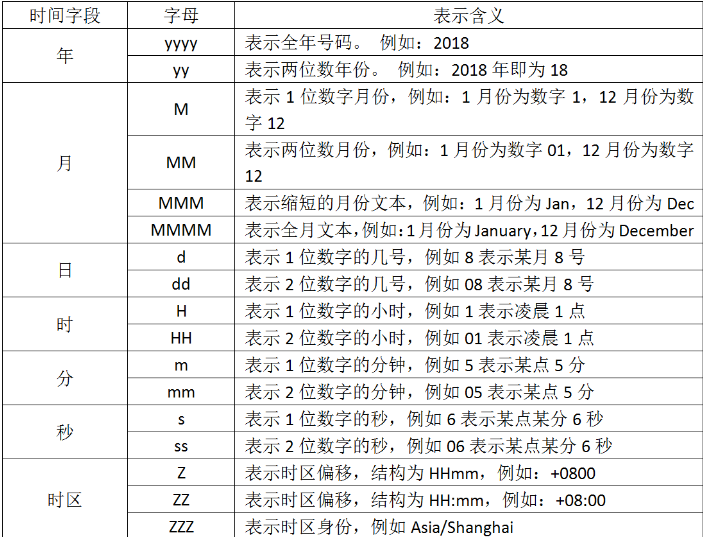

```bash
[23/Mar/2022:14:37:19 +0800]

    现在我们想转换时间，那就要写出"dd/MMM/yyy:HH:mm:ss Z"，你发现中间有三个M，你要是写出两个就不行了，因为我们查表发现两个大写的M表示两位数字的月份，可是我们要解析的文本中，月份则是使用简写的英文，所以只能去找三个M。还有最后为什么要加上个大写字母Z，因为要解析的文本中含有“+0800”时区偏移，因此我们要加上去，否则filter就不能正确解析文本数据，从而转换时间戳失败
```

##### 4)自定义时间格式

###### ①数据源

例如 tomcat 定义的格式 ***%{yyyy-MM-dd HH:mm:ss Z}***,按照这样的配置，输出的日志原文的时间是

```bash
2019-12-11 10:11:12 +0800
```

###### ②配置

```bash
filter{
  date{
    match => {"message", "yyyy-MMM-dd HH:mm:ss Z"}
    target => "@timestamp"
  }
}
```

###### ③结果

```bash
2019-12-11 10:11:12 +0800
{
      "@version" => "1",
       "message" => "2019-12-11 10:11:12 +0800",
          "host" => "lka-04",
    "@timestamp" => 2019-12-11T02:11:12.000Z
}
```

##### 5)nginx日志待中括号的格式

###### ①数据源

```bash
[07/Feb/2018:16:24:19 +0800]
```

**带有一对中括号，那么在 grok 中需要转义中括号**

```bash
\[%{HTTPDATE:timestamp}\]
```

###### ②配置

```bash
filter{
  date{
    match => ["message", "dd/MM/yyyy:HH:mm:ss Z"]
    target => "@timestamp"
  }
}
```

###### ③结果

```bash
23/Mar/2022:14:37:19 +0800
{
       "message" => "23/Mar/2022:14:37:19 +0800",
      "@version" => "1",
          "host" => "lka-04",
    "@timestamp" => 2022-03-23T06:37:19.000Z
}
```

##### 6）ISO8601形式1

###### ①数据源

```bash
2019-12-11 13:08:45.254
```

**grok获取方式*

```bash
grok {
　　match => { "message" => "%{TIMESTAMP_ISO8601:log_create_time}" }
}
```

###### ②配置方式一

```bash
filter{
  date{
    match => ["message", "MMM d HH:mm:ss", "MMM DD HH:mm：ss", "ISO8601"]
    target => "@timestamp"
  }
}

```

###### ③结果

```bash
2019-12-11 13:08:45.254
{
      "@version" => "1",
       "message" => "2019-12-11 13:08:45.254",
    "@timestamp" => 2019-12-11T05:08:45.254Z,
          "host" => "lka-04"
}
```

###### ④配置方式二

```bash
filter{
  date{
    match => ["message", "yyyy-MM-dd HH:mm:ss.SSS"]
    target => "@timestamp"
  }
}

```

###### ⑤结果

```bash
2019-12-11 13:08:45.254
{
          "host" => "lka-04",
       "message" => "2019-12-11 13:08:45.254",
      "@version" => "1",
    "@timestamp" => 2019-12-11T05:08:45.254Z
}
```

##### 7)ISO8601 形式2

###### ①数据源

**时间 date 中带 T，日志原文如下：**

```
2019-12-11T17:06:33 +08:00
```

 **此时， grok 可以这样写：**

```bash
grok {
  match => { "message" => "%{TIMESTAMP_ISO8601}：log_create_time" }
}
```

###### ②配置

**而 date 插件 转存到 @timestamp 中可以这样匹配：**

```
date {
　　match => [ "log_create_time", "yyyy-MM-dd'T'HH:mm:ss ZZ" ]
　　target => "@timestamp"
}
```

**也可以用更简洁的写法：**

```
date {
　　match => [ "log_create_time", "ISO8601" ]
　　target => "@timestamp"
}
```

#####  8)Unix时间戳形式

###### ①数据源

**典型的如 MySQL 的慢查询日志，日志原文：**

```bash
# Time: 2019-12-11T01:50:21.123793Z //舍弃这个时间
# User@Host: root[root] @ elk-master01 Id: 4
# Quert Time: 4.650893 Lock time: 0.000000 Rows_sent: 1 Rows_examined: 0
SET timestamp=1554342621; // 需要的是这个
selecet sleep(4.65);
```

 **在 grok 中这样匹配：**

```
%{NUMBER：timestamp_mysql_slowquery}
```

###### ②配置

```
date {
  match => [ "timestamp_mysql_slow_query", "UNIX" ]
  target => "@timestamp"
}
```

####  4.数据修改mutate插件

```bash
    mutate插件是logstash另一个非常重要的插件，它提供了丰富的基础类型数据处理能力，包括重命名、删除、替换、修改日志事件中的字段。
    
我们这里举几个常用的mutate插件：
    字段类型转换功能covert
    正则表达式替换字段功能gsub
    分隔符分隔字符串为数值功能split
    重命名字段功能rename
    删除字段功能remove_field
```

##### 1）字符类型转换convert

###### ①配置

```bash
filter{
  grok{
    match => {"message" => "%{IPV4:ip}"}
    remove_field => ["message"]
  }
  mutate{
    convert => ["ip","string"]
  }
}
```

**另一种写法**

```bash
filter{
  grok{
    match => {"message" => "%{IPV4:ip}"}
    remove_field => ["message"]
  }
  mutate{
    convert => {
      "ip" => "string"
    }
  }
}
```

###### ②结果

**在这里的ip行中，效果可能不太明显，但是确实是已经转化成string模式了。**

```bash
172.16.0.10 - - [23/Mar/2022:14:37:19 +0800] "GET /HTTP/1.1" 403 5039
{
          "host" => "lka-04",
            "ip" => "172.16.0.10",
    "@timestamp" => 2022-03-24T06:42:01.498Z,
      "@version" => "1"
}
```


##### 2）正则表达式替换匹配字段gsub

gsub可以通过正则表达式替换字段中匹配到的值，但是这本身只对字符串字段有效。

###### ①配置

```bash
filter{
  grok{
    match => {
      "message" => "%{QS:referrer}"
    }
  }

  grok{
    match => {
      "message" => "%{QS:referrer1}"
    }
    remove_field => ["message"]
  }

  mutate{
    gsub => ["referrer","/","-"]
  }
}

```

###### ②结果

```bash
172.16.0.10 - - [23/Mar/2022:14:37:19 +0800] "GET /HTTP/1.1" 403 5039
{
      "@version" => "1",
    "@timestamp" => 2022-03-24T07:01:40.119Z,
      "referrer" => "\"GET -HTTP-1.1\"",
          "host" => "lka-04",
     "referrer1" => "\"GET /HTTP/1.1\""
}
```


##### 3）添加字段add_field

**使用 add_field 参数有两种需求：**

###### ①直接加入到 event 的 hash 顶级对象中

**配置**

```bash
filter{
  mutate{
    add_field => ["my-field","123"]
  }
}
```

**结果**

```bash
172.16.0.10 - - [23/Mar/2022:14:37:19 +0800] "GET /HTTP/1.1" 403 5039
{
    "@timestamp" => 2022-03-24T07:13:54.145Z,
       "message" => "172.16.0.10 - - [23/Mar/2022:14:37:19 +0800] \"GET /HTTP/1.1\" 403 5039",
      "@version" => "1",
          "host" => "lka-04",
      "my-field" => "123"
}
```


###### ②加入到 event 的某个字段中

**配置**

```bash
filter{
  mutate{
    add_field => {
      "[my-field][123]" => "456"
      "[my-field][abc]" => "def"
    }
  }
}
```

**结果**

```bash
172.16.0.10 - - [23/Mar/2022:14:37:19 +0800] "GET /HTTP/1.1" 403 5039
{
    "@timestamp" => 2022-03-24T07:19:08.607Z,
       "message" => "172.16.0.10 - - [23/Mar/2022:14:37:19 +0800] \"GET /HTTP/1.1\" 403 5039",
          "host" => "lka-04",
      "my-field" => {
        "abc" => "def",
        "123" => "456"
    },
      "@version" => "1"
}
```


##### 4）分隔符分隔字符串为数组split

split可以通过指定的分隔符分隔字段中的字符串为数组

###### ①配置

```bash
filter{
  mutate{
    #指定分隔符
    split => ["message","-"]
    add_field => {
      "my-fiele" => "%{[message][0]}"
    }
  }
}
```

###### ②结果

```bash
a-b-c-d-e-f-g			#输入这个结果
{
    "@timestamp" => 2022-03-24T07:23:40.366Z,
          "host" => "lka-04",
      "my-fiele" => "a",
       "message" => [
        [0] "a",
        [1] "b",
        [2] "c",
        [3] "d",
        [4] "e",
        [5] "f",
        [6] "g"
    ],
      "@version" => "1"
}

```

##### 5）重命名字段rename

**rename可以实现重命名某个字段的功能。**

###### ①配置

```bash
filter{
  grok{
    match => {"message" => "%{IPV4:ip}"}
    remove_field => ["message"]
  }
  mutate{
    rename => ["ip","IP"]
  }
}
```

###### ②结果

```bash
172.16.0.10 - - [23/Mar/2022:14:37:19 +0800] "GET /HTTP/1.1" 403 5039
{
      "@version" => "1",
          "host" => "lka-04",
    "@timestamp" => 2022-03-24T07:28:50.925Z,
            "IP" => "172.16.0.10"
}
```

##### 6）删除字段remove_field

**已经有很多例子了**

#### 5.geoip地址查询归类

​    geoip是常见的免费的IP地址归类查询库，geoip可以根据IP地址提供对应的地域信息，包括国别，省市，经纬度等等，此插件对于可视化地图和区域统计非常有用。

##### 1）所有信息展示

###### ①配置

```bash
filter{
  geoip {
    source => "message"
  }
}
```

###### ②结果

```bash
220.181.36.223
{
         "geoip" => {
              "timezone" => "Asia/Shanghai",
        "continent_code" => "AS",
              "latitude" => 34.7732,
         "country_code3" => "CN",
          "country_name" => "China",
                    "ip" => "220.181.36.223",
         "country_code2" => "CN",
              "location" => {
            "lon" => 113.722,
            "lat" => 34.7732
        },
             "longitude" => 113.722
    },
       "message" => "220.181.36.223",
      "@version" => "1",
          "host" => "lka-04",
    "@timestamp" => 2022-03-24T07:38:49.073Z
}
```


##### 2）选择性输出

但是上面的内容并不是每个都是我们想要的，因此我们可以选择性的输出

###### ①配置

```bash
filter{
  geoip {
    source => "message"
    target => "geoip"
    fields => ["country_name","location","ip"]
  }
}
```

###### ②结果

```bash
220.181.36.223
{
       "message" => "220.181.36.223",
    "@timestamp" => 2022-03-24T07:42:27.735Z,
          "host" => "lka-04",
      "@version" => "1",
         "geoip" => {
        "country_name" => "China",
                  "ip" => "220.181.36.223",
            "location" => {
            "lat" => 34.7732,
            "lon" => 113.722
        }
    }
}
```


#### 6.综合使用

**以nginx日志内容为例**

```bash
112.195.209.90 - - [20/Feb/2018:12:12:14 +0800] "GET / HTTP/1.1" 200 190 "-" "Mozilla/5.0 (Linux; Android 6.0; Nexus 5 Build/MRA58N) AppleWebKit/537.36 (KHTML, like Gecko) Chrome/63.0.3239.132 Mobile Safari/537.36" "-"
```

日志中的双引号、单引号、中括号等不能被正则解析的都要加上转义符号

##### 1）配置

```bash
filter{
  grok {
    match => ["message","%{IPORHOST:client_ip}\ -\ -\ \[%{HTTPDATE:timestamp}\]\ %{QS:referrer}\ %{NUMBER:status}\ %{NUMBER:bytes}\ \"-\"\ \"%{DATA:browser_info}\ %{GREEDYDATA:extra_info}\"\ \"-\""]
  }
  geoip {
  source => ["client_ip"]
  target => ["geoip"]
  fields => ["city_name","region_name","country_name","ip"]
  }
  date {
  match => ["timestamp","dd/MMM/yyyy:HH:mm:ss Z"]
  }
  mutate {
  remove_field => ["message","timestamp"]
  }
}
```

##### 2）结果

```bash
112.195.209.90 - - [20/Feb/2018:12:12:14 +0800] "GET / HTTP/1.1" 200 190 "-" "Mozilla/5.0 (Linux; Android 6.0; Nexus 5 Build/MRA58N) AppleWebKit/537.36 (KHTML, like Gecko) Chrome/63.0.3239.132 Mobile Safari/537.36" "-"
{
        "referrer" => "\"GET / HTTP/1.1\"",
    "browser_info" => "Mozilla/5.0",
       "client_ip" => "112.195.209.90",
           "bytes" => "190",
            "host" => "lka-04",
        "@version" => "1",
          "status" => "200",
      "@timestamp" => 2018-02-20T04:12:14.000Z,
           "geoip" => {
        "country_name" => "China",
                  "ip" => "112.195.209.90",
           "city_name" => "Beijing",
         "region_name" => "Beijing"
    },
      "extra_info" => "(Linux; Android 6.0; Nexus 5 Build/MRA58N) AppleWebKit/537.36 (KHTML, like Gecko) Chrome/63.0.3239.132 Mobile Safari/537.36"
}
```

注意：有一点需要注意：在匹配信息的时候，GREEDYDATA与DATA匹配的机制是不一样的，GREEDYDATA是贪婪模式，而DATA则是能少匹配一点就少匹配一点。

## 五、kibana使用

### 1、添加匹配索引


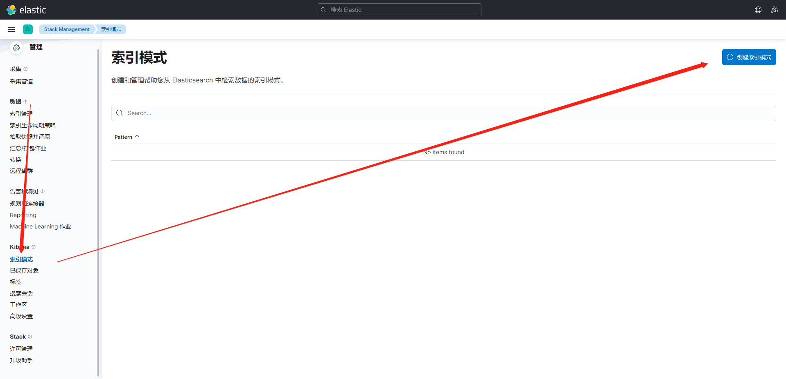

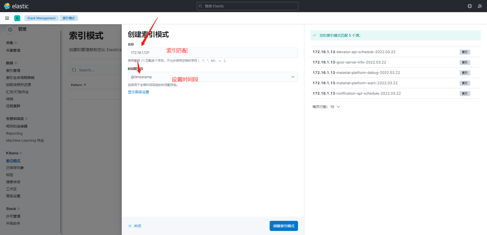


### 2、查看数据

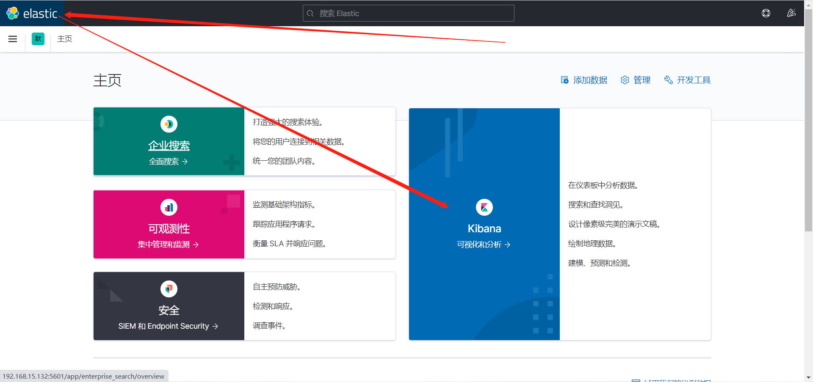


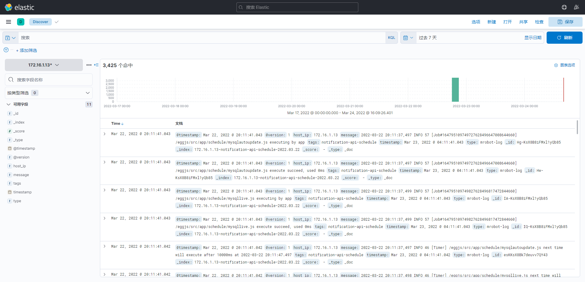

### 3、kibana界面介绍

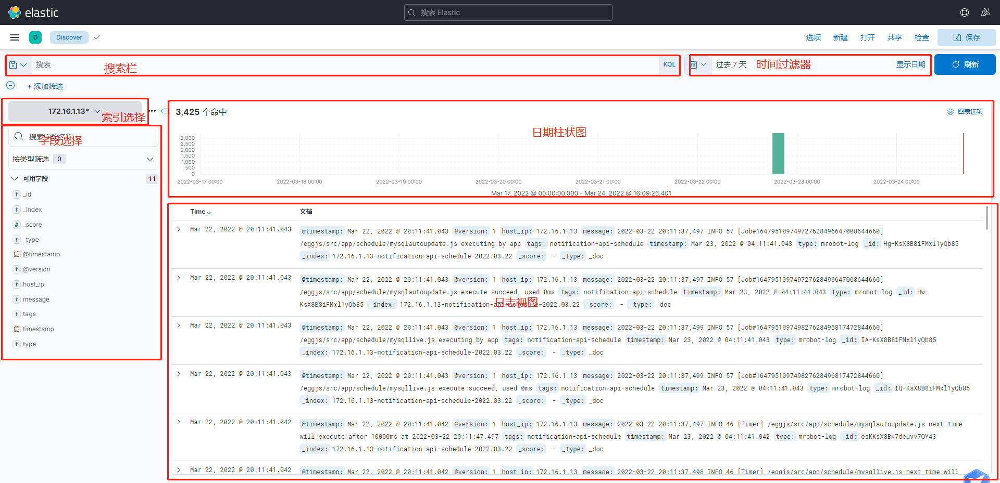


### 4、kibana搜索语法

#### 1.以Key:Value的形式构建查询条件

Key即是域名(Field), Value即是值项(Term)
默认域名可以省略掉, kibana的默认域是message域, message会包含所有日志内容.

```bash
    title:abc   # 在title这个域中搜索 abc, 所有title 包含 abc 都会被搜索出来. 
    title:"abc def"  # 在title这个域中搜索 abc def 这个完整的字符串.
    title:abc def   # 这个写法不同于上面的查询语句, 其实是两个查询条件, 在title域中搜索abc, 并且在默认域中搜索def.
    title:"1=1"   # 如果term有空格或等于号等特殊字符, 需要用双引号括起来.
```

#### 2.对于数值项可以使用>、<、=操作符

```bash
account_number:<100 
```

#### 3.多个查询项的组合, 使用大写的 AND 、 OR 、NOT实现与或非.

```bash
title:"The Right Way" AND text:go
account_number:<100 AND balance:>47500 
```

#### 4.通配符

```bash
Kibana 一般不需要使用通配符, 因为 Kibana 的 key:value 查询条件, 只要域值包含 value 就能被搜索出来, 除非我们的值项有多个特征, 可以用通配符将多个特征连起来. 
? 号可以匹配任意一个字符
* 号可以匹配任意多个字符
但通配符可以放在term的中间或尾部, 不能放在term的最前面. 
```

#### 5.支持正则

ES 中正则性能很差，而且支持的功能也不是特别强大，尽量不要使用, 正则表达式需要用//括起来

```bash
 message:/[mb]oat/  # 匹配 moat 或者 boat
```

#### 6.范围限定

方括号代表包含边界值, 花括号代表不包含边界值

```bash
 mod_date:[20020101 TO 20030101] 
 title:{Aida TO Carmen}  
```

#### 7.模糊搜索

```bash
~  : 在一个单词后面加上~启用模糊搜索

first~  也能匹配到 frist
```

#### 8.近似搜索

```bash
在短语后面加上~

"select where"~3 表示 select 和 where 中间隔着3个单词以内。
```

#### 9.转义特殊字符

```bash
+ - && || ! () {} [] ^" ~ * ? : \

以上字符当作值搜索的时候需要用\转义
```


