# 了解pulsar

## 一、什么是pulsar？

### 1、介绍

> ​    Pulsar：Apache Pulsar 是 Apache 软件基金会顶级项目，是下一代云原生分布式消息流平台，集消息、存储、轻量化函数式计算为一体，采用计算与存储分离架构设计。支持多租户、持久化存储、多机房跨区域数据复制，具有强一致性、高吞吐、低延时及高可扩展性等流数据存储特性，被看作是云原生时代实时消息流传输、存储和计算最佳解决方案。

>​    Pulsar 诞生于 2012 年，最初的目的是为在 Yahoo 内部，整合其他消息系统，构建统一逻辑、支撑大集群和跨区域的消息平台。当时的其他消息系统（包括 Kafka），都不能满足 Yahoo 的需求，比如大集群多租户、稳定可靠的 IO 服务质量、百万级 Topic、跨地域复制等，因此 Pulsar 应运而生，并于2016年底开源，现在是Apache软件基金会顶级开源项目。Pulsar在Yahoo的生产环境运行了三年多，助力Yahoo的主要应用，如YahooMail、Yahoo Finance、Yahoo Sports、Flickr、Gemini广告平台和Yahoo分布式键值存储系统Sherpa。

>​    Apache Pulsar是一个云原生企业级的发布订阅（pub-sub）消息系统，最初由Yahoo开发并于2016年开源并捐献给[Apache](https://so.csdn.net/so/search?q=Apache&spm=1001.2101.3001.7020)，2018成为Apache顶级项目。

### 2、功能特性

>- Pulsar 的单个实例原生支持多个集群，可跨机房在集群间无缝地完成消息复制。
>
>- 极低的发布延迟和端到端的延迟。
>
>- 可无缝扩展到超过一百万个 Topic。
>
>- 简单的客户端 API，支持 Java、Go、Python 和 C++.
>
>- 支持多种 Topic 订阅模式 （独占订阅、共享订阅、故障转移订阅）。
>
>- 通过 Apache BookKeeper 提供的持久化消息存储机制保证消息传递。
>
>- 由轻量级的 Serverless 计算框架 Pulsar Functions 实现流原生的数据处理。
>
>- 基于 Pulsar Functions 的 serverless connector 框架 Pulsar IO 使得数据更容易移入、移出 Apache Pulsar。
>
>- 分层存储可在数据陈旧时，将数据从热存储卸载到冷/长期存储（如S3、GCS）中

>1. 多租户模式
>2. 灵活的消息系统
>3. 云原生架构
>4. 分片流(segmented Sreams)
>5. 支持跨地域复制
>
>Pulsar架构模型类似于Client->Proxy->Server

#### 1.多租户模式

>- 租户和命名空间（namespace）是 Pulsar 支持多租户的两个核心概念。
>- 在租户级别，Pulsar 为特定的租户预留合适的存储空间、应用授权与认证机制。
>- 在命名空间级别，可以调整副本设置，管理跨集群的消息复制。Pulsar还有一系列的配置策略(policy)，包括存储配额、broker控制produce和consume的流量、消息过期策略和命名空间之间的隔离策略

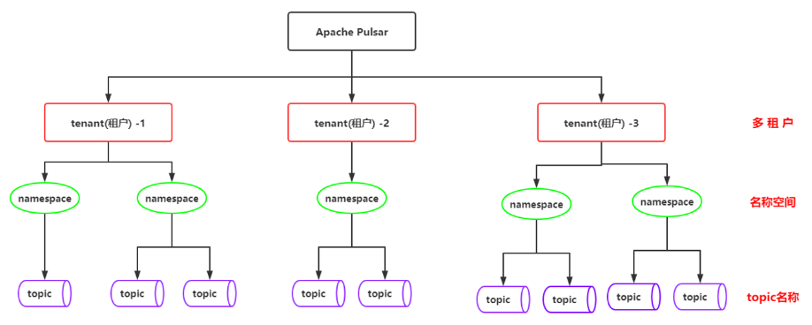

##### 1)多租户

###### ①介绍

> 多租户是一种架构，目的是为了让多用户环境下使用同一套程序，且保证用户间数据隔离
>
> 简单讲：在一台服务器上运行单个应用实例，它为多个租户（客户）提供服务。
>
> ​    Apache Pulsar 最初诞生于雅虎，当时就是为了解决雅虎内部各个部门之间数据的协调，所以多租户特性显得至关重用，Pulsar 从诞生之日起就考虑到多租户这一特性，并在后续的实现过程中，将其不断的完善。 多租户这一特性，使得各个部门之间可以共享同一份数据，不用单独部署独立的系统来操作数据，很好的保证了各部门间数据一致性的问题，同时简化维护成本。

###### ②多租户符合的要求

>- 使用身份验证、授权和 ACL（访问控制列表）确保其安全性
>- 为每个租户强制执行存储配额
>- 支持在运行时更改隔离机制，从而实现操作成本低和管理简单

###### ③多租户的体现

>persistent://tenant/namespace/topic
>
>从URL中可以看出tenant(租户)是topic最基本的单元(比命名空间和topic名称更为基本)

###### ④多租户的安全性（认证和授权）

>一个多租户系统需要在租户内提供系统级别的安全性，细分来讲，主要可以归类为一下两点:
>
>- 租户只能访问它有权限访问的 topics
>- 不允许访问它无法访问的 topics

>​    在 Pulsar 中，多租户的安全性是通过身份验证和授权机制实现的。当 client 连接到 pulsar broker 时，broker 会使用身份验证插件来验证此客户端的身份，然后为其分配一个 string 类型的 role token。role token 主要有如下作用：
>
>- 判断 client 是否有对 topics 进行生产或消费消息的权限
>- 管理租户属性的配置   

>Pulsar 目前支持一下几种身份认证, 同时支持自定义实现自己的身份认证程序
>
>- TLS 客户端身份认证
>- 雅虎的身份认证系统: Athenz
>- Kerberos
>- JSON Web Token 认证

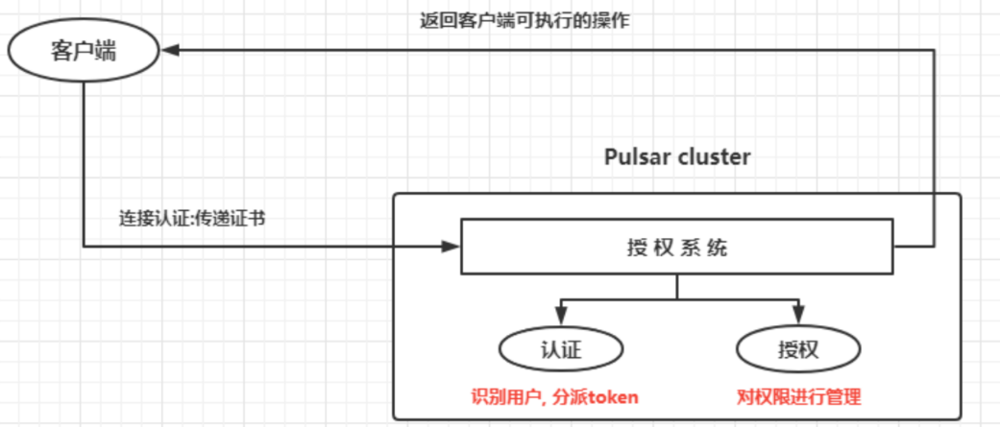

###### ⑤多租户隔离性

**隔离性主要分为如下两种：**

- 软隔离: 通过磁盘配额，流量控制和限制等手段

>存储: 
>
>   Apache Pulsar 使用Bookkeeper来作为其存储层, bookie是Bookkeeper的实例, Bookkeeper本身就是具有I/O分离(读写分离)的特性,可以很多的做好IO隔离, 提升读写的效率
>
>   同时, 不同的租户可以为不同的NameSpace配置不同的存储配额, 当租户内消息的大小达到了存储配额的限制, Pulsar会采取相应的措施, 例如: 阻止消息生成, 抛异常 或丢弃数据等
>
>Broker:
>
>   每个Borker使用的内存资源都是有上限的, 当Broker达到配置的CPU或内存使用的阈值后, Pulsar会迅速的将流量转移到负载较小的Broker处理
>
>   在生产和消费方面, Pulsar都可以进行流量控制,租户可以配置发送和接收的速率,避免出现一个客户端占用当前Broker的所有处理资源

- 硬隔离: 物理资源隔离

>Pulsar 允许将某些租户或名称空间与特定 Broker 进行隔离。这可确保这些租户或命名空间可以充分利用该特定 Broker 上的资源。

##### 2）Pulsar的名称空间

>​    namespace是Pulsar中最基本的管理单元，在namespace这一层面，可以设置权限，调整副本设置，管理跨集群的消息复制，控制消息策略和执行关键操作。一个主题topic可以继承其所对应的namespace的属性，因此我们只需对namespace的属性进行设置，就可以一次性设置该namespace中所有主题topic的属性。
>
>namespace有两种，分别是本地的namespace和全局的namespace：
>
>- 本地namespace——仅对定义它的集群可见。
>
>- 全局namespace——跨集群可见，可以是同一个数据中心的集群，也可以是跨地域中心的集群，这依赖于是否在namespace中设置了跨集群拷贝数据的功能。
>
>  
>
>​    虽然本地namespace和全局namespace的作用域不同，但是只要对他们进行适当的设置，都可以跨团队和跨组织共享。一旦生产者获得了namespace的写入权限，那么它就可以往namespace中的所有topic主题写入数据，如果某个主题不存在，则在生产者第一次写入数据时动态创建。
>  

#### 2.灵活的消息系统

>- 比kafka更高的吞吐量和低延迟
>- 无缝支持上百万个topics
>- 支持多种消息订阅模式 (exclusive[独享] & shared[共享] & failover[灾备])
>    - Exclusive(独享) - 一个订阅只能有一个消息者消费消息
>    - Shared(共享) - 一个订阅中同时可以有多个消费者，多个消费者共享Topic中的消息
>    - Fail-Over(灾备) - 一个订阅同时只有一个消费者，可以有多个备份消费者。一旦主消费者故障则备份消费者接管。不会出现同时有两个活跃的消费者。
>- 通过持久化存储BookKeeper保障消息的传递
>- 轻量级Serverless计算框架Pulsar Functions提供了流式数据处理能力。
>- Pulsar 做了队列模型和流模型的统一，在 Topic 级别只需保存一份数据，同一份数据可多次消费。以流式、队列等方式计算不同的订阅模型大大提升了灵活度。
>- 同时pulsar通过事务采用Exactly-Once(精准一次)在进行消息传输过程中, 可以确保数据不丢不重

**队列模式：先进先出，直进直出**

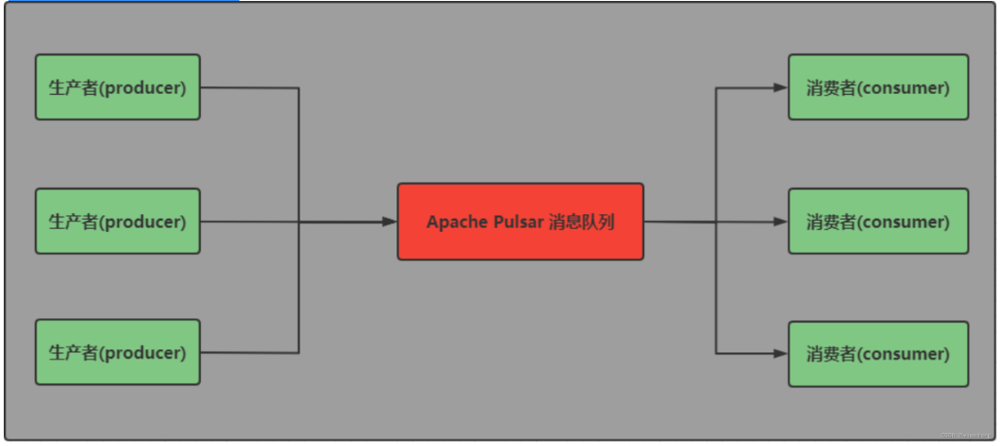

**流模式：数据经过转换之后再次存储进topic中**

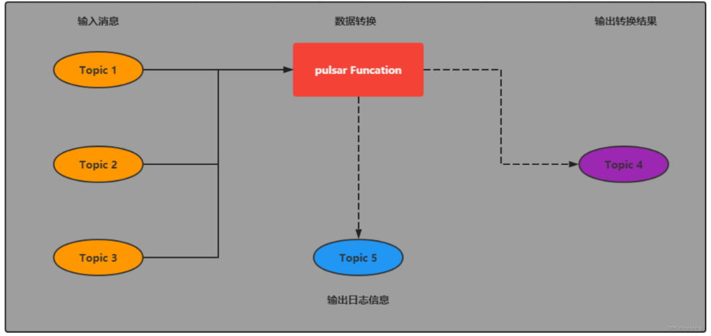

#### 3.云原生架构

>​    Pulsar 使用计算与存储分离的云原生架构，数据从 Broker 搬离，存在共享存储内部。上层是无状态 Broker，复制消息分发和服务；下层是持久化的存储层 Bookie 集群。Pulsar 存储是分片的，这种构架可以避免扩容时受限制，实现数据的独立扩展和快速恢复。

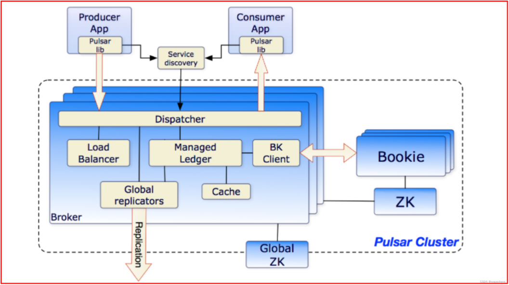

#### 4.分片流(Segmented Streams)

>​    Pulsar 将无界的数据看作是分片的流，分片分散存储在分层存储（tiered storage）、BookKeeper 集群和 Broker 节点上，而对外提供一个统一的、无界数据的视图。即底层存储较为复杂，甚至是针对topic级别都有分片存储。其次，不需要用户显式迁移数据，减少存储成本并保持近似无限的存储。用户只需关注如何使用，而不是去研究底层数据如何存储，减少了用户的学习成本。

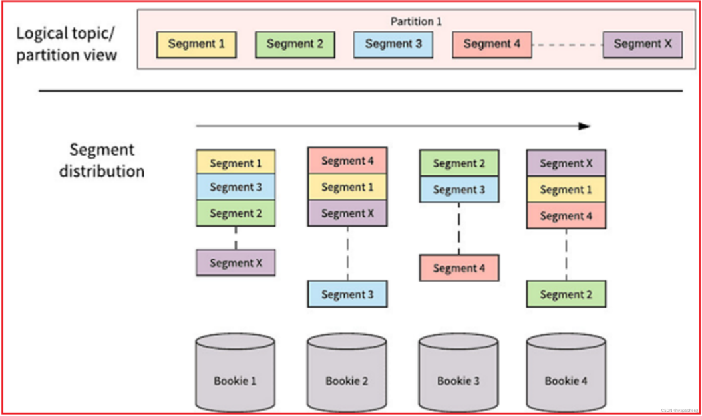

#### 5.支持跨地域复制

>​    Pulsar 中的跨地域复制是将 Pulsar 中持久化的消息在多个集群间备份。在 Pulsar 2.4.0 中新增了复制订阅模式(Replicated-subscriptions)，在某个集群失效情况下，该功能可以在其他集群恢复消费者的消费状态，从而达到热备模式下消息服务的高可用。

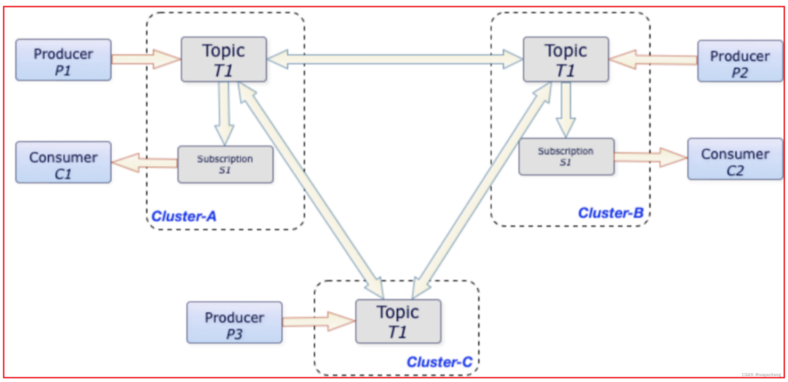

### 3、Apache Pulsar基本架构

> 单个 Pulsar 集群由以下三部分组成：
>
> - 多个 broker 负责处理和负载均衡 producer 发出的消息，并将这些消息分派给 consumer；Broker 与 Pulsar 配置存储交互来处理相应的任务，并将消息存储在 BookKeeper 实例中（又称 bookies）；Broker 依赖 ZooKeeper 集群处理特定的任务，等等。
> - 多个 bookie 的 BookKeeper 集群负责消息的持久化存储。
> - 一个zookeeper集群，用来处理多个Pulsar集群之间的协调任务。

#### 1.Broker

> broker是一个无状态组件, 主要负责运行另外的两个组件:
>
> - 一个HTTP服务器，它暴露了REST系统管理接口以在生产者和消费者之间进行Topic查找的API
>
> - 一个调度分发器，它是异步的TCP服务器，通过自定义二进制协议应用于所有相关的数据传输
>
>   ​    出于性能考虑，消息通常从Managed Ledger缓存中分派出去，除非积压超过缓存大小。如果积压的消息对于缓存来说太大了, 则Broker将开始从BookKeeper那里读取Entries（Entry同样是BookKeeper中的概念，相当于一条记录）。
>
>   ​    最后，为了支持全局Topic异地复制，Broker会控制Replicators追踪本地发布的条目，并把这些条目用Java 客户端重新发布到其他区域

#### 2.Zookeeper

>Pulsar使用Zookeeper进行元数据存储、集群配置和协调
>
>- 配置存储：存储租户，命名域和其他需要全局一致的配置项
>- 每个集群由自己独立的Zookeeper保存集群内部配置和协调信息，例如归属信息，broker负载报告。BookKeeper ledger信息等等

#### 3.BookKeeper

>- Pulsar使用BookKeeper进行持久化存储

##### 1)介绍

> ​    Apache BookKeeper是一款企业级存储系统，最初由雅虎研究院研发，在2011年作为Apache ZooKeeper的子项目进行孵化，在2015年1月成为 Apache顶级项目。
>
> ​    起初，BookKeeper是一个预写日志(WAL)系统，经过几年的发展，BookKeeper的功能更加完善，比如为Hadoop分布式文件系统(HDFS)的NameNode提供高可用和多副本，为消息系统比Pulsar提供存储服务，为多个数据中心提供跨机器复制。

##### 2)使用场景

> BookKeeper最初的一个使用场景是为HDFS(Hadoop分布式文件系统)的NameNode保存edit log，如下图：

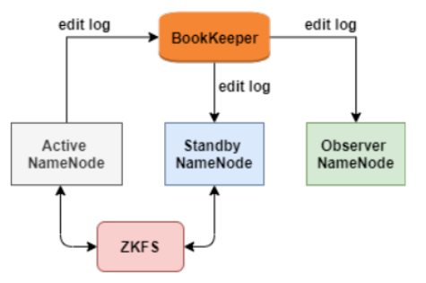

>ZKFC是一个[Zookeeper](https://so.csdn.net/so/search?q=Zookeeper&spm=1001.2101.3001.7020)的客户端，主要用来监测和管理NameNode状态，每个NameNode机器上都会运行一个ZKFC，它的职责主要有三个：
>
>- 健康检查
>- Zookeeper会话管理
>- 选举，当集群中一个Active NameNode宕机，Zookeeper会自动选择一个节点作为新的Active NameNode。

> ​    BookKeeper记录NameNode的edit log(edit log存放文件系统的操作日志)，NameNode的所有修改都会记录到BookKeeper。这样active NameNode宕机后，BookKeeper用保存的edit log去standby NameNode做回放，之后切换成active NameNode。
>
> BookKeeper具有如下特性：
>
> - 一致性：因为edit log保存的是HDFS的元数据，对一致性要求很高
> - 低延迟：为了不丢数据，需要低延迟
> - 高吞吐：为了支持更多的NameNode节点，需要高吞吐

##### 3) 节点对等

Bookie中保存的数据结构如下图：

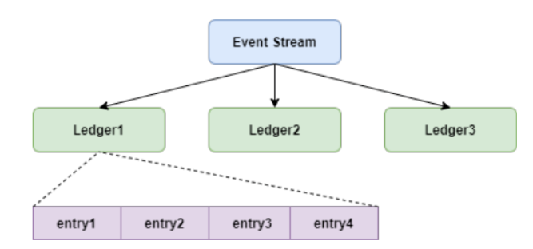

>writer写数据时，把entry并发写入多个bookie节点的Ledger。这类似于文件系统写数据时首先会打开一个文件，如果文件不存在，则会创建文件元数据。
>
>- Ledger也就是Pulsar中的segment。
>
>writer写数据时，首先会打开一个新Ledger，函数如下：
>
>- openLedger(组内节点数目、数据备份数目、等待刷盘节点数目)
>
>比如(5,3,2)代表组内共有5个Bookie节点，写数据时需要写入3个节点，有2个节点返回成功代表写入成功。
>
>这样写入的这3个节点数据完全一样，关系是对等的，不存在主从关系。

###### ①数据读写

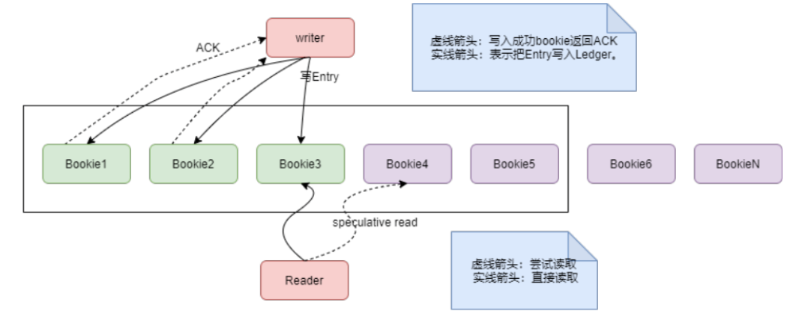

> ​    writer以roundrobin的方式写入bookie，比如在上图中，第一条数据写入Bookie1、Bookie2和Bookie3，第二条数据写入Bookie2、Bookie3、Bookie4，第三条数据写入Bookie3、Bookie4、Bookie5，第四条数据写入Bookie4、Bookie5和Bookie1。
>
> ​    在打开一个Ledger时，就传入了bookie数量，这样在写每个entry时，就用entry的id跟bookie数量取模，来确定写到哪几个bookie上。比如第3条消息跟5取模是3，就写到Bookie3、Bookie4和Bookie5。
>
> ​    这样以轮询的方式将Ledger数据写入各个bookie节点，每个bookie节点的数据是均衡的，每个bookie节点的磁盘带宽和网卡带宽都能得到充分利用。

###### ②读高可用

>    Reader在读取数据时，可以读取多份数据中的任意一份数据。BookKeeper会设置一个读超时时间，如果读取超时了，会给另外一个bookie节点(speculative read)发送读请求。

###### ③写高可用

>如果某个bookie节点(比如bookie5)发生故障不能写入了，BookKeeper会做如下处理：
>
>- 记录出错的entry id
>- 对故障节点的数据进行封装
>- 关闭当前的Ledger，重新打开一个新的Ledger，这个Ledger会重新选择bookie节点，1、2、3、4、6。
>- 如果bookie5恢复，就不再提供写服务了，只提供读服务。
>- 如果不能恢复，就把bookie5的数据，从其他节点的备份中恢复到新的节点上，这个过程需要根据Ledger id跟5取模来判断是否落到bookie5上，数据恢复过程并不影响Reader，因为其他两份数据可以继续提供服务。

##### 4) I/O模型

BookKeeper的I/O模型如下图，这个图是单个bookie的数据流转：

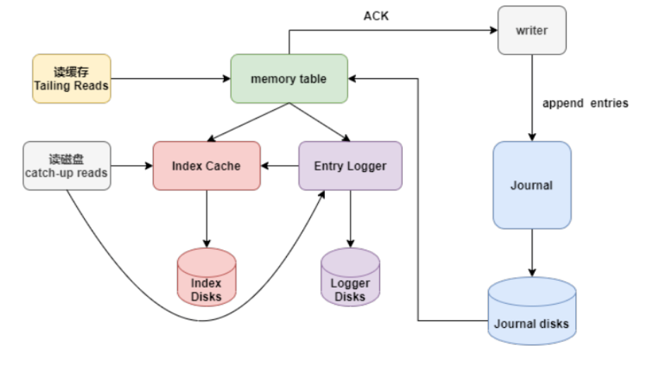

>1. Writer写入的数据首先到达Journal，Journal将数据进行group后刷到到Journal盘，这个刷盘的数据顺序跟writer写入顺序一致。
>
>   Writer写入Journal Disk是实时刷盘。
>
>2. Journal Disk的数据会写入memory table进行数据整理，把同一个topic的数据整理到一起。
>3. 把整理好的数据刷盘。Index Disk保存entry的index，对应entry在Logger Disks的offset。

###### ①读写分离

​    读取数据时，首先从Memory Cache中读取数据，如果数据不存在，才会去Index Disk和Logger Disk读取数据。而写数据是实时落盘到Journal Disk，这样实现了读写隔离。

###### ②强一致性

   数据可以实时刷盘到Journal Disk,保证了数据的强一致性。

###### ③灵活SLA

​    对于写性能要求高的业务场景，可以单独加强Journal盘性能，而对于读性能要求高的场景，可以加强Ledger Disk和Index Disk的性能。

##### 5) Pulsar中的使用

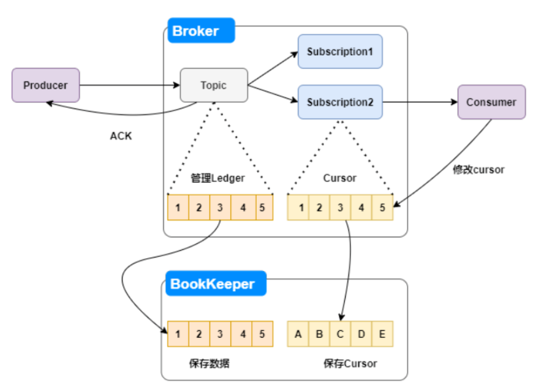

>每次Producer生成的消息实时落盘后，给Producer返回一个ACK。
>
>Consumer消费消息后，还会修改Cusor中保存的offset，并且也会记录到BookKeeper。这样保证了Cursor的一致性。

>​    Apache Pulsar 为应用程序提供有保证的信息传递, 如果消息成功到达broker, 就认为其预期到达了目的地。
>
>​    为了提供这种保证，未确认送达的消息需要持久化存储直到它们被确认送达。这种消息传递模式通常称为持久消息传递 。在Pulsar内部，所有消息都被保存并同步N份，例如，2个服务器保存四份，每个服务器上面都有镜像的RAID存储。

>Pulsar用Apache bookKeeper作为持久化存储。Bookeeper是一个分布式的预写日志（WAL）系统，有如下几个特性，特别适合Pulsar的应用场景：
>
>- 使Pulsar能够利用独立的日志，称为Ledgers、可以随着时间的推移为Topic创建多个Ledgers
>- 它为处理顺序消息提供了非常有效的存储
>- 保证了多系统挂掉时Ledgers的读取一致性
>- 提供不同的Bookies之间均匀IO分布的特性
>- 它在容量和吞吐量方面都具有水平伸缩性。
>- 能够通过将bookies增加都集群中来提升吞吐量
>- Bookies被设计成可以承载数千的并发读写的ledgers。使用多个磁盘设备（一个用于日志，另一个用于一般存储），这样Bookies可以将读操作的影响和对于写操作的延迟分隔开

#### 4.Ledger

>​    Ledger是一个只追加的数据结构，并且只有一个写入器，这个写入器负责多个Bookeeper存储节点的写入，ledger的条目会被复制到多个Bookies。Ledger本身有着非常简单的语义
>
>- Pulsar Broker可以创建、添加内容和关闭Ledger
>- 当一个Ledger被关闭后，除非明确的要写数据或者是因为写入器挂掉导致Ledger关闭，ledger将会以只读打开。
>- 当ledger的条目不再有用的时候，整个ledger可以被删除（Ledger的分布式跨Bookie的）

#### 5.Pulsar代理（Pulsar Proxy）

>​    Pulsar客户端和Pulsar集群交互的一种方式就是直连Pulsar brokers。然而，在某些情况下，这种直连既不可行也不可取，因为客户端并不知道broker的地址。 例如在云环境或者Kubernetes以及其他类似的系统上面运行Pulsar，直连brokers就基本上不可能了。
>​    Pulsar proxy 为这个问题提供了一个解决方案, 为所有的broker提供了一个网关, 如果选择运行了Pulsar Proxy. 所有的客户都会通过这个代理而不是直接与brokers通信

## 二、为什么要用pulsar？

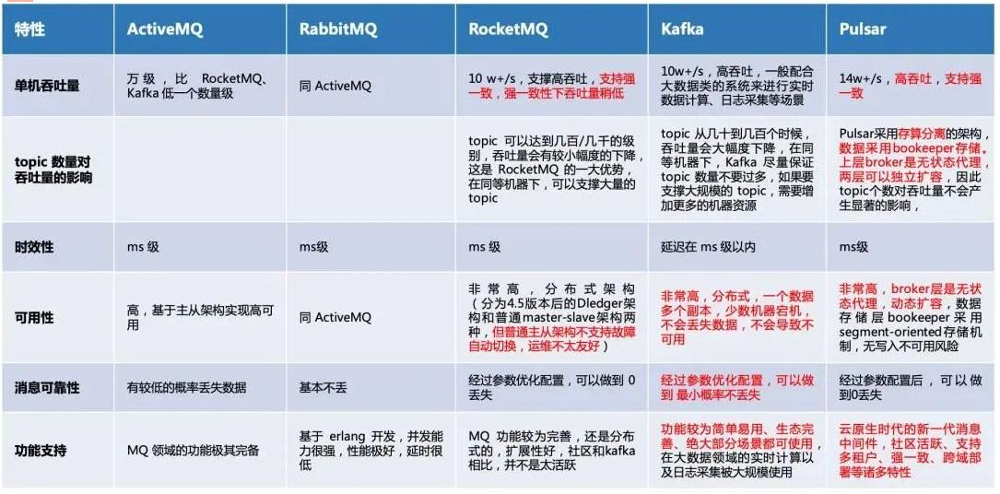

### 1、为什么新项目要使用pulsar？

>1.我们需要pulsar的多租户功能
>
>2.pulsar的高性能，高可用等特性综合对比下来适合使用

### 2、为什么ELK要用pulsar替代kafka？

#### 1.概念对比

>1) 模型概念
>
>- Kafka: producer – topic – consumer group – consumer
>- Pulsar: producer – topic -subsciption- consumer
>
>2) 消息消费模式
>
>- Kafka: 主要集中在流(Stream) 模式, 对单个partition是独占消费, 没有共享(Queue)的消费模式
>- Pulsar: 提供了统一的消息模型和API. 流(Stream) 模式 – 独占和故障切换订阅方式 ; 队列(Queue)模式 – 共享订阅的方式
>
>3) 消息确认(ack)
>- Kafka: 使用偏移量 offset
>- Pulsar: 使用专门的cursor管理. 累积确认和kafka效果一样; 提供单条或选择性确认
>
>4) 消息保留:
>
>- Kafka: 根据设置的保留期来删除消息, 有可能消息没被消费, 过期后被删除, 不支持TTL
>- Pulsar: 消息只有被所有订阅消费后才会删除, 不会丢失数据,. 也运行设置保留期, 保留被消费的数据 . 支持TTL

>​    Apache Kafka和Apache Pulsar都有类似的消息概念。 客户端通过主题与消息系统进行交互。 每个主题都可以分为多个分区。 然而，Apache Pulsar和Apache Kafka之间的根本区别在于Apache Kafka是以分区为存储中心，而Apache Pulsar是以Segment为存储中心。

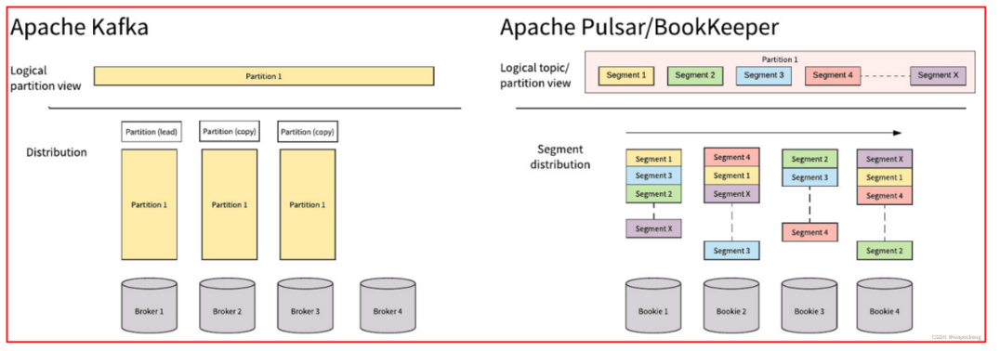

>​     对比总结： Apache Pulsar将高性能的流（Apache Kafka所追求的）和灵活的传统队列（RabbitMQ所追求的）结合到一个统一的消息模型和API中。 Pulsar使用统一的API为用户提供一个支持流和队列的系统，且具有同样的高性能。 

#### 2.性能对比

​     Pulsar 表现最出色的就是性能，Pulsar 的速度比 Kafka 快得多，美国德克萨斯州一家名为 GigaOm (https://gigaom.com/) 的技术研究和分析公司对 Kafka 和 Pulsar 的性能做了比较，并证实了这一点。

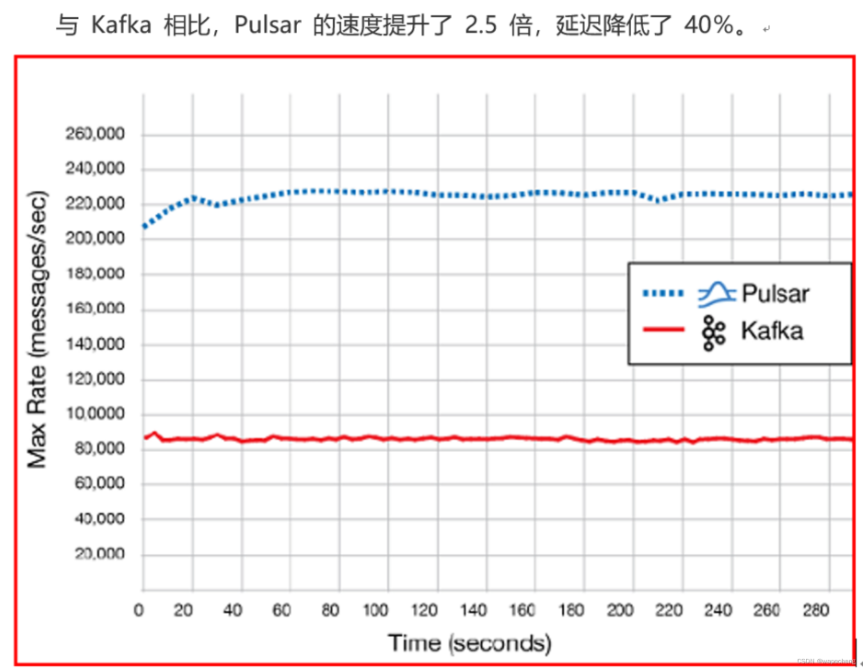

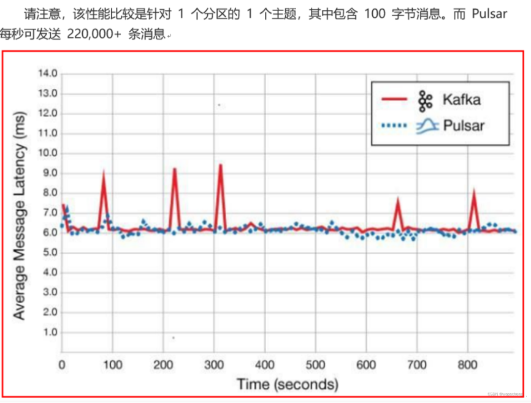

#### 3.目前kafka的痛点

>1)  Kafka 很难进行扩展，因为 Kafka 把消息持久化在 broker 中，迁移主题分区时，需要把分区的数据完全复制到其他 broker 中，这个操作非常耗时。
>
>2) 当需要通过更改分区大小以获得更多的存储空间时，会与消息索引产生冲突，打乱消息顺序。因此，如果用户需要保证消息的顺序，Kafka 就变得非常棘手了。
>
>3) 如果分区副本不处于 ISR（同步）状态，那么 leader 选取可能会紊乱。一般地，当原始主分区出现故障时，应该有一个 ISR 副本被征用，但是这点并不能完全保证。若在设置中并未规定只有 ISR 副本可被选为 leader 时，选出一个处于非同步状态的副本做 leader，这比没有 broker 服务该 partition 的情况更糟糕。
>
>4) 使用 Kafka 时，你需要根据现有的情况并充分考虑未来的增量计划，规划 broker、主题、分区和副本的数量，才能避免 Kafka 扩展导致的问题。这是理想状况，实际情况很难规划，不可避免会出现扩展需求。
>
>5) Kafka 集群的分区再均衡会影响相关生产者和消费者的性能。
>
>6) 发生故障时，Kafka 主题无法保证消息的完整性（需要扩展时极有可能丢失消息）。
>
>7) 使用 Kafka 需要和 offset 打交道，这点让人很头痛，因为 broker 并不维护 consumer 的消费状态。
>
>8) 如果使用率很高，则必须尽快删除旧消息，否则就会出现磁盘空间不够用的问题。
>
>9) 众所周知，Kafka 原生的跨地域复制机制（MirrorMaker）有问题，即使只在两个数据中心也无法正常使用跨地域复制。因此，甚至 Uber 都不得不创建另一套解决方案来解决这个问题，并将其称为 uReplicator (https://eng.uber.com/ureplicator/)。
>
>10) 要想进行实时数据分析，就不得不选用第三方工具，如 Apache Storm、Apache Heron 或 Apache Spark。同时，你需要确保这些第三方工具足以支撑传入的流量。
>
>11)  Kafka 没有原生的多租户功能来实现租户的完全隔离，它是通过使用主题授权等安全功能来完成的。 

