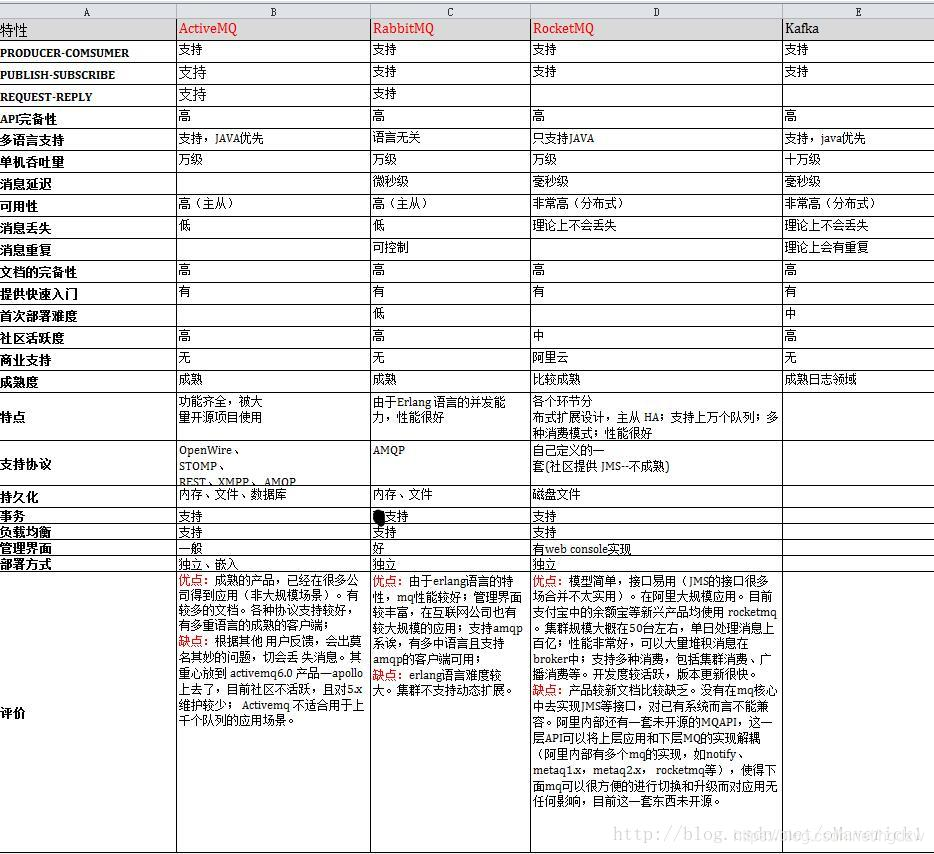
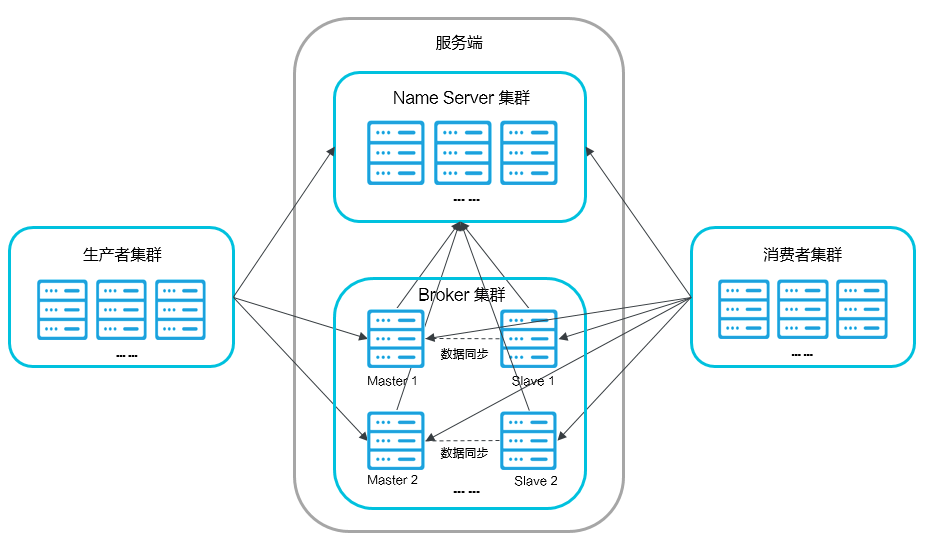
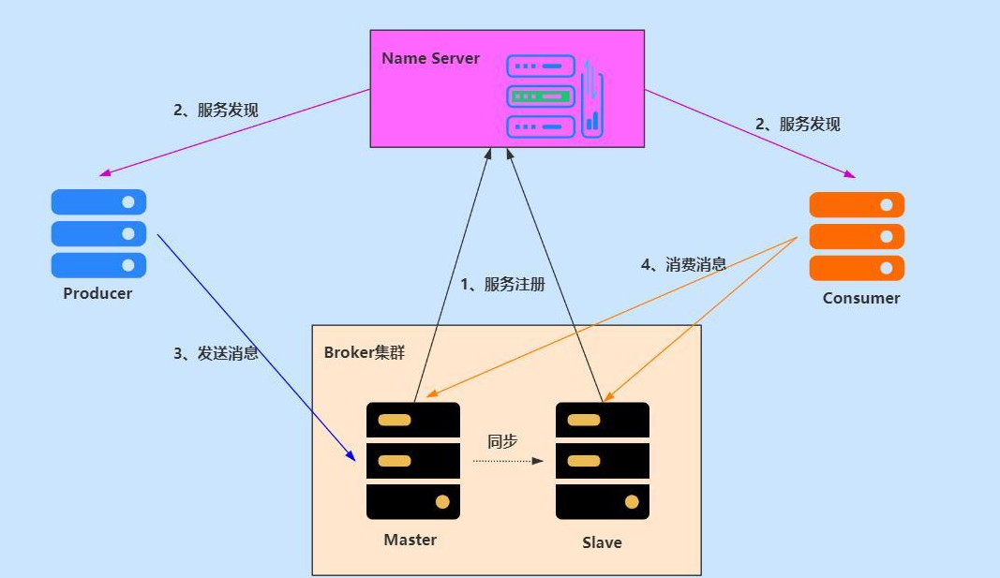
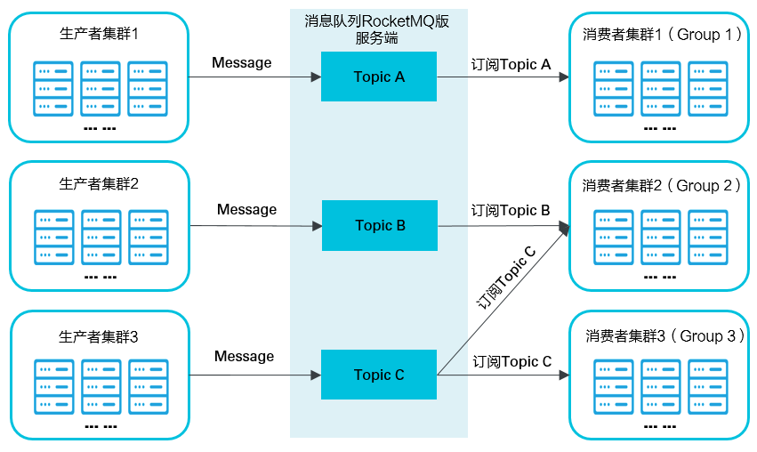
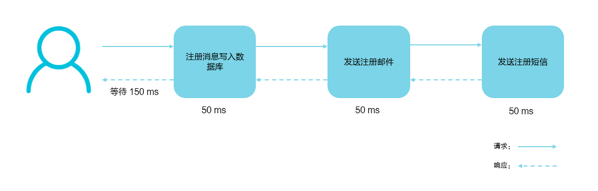
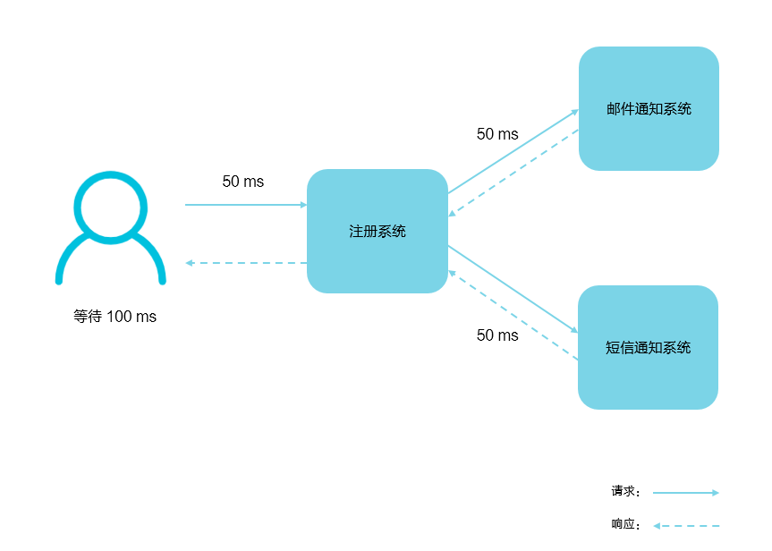
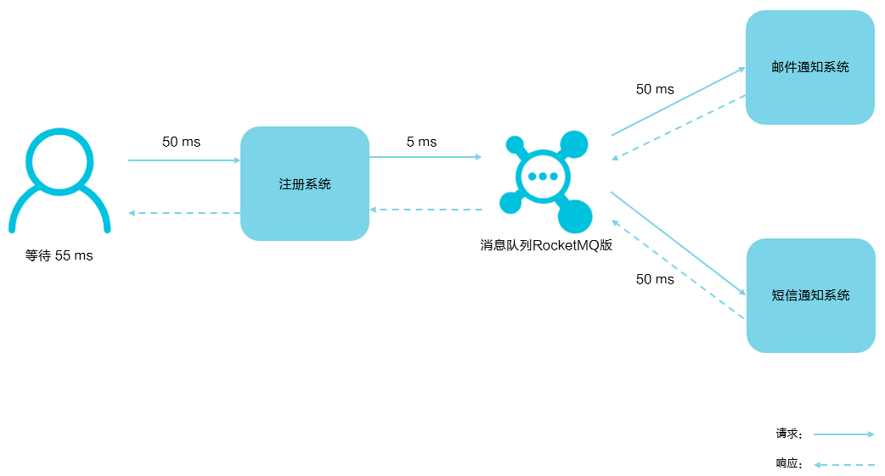
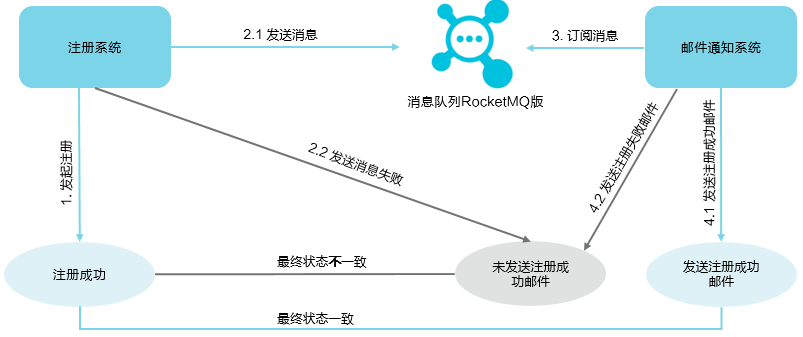
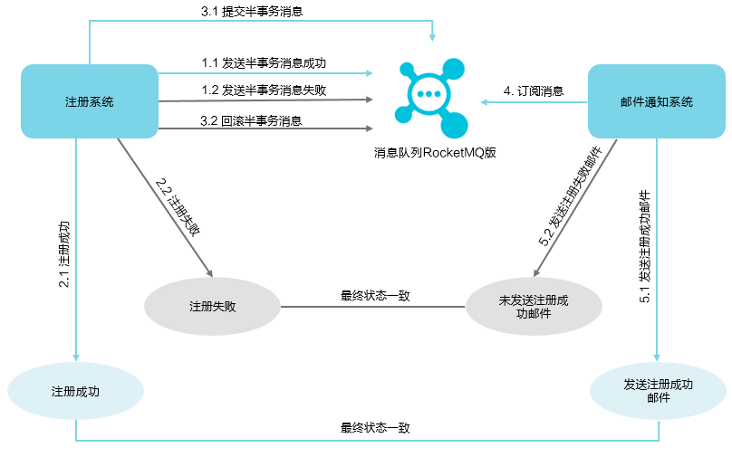
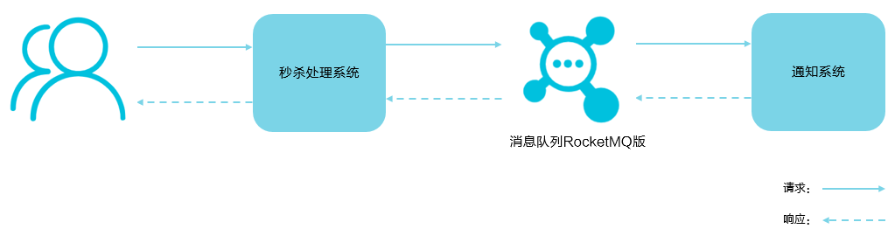

[TOC]

# RocketMQ介绍及基本概念

## 一、介绍

```bash
RocketMQ作为一款纯java、分布式、队列模型的开源消息中间件，支持事务消息、顺序消息、批量消息、定时消息、消息回溯等。
```

### 1、特点

```bash
1.支持发布/订阅（Pub/Sub）和点对点（P2P）消息模型
2.在一个队列中可靠的先进先出（FIFO）和严格的顺序传递 （RocketMQ可以保证严格的消息顺序，而ActiveMQ无法保证）
3.支持拉（pull）和推（push）两种消息模式
    pull其实就是消费者主动从MQ中去拉消息，而push则像rabbit MQ一样，是MQ给消费者推送消息。但是RocketMQ的push其实是基于pull来实现的。
    它会先由一个业务代码从MQ中pull消息，然后再由业务代码push给特定的应用/消费者。其实底层就是一个pull模式
4.单一队列百万消息的堆积能力 （RocketMQ提供亿级消息的堆积能力，这不是重点，重点是堆积了亿级的消息后，依然保持写入低延迟）
5.支持多种消息协议，如 JMS、MQTT 等
6.分布式高可用的部署架构,满足至少一次消息传递语义（RocketMQ原生就是支持分布式的，而ActiveMQ原生存在单点性）
7.提供 docker 镜像用于隔离测试和云集群部署
8.提供配置、指标和监控等功能丰富的 Dashboard
```

### 2、优势

>目前主流的 MQ 主要是 RocketMQ、kafka、RabbitMQ，其主要优势有：

```bash
1.支持事务型消息（消息发送和 DB 操作保持两方的最终一致性，RabbitMQ 和 Kafka 不支持）
2.支持结合 RocketMQ 的多个系统之间数据最终一致性（多方事务，二方事务是前提）
3.支持 18 个级别的延迟消息（Kafka 不支持）
4.支持指定次数和时间间隔的失败消息重发（Kafka 不支持，RabbitMQ 需要手动确认）
5.支持 Consumer 端 Tag 过滤，减少不必要的网络传输（即过滤由MQ完成，而不是由消费者完成。RabbitMQ 和 Kafka 不支持）
6.支持重复消费（RabbitMQ 不支持，Kafka 支持）
```

### 3、常见MQ区别




## 二、常见架构

### 1、架构图



### 2、架构角色介绍

#### 1.Name Server

```bash
1.是一个几乎无状态节点，可集群部署，在消息队列RocketMQ版中提供命名服务，更新和发现Broker服务,节点之间无任何信息同步。

2.提供轻量级的服务发现与路由服务，每个名称服务器记录了全部的 broker 的路由信息，并且提供相应的读写服务，支持快速存储扩展。

3.NameServer 是整个 RocketMQ 的“大脑” ，它是 RocketMQ 的服务注册中心，所以 RocketMQ 需要先启动 NameServer 再启动 Rocket 中的 Broker。
```

##### 1）NameServer作用

```bash
    名称服务器（NameServer）用来保存 Broker 相关元信息并给 Producer 和 Consumer 查找Broker 信息。NameServer 被设计成几乎无状态的，可以横向扩展，节点之间相互之间无通信，通过部署多台机器来标记自己是一个伪集群。
    
    每个 Broker 在启动的时候会到 NameServer 注册，Producer 在发送消息前会根据 Topic 到NameServer 获取到 Broker 的路由信息，进而和Broker取得连接。Consumer 也会定时获取 Topic 的路由信息。所以从功能上看应该是和 ZooKeeper 差不多，据说 RocketMQ 的早期版本确实是使用的ZooKeeper ，后来改为了自己实现NameServer 。
```

##### 2)和ZooKeeper的区别

```bash
     Name Server和ZooKeeper的作用大致是相同的，从宏观上来看，Name Server做的东西很少，就是保存一些运行数据，Name Server之间不互连，这就需要broker端连接所有的Name Server，运行数据的改动要发送到每一个Name Server来保证运行数据的一致性（这个一致性确实有点弱），这样就变成了Name Server很轻量级，但是broker端就要做更多的东西了。

    而ZooKeeper呢，broker只需要连接其中的一台机器，运行数据分发、一致性都交给了ZooKeeper来完成。
```

##### 3)高可用保障

```bash
    Broker 在启动时向所有 NameServer 注册（主要是服务器地址等） ，生产者在发送消息之前先从NameServer 获取 Broker 服务器地址列表（消费者一样），然后根据负载均衡算法从列表中选择一台服务器进行消息发送。

    NameServer 与每台 Broker 服务保持长连接，并间隔 30S 检查 Broker 是否存活，如果检测到Broker 宕机，则从路由注册表中将其移除，这样就可以实现 RocketMQ 的高可用。
```

#### 2.Broker

```bash
1.消息中转角色，负责存储消息，转发消息。分为Master Broker和Slave Broker，一个Master Broker可以对应多个Slave Broker，但是一个Slave Broker只能对应一个Master Broker。Broker启动后需要完成一次将自己注册至Name Server的操作；随后每隔30s定期向Name Server上报Topic路由信息。

2.broker 通过提供轻量级的主题和队列机制来维护消息存储。它支持推和拉两种模型，包含容错机制（2 个副本或 3 个副本），并提供了强大的平滑峰值，提供积累数以亿计的消息并保证其在原始时间顺序的被消费能力。

3.它还存储与消息相关的元数据，包括用户组、消费进度偏移量、队列信息等。

4. Broker 有 Master 和 Slave 两种类型，Master 既可以写又可以读，Slave不可以写只可以读。

5.此外，broker 也提供灾难恢复、丰富的度量统计和警报机制，所有这些能力在传统的消息传递系统里面都是没有的。
```

##### 1)部署方式

```bash
    Broker部署相对复杂，Broker分为Master与Slave，一个Master可以对应多个Slave，但是一个Slave只能对应一个Master，Master与Slave的对应关系通过指定相同的Broker Name，不同的BrokerId来定义，BrokerId为0表Master，非0表示Slave。Master也可以部署多个。

    从物理结构上看 Broker 的集群部署方式有四种：单 Master 、多 Master 、多 Master 多Slave（同步刷盘）、多 Master多 Slave（异步刷盘）。
```

###### ①单Master

```bash
    这种方式一旦 Broker 重启或宕机会导致整个服务不可用，这种方式风险较大，所以显然不建议线上环境使用。
```

###### ②多Master

```bash
    所有消息服务器都是 Master ，没有 Slave 。这种方式优点是配置简单，单个 Master 宕机或重启维护对应用无影响。
    缺点是单台机器宕机期间，该机器上未被消费的消息在机器恢复之前不可订阅，消息实时性会受影响。
```

###### ③多 Master 多 Slave（异步复制）

```bash
   每个 Master 配置一个 Slave，所以有多对 Master-Slave，消息采用异步复制方式，主备之间有毫秒级消息延迟。这种方式优点是消息丢失的非常少，且消息实时性不会受影响，Master 宕机后消费者可以继续从 Slave 消费，中间的过程对用户应用程序透明，不需要人工干预，性能同多 Master 方式几乎一样。
   缺点是 Master 宕机时在磁盘损坏情况下会丢失极少量消息。
```

###### ④多 Master 多 Slave（同步双写）

```bash
    每个 Master 配置一个 Slave，所以有多对 Master-Slave ，消息采用同步双写方式，主备都写成功才返回成功。这种方式优点是数据与服务都没有单点问题，Master 宕机时消息无延迟，服务与数据的可用性非常高。
    缺点是性能相对异步复制方式略低，发送消息的延迟会略高。
```

##### 2)高可用保障

```bash
    每个Broker与Name Server集群中的所有节点建立长连接，定时(每隔30s)注册Topic信息到所有Name Server。Name Server定时(每隔10s)扫描所有存活broker的连接，如果Name Server超过2分钟没有收到心跳，则Name Server断开与Broker的连接。
```

#### 3.Producer生产者

```bash
1.与Name Server集群中的其中一个节点（随机）建立长链接（Keep-alive），定期从Name Server读取Topic路由信息，并向提供Topic服务的Master Broker建立长链接，且定时向Master Broker发送心跳。
2.负责生产并发送消息至 Topic。
3.生产者向brokers发送由业务应用程序系统生成的消息。RocketMQ提供了发送：同步、异步和单向（one-way）的多种范例。
```

##### 1）同步发送

```bash
    同步发送指消息发送方发出数据后会在收到接收方发回响应之后才发下一个数据包。一般用于重要通知消息，例如重要通知邮件、营销短信。
```

##### 2)异步发送

```bash
    异步发送指发送方发出数据后，不等接收方发回响应，接着发送下个数据包，一般用于可能链路耗时较长而对响应时间敏感的业务场景，例如用户视频上传后通知启动转码服务。假如过一段时间检测到某个信息发送失败，可以选择重新发送。
```

##### 3)单向发送

```bash
    单向发送是指只负责发送消息而不等待服务器回应且没有回调函数触发，适用于某些耗时非常短但对可靠性要求并不高的场景，例如日志收集。
```

##### 4)生产者组

```bash
    生产者组（Producer Group）是一类 Producer 的集合，这类 Producer 通常发送一类消息并且发送逻辑一致，所以将这些 Producer 分组在一起。从部署结构上看生产者通过 Producer Group 的名字来标记自己是一个集群。
```

##### 5)高可用保障

```bash
    Producer与Name Server集群中的其中一个节点(随机选择)建立长连接，定期从Name Server取Topic路由信息，并向提供Topic服务的Master建立长连接，且定时向Master发送心跳。Producer完全无状态，可集群部署。

    Producer每隔30s（由ClientConfig的pollNameServerInterval）从Name server获取所有topic队列的最新情况，这意味着如果Broker不可用，Producer最多30s能够感知，在此期间内发往Broker的所有消息都会失败。

   Producer每隔30s（由ClientConfig中heartbeatBrokerInterval决定）向所有关联的broker发送心跳，Broker每隔10s中扫描所有存活的连接，如果Broker在2分钟内没有收到心跳数据，则关闭与Producer的连接。
```


#### 4.Consumer消费者

```bash
1.与Name Server集群中的其中一个节点（随机）建立长连接，定期从Name Server拉取Topic路由信息，并向提供Topic服务的Master Broker、Slave Broker建立长连接，且定时向Master Broker、Slave Broker发送心跳。Consumer既可以从Master Broker订阅消息，也可以从Slave Broker订阅消息，订阅规则由Broker配置决定。
2.RocketMQ中的消息有个特点，同一条消息，只能被某一消费组其中的一台机器消费，但是可以同时被不同的消费组消费。
```

##### 1)高可用保障

```bash
    Consumer与Name Server集群中的其中一个节点(随机选择)建立长连接，定期从Name Server取Topic路由信息，并向提供Topic服务的Master、Slave建立长连接，且定时向Master、Slave发送心跳。Consumer既可以从Master订阅消息，也可以从Slave订阅消息，订阅规则由Broker配置决定。

    Consumer每隔30s从Name server获取topic的最新队列情况，这意味着Broker不可用时，Consumer最多最需要30s才能感知。

    Consumer每隔30s（由ClientConfig中heartbeatBrokerInterval决定）向所有关联的broker发送心跳，Broker每隔10s扫描所有存活的连接，若某个连接2分钟内没有发送心跳数据，则关闭连接；并向该Consumer Group的所有Consumer发出通知，Group内的Consumer重新分配队列，然后继续消费。

    当Consumer得到master宕机通知后，转向slave消费，slave不能保证master的消息100%都同步过来了，因此会有少量的消息丢失。但是一旦master恢复，未同步过去的消息会被最终消费掉。
```

### 3、交互流程



```bash
1.NameServer 先启动

2.Broker 启动时向 NameServer 注册

3.生产者在发送某个主题的消息之前先从 NamerServer 获取 Broker 服务器地址列表（有可能是集群），然后根据负载均衡算法从列表中选择一台Broker 进行消息发送。

4.NameServer 与每台 Broker 服务器保持长连接，并间隔 30S 检测 Broker 是否存活，如果检测到Broker 宕机（使用心跳机制， 如果检测超120S），则从路由注册表中将其移除。

5消费者在订阅某个主题的消息之前从 NamerServer 获取 Broker 服务器地址列表（有可能是集群），但是消费者选择从 Broker 中 订阅消息，订阅规则由 Broker 配置决定
```


## 三、概念

### 1、核心概念

#### 1.MQ

```bash
Message Queue消息队列，既然是队列，就要实现数据结构中队列的基本特征，比如先进先出，入队、出队操作等。

RocketMQ就是把内存中使用的那个队列，变成一个独立的、大家都可以用的队列系统。
```

#### 2.Topic

```bash
消息主题，一级消息类型，生产者向其发送消息。

一个业务事件，是整个MQ领域最核心的概念，无论是生产还是消费都是针对Topic进行操作。

如果MQ是个大的队列，只有一个队列可以用太浪费了吧，来分一分，分解成很多个小的独立的队列。RocketMQ变成一个管理队列的系统，而分解下来的若干个小的队列通过什么来区分呢？就是通过topic。

比如我的业务定义topic：tp_im_event。你的业务定义topic：tp_cargo_event，那就是两个小队列了，我的业务用我的队列，你的项目用你的队列。Topic就是队列的名字。
```

#### 3.Queue真实队列

```bash
既然Topic是队列的名字，那么queue就表示真实操作的队列了。一开始的时候一个Topic就对应一个queue，多好，一个是名字、一个是现实。可是用着用着就悲催了，为啥？消息操作太多了，全都放在一个小队列上。为了提高效率，咋整？？RocketMQ是这样做的，一个Topic绑定的是一组queue，这样每个queue分摊部分压力，性能就上去了。

读队列个数：可以用来读取数据的队列个数

写队列个数：可以用来写入数据的队列个数

queue：真实存储数据用的队列。
```

#### 4.Message

```bash
生产者向Topic发送并最终传送给消费者的数据消息的载体。

队列存储的是消息！Message！尽量小，别发个文件啊什么的大东西，后面真心扛不住（超过特定大小还会报错）。
```

#### 5.消息属性

```bash
生产者可以为消息定义的属性，包含Message Key和Tag。
```

#### 6.Message Key

```bash
消息的业务标识，由消息生产者（Producer）设置，唯一标识某个业务逻辑。

发送了某个消息，但是希望在后台很方便的搜索到，就要通过key了。可以根据key搜索到所有相关的Message。可以认为RocketMQ内部维护了一个非常大的HashMap，key就是这个key，value就是Message，如果出现Hash冲突就用链表来报错对应关系。
```

#### 7.Message ID

```bash
消息的全局唯一标识，由消息队列RocketMQ系统自动生成，唯一标识某条消息。
```

#### 8.Tag

```bash
消息标签，二级消息类型，用来进一步区分某个Topic下的消息分类

一个queue里都是消息，如何对这些消息进行归类呢？为了进一步细化消息，有了Tag的概念。可以通过Tag对相同消息进行归类，这样用户就可以只订阅一部分的消息了（只订阅部分Tag）

比如：有一个Topic叫做‘发货’，下游消费者希望可以根据货源进行不同的处理，可以通过‘tag＝北京’以及‘tag＝上海’来区分不同的发货源。下游消费者，可以单独订阅‘上海’的货物，或者‘tag=上海|江苏|浙江’来订阅这三个地区的货物，还可以‘tag=＊’来订阅全国的货物。
```

#### 9.Producer

```bash
也称为消息发布者，负责生产并发送消息至Topic。

生产者：针对某一个Topic制造数据，把数据塞到queue里。（发消息的）
```

#### 10.Producer Group

```bash
管理消息的时候，我们肯定会遇见这个问题，某个消息谁发的？RocketMQ把发送者的身份抽象成了Producer Group，就是［发送组］。

简单点：这个东西命名成项目名就行，相同Producer Group保持相同业务行为。
```

#### 11.Consumer

```bash
也称为消息订阅者，负责从Topic接收并消费消息。

消费者：把queue里面的消息拿出来用

消费行为：如何处理通过Topic+Tag定位的消息。
```

#### 12.Consumer Group

```bash
一个RocketMQ集群是如何区分消费者是谁的呢？就是通过消费组，相同消费组的机器，MQ认为消费行为是一致的。业务上一定要保证相同消费组有相同的消费行为。对于不同的消费组名字，RocketMQ就认为是个不同消费者了。如果修改了消费组的名字，那就是新的消费者，就会按照新的消费组的消费进度处理消费。

消息那么多，项目都重启无数次了，RocketMQ是如何记录消息消费到什么地方了呢？

也是通过消费组，RocketMQ内部会维护一个关系，记录Consumer Group和消费进度之间的联系。所以，如果把Consumer Group的名字改掉是可能重新消费之前的所有数据的（视初始消费位置而定）
```


#### 13.分区

```bash
即Topic Partition，物理上的概念。每个Topic包含一个或多个分区。
```


#### 14.消费位点

```bash
每个Topic会有多个分区，每个分区会统计当前消息的总条数，这个称为最大位点MaxOffset；分区的起始位置对应的位置叫做起始位点MinOffset。
```

#### 15.Group

```bash
一类生产者或消费者，这类生产者或消费者通常生产或消费同一类消息，且消息发布或订阅的逻辑一致。
```


#### 16.Group ID

```bash
Group的标识
```

#### 17.Exactly-Once投递语义

```bash
Exactly-Once投递语义是指发送到消息系统的消息只能被Consumer处理且仅处理一次，即使Producer重试消息发送导致某消息重复投递，该消息在Consumer也只被消费一次。
```


#### 18.集群消费

```bash
一个Group ID所标识的所有Consumer平均分摊消费消息。例如某个Topic有9条消息，一个Group ID有3个Consumer实例，那么在集群消费模式下每个实例平均分摊，只消费其中的3条消息。
```


#### 19.广播消费

```bash
一个Group ID所标识的所有Consumer都会各自消费某条消息一次。例如某个Topic有9条消息，一个Group ID有3个Consumer实例，那么在广播消费模式下每个实例都会各自消费9条消息。
```


#### 20.定时消息

```bash
Producer将消息发送到消息队列RocketMQ服务端，但并不期望这条消息立马投递，而是推迟到在当前时间点之后的某一个时间投递到Consumer进行消费，该消息即定时消息。
```

#### 21.延时消息

```bash
Producer将消息发送到消息队列RocketMQ服务端，但并不期望这条消息立马投递，而是延迟一定时间后才投递到Consumer进行消费，该消息即延时消息。
```


#### 22.事务消息

```bash
RocketMQ提供类似X/Open XA的分布事务功能，通过消息队列RocketMQ的事务消息能达到分布式事务的最终一致。
```


#### 23.顺序消息

```bash
RocketMQ提供的一种按照顺序进行发布和消费的消息类型，分为全局顺序消息和分区顺序消息。
```


#### 24.全局顺序消息

```bash
对于指定的一个Topic，所有消息按照严格的先入先出（FIFO）的顺序进行发布和消费。
```


#### 25.分区顺序消息

```bash
对于指定的一个Topic，所有消息根据Sharding Key进行区块分区。同一个分区内的消息按照严格的FIFO顺序进行发布和消费。Sharding Key是顺序消息中用来区分不同分区的关键字段，和普通消息的Message Key是完全不同的概念。
```


#### 26.消息堆积

```bash
Producer已经将消息发送到消息队列RocketMQ的服务端，但由于Consumer消费能力有限，未能在短时间内将所有消息正确消费掉，此时在消息队列RocketMQ的服务端保存着未被消费的消息，该状态即消息堆积。

消息队列主要的功能是模块结偶，同步转异步和削峰，必然会出现生产非常快但是消费慢这种事情，比如生产的速度是100000/s但是消费速度是1/s，这个时候就叫做消息积压或者消费延迟（Delay）。理论上RockeMQ对于这种场景有比较好的适应能力，原理大致这样：正常的生产消费都是操作内存数据，所以比较快。但是如果积压非常多，内存明显扛不住了，则降级为生产消费的是磁盘数据，直接操作磁盘。磁盘肯定比内存的速度慢很多啦。

这个时候整个集群的处理能力就拉低了。所以最好生产和消费能力不要相差太多，即便相差很多，积压也应该在有限的时间内处理完毕。
```


**目前比较容易出现消息积压的情况有：**

```bash
- 新消费组上线（消费历史消息）
- 消费能力弱
- 生产洪峰（比如for循环发消息，job发消息）
```


#### 27.消息过滤

```bash
Consumer可以根据消息标签（Tag）对消息进行过滤，确保Consumer最终只接收被过滤后的消息类型。消息过滤在消息队列RocketMQ的服务端完成。
```


#### 28.消息轨迹

```bash
在一条消息从Producer发出到Consumer消费处理过程中，由各个相关节点的时间、地点等数据汇聚而成的完整链路信息。通过消息轨迹，您能清晰定位消息从Producer发出，经由消息队列RocketMQ服务端，投递给Consumer的完整链路，方便定位排查问题。
```


#### 29.重置消费位点

```bash
以时间轴为坐标，在消息持久化存储的时间范围内（默认3天），重新设置Consumer对已订阅的Topic的消费进度，设置完成后Consumer将接收设定时间点之后由Producer发送到消息队列RocketMQ服务端的消息。
```

#### 30.死信队列

```bash
死信队列用于处理无法被正常消费的消息。当一条消息初次消费失败，消息队列RocketMQ会自动进行消息重试；达到最大重试次数后，若消费依然失败，则表明Consumer在正常情况下无法正确地消费该消息。此时，消息队列RocketMQ不会立刻将消息丢弃，而是将这条消息发送到该Consumer对应的特殊队列中。

消息队列RocketMQ将这种正常情况下无法被消费的消息称为死信消息（Dead-Letter Message），将存储死信消息的特殊队列称为死信队列（Dead-Letter Queue）
```

### 2、消息收发模型

```bash
消息队列RocketMQ支持发布和订阅模型，消息生产者应用创建Topic并将消息发送到Topic。消费者应用创建对Topic的订阅以便从其接收消息。通信可以是一对多（扇出）、多对一（扇入）和多对多。具体通信如下图所示。
```



- **生产者集群**：用来表示发送消息应用，一个生产者集群下包含多个生产者实例，可以是多台机器，也可以是一台机器的多个进程，或者一个进程的多个生产者对象。
  一个生产者集群可以发送多个Topic消息。发送分布式事务消息时，如果生产者中途意外宕机，消息队列RocketMQ服务端会主动回调生产者集群的任意一台机器来确认事务状态。
- **消费者集群**：用来表示消费消息应用，一个消费者集群下包含多个消费者实例，可以是多台机器，也可以是多个进程，或者是一个进程的多个消费者对象。
  一个消费者集群下的多个消费者以均摊方式消费消息。如果设置的是广播方式，那么这个消费者集群下的每个实例都消费全量数据。
  一个消费者集群对应一个Group ID，一个Group ID可以订阅多个Topic，如上图中的Group 2所示。Group和Topic的订阅关系可以通过直接在程序中设置即可。

### 3、应用场景

消息队列中间件是分布式系统中重要的组件，主要解决应用解耦，异步消息，流量削锋等问题，实现高性能，高可用，可伸缩和最终一致性架构。

#### 1.场景介绍

##### 1）削峰填谷

```bash
诸如秒杀、抢红包、企业开门红等大型活动时皆会带来较高的流量脉冲，或因没做相应的保护而导致系统超负荷甚至崩溃，或因限制太过导致请求大量失败而影响用户体验，消息队列RocketMQ可提供削峰填谷的服务来解决该问题。
```

##### 2）异步解耦

```bash
交易系统作为淘宝和天猫主站最核心的系统，每笔交易订单数据的产生会引起几百个下游业务系统的关注，包括物流、购物车、积分、流计算分析等等，整体业务系统庞大而且复杂，消息队列RocketMQ可实现异步通信和应用解耦，确保主站业务的连续性。
```

##### 3）顺序收发

```bash
细数日常中需要保证顺序的应用场景非常多，例如证券交易过程时间优先原则，交易系统中的订单创建、支付、退款等流程，航班中的旅客登机消息处理等等。与先进先出FIFO（First In First Out）原理类似，消息队列RocketMQ提供的顺序消息即保证消息FIFO。
```

##### 4）分布式事务一致性

```bash
交易系统、支付红包等场景需要确保数据的最终一致性，大量引入消息队列RocketMQ的分布式事务，既可以实现系统之间的解耦，又可以保证最终的数据一致性。
```

##### 5）大数据分析

```bash
数据在“流动”中产生价值，传统数据分析大多是基于批量计算模型，而无法做到实时的数据分析，利用阿里云消息队列RocketMQ与流式计算引擎相结合，可以很方便的实现业务数据的实时分析。
```

##### 6）分布式缓存同步

```bash
天猫双11大促，各个分会场琳琅满目的商品需要实时感知价格变化，大量并发访问数据库导致会场页面响应时间长，集中式缓存因带宽瓶颈，限制了商品变更的访问流量，通过消息队列RocketMQ构建分布式缓存，实时通知商品数据的变化。
```

#### 2.功能实现

```bash
下文先以用户注册为场景说明消息队列RocketMQ如何实现以下功能：

异步解耦
分布式事务的数据一致性
消息的顺序收发
最后，再以电商的秒杀场景和价格同步场景分别说明消息队列RocketMQ所实现的削峰填谷和大规模机器的缓存同步。
```

##### 1)异步解耦

###### ①传统处理

最常见的一个场景是用户注册后，需要发送注册邮件和短信通知，以告知用户注册成功。传统的做法有以下两种：

**串行方式**



```bash
数据流动如下所述：

1.您在注册页面填写账号和密码并提交注册信息，这些注册信息首先会被写入注册系统。

2.注册信息写入注册系统成功后，再发送请求至邮件通知系统。邮件通知系统收到请求后向用户发送邮件通知。

3.邮件通知系统接收注册系统请求后再向下游的短信通知系统发送请求。短信通知系统收到请求后向用户发送短信通知。

以上三个任务全部完成后，才返回注册结果到客户端，用户才能使用账号登录。
假设每个任务耗时分别为50 ms，则用户需要在注册页面等待总共150 ms才能登录。
```

**并行方式**



```bash
数据流动如下所述：

1.用户在注册页面填写账号和密码并提交注册信息，这些注册信息首先会被写入注册系统。

2.注册信息写入注册系统成功后，再同时发送请求至邮件和短信通知系统。邮件和短信通知系统收到请求后分别向用户发送邮件和短信通知。

3.以上两个任务全部完成后，才返回注册结果到客户端，用户才能使用账号登录。

假设每个任务耗时分别为50 ms，其中，邮件和短信通知并行完成，则用户需要在注册页面等待总共100 ms才能登录。
```


###### ②异步解耦

```bash
对于用户来说，注册功能实际只需要注册系统存储用户的账户信息后，该用户便可以登录，后续的注册短信和邮件不是即时需要关注的步骤。

对于注册系统而言，发送注册成功的短信和邮件通知并不一定要绑定在一起同步完成，所以实际当数据写入注册系统后，注册系统就可以把其他的操作放入对应的消息队列RocketMQ中然后马上返回用户结果，由消息队列RocketMQ异步地进行这些操作。
```




```bash
数据流动如下所述：

1.用户在注册页面填写账号和密码并提交注册信息，这些注册信息首先会被写入注册系统。

2.注册信息写入注册系统成功后，再发送消息至消息队列RocketMQ。消息队列RocketMQ会马上返回响应给注册系统，注册完成。用户可立即登录。

3.下游的邮件和短信通知系统订阅消息队列RocketMQ的此类注册请求消息，即可向用户发送邮件和短信通知，完成所有的注册流程。

4.用户只需在注册页面等待注册数据写入注册系统和消息队列RocketMQ的时间，即等待55 ms即可登录。

    异步解耦是消息队列RocketMQ的主要特点，主要目的是减少请求响应时间和解耦。主要的适用场景就是将比较耗时而且不需要即时（同步）返回结果的操作作为消息放入消息队列。同时，由于使用了消息队列RocketMQ，只要保证消息格式不变，消息的发送方和接收方并不需要彼此联系，也不需要受对方的影响，即解耦。
```


##### 2)分布式事务的数据一致性

> ​    注册系统注册的流程中，用户入口在网页注册系统，通知系统在邮件系统，两个系统之间的数据需要保持最终一致。

###### ①普通消息处理

> ​    如上所述，注册系统和邮件通知系统之间通过消息队列进行异步处理。注册系统将注册信息写入注册系统之后，发送一条注册成功的消息到消息队列RocketMQ，邮件通知系统订阅消息队列RocketMQ的注册消息，做相应的业务处理，发送注册成功或者失败的邮件



```bash
流程说明如下：

1.注册系统发起注册。

2.注册系统向消息队列RocketMQ发送注册消息成功与否的消息。
   2.1. 消息发送成功，进入3。
   2.2. 消息发送失败，导致邮件通知系统未收到消息队列RocketMQ发送的注册成功与否的消息，而无法发送邮件，最终邮件通知系统和注册系统之间的状态数据不一致。

3.邮件通知系统收到消息队列RocketMQ的注册成功消息。

4.邮件通知系统发送注册成功邮件给用户。

    在这样的情况下，虽然实现了系统间的解耦，上游系统不需要关心下游系统的业务处理结果；但是数据一致性不好处理，如何保证邮件通知系统状态与注册系统状态的最终一致。
```


###### ②事务消息处理

此时，需要利用消息队列RocketMQ所提供的事务消息来实现系统间的状态数据一致性。



```bash
流程说明如下：

1.注册系统向消息队列RocketMQ发送半事务消息。
    1.1. 半事务消息发送成功，进入2。
    1.2. 半事务消息发送失败，注册系统不进行注册，流程结束。（最终注册系统与邮件通知系统数据一致）

2.注册系统开始注册。
    2.1. 注册成功，进入3.1。
    2.2. 注册失败，进入3.2。

3.注册系统向消息队列RocketMQ发送半消息状态。
   3.1. 提交半事务消息，产生注册成功消息，进入4。
   3.2. 回滚半事务消息，未产生注册成功消息，流程结束。
   说明 最终注册系统与邮件通知系统数据一致。

4.邮件通知系统接收消息队列RocketMQ的注册成功消息。

5.邮件通知系统发送注册成功邮件。（最终注册系统与邮件通知系统数据一致）
关于分布式事务消息的更多详细内容，请参见事务消息。
```

##### 3)消息的顺序收发

```bash
消息队列RocketMQ顺序消息分为两种情况：

    全局顺序：对于指定的一个Topic，所有消息将按照严格的先入先出（FIFO）的顺序，进行顺序发布和顺序消费。

    分区顺序：对于指定的一个Topic，所有消息根据Sharding Key进行区块分区，同一个分区内的消息将按照严格的FIFO的顺序，进行顺序发布和顺序消费，可以保证一个消息被一个进程消费。
    
在注册场景中，可使用用户ID作为Sharding Key来进行分区，同一个分区下的新建、更新或删除注册信息的消息必须按照FIFO的顺序发布和消费。
```


##### 4)削峰填谷

流量削峰也是消息队列RocketMQ的常用场景，一般在秒杀或团队抢购活动中使用广泛。

在秒杀或团队抢购活动中，由于用户请求量较大，导致流量暴增，秒杀的应用在处理如此大量的访问流量后，下游的通知系统无法承载海量的调用量，甚至会导致系统崩溃等问题而发生漏通知的情况。为解决这些问题，可在应用和下游通知系统之间加入消息队列RocketMQ。



```bash
秒杀处理流程如下所述：

1.用户发起海量秒杀请求到秒杀业务处理系统。
2.秒杀处理系统按照秒杀处理逻辑将满足秒杀条件的请求发送至消息队列RocketMQ。
3.下游的通知系统订阅消息队列RocketMQ的秒杀相关消息，再将秒杀成功的消息发送到相应用户。
4.用户收到秒杀成功的通知。
```

##### 5)大规模机器的缓存同步

```bash
     双十一大促时，各个分会场会有玲琅满目的商品，每件商品的价格都会实时变化。使用缓存技术也无法满足对商品价格的访问需求，缓存服务器网卡满载。访问较多次商品价格查询影响会场页面的打开速度。

    此时需要提供一种广播机制，一条消息本来只可以被集群的一台机器消费，如果使用消息队列RocketMQ的广播消费模式，那么这条消息会被所有节点消费一次，相当于把价格信息同步到需要的每台机器上，取代缓存的作用。
```


