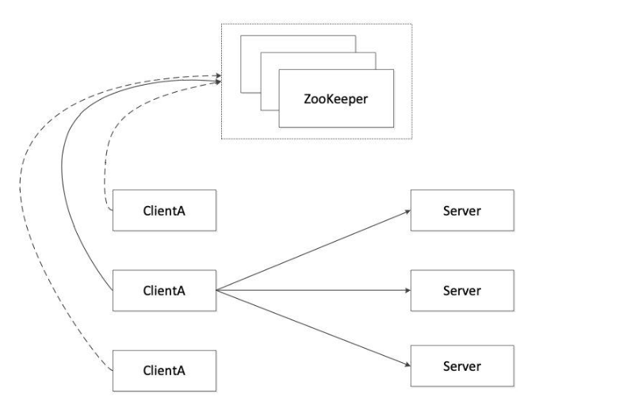
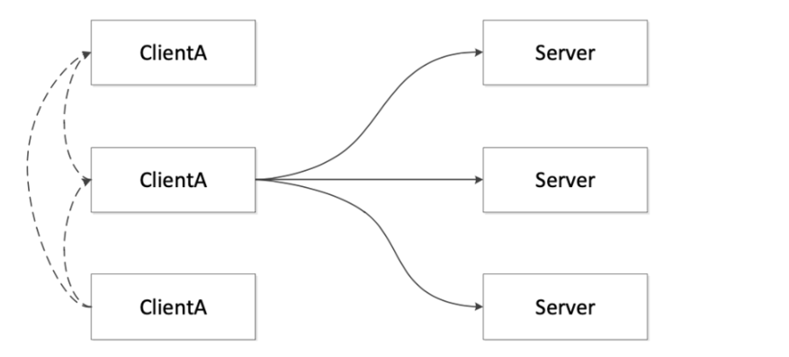
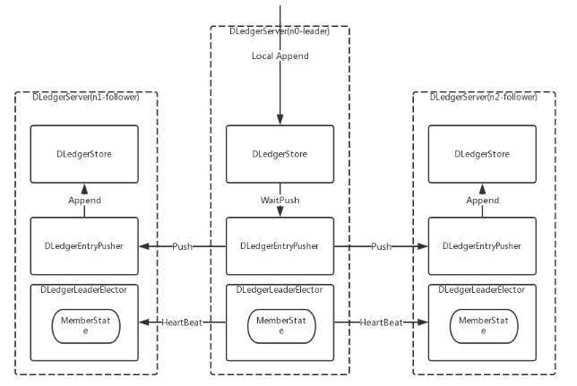
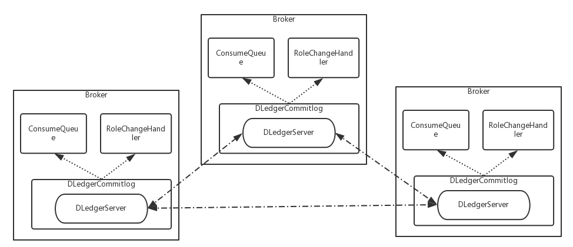

# RocketMq容灾、高可用方案

## 一、实现分布式集群多副本的三种方式

### 1、M/S模式

```bash
     即Master/Slaver模式。该模式在过去使用的最多，RocketMq之前也是使用这样的主从模式来实现的。主从模式分为同步模式和异步模式，区别是在同步模式下只有主从复制完毕才会返回给客户端；而在异步模式中，主从的复制是异步的，不用等待即可返回.
     
     同步模式特点：高延迟、低吞吐、无数据丢失(发生故障时)、自动故障转移、强一致性
     异步模式特点：低延迟、高吞吐、少量数据丢失(主挂掉时)、平均修复时间较长、最终一致性
```

### 2、基于zookeeper服务



```bash
    和M/S模式相比zookeeper模式是自动选举的主节点，不过rocketMq暂时不支持zookeeper，且基于ZooKeeper的服务也带来一个比较严重的问题：依赖加重。因为运维ZooKeeper是一件很复杂的事情。
```

### 3、基于raft




```bash
    相比zookeeper，raft自身就可以实现选举，raft通过投票的方式实现自身选举leader。去除额外依赖。目前RocketMq 4.5.0已经支持
```

## 二、Dledger介绍

github地址：https://github.com/openmessaging/dledger

```bash
    Dledger是一个基于Raft的 Commitlog 存储 Library。DLedger 定位是一个工业级的 Java Library，可以友好地嵌入各类 Java 系统中，满足其高可用、高可靠、强一致的需求。Dledger是基于日志实现的，只拥有日志的写入和读出接口，且对顺序读出和随机读出做了优化。
    DLedger 的实现大体可以分为以下两个部分： 1.选举 Leader 2.复制日志
```



### 1、Dledger在RocketMq的实现



**实现方式**

```bash
1.DLedgerCommitlog 用来代替现有的 Commitlog 存储实际消息内容，它通过包装一个 DLedgerServer 来实现复制；
2.依靠 DLedger 的直接存取日志的特点，消费消息时，直接从 DLedger 读取日志内容作为消息返回给客户端；
3.依靠 DLedger 的 Raft 选举功能，通过 RoleChangeHandler 把角色变更透传给 RocketMQ 的Broker，从而达到主备自动切换的目标
```


## 三、RocketMQ-Dledger集群搭建

```bash
介绍如何部署自动容灾切换的 RocketMQ-on-DLedger Group。

1.RocketMQ-on-DLedger Group 是指一组相同名称的 Broker，至少需要 3 个节点，通过 Raft 自动选举出一个 Leader，其余节点 作为 Follower，并在 Leader 和 Follower 之间复制数据以保证高可用。
2.RocketMQ-on-DLedger Group 能自动容灾切换，并保证数据一致。
3.RocketMQ-on-DLedger Group 是可以水平扩展的，也即可以部署任意多个 RocketMQ-on-DLedger Group 同时对外提供服务。
```

### 1、源码构建

#### 1.Dledger

```bash
git clone https://github.com/openmessaging/openmessaging-storage-dledger.git

cd openmessaging-storage-dledger

mvn clean install -DskipTests
```


#### 2.RocketMQ

```bash
git clone https://github.com/apache/rocketmq.git

cd rocketmq

git checkout -b store_with_dledger origin/store_with_dledger

mvn -Prelease-all -DskipTests clean install -U
```

### 2、编写配置

>每个 RocketMQ-on-DLedger Group 至少准备三台机器（本文假设为 3）。
>编写 3 个配置文件，建议参考 conf/dledger 目录下的配置文件样例。

**关键配置介绍**

| name                      | 含义                                                         | 举例                                                     |
| ------------------------- | ------------------------------------------------------------ | -------------------------------------------------------- |
| enableDLegerCommitLog     | 是否启动 DLedger                                             | true                                                     |
| dLegerGroup               | DLedger Raft Group的名字，建议和 brokerName 保持一致         | RaftNode00                                               |
| dLegerPeers               | DLedger Group 内各节点的端口信息，同一个 Group 内的各个节点配置必须要保证一致 | n0-127.0.0.1:40911;n1-127.0.0.1:40912;n2-127.0.0.1:40913 |
| dLegerSelfId              | 节点 id, 必须属于 dLegerPeers 中的一个；同 Group 内各个节点要唯一 | n0                                                       |
| sendMessageThreadPoolNums | 发送线程个数，建议配置成 Cpu 核数                            | 16                                                       |

**配置举例**

```bash
brokerClusterName = RaftCluster
brokerName=RaftNode00
listenPort=30911
namesrvAddr=127.0.0.1:9876
storePathRootDir=/tmp/rmqstore/node00
storePathCommitLog=/tmp/rmqstore/node00/commitlog
enableDLegerCommitLog=true
dLegerGroup=RaftNode00
dLegerPeers=n0-127.0.0.1:40911;n1-127.0.0.1:40912;n2-127.0.0.1:40913
## must be unique
dLegerSelfId=n0
sendMessageThreadPoolNums=16
```

### 3、启动Broker

```bash
nohup sh bin/mqbroker -c conf/dledger/xxx-n0.conf & 
nohup sh bin/mqbroker -c conf/dledger/xxx-n1.conf & 
nohup sh bin/mqbroker -c conf/dledger/xxx-n2.conf &
```

### 4、容灾高可用方案推荐

```bash
目前RocketMq主要有两种选择
1.M/S
2.Dledger模式
两种的优缺点：

Master/Slave
优点：实现简单
缺点：不能自动控制节点切换，一旦出了问题，需要人为介入。

Dledger
优点：可以自己协调，并且去除依赖。
缺点: 只
```


