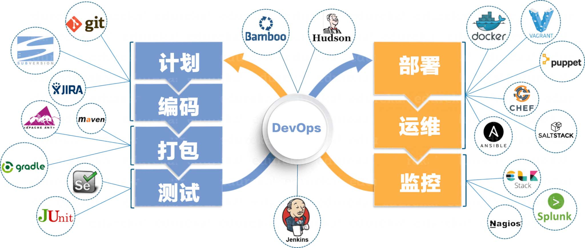

[TOC]

# Devops简介

## 一、介绍

```bash
    Devops实际上是一系列敏捷方法+精益方法的集合，这些方法集合使得dev + ops （即开发+运维）之间，建立良好的沟通和协作，更快更可靠的创建高质量软件版本。
```

## 二、本质

```bash
    它的本质是在软件开发周期中提供一系列的方法，使得软件版本可以快速的交付。
```

## 三、适用领域

```bash
     DevOps 适合“软件即服务（SaaS）”或“平台即服务（PaaS）”这样的应用领域，其显著的特征就是：打通用户、PMO、需求、设计、开发（Dev）、测试、运维（Ops）等各上下游部门。
```

## 四、实现方式

```bash
    一般软件开发过程可以分成：持续开发，持续测试，持续集成，持续部署和持续监控等部分。因此，devops的实现也和这些过程息息相关。
```


### 1、持续开发

```bash
1.持续开发是DevOps 软件不断开发的阶段。
2.与瀑布模型不同的是，敏捷开发中软件可交付成果被分解为短开发周期的多个任务节点，在很短的时间内开发并交付。
3.这个阶段包括编码和构建阶段，并使用Git和SVN等工具来维护不同版本的代码，以及Ant、Maven、Gradle等工具来构建/打包代码到可执行文件中，这些文件可以转发给自动化测试系统进行测试。
```

### 2、持续测试

```bash
1.在这个阶段，开发的软件将被持续地测试bug。
2.对于持续测试，使用自动化测试工具，如Selenium、Robotframework等。这些工具允许质量管理系统完全并行地测试多个代码库，以确保功能中没有缺陷。
3.在这个阶段，使用Docker容器实时模拟“测试环境”也是首选。一旦代码测试通过，它就会不断地与现有代码集成。
```

### 3、持续集成

```bash
1.这是支持新功能的代码与现有代码集成的阶段。
2.由于软件在不断地开发，更新后的代码需要不断地集成，并顺利地与系统集成，以反映对最终用户的需求更改。更改后的代码，还应该确保运行时环境中没有错误，允许我们测试更改并检查它如何与其他更改发生反应。
3.Jenkins是一个非常流行的用于持续集成的工具。使用Jenkins，可以从git存储库提取最新的代码修订，并生成一个构建，最终可以部署到测试或生产服务器。可以将其设置为在git存储库中发生更改时自动触发新构建，也可以在单击按钮时手动触发。
```

### 4、持续部署

```bash
1.它是将代码部署到生产环境的阶段。
2.在这里，我们确保在所有服务器上正确部署代码。 如果添加了任何功能或引入了新功能，那么应该准备好迎接更多的网站流量。 3.因此，系统运维人员还有责任扩展服务器以容纳更多用户。
4.由于新代码是连续部署的，因此配置管理工具可以快速，频繁地执行任务。 Puppet，Chef，SaltStack和Ansible是这个阶段使用的一些流行工具。容器化工具在部署阶段也发挥着重要作用。 5.Docker和Vagrant是流行的工具，有助于在开发，测试，登台和生产环境中实现一致性。 除此之外，它们还有助于轻松扩展和缩小实例。
```

### 5、持续监控

```bash
1.这是DevOps生命周期中非常关键的阶段，旨在通过监控软件的性能来提高软件的质量。这种做法涉及运营团队的参与，他们将监视用户活动中的错误/系统的任何不正当行为。
2.这也可以通过使用专用监控工具来实现，该工具将持续监控应用程序性能并突出问题。
3.使用的一些流行工具是Splunk，ELK Stack，Nagios，NewRelic和Sensu。这些工具可帮助密切监视应用程序和服务器，以主动检查系统的运行状况。它们还可以提高生产率并提高系统的可靠性，从而降低IT支持成本。
4.发现的任何重大问题都可以向开发团队报告，以便可以在持续开发阶段进行修复。这些DevOps阶段连续循环进行，直到达到所需的产品质量。下面的图表将显示可以在DevOps生命周期的哪个阶段使用哪些工具。
```

## 五、Devops工具

```bash
为了实现Devops，可以有许多工具：
```



### 1、监控工具

```bash
    比较老牌的就是Zabbix,Nagios，用Zabbix的感觉是最多的。国内的有小米开源的OpenFalcon。这类监控工具一般是对服务器、服务（中间件，数据库）做一些常用指标的监控。
```

### 2、性能分析/APM工具

```bash
    APM很多时候被认为是监控的一个细分领域。但在现代复杂分布式系统架构下，APM工具往往更能准确、直接的帮助用户定位到性能瓶颈，比如哪一个URL访问慢、哪一个方法执行慢、哪一个SQL执行慢。在以往要想拿到这些数据，往往得需要比较资深的架构师、DBA一起合作才能拿到这些数据，而定位瓶颈的效率往往还不太高。现在通过APM工具能让普通技能的运维人员，也很高效的定位到这些深层的问题。现在商用的APM工具不少，国外的有Newrelic，国内知名的就有听云、Oneapm、透视宝这些。开源的也有Pinpoint（naver开源）、Zipkin（twitter开源）、CAT（大众点评开源）.
```

### 3、批量+自动化运维工具

```bash
    这里就比较多了，知名的有Puppet、Ansible、Chef、Saltstack这些。这些在网上的资料也比较多，找比较新版本的官方文档看就行了。Puppet和chef是比较早期的工具，受众面也很大，不过这两个工具基于ruby实现，现在要找到熟悉ruby的人来做这块的二次开发可不容易。而ansible和saltstack则相对新生代一些，目前用户基数增长很快，基于python实现，要找做二次开发的人也相对容易的多。
```

### 4、集中日志分析工具

```bash
    在一个服务器比较多的环境下，如何集中的管理和分析、查询日志，已经变成一个比较强的需求了。想象一下，如果发生了某个错误，你还得一台台机器去翻日志文件，是不是很蛋疼。在这个需求驱动下，就诞生了一些集中日志分析工具。在开源领域，比较知名的就是ELK这一套工具了，涵盖了日志采集、上报、搜索、展现这一类基本需求，现在比较多的上规模的企业都用这个，网上资料也大把。核心实现机制都是通过一些日志采集代理（类似Filebeat）去爬日志文件，将最新的部分提交到采集服务端，后端再对接搜索引擎，能支持很快速、准确的搜索即可。有一个国内不怎么知名的Sentry日志收集服务，比较轻量级，本身是Python做的，与各种语言的日志框架做了非常好的集成，可以很方便的集中收集异常日志，并分配给对应的开发人员。它在github上有10000多个star了，这在DevOps相关的软件里，都是排名非常靠前的了。
```

### 5、持续集成/发布工具

```bash
    我接触的人都是用Jenkins的，没有用其他的，可能跟我所在的技术圈子有关。集成打包的过程其实一般都比较简单，配好版本库和打包脚本就行。但发布的过程就比较复杂，有些是全量发布，但也有非常多的IT团队采用增量发布。这个方面如果想用工具，还是得先分析清楚现有的发布流程，手工情况下怎么做，哪些能通过自动化工具来完成。
```

### 6、Laas集成

```bash
    最近两年的公有云推广比较迅速，很多新的服务器采购都被导入到云上去了。现在主流的公有云都提供了比较完备的API，基于这些API也可以做一些针对基础资源的自动化操作，比如游戏行业的快速开服。
```

## 六、优势

```bash
    由于从开发、测试、集成、部署，都可以随时触发，并实现自动化，因此，产品可以实现快速迭代，快速发布，快速响应
```

## 七、总结

```bash
 Devops也是一个自动化过程，允许快速，安全和高质量的软件开发和发布，同时保持所有利益相关者在一个循环中。 这就是DevOps获得越来越多的大型互联网公司青睐的真正原因。
```


