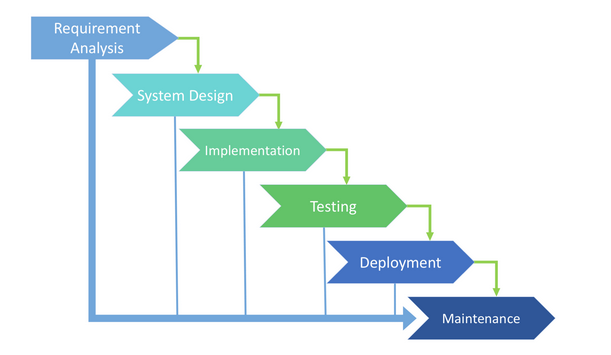
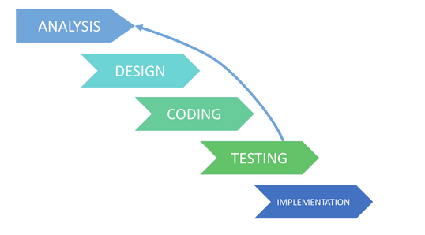
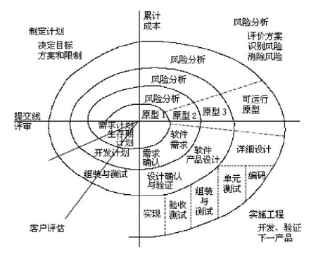
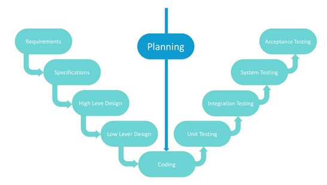
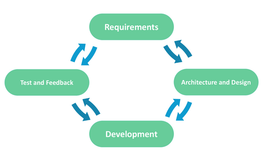
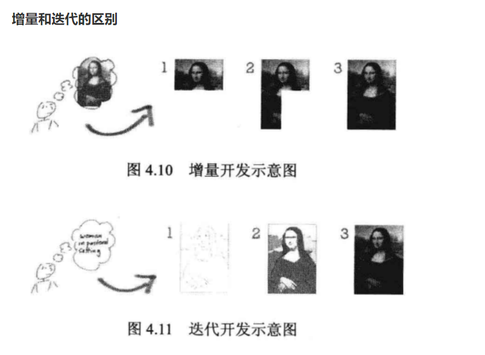

# 持续集成简介

## 一、软件开发生命周期

		软件开发生命周期又叫做SDLC(Software Development Life Cycle)，它是集合了计划、开发、测试 和部署过程的集合。
	
		一个软件从定义，开发，运行维护，直到最终要经历一个时期的过程 ，这个时期称为软件的生命周期 系统软件生命周期一般为分析，设计，实现和测试与维护这几个阶段，


### 1、需求分析阶段

```bash
	这是生命周期的第一阶段，根据项目需求，团队执行一个可行性计划的分析。项目需求可能是公司内部或者客户提出的。这阶段主要是对信息的收集，也有可能是对现有项目的改善和重新做一个新的项目。还要分析项目的预算多长，可以从哪方面受益及布局，这也是项目创建的目标。
```


### 2、设计阶段

```bash
	第二阶段就是设计阶段，系统架构和满意状态(就是要做成什么样子，有什么功能)，和创建一个项目计划。计划可以使用图表，布局设计或者文者的方式呈现。
```


### 3、实现阶段

```bash
	第三阶段就是实现阶段，项目经理创建和分配工作给开者，开发者根据任务和在设计阶段定义的目标进行开发代码。依据项目的大小和复杂程度，可以需要数月或更长时间才能完成。
```


### 4、测试阶段

```bash
	在设计测试用例的基础上，测试软件的各个组成模块，然后，在把各个模块集成起来，测试整个产品的功能和性能是否能够满足已有的规格说明。
	测试人员进行代码测试 ，包括功能测试、代码测试、压力测试等
```


### 5、维护、进化阶段

```bash
	最后进阶段就是对产品不断的进化改进和维护阶段，根据用户的使用情况，可能需要对某功能进行修改，bug修复，功能增加等。
```


## 二、SDLC模型

### 1、类型

```bash
SDLC模型：
	瀑布模型（Waterfall model）
	迭代模型（Iterative model）
	螺旋模型（spiral model）
	V型模型（V-shape model）
	敏捷模型（Agile model）
```


### 2、瀑布模型

```bash
	是一个级联SDLC模型，其中开发过程看起来像流程，一步一步地进行分析，预测，实现，测试，实施和支持阶段。
```



```bash
优点：简单易用和理解；每个阶段都有明确的结果和流程审查；易于确定开发周期中的关键点；易于分类和确定任务的优先级

缺点：只有在最后一个阶段结束后，软件才会准备就绪；高风险和不确定性；阶段的进展很难衡量

适用性：适用于产品定义明确且不模棱两可的小型或中型项目，不适合长期项目。
```


### 3、迭代模型

```bash
	在项目开始之前，迭代模型不需要完整的需求列表。开发过程可以从对功能部件的要求开始，可以在以后扩展。该过程是重复的，允许为每个循环制作新版本的产品。每次迭代都包括开发系统的单独组件，然后，将此组件添加到之前开发的功能中。说到数学术语，迭代模型是顺序逼近方法的实现; 这意味着逐渐接近计划的最终产品形状。
```



```bash
优点：某些功能可以在开发生命周期的开始阶段快速开发；可以应用并行开发；进展很容易衡量

缺点：迭代模型比瀑布模型需要更多资源；需要持续管理；可能会出现架构或设计问题，因为在短期规划阶段并未预见到所有要求；过程很难管理

适用性：主要任务是预定义的，但细节可能随着时间而推进，小项目的糟糕选择，适用于大型项目
```


### 4、螺旋模型

```bash
	螺旋模型分阶段结合了架构和原型。它是Iterative和Waterfall SDLC模型的组合，具有重要的风险分析重点。螺旋模型的主要问题是确定进入下一阶段的正确时机。建议将初步设定的时间范围作为此问题的解决方案。即使前一阶段的工作尚未完成，也将根据计划完成向下一阶段的转变。该计划是根据统计数据引入的，即使从个人开发人员的经验来看，也可以在之前的项目中收到。
```



```bash
优点：开发过程准确记录，可根据变化进行扩展；可伸缩性允许在相对较晚的阶段进行更改并添加新功能；早期的工作原型已经完成 - 用户可以更快地指出这些缺陷

缺点：早期的工作原型已经完成 - 用户可以更快地指出这些缺陷；大量的中间阶段需要过多的文档

适用性：对小项目可能无效，具有中级或高级风险的项目，防止这些风险非常重要，客户不确定要求，预计在开发周期中会进行重大编辑。
```


### 5、V型模型

```bash
	V型模型是经典瀑布模型的扩展，它基于每个开发阶段的相关测试阶段。这是一个非常严格的模型，下一阶段仅在前一阶段之后开始。这也称为“验证和验证”模型。每个阶段都有当前的过程控制，以确保可以转换到下一个阶段。
```



```bash
优点：V形模型的每个阶段都有严格的结果，因此很容易控制；测试和验证在早期阶段进行

缺点：缺乏灵活性、相对较大的风险

适用性：适用于需求稳定且清晰的小型项目、对于需要进行准确产品测试的项目。
```


### 6、敏捷模型

```bash
	在每次开发迭代之后的敏捷方法中，客户能够看到结果并理解他是否满意或不满意。这是敏捷软件开发生命周期模型的优势之一。其缺点之一是，由于缺乏明确的要求，很难估计资源和开发成本。极限编程是敏捷模型的实际应用之一。这种模型的基础包括每周短暂的会议 - Sprint是Scrum方法的一部分。
	敏捷开发(Agile Development) 的核心是迭代开发(Iterative Development) 与 增量开发 (Incremental Development) 。
```



```bash
优点：功能需求的更正被实施到开发过程中以提供竞争力；项目按短而透明的迭代划分；灵活的变更过程使风险最小化

缺点：新要求可能与现有架构冲突；通过所有更正和更改，项目可能会超出预期时间；由于永久性变化而无法衡量最终成本

适用性：用户需求动态变化的项目
```


#### 1)迭代开发

```bash
	对于大型软件项目，传统的开发方式是采用一个大周期(比如一年)进行开发，整个过程就是一次"大 开发";迭代开发的方式则不一样，它将开发过程拆分成多个小周期，即一次"大开发"变成多次"小开 发"，每次小开发都是同样的流程，所以看上去就好像重复在做同样的步骤。
```


#### 2)增量开发

```bash
	软件的每个版本，都会新增一个用户可以感知的完整功能。也就是说，按照新增功能来划分迭代。
```



#### 3)敏捷开发如何迭代

```bash
	虽然敏捷开发将软件开发分成多个迭代，但是也要求，每次迭代都是一个完整的软件开发周期，必须按
	照软件工程的方法论，进行正规的流程管理。
```


## 三、持续集成

```bash
	持续集成( Continuous integration ， 简称 CI )指的是，频繁地(一天多次)将代码集成到主干。 持续集成的目的，就是让产品可以快速迭代，同时还能保持高质量。它的核心措施是，代码集成到主干之前，必须通过自动化测试。只要有一个测试用例失败，就不能集成。通过持续集成，团队可以快速的从一个功能到另一个功能，简而言之，敏捷软件开发很大一部分都要归功于持续集成。在持续集成的过程当中主要包括以下步骤：提交、测试、构建（容器需要构建， 编译型语言编译）、部署及回滚。
```


### 1、持续集成要素

```bash
1.一个自动构建过程，从检出代码、编译构建、运行测试、结果记录、测试统计等都是自动完成的，无需人工干预。 

2.一个代码存储库，即需要版本控制软件来保障代码的可维护性，同时作为构建过程的素材库，一般使用SVN或Git。

3.一个持续集成服务器， Jenkins 就是一个配置简单和使用方便的持续集成服务器。
```


### 2、持续集成的好处

```bash
1、降低风险，由于持续集成不断去构建，编译和测试，可以很早期发现问题，所以修复的代价就少
2、对系统健康持续检查，减少发布风险带来的问题
3、减少重复性工作
4、持续部署，提供可部署单元包
5、持续交付可供使用的版本
6、增强团队信心
```