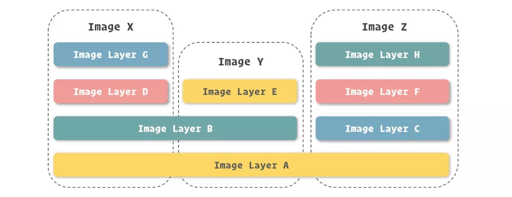
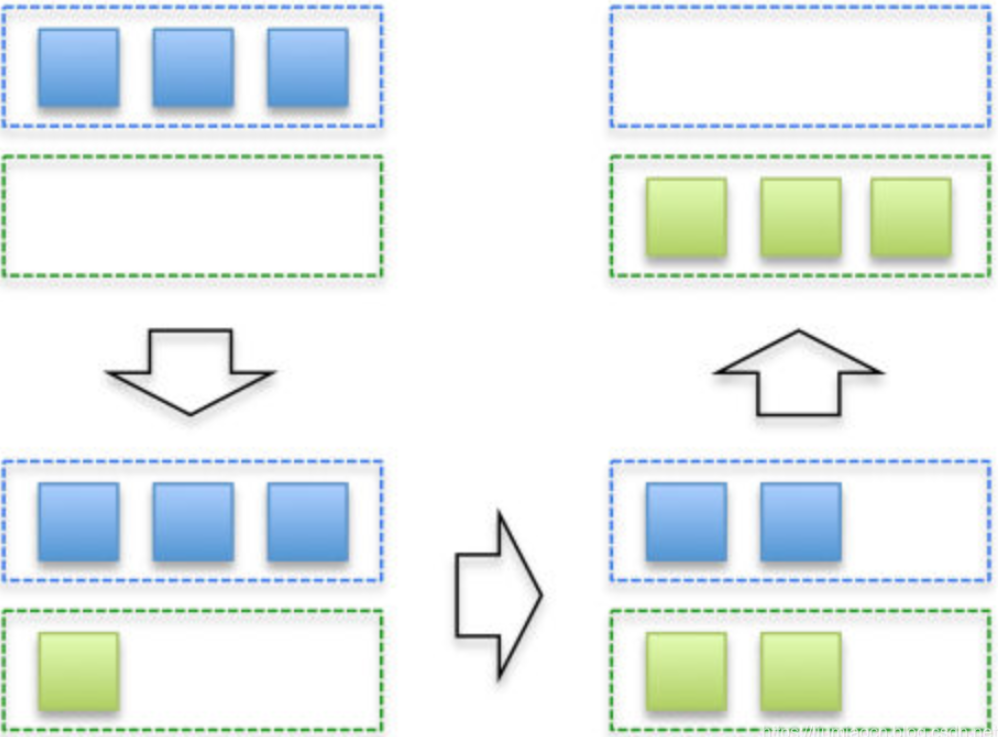
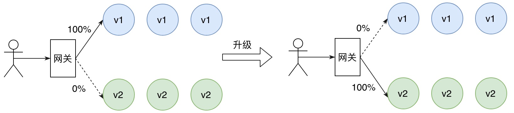
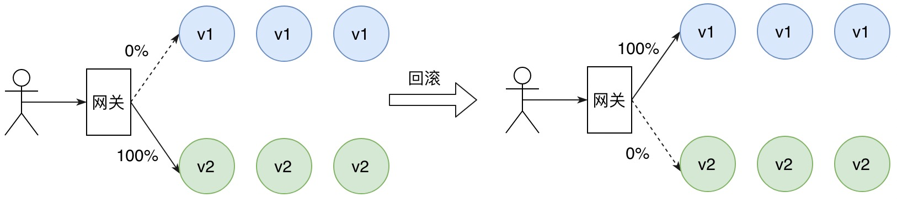
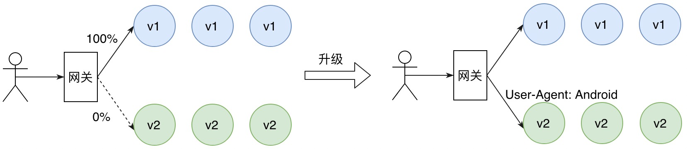
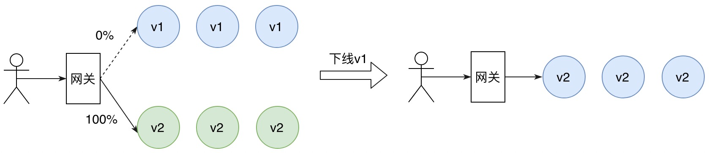
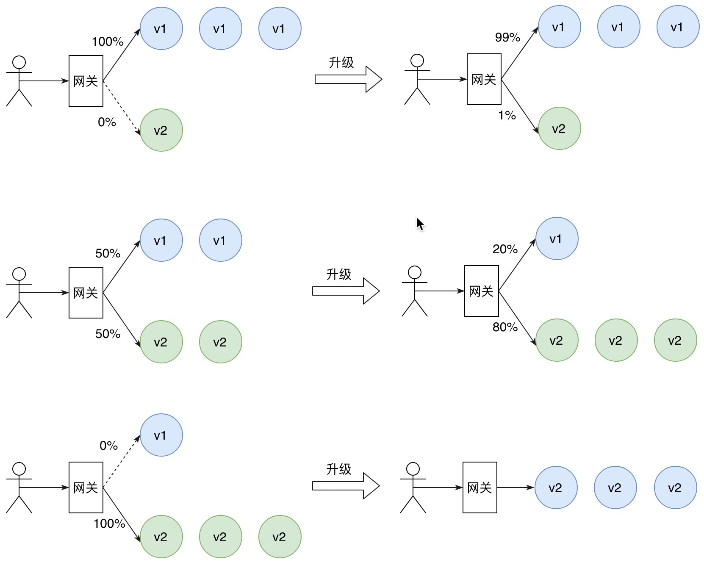
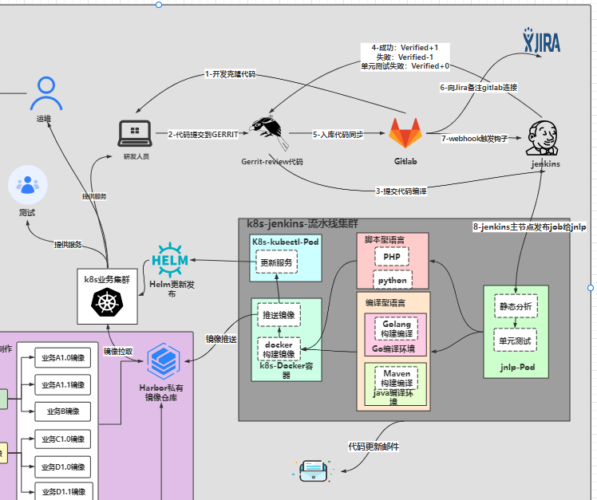

# K8s-CICD流程介绍

## 一、镜像升级方式

### 1、pod升级为什么要基于镜像升级

#### 1.docker镜像

##### 1)介绍

>​    可以将**Docker镜像理解为包含应用程序以及其相关依赖的一个基础文件系统**，在Docker容器启动的过程中，它以只读的方式被用于创建容器的运行环境。

> ​    Docker镜像其实是由基于UnionFS文件系统的一组镜像层依次挂载而得，而每个镜像层包含的其实是对上一镜像层的修改，这些修改其实是发生在容器运行的过程中的。所以，也可以反过来理解，镜像是对容器运行环境进行持久化存储的结果。

##### 2)镜像

> ​     与其他虚拟机镜像管理不同，Docker将镜像管理纳入到了自身设计之中，也即所有的Docker镜像都是按照Docker所设定oci规范的逻辑打包的。

> ​     常见的虚拟机镜像，通常是由提供者打包成镜像文件，安装者从网上下载或是其他方式获得，恢复到虚拟机中的文件系统里；镜像必须通过oci规范打包，也必须通过支持oci规范的容器技术下载或导入后使用，不能单独直接恢复成容器中的文件系统。

>​    虽然失去了灵活性，但固定的格式意味着可以很轻松的在不同的服务器间传递镜像，配合Docker自身对镜像的管理功能，使得在不同的机器中传递和共享服务变得非常方便，这也是Docker能够提升工作效率的一处体现。

##### 3）镜像实现

>​    对于每一个记录文件系统修改的镜像层来说，Docker都会根据它们的信息生成了一个Hash码，足以保证全球唯一性，这种编码（64长度的字符串）的形式在Docker很多地方都有体现。

>由于镜像每层都有唯一的编码，就能够区分不同的镜像层并能保证它们的内容与编码是一致的，这带来了另一项好处，允许在镜像之间共享镜像层。

>​    由Docker官方提供的两个镜像ElasticSearch镜像和Jenkins镜像都是在OpenJDK镜像之上修改而得，实际使用的时候，这两个镜像是可以共用OpenJDK镜像内部的镜像层的。

>​    这带来的一项好处就是让镜像可以共用存储空间，达到1+1<2的效果，为在同一台机器里存放众多镜像提供了可能。

> ​    一个虚拟机镜像的占用空间往往用GB来衡量，而Docker管理之下的镜像，占用空间是以MB为单位进行衡量的，加之镜像之间还能够共享部分的镜像层，也就是共享存储空间，所以在常见的硬盘里放下几十、数百个镜像也不是什么难事。

#### 2.为什么要基于镜像升级？

> 数据持久化只存放数据，干净
>
> 方便项目迁移，新建
>
> 
>
> 如果使用jar包升级：
>
> ​    如果基于nfs挂载jar包的方式升级，需要额外上传jar包到nfs目录，然后更改pod配置。随着服务的数量不断增加，管理成本越来越大。
>
> ​    nfs目录结构会很乱，占用大量空间。
>
> ​    要对jar包版本控制，不同版本放在nfs不同的地方
>
> ​    jar包升级不方便回滚
>
> ​    改一个文件里面的一行，就要整个压缩包都拷过去？
>
> 
>
> 如果使用镜像升级
>
> ​    jar包放在镜像，理论上只要有个服务器运行这个镜像，我服务就可以起来。不需要额外配置挂载等其他配置
>
> ​    镜像升级已经有了成熟的方案
>
> ​    基于镜像升级只需要改下pod配置就可以实现升级

## 二、常见升级方式

### 1、滚动发布

> k8s默认升级方式

> ​    那么万一发布失败了呢？此时就得回滚，因为不同的上线是不一样的，有时候你仅仅是对代码做一些微调，大多数时候是针对新需求有上线，加了新的代码/接口，有时候是架构重构，实现机制和技术架构都变了
>
>    所以回滚的话，也不太一样，比如你如果是加了一些新的接口，结果上线失败了，此时新接口没人访问，直接代码回滚到旧版本重新部署就行了；
>
>    如果你是做技术架构升级，此时失败了，可能很多请求已经处理失败，数据丢失，严重的时候会导致公司丢失订单，或者是数据写入了但是都错了。
>
> 
>
>    滚动发布的话，风险还是比较大的，因为一旦你用了自动化的滚动发布，那么发布系统会自动把你的所有机器都部署新版本的代码，这个时候中间很有可能会出现问题，导致大规模的异常和损失

### 3、蓝绿发布

>​    蓝绿发布需要对服务的新版本进行冗余部署，一般新版本的机器规格和数量与旧版本保持一致，相当于该服务有两套完全相同的部署环境，只不过此时只有旧版本在对外提供服务，新版本作为热备。
>
>​    当服务进行版本升级时，我们只需将流量全部切换到新版本即可，旧版本作为热备。
>
>​    由于冗余部署的缘故，所以不必担心新版本的资源不够。
>
>​    如果新版本上线后出现严重的程序 BUG，那么我们只需将流量全部切回至旧版本，大大缩短故障恢复的时间。待新版本完成 BUG 修复并重新部署之后，再将旧版本的流量切换到新版本。
>
>​    蓝绿发布通过使用额外的机器资源来解决服务发布期间的不可用问题，当服务新版本出现故障时，也可以快速将流量切回旧版本。

> 如图，某服务旧版本为 v1，对新版本 v2 进行冗余部署。版本升级时，将现有流量全部切换为新版本 v2。

> 当新版本 v2 存在程序 BUG 或者发生故障时，可以快速切回旧版本 v1。

#### 1.蓝绿部署的优点：

1、部署结构简单，运维方便；

2、服务升级过程操作简单，周期短。

#### 2.蓝绿部署的缺点：

1、资源冗余，需要部署两套生产环境；

2、新版本故障影响范围大。

### 4、A/B测试

>   相比于蓝绿发布的流量切换方式，A/B 测试基于用户请求的元信息将流量路由到新版本，这是一种基于请求内容匹配的灰度发布策略。
>
>   只有匹配特定规则的请求才会被引流到新版本，常见的做法包括基于 Http Header 和 Cookie。
>
>​       基于 Http Header 方式的例子，
>
>​           例如 User-Agent 的值为 Android 的请求 （来自安卓系统的请求）可以访问新版本，其他系统仍然访问旧版本。
>
>​       基于 Cookie 方式的例子，
>
>​           Cookie 中通常包含具有业务语义的用户信息，例如普通用户可以访问新版本，VIP 用户仍然访问旧版本。

> 如图，某服务当前版本为 v1，现在新版本 v2 要上线。希望安卓用户可以尝鲜新功能，其他系统用户保持不变。

>通过在监控平台观察旧版本与新版本的成功率、RT 对比，当新版本整体服务预期后，即可将所有请求切换到新版本 v2，最后为了节省资源，可以逐步下线到旧版本 v1。

#### 1.A/B 测试的优点：

1、可以对特定的请求或者用户提供服务新版本，新版本故障影响范围小；

2、需要构建完备的监控平台，用于对比不同版本之间请求状态的差异。

#### 2.A/B 测试的缺点：

1、仍然存在资源冗余，因为无法准确评估请求容量；

2、发布周期长。

### 5、金丝雀发布

>​    在蓝绿发布中，由于存在流量整体切换，所以需要按照原服务占用的机器规模为新版本克隆一套环境，相当于要求原来1倍的机器资源。
>
>​    在 A/B 测试中，只要能够预估中匹配特定规则的请求规模，我们可以按需为新版本分配额外的机器资源。
>
>​    相比于前两种发布策略，金丝雀发布的思想则是将少量的请求引流到新版本上，因此部署新版本服务只需极小数的机器。
>
>​    验证新版本符合预期后，逐步调整流量权重比例，使得流量慢慢从老版本迁移至新版本，期间可以根据设置的流量比例，对新版本服务进行扩容，同时对老版本服务进行缩容，使得底层资源得到最大化利用。

#### 1.金丝雀发布的优点：

1、按比例将流量无差别地导向新版本，新版本故障影响范围小；

2、发布期间逐步对新版本扩容，同时对老版本缩容，资源利用率高。

#### 2.金丝雀发布的缺点：

1、流量无差别地导向新版本，可能会影响重要用户的体验；

2、发布周期长。

### 6、总结

- 蓝绿发布：简单理解就是流量切换，依据热备的思想，冗余部署服务新版本。
- A/B 测试：简单理解就是根据请求内容（header、cookie）将请求流量路由到服务的不同版本。
- 金丝雀发布：是一种基于流量比例的发布策略，部署一个或者一小批新版本的服务，将少量（比如 1%）的请求引流到新版本，逐步调大流量比重，直到所有用户流量都被切换新版本为止。

好用的金丝雀和A/B发布的方式离不开istio

## 三、架构图

