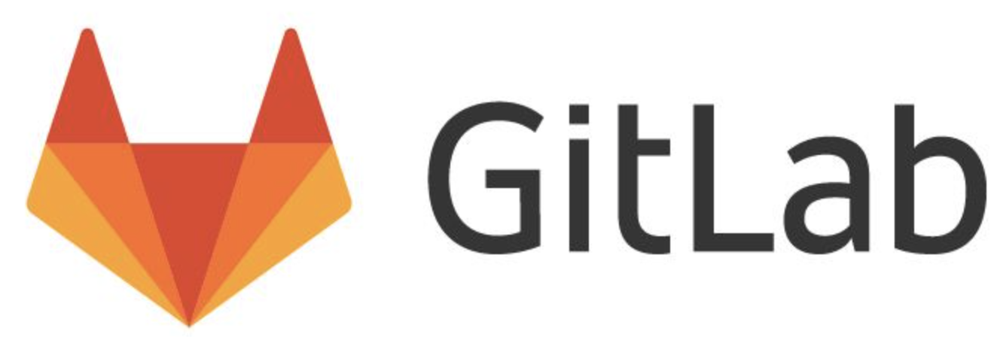
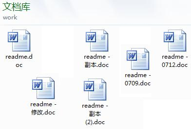
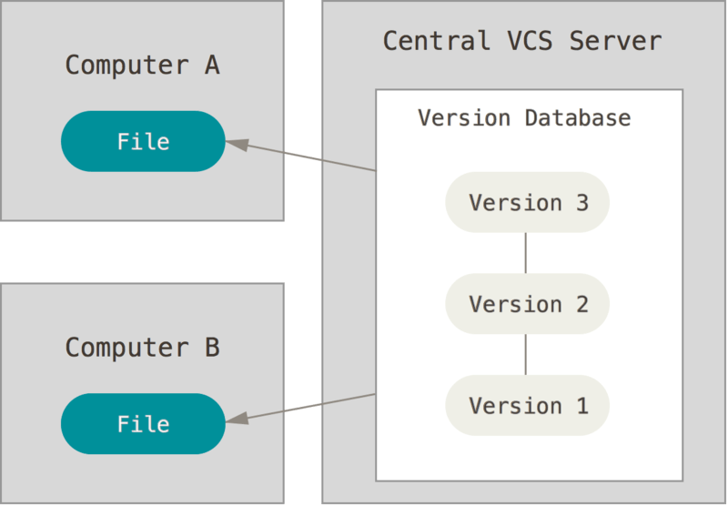
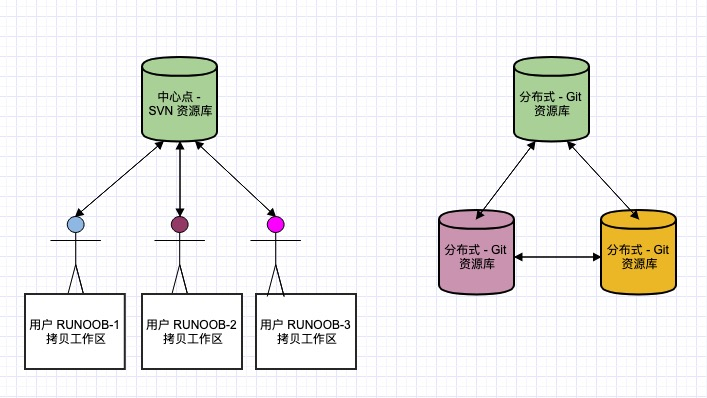
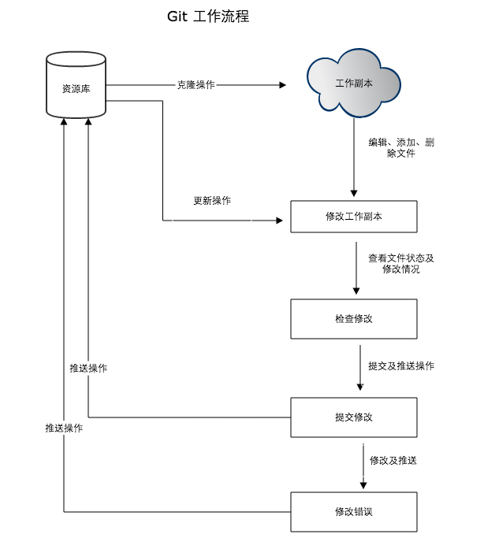
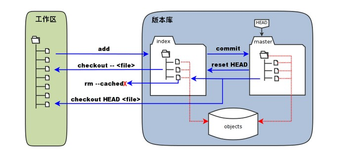

# Git简介

## GitLab私有代码仓库



```bash
	GitLab 是一个用于仓库管理系统的开源项目，使用Git作为代码管理工具，并在此基础上搭建起来的web服务。
	GitLab和GitHub一样属于第三方基于Git开发的作品（私有仓库），GITLAB免费且开源(基于MIT协议)，与Github类似， 可以注册用户，任意提交你的代码，添加SSHKey等等。不同的是，GitLab是可以部署到自己的服务器 上，数据库等一切信息都掌握在自己手上，适合团队内部协作开发，你总不可能把团队内部的智慧总放 在别人的服务器上吧?简单来说可把GitLab看作个人版的GitHub。
```


## 一、Git简介


### 1、Git是什么？

```bash
Git是目前世界上最先进的分布式版本控制系统（没有之一）。

Git是一个开源的分布式版本控制系统，用于敏捷高效地处理任何或小或大的项目。

Git 是 Linus Torvalds 为了帮助管理 Linux 内核开发而开发的一个开放源码的版本控制软件。

Git 与常用的版本控制工具 CVS, Subversion 等不同，它采用了分布式版本库的方式，不必服务器端软件支持。
```


## 二、版本控制系统

### 1、什么是版本控制系统？

```bash
版本控制是一种记录一个或若干文件内容变化，以便将来查阅特定版本修订情况的系统。我们对保存着软件源代码的文件作版本控制，但实际上，可以对任何类型的文件进行版本控制。

如果你用Microsoft Word写过长篇大论，那你一定有这样的经历：

想删除一个段落，又怕将来想恢复找不回来怎么办？有办法，先把当前文件“另存为……”一个新的Word文件，再接着改，改到一定程度，再“另存为……”一个新文件，这样一直改下去，最后你的Word文档变成了这样：
```



```bash
过了一周，你想找回被删除的文字，但是已经记不清删除前保存在哪个文件里了，只好一个一个文件去找，真麻烦。

看着一堆乱七八糟的文件，想保留最新的一个，然后把其他的删掉，又怕哪天会用上，还不敢删，真郁闷。

更要命的是，有些部分需要你的财务同事帮助填写，于是你把文件Copy到U盘里给她（也可能通过Email发送一份给她），然后，你继续修改Word文件。一天后，同事再把Word文件传给你，此时，你必须想想，发给她之后到你收到她的文件期间，你作了哪些改动，得把你的改动和她的部分合并，真困难。

于是你想，如果有一个软件，不但能自动帮我记录每次文件的改动，还可以让同事协作编辑，这样就不用自己管理一堆类似的文件了，也不需要把文件传来传去。如果想查看某次改动，只需要在软件里瞄一眼就可以，岂不是很方便？

这个软件用起来就应该像这个样子，能记录每次文件的改动：
```

| 版本 | 文件名      | 用户 | 说明                   | 日期       |
| :--- | :---------- | :--- | :--------------------- | :--------- |
| 1    | service.doc | 张三 | 删除了软件服务条款5    | 7/12 10:38 |
| 2    | service.doc | 张三 | 增加了License人数限制  | 7/12 18:09 |
| 3    | service.doc | 李四 | 财务部门调整了合同金额 | 7/13 9:51  |
| 4    | service.doc | 张三 | 延长了免费升级周期     | 7/14 15:17 |

这样，我们就结束了手动管理多个“版本”的史前时代，进入到版本控制的20世纪。


### 2、本地版本控制系统

```bash
	许多人习惯用复制整个项目目录的方式来保存不同的版本，或许还会改名加上备份时间以示区别。 这么做唯一的好处就是简单，但是特别容易犯错。 有时候会混淆所在的工作目录，一不小心会写错文件或者覆盖意想外的文件。
	为了解决这个问题，人们很久以前就开发了许多种本地版本控制系统，大多都是采用某种简单的数据库来记录文件的历次更新差异。
```


```bash
	其中最流行的一种叫做 RCS，现今许多计算机系统上都还看得到它的踪影。 甚至在流行的 Mac OS X 系统上安装了开发者工具包之后，也可以使用 rcs 命令。 它的工作原理是在硬盘上保存补丁集(补丁是指文件修订前后的变化)；通过应用所有的补丁，可以重新计算出各个版本的文件内容。
```


### 3、集中化的版本控制系统

```bash
	接下来人们又遇到一个问题，如何让在不同系统上的开发者协同工作？ 于是，集中化的版本控制系统(Centralized Version Control Systems，简称 CVCS)应运而生。 这类系统，诸如 CVS、Subversion(SVN) 以及 Perforce 等，都有一个单一的集中管理的服务器，保存所有文件的修订版本，而协同工作的人们都通过客户端连到这台服务器，取出最新的文件或者提交更新。多年以来，这已成为版本控制系统的标准做法。
```



```bash
	这种做法带来了许多好处，特别是相较于老式的本地 VCS 来说。 现在，每个人都可以在一定程度上看到项目中的其他人正在做些什么。 而管理员也可以轻松掌控每个开发者的权限，并且管理一个 CVCS 要远比在各个客户端上维护本地数据库来得轻松容易。
	事分两面，有好有坏。 这么做最显而易见的缺点是中央服务器的单点故障。 如果宕机一小时，那么在这一小时内，谁都无法提交更新，也就无法协同工作。 如果中心数据库所在的磁盘发生损坏，又没有做恰当备份，毫无疑问您将丢失所有数据——包括项目的整个变更历史，只剩下人们在各自机器上保留的单独快照。本地版本控制系统也存在类似问题，只要整个项目的历史记录被保存在单一位置，就有丢失所有历史更新记录的风险。
```


### 4、分布式版本控制系统

```bash
	于是分布式版本控制系统(Distributed Version Control System，简称 DVCS)面世了。 在这类系统中，像 Git、Mercurial、Bazaar 以及 Darcs 等，客户端并不只提取最新版本的文件快照，而是把代码仓库完整地镜像下来。 这么一来，任何一处协同工作用的服务器发生故障，事后都可以用任何一个镜像出来的本地仓库恢复。 因为每一次的克隆操作，实际上都是一次对代码仓库的完整备份。如下图所示 
```


```bash
	更进一步，许多这类系统都可以指定和若干不同的远端代码仓库进行交互。藉此，你就可以在同一个项目中，分别和不同工作小组的人相互协作。可以根据需要设定不同的协作流程，比如层次模型式的工作流，而这在以前的集中式系统中是无法实现的。
```


## 三、Git与SVN区别

```bash
Git 不仅仅是个版本控制系统，它也是个内容管理系统(CMS)，工作管理系统等。

如果你是一个具有使用 SVN 背景的人，你需要做一定的思想转换，来适应 Git 提供的一些概念和特征。

Git 与 SVN 区别点:
	1、Git 是分布式的，SVN 不是：这是 Git 和其它非分布式的版本控制系统，例如 SVN，CVS 等，最核心的区别。

	2、Git 把内容按元数据方式存储，而 SVN 是按文件：所有的资源控制系统都是把文件的元信息隐藏在一个类似 .svn、.cvs 等的文件夹里。

	3、Git 分支和 SVN 的分支不同：分支在 SVN 中一点都不特别，其实它就是版本库中的另外一个目录。

	4、Git 没有一个全局的版本号，而 SVN 有：目前为止这是跟 SVN 相比 Git 缺少的最大的一个特征。

	5、Git 的内容完整性要优于 SVN：Git 的内容存储使用的是 SHA-1 哈希算法。这能确保代码内容的完整性，确保在遇到磁盘故障和网络问题时降低对版本库的破坏。
```




## 四、Git简史

```bash
同生活中的许多伟大事物一样，Git 诞生于一个极富纷争大举创新的年代。
	Linux 内核开源项目有着为数众广的参与者。 绝大多数的 Linux 内核维护工作都花在了提交补丁和保存归档的繁琐事务上(1991－2002年间)。 到 2002 年，整个项目组开始启用一个专有的分布式版本控制系统 BitKeeper 来管理和维护代码。
	到了 2005 年，开发 BitKeeper 的商业公司同 Linux 内核开源社区的合作关系结束，他们收回了 Linux 内核社区免费使用 BitKeeper 的权力。 这就迫使 Linux 开源社区(特别是 Linux 的缔造者 Linus Torvalds)基于使用 BitKeeper 时的经验教训，开发出自己的版本系统。 他们对新的系统制订了若干目标：

	速度很快
	设计简单
	对非线性开发模式的强力支持(允许成千上万个并行开发的分支)
	完全分布式
	有能力高效管理类似 Linux 内核一样的超大规模项目(速度和数据量)

自诞生于 2005 年以来，Git 日臻成熟完善，在高度易用的同时，仍然保留着初期设定的目标。 它的速度飞快，极其适合管理大项目，有着令人难以置信的非线性分支管理系统(参见 Git 分支)
```


## 五、Git特性

### 1、直接记录快照，而非差异比较

```bash
	Git 和其它版本控制系统(包括 Subversion 和近似工具)的主要差别在于 Git 对待数据的方法。 概念上来区分，其它大部分系统以文件变更列表的方式存储信息。 这类系统(CVS、Subversion、Perforce、Bazaar 等等)将它们保存的信息看作是一组基本文件和每个文件随时间逐步累积的差异。存储每个文件与初始版本的差异，如下图所示
```


```bash
	Git 不按照以上方式对待或保存数据。 反之，Git 更像是把数据看作是对小型文件系统的一组快照。 每次你提交更新，或在 Git 中保存项目状态时，它主要对当时的全部文件制作一个快照并保存这个快照的索引。 为了高效，如果文件没有修改，Git 不再重新存储该文件，而是只保留一个链接指向之前存储的文件。 Git 对待数据更像是一个 快照流。如下图所示 
```


```bash
	这是 Git 与几乎所有其它版本控制系统的重要区别。 因此 Git 重新考虑了以前每一代版本控制系统延续下来的诸多方面。 Git 更像是一个小型的文件系统，提供了许多以此为基础构建的超强工具，而不只是一个简单的 VCS。 稍后我们在 Git 分支讨论 Git 分支管理时，将探究这种方式对待数据所能获得的益处。
```


### 2、近乎所有操作都是本地执行

```bash
	1、在 Git 中的绝大多数操作都只需要访问本地文件和资源，一般不需要来自网络上其它计算机的信息。 如果你习惯于所有操作都有网络延时开销的集中式版本控制系统，Git 在这方面会让你感到速度之神赐给了 Git 超凡的能量。 因为你在本地磁盘上就有项目的完整历史，所以大部分操作看起来瞬间完成。
	
	2、举个例子，要浏览项目的历史，Git 不需外连到服务器去获取历史，然后再显示出来——它只需直接从本地数据库中读取。 你能立即看到项目历史。 如果想查看当前版本与一个月前的版本之间引入的修改，Git 会查找到一个月前的文件做一次本地的差异计算，而不是由远程服务器处理或从远程服务器拉回旧版本文件再来本地处理。
	
	3、这也意味着你离线或者没有 VPN 时，几乎可以进行任何操作。 如你在飞机或火车上想做些工作，你能愉快地提交，直到有网络连接时再上传。 如你回家后 VPN 客户端不正常，你仍能工作。 使用其它系统，做到如此是不可能或很费力的。 比如，用 Perforce，你没有连接服务器时几乎不能做什么事；用 Subversion 和 CVS，你能修改文件，但不能向数据库提交修改(因为你的本地数据库离线了)。 这看起来不是大问题，但是你可能会惊喜地发现它带来的巨大的不同。
```


### 3、Git保证完整性

```bash
1、Git 中所有数据在存储前都计算校验和，然后以校验和来引用。 这意味着不可能在 Git 不知情时更改任何文件内容或目录内容。 这个功能建构在 Git 底层，是构成 Git 哲学不可或缺的部分。 若你在传送过程中丢失信息或损坏文件，Git 就能发现。

2、Git 用以计算校验和的机制叫做 SHA-1 散列(hash，哈希)。 这是一个由 40 个十六进制字符(0-9 和 a-f)组成字符串，基于 Git 中文件的内容或目录结构计算出来。 SHA-1 哈希看起来是这样：
24b9da6552252987aa493b52f8696cd6d3b0037

3、Git 中使用这种哈希值的情况很多，你将经常看到这种哈希值。 实际上，Git 数据库中保存的信息都是以文件内容的哈希值来索引，而不是文件名。
```


### 4、Git一般只添加数据

```bash
	你执行的 Git 操作，几乎只往 Git 数据库中增加数据。 很难让 Git 执行任何不可逆操作，或者让它以任何方式清除数据。 同别的 VCS 一样，未提交更新时有可能丢失或弄乱修改的内容；但是一旦你提交快照到 Git 中，就难以再丢失数据，特别是如果你定期的推送数据库到其它仓库的话。
	这使得我们使用 Git 成为一个安心愉悦的过程，因为我们深知可以尽情做各种尝试，而没有把事情弄糟的危险。 更深度探讨 Git 如何保存数据及恢复丢失数据的话题，请参考撤消操作。
```


### 5、三种状态

```bash
已提交(committed)、已修改(modified)和已暂存(staged)。 
	1、已提交表示数据已经安全的保存在本地数据库中。 
	2、已修改表示修改了文件，但还没保存到数据库中。 
	3、已暂存表示对一个已修改文件的当前版本做了标记，使之包含在下次提交的快照中。
由此引入 Git 项目的三个工作区域的概念：Git 仓库、工作目录以及暂存区域。工作目录、暂存区域以及 Git 仓库如下图所示 
```


```bash
	1、Git 仓库目录是 Git 用来保存项目的元数据和对象数据库的地方。 这是 Git 中最重要的部分，从其它计算机克隆仓库时，拷贝的就是这里的数据。
	2、目录是对项目的某个版本独立提取出来的内容。 这些从 Git 仓库的压缩数据库中提取出来的文件，放在磁盘上供你使用或修改。
	3、区域是一个文件，保存了下次将提交的文件列表信息，一般在 Git 仓库目录中。 有时候也被称作‘索引’，不过一般说法还是叫暂存区域。

基本的 Git 工作流程如下：
	在工作目录中修改文件。暂存文件，将文件的快照放入暂存区域。提交更新，找到暂存区域的文件，将快照永久性存储到 Git 仓库目录。
	如果 Git 目录中保存着的特定版本文件，就属于已提交状态。 如果作了修改并已放入暂存区域，就属于已暂存状态。 如果自上次取出后，作了修改但还没有放到暂存区域，就是已修改状态。 在Git 基础一章，你会进一步了解这些状态的细节，并学会如何根据文件状态实施后续操作，以及怎样跳过暂存直接提交。
```


## 六、Git工作流程

```bash
本章节我们将为大家介绍 Git 的工作流程。

一般工作流程如下：

    克隆 Git 资源作为工作目录。
    在克隆的资源上添加或修改文件。
    如果其他人修改了，你可以更新资源。
    在提交前查看修改。
    提交修改。
    在修改完成后，如果发现错误，可以撤回提交并再次修改并提交。
下图展示了 Git 的工作流程
```



## 七、工作区、暂存区、版本库

### 1、基本概念

```bash
工作区：就是你在电脑里能看到的目录。
暂存区：英文叫stage, 或index。一般存放在"git目录"下的index文件（.git/index）中，所以我们把暂存区有时也叫作索引（index）。
版本库：工作区有一个隐藏目录.git，这个不算工作区，而是Git的版本库。
```


### 2、三者关系



```bash
1、图中左侧为工作区，右侧为版本库。在版本库中标记为 "index" 的区域是暂存区（stage, index），标记为 "master" 的是 master 分支所代表的目录树。

2、图中我们可以看出此时 "HEAD" 实际是指向 master 分支的一个"游标"。所以图示的命令中出现 HEAD 的地方可以用 master 来替换。

3、图中的 objects 标识的区域为 Git 的对象库，实际位于 ".git/objects" 目录下，里面包含了创建的各种对象及内容。

4、当对工作区修改（或新增）的文件执行 "git add" 命令时，暂存区的目录树被更新，同时工作区修改（或新增）的文件内容被写入到对象库中的一个新的对象中，而该对象的ID被记录在暂存区的文件索引中。

5、当执行提交操作（git commit）时，暂存区的目录树写到版本库（对象库）中，master 分支会做相应的更新。即 master 指向的目录树就是提交时暂存区的目录树。

6、当执行 "git reset HEAD" 命令时，暂存区的目录树会被重写，被 master 分支指向的目录树所替换，但是工作区不受影响。

7、当执行 "git rm --cached <file>" 命令时，会直接从暂存区删除文件，工作区则不做出改变。

8、当执行 "git checkout ." 或者 "git checkout -- <file>" 命令时，会用暂存区全部或指定的文件替换工作区的文件。这个操作很危险，会清除工作区中未添加到暂存区的改动。

9、当执行 "git checkout HEAD ." 或者 "git checkout HEAD <file>" 命令时，会用 HEAD 指向的 master 分支中的全部或者部分文件替换暂存区和以及工作区中的文件。这个命令也是极具危险性的，因为不但会清除工作区中未提交的改动，也会清除暂存区中未提交的改动。
```

