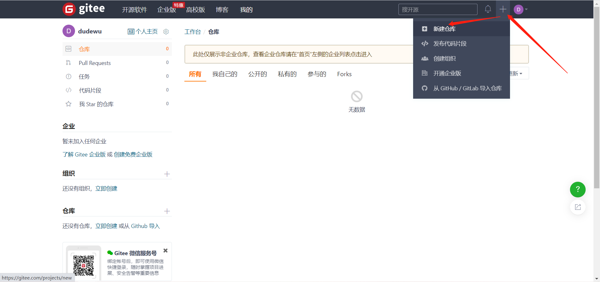
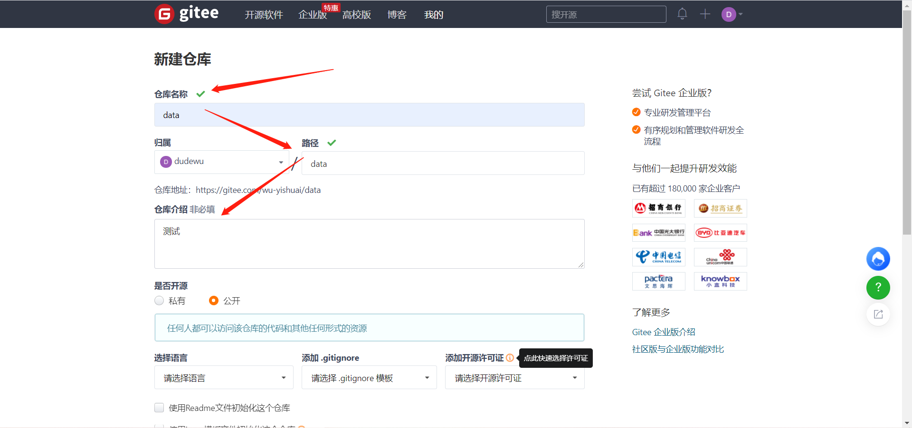
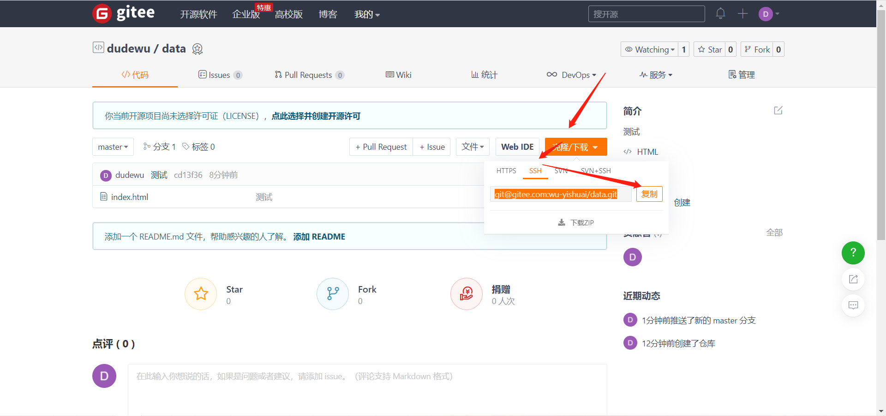
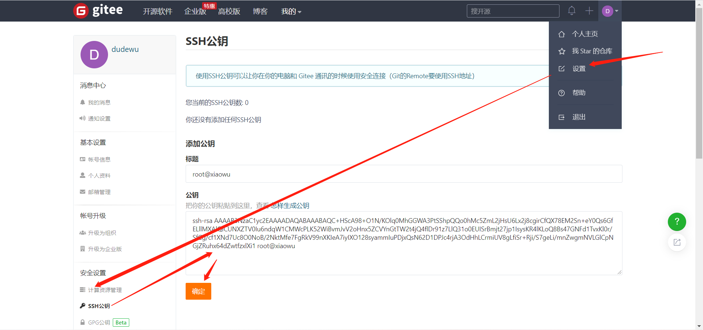

# git基础使用

## 一、仓库

```bash
# 在当前目录新建一个Git代码库
$ git init

# 新建一个目录，将其初始化为Git代码库
$ git init 目录名

# 下载一个项目和它的整个代码历史
$ git clone [url]
```


## 二、配置

### 命令配置

```bash
# 显示当前的Git配置
$ git config --list

# 编辑Git配置文件
$ git config -e [--global]

# 设置提交代码时的用户信息
$ git config [--global] user.name "[name]"
$ git config [--global] user.email "[email address]"
```


## 三、添加/删除文件

```bash
# 添加指定文件到暂存区
$ git add [file1] [file2] ...

# 添加指定目录到暂存区，包括子目录
$ git add [dir]

# 添加当前目录的所有文件到暂存区
$ git add .

# 添加每个变化前，都会要求确认
# 对于同一个文件的多处变化，可以实现分次提交
$ git add -p

# 删除工作区文件，并且将这次删除放入暂存区
$ git rm [file1] [file2] ...

# 停止追踪指定文件，但该文件会保留在工作区
$ git rm --cached [file]

# 改名文件，并且将这个改名放入暂存区
$ git mv [file-original] [file-renamed]
```


## 四、代码提交

```bash
# 提交暂存区到仓库区
$ git commit -m [message]

# 提交暂存区的指定文件到仓库区
$ git commit [file1] [file2] ... -m [message]

# 提交工作区自上次commit之后的变化，直接到仓库区
$ git commit -a

# 提交时显示所有diff信息
$ git commit -v

# 使用一次新的commit，替代上一次提交
# 如果代码没有任何新变化，则用来改写上一次commit的提交信息
$ git commit --amend -m [message]

# 重做上一次commit，并包括指定文件的新变化
$ git commit --amend [file1] [file2] ...
```


## 五、分支

```bash
# 列出所有本地分支
$ git branch

# 列出所有远程分支
$ git branch -r

# 列出所有本地分支和远程分支
$ git branch -a

# 新建一个分支，但依然停留在当前分支
$ git branch [branch-name]

# 新建一个分支，并切换到该分支
$ git checkout -b [branch]

# 新建一个分支，指向指定commit
$ git branch [branch] [commit]

# 新建一个分支，与指定的远程分支建立追踪关系
$ git branch --track [branch] [remote-branch]

# 切换到指定分支，并更新工作区
$ git checkout [branch-name]

# 切换到上一个分支
$ git checkout -

# 建立追踪关系，在现有分支与指定的远程分支之间
$ git branch --set-upstream [branch] [remote-branch]

# 合并指定分支到当前分支
$ git merge [branch]

# 选择一个commit，合并进当前分支
$ git cherry-pick [commit]

# 删除分支
$ git branch -d [branch-name]

# 删除远程分支
$ git push origin --delete [branch-name]
$ git branch -dr [remote/branch]
```


## 六、标签

```bash
# 列出所有tag
$ git tag

# 新建一个tag在当前commit
$ git tag [tag]

# 新建一个tag在指定commit
$ git tag [tag] [commit]

# 删除本地tag
$ git tag -d [tag]

# 删除远程tag
$ git push origin :refs/tags/[tagName]

# 查看tag信息
$ git show [tag]

# 提交指定tag
$ git push [remote] [tag]

# 提交所有tag
$ git push [remote] --tags

# 新建一个分支，指向某个tag
$ git checkout -b [branch] [tag]
```


## 七、查看信息

```bash
# 显示有变更的文件
$ git status

# 显示当前分支的版本历史
$ git log

# 显示commit历史，以及每次commit发生变更的文件
$ git log --stat

# 搜索提交历史，根据关键词
$ git log -S [keyword]

# 显示某个commit之后的所有变动，每个commit占据一行
$ git log [tag] HEAD --pretty=format:%s

# 显示某个commit之后的所有变动，其"提交说明"必须符合搜索条件
$ git log [tag] HEAD --grep feature

# 显示某个文件的版本历史，包括文件改名
$ git log --follow [file]
$ git whatchanged [file]

# 显示指定文件相关的每一次diff
$ git log -p [file]

# 显示过去5次提交
$ git log -5 --pretty --oneline

# 显示所有提交过的用户，按提交次数排序
$ git shortlog -sn

# 显示指定文件是什么人在什么时间修改过
$ git blame [file]

# 显示暂存区和工作区的差异
$ git diff

# 显示暂存区和上一个commit的差异
$ git diff --cached [file]

# 显示工作区与当前分支最新commit之间的差异
$ git diff HEAD

# 显示两次提交之间的差异
$ git diff [first-branch]...[second-branch]

# 显示今天你写了多少行代码
$ git diff --shortstat "@{0 day ago}"

# 显示某次提交的元数据和内容变化
$ git show [commit]

# 显示某次提交发生变化的文件
$ git show --name-only [commit]

# 显示某次提交时，某个文件的内容
$ git show [commit]:[filename]

# 显示当前分支的最近几次提交
$ git reflog
```


## 八、远程同步

### 1、gitee或github新建仓库






### 2、下载远程仓库

```bash
[root@xiaowu ~]# git clone https://gitee.com/wu-yishuai/data.git
```


### 3、模拟开发

```bash
[root@xiaowu ~/data]# echo 111 > index.html
[root@xiaowu ~/data]# git add index.html
[root@xiaowu ~/data]# git commit -m "测试"
```


### 4、提交到远程仓库

#### 1）设置用户名和邮箱

```bash
[root@xiaowu ~/data]# git config --global user.name "dudewu"
[root@xiaowu ~/data]# git config --global user.email "1426115933@qq.com"
```

#### 2）将本地代码提交到远程仓库

```bash
[root@xiaowu ~/data]# git push -u origin master
Username for 'https://gitee.com': 
Password for 'https://1426115933@qq.com@gitee.com': 
Counting objects: 3, done.
Writing objects: 100% (3/3), 218 bytes | 0 bytes/s, done.
Total 3 (delta 0), reused 0 (delta 0)
remote: Powered by GITEE.COM [GNK-5.0]
To https://gitee.com/wu-yishuai/data.git
 * [new branch]      master -> master
Branch master set up to track remote branch master from origin.
```


### 5、使用SSH提交到远程

#### 1）复制远程ssh连接



#### 2）修改.git/config

```bash
...
url = git@gitee.com:wu-yishuai/data.git
...
```


#### 3）创建SSH秘钥，复制公钥

```bash
[root@xiaowu ~/data]# ssh-keygen -t rsa

[root@xiaowu ~/data]# cat /root/.ssh/id_rsa.pub 
```



#### 4）测试

```bash
[root@xiaowu ~/data]# echo 222 > index.html
[root@xiaowu ~/data]# git add index.html
[root@xiaowu ~/data]# git commit -m "测试"
[master d0ea3b7] 测试
 1 file changed, 1 insertion(+), 1 deletion(-)
[root@xiaowu ~/data]# git push -u origin master
```

# gerrit

## 一、git添加rsa ssh key后仍提示Permission denied (publickey)解决方法

### 1、概括

```bash
在最新的git客户端尝试使用使用 ssh-rsa sha-1 哈希算法生成的 SSH 密钥时，不接受 SSH 密钥（用户收到“权限被拒绝”消息）
```

### 2、使用ssh -vvvv诊断，诊断结果

```bash
debug3: authmethod_is_enabled publickey
debug1: Next authentication method: publickey
debug1: Offering public key: /home/user/.ssh/id_rsa RSA ... agent
debug1: send_pubkey_test: no mutual signature algorithm <-- ssh-rsa is not enabled 
debug1: No more authentication methods to try.
user@hostname: Permission denied (publickey).
```


### 3、问题原因

https://www.openssh.com/txt/release-8.2

```bash
    由于各种安全漏洞，RSA SHA-1 哈希算法在操作系统和 SSH 客户端中迅速被弃用，其中许多技术现在完全拒绝使用该算法。

    如果您使用的操作系统或 SSH 客户端的版本禁用了此算法，则这些技术可能不再接受以前使用此算法生成的任何 SSH 密钥。
```

### 4、解决方式

#### 1.使用ecdsa或者ed25519算法重新生成秘钥对

##### 1.生成密钥对，二选一

```bash
ssh-keygen -t ed25519 -C "your_email@example.com"
ssh-keygen -t ecdsa -C "your_email@example.com"

#例如
ssh-keygen -t ed25519 -C 
```

##### 2.将公钥复制到gerrit

```bash
cat ~/.ssh/id_ed25519.pub
```


#### 2.重新启用 ssh-rsa，不推荐

```bash
cd 
HP@trevorwu MINGW64 ~ # cd .ssh
HP@trevorwu MINGW64 ~/.ssh # vim config
Host *
HostkeyAlgorithms +ssh-rsa
PubkeyAcceptedKeyTypes +ssh-rsa
```

#### 3.返回旧版本，不推荐


## 二、gerrit上传

```bash
git config --global user.name "trevor.wu"
git config --global user.email "trevor.wu@gwell.tech"
git add .
git commit --amend
push到云端服务器： git push origin HEAD:refs/for/master


查看状态（绿色）：git status

#修改文件提交
amend提交:  git commit --amend

amend提交文件： git commit . --amend
```


## 三、gerrit修改

```bash
git clone "ssh://trevor.wu@172.16.0.34:29418/cloud/deployment"

git add .
git commit
	JIRA: MTY-3980
	Type: Feature

	Add firewall shutdown statement

	Change-Id:I4d7842d9aa6d962a86daf27d13a3b77005c29c2e
git commit --amend
 git push origin HEAD:refs/for/master
```

# 冲突解决

  500  git status
  501  git log
  502  git fetch origin
  503  git rebase origin/master
  504  git diff
  505  git add .
  506  git rebase --continue
  507  git push origin HEAD:refs/for/master


  509  git fetch origin
  510  git rebase origin/master


### 6、命令

```bash
# 下载远程仓库的所有变动
$ git fetch [remote]

# 显示所有远程仓库
$ git remote -v

# 显示某个远程仓库的信息
$ git remote show [remote]

# 增加一个新的远程仓库，并命名
$ git remote add [shortname] [url]

# 取回远程仓库的变化，并与本地分支合并
$ git pull [remote] [branch]

# 上传本地指定分支到远程仓库
$ git push [remote] [branch]

# 强行推送当前分支到远程仓库，即使有冲突
$ git push [remote] --force

# 推送所有分支到远程仓库
$ git push [remote] --all

# 拉取代码并创建相应的仓库目录
git clone [url]

# 拉取代码并自定义仓库别名
git clone [url] [shortname]
```


## 九、撤销

```bash
# 恢复暂存区的指定文件到工作区
$ git checkout [file]

# 恢复某个commit的指定文件到暂存区和工作区
$ git checkout [commit] [file]

# 恢复暂存区的所有文件到工作区
$ git checkout .

# 重置暂存区的指定文件，与上一次commit保持一致，但工作区不变
$ git reset [file]

# 重置暂存区与工作区，与上一次commit保持一致
$ git reset --hard

# 重置当前分支的指针为指定commit，同时重置暂存区，但工作区不变
$ git reset [commit]

# 重置当前分支的HEAD为指定commit，同时重置暂存区和工作区，与指定commit一致
$ git reset --hard [commit]

# 重置当前HEAD为指定commit，但保持暂存区和工作区不变
$ git reset --keep [commit]

# 新建一个commit，用来撤销指定commit
# 后者的所有变化都将被前者抵消，并且应用到当前分支
$ git revert [commit]

# 暂时将未提交的变化移除，稍后再移入
$ git stash
$ git stash pop
```


## 十、其他

```bash
# 生成一个可供发布的压缩包
$ git archive
```