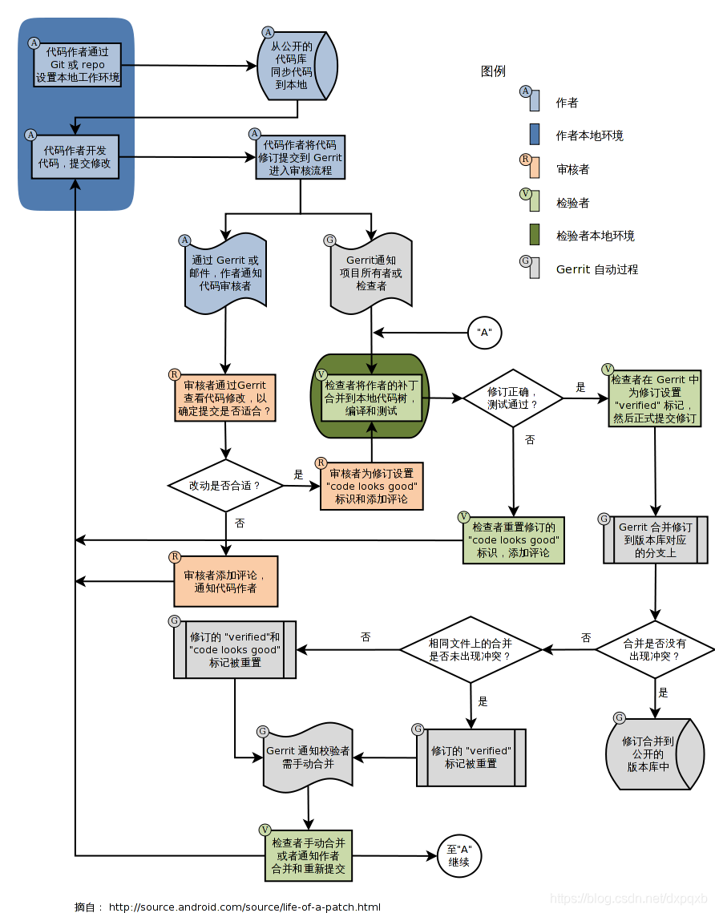
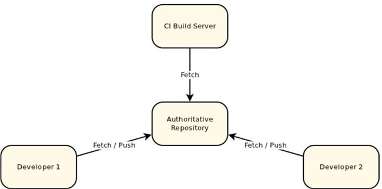
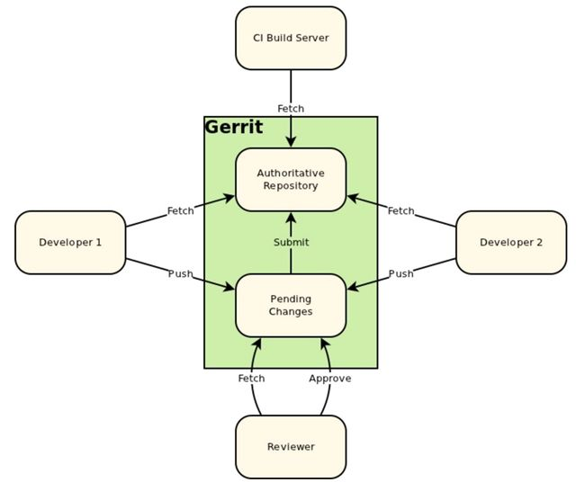
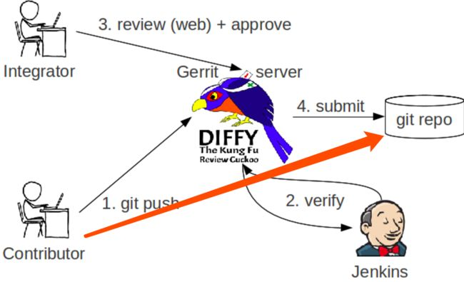

# Gerrit介绍

## 一、介绍

```bash
    代码审核（Code Review）是软件研发质量保障机制中非常重要的一环，但在实际项目执行过程中，却因为种种原因被 Delay 甚至是忽略。在实践中，给大家推荐一款免费、开放源代码的代码审查软件 Gerrit。
```

### 1、Code Review是什么？

```bash
    Code Review 最直观的解释即看代码。常规的做法为自己看，有时代码逻辑问题可能自己看不出来，需要找同事一起看，在大家知识体系相对平均的情况下可能需要花钱专门的公司帮助查看。
```

### 2、Code Review带来的好处？

```bash
1.有利于统一代码规范, 代码风格,结构写法,注释风格等;
2.业务逻辑，安全隐患，性能问题等都可以通过 review 的方式发现;
3.编程的时候,如果你知道有同事会检查你的代码,你的态度就会变的不一样, 你会写出更加整洁,有完整注释的代码;
4.更早的发现代码中的问题.越往后，Code Review 的效果越差，修复的成本也越来越高;
5.熟悉别人的代码, 有助于人员备份;
```


### 3、什么是Git

```bash
1.Git是目前世界上最先进的分布式版本控制系统（没有之一）。
2.Git是一个开源的分布式版本控制系统，用于敏捷高效地处理任何或小或大的项目。
3.Git 是 Linus Torvalds 为了帮助管理 Linux 内核开发而开发的一个开放源码的版本控制软件
4.Git 与常用的版本控制工具 CVS, Subversion 等不同，它采用了分布式版本库的方式，不必服务器端软件支持。
```

### 4、什么是Repo

```bash
    Repo是一个基于Git的工具，它的主要目的是为了管理多个代码仓库，也就是多个Git。然后它里面还加入了一些其他的方便开发的功能，比如帮助上传代码到Gerrit上面Review。它本身是用Python写出来的一个小工具。简而言之是管理多个Git仓库的脚本
```

### 5、什么是Gerrit

```bash
    Gerrit 是 Google 为 Android 系统研发量身定制的一套免费开源的代码审核系统，它在传统的源码管理协作流程中强制性引入代码审核机制，通过人工代码审核和自动化代码验证过程，将不符合要求的代码屏蔽在代码库之外，确保核心代码多人校验、多人互备和自动化构建核验
    Gerrit 是一个Git服务器，它基于 git 版本控制系统，使用网页界面来进行审阅工作。Gerrit 旨在提供一个轻量级框架，用于在代码入库之前对每个提交进行审阅，更改将上载到 Gerrit，但实际上并不成为项目的一部分，直到它们被审阅和接受 。代码审查是Gerrit的核心功能，但仍是可选的，团队可以决定不进行代码审查而工作。
    Gerrit 是一个临时区域, 在提交的代码成为代码库的一部分之前, 可以对其修改进行检查。代码修改的作者将提交作为对 Gerrit 的更改。在Gerrit中，每个更改都存储在暂存区域中，可以在其中进行检查和查看。仅当它被批准并提交时，它才被应用到代码库中。
    其实，Gerrit 就相当于是在开发员将本地修改提交到代码仓库之前的一个审核工具。在这个审核工具中，你可以查看该提交者在本次的的提交中的修改，然后再决定是否可以将该修改提交给仓库
```

## 二、Gerrit工作流程

```bash
    开发者的代码通过 git 命令（或 repo 封装）推送到 Gerrit 管理下的 Git 版本库，推送的提交转化为一个代码审核任务，审核任务可以通过 refs/changes/<change-id> 下的引用访问到。代码审核者可以通过 Web 界面查看审核任务、代码变更，通过 Web 界面做出通过代码审核或者打回等决定。测试者也可以通过 refs/changes/<change-id> 引用获取（fetch）修订对其进行测试，如果测试通过就可以将该评审任务设置为校验通过（verified）。最后经过了审核和校验的修订可以通过 Gerrit 界面中提交动作合并到版本库对应的分支中。 在 Android 项目的网站的代码贡献流程图更为详细的介绍了 Gerrit 代码审核服务器的工作流程。 gerrit工作流程如下图所示：
```



## 三、加入Gerrit之后的系统架构

### 1、加入Gerrit之前的系统架构



### 2、加入Gerrit之后的系统架构



### 3、通过Gerrit机制将代码做分隔



#### 1.无gerrit代码提交流程

```bash
    使用过 git 的同学，都知道，当我们git add --> git commit --> git push 之后，你的代码会被直接提交到 repo，也就是代码仓库中，就是图中橘红色箭头指示的那样。
```

#### 2.gerrit流程

```bash
    gerrit 就是上图中的那只鸟，普通成员的代码是被先 push 到 gerrit 服务器上，然后由代码审核人员，就是左上角的 integrator 在 web 页面进行代码的审核 (review)，可以单人审核，也可以邀请其他成员一同审核，当代码审核通过(approve) 之后，这次代码才会被提交 (submit) 到代码仓库 (repo) 中去。
    无论有新的代码提交待审核，代码审核通过或被拒绝，代码提交者 (Contributor) 和所有的相关代码审核人员 (Integrator) 都会收到邮件提醒。gerrit 还有自动测试的功能，和主线有冲突或者测试不通过的代码，是会被直接拒绝掉的，这个功能是通过右下角那个老头 (Jenkins) 的来实现的,这里不过多讨论。
```

#### 3.注意点

```bash
    当进行 commit 时，必须要生成一个 Change-Id，否则，push 到 gerrit 服务器时，会收到一个错误提醒。
    提交者不能直接把代码推到远程的 master 主线 (或者其他远程分支) 上去。这样就相当于越过了 gerrit了。 gerrit 必须依赖于一个refs/for/* 的分支。
    假如我们远程只有一个 master 主线，那么只有当你的代码被提交到refs/for/master分支时，gerrit 才会知道，我收到了一个需要审核的代码推送，需要通知审核员来审核代码了。当审核通过之后，gerrit 会自动将这条分支合并到 master 主线上，然后邮件通知相关成员，master 分支有更新，需要的成员再去 pull 就好了。而且这条refs/for/master分支，是透明的，也就是说普通成员其实是不需要知道这条线的，如果你正确配置了 sourceTree，你也应该是看不到这条线的。
```

## 四、代码审核的建议

```bash
1.对事不对人, 大家都是同事, 在一个团队工作和气最重要. 不要在Code Review中说"你写的什么垃圾"这种话, 你可以说"这个变量名不是很好理解, 咱们换成xxx是不是更好"
2.每个Review至少给一条正面评价. Gerrit中有对代码点赞的功能, 可以时不时的使用一下.
3.保证发布的代码和评审意见的可读性.
4.用工具进行基础问题的自动化检查. 用Tab还是空格, 用两个空格还是四个空格, 缩进风格是使用K&R还是Allman. 这些问题可以使用php code sniffer解决, 团队应该把精力放在代码规范, 代码性能优化等地方.
5.全员参加Code Review, 并设定各部分负责人.
6.每个代码PR(Pull Request)内容一定要少. Code Review效果和质量与PR代码量成反比, 提交的代码越多, Code Review的效果就越差. 所以要经常Code Review, 保证每个PR代码的量要少, 最多不超过300行/PR.
7.在写新代码之前, 先Review掉需要评审的代码. 不要堆积Review, 有PR产生一定要尽快Review, 否则时间拖的长了以后Review的过程就会比较艰难.
8.不要在Review中讨论需求, Review就是Review. 要明确Code Review是完善代码, 始终要以代码质量为中心要素.
```


