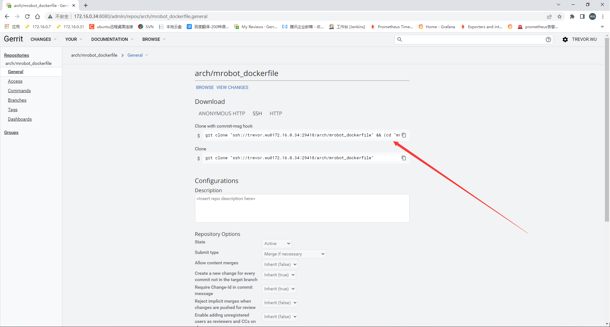
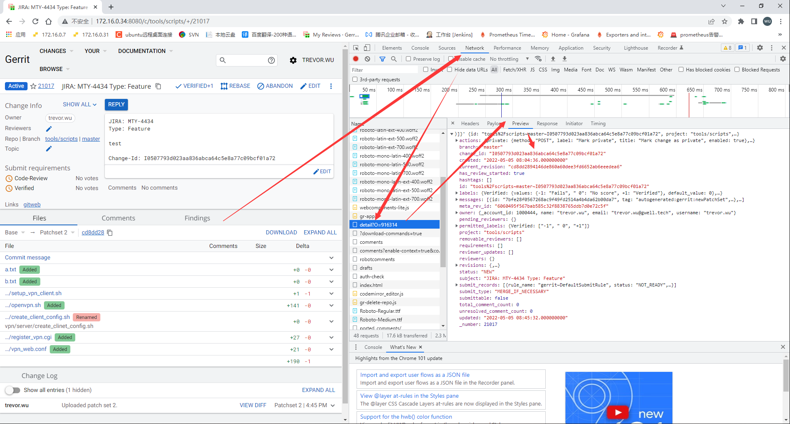

# gerrit3.5.1变化文档

## 一、变化以及相关问题解决方法

### 1、关于chenge-ID

#### 1.问题

> gerrit默认生成chengeID，但是由于前端和默认commit—msg的原因，默认的commit-msg并不会在commit里面添加chengeID，所以不能看到chenge-ID


#### 2.解决方法

##### 1）自定义commit-msg

**gerrit配置**

```bash
[gerrit]
...
        installCommitMsgHookCommand = gitdir=$(git rev-parse --git-dir) && curl -Lo ${gitdir}/hooks/commit-msg http://172.16.0.43:6868/hooks/commit-msg

....
```


###### ①commit-msg内容

> PS：只是看看内容，不用管

```bash
#!/bin/sh
# avoid [[ which is not POSIX sh.
if test "$#" != 1 ; then
  echo "$0 requires an argument."
  exit 1
fi

if test ! -f "$1" ; then
  echo "file does not exist: $1"
  exit 1
fi

# Do not create a change id if requested
if test "false" = "`git config --bool --get gerrit.createChangeId`" ; then
  exit 0
fi

# $RANDOM will be undefined if not using bash, so don't use set -u
random=$( (whoami ; hostname ; date; cat $1 ; echo $RANDOM) | git hash-object --stdin)
dest="$1.tmp.${random}"

trap 'rm -f "${dest}"' EXIT

if ! git stripspace --strip-comments < "$1" > "${dest}" ; then
   echo "cannot strip comments from $1"
   exit 1
fi

if test ! -s "${dest}" ; then
  echo "file is empty: $1"
  exit 1
fi

# Avoid the --in-place option which only appeared in Git 2.8
# Avoid the --if-exists option which only appeared in Git 2.15
if ! git -c trailer.ifexists=doNothing interpret-trailers \
      --trailer "Change-Id: I${random}" < "$1" > "${dest}" ; then
  echo "cannot insert change-id line in $1"
  exit 1
fi

if ! mv "${dest}" "$1" ; then
  echo "cannot mv ${dest} to $1"
  exit 1
fi
```


###### ②到项目目录，下载commit-msg




**包括项目一起拉下来**

```bash
git clone "ssh://trevor.wu@172.16.0.90:29418/arch/mrobot_dockerfile" && (cd "mrobot_dockerfile" && gitdir=$(git rev-parse --git-dir) && curl -Lo ${gitdir}/hooks/commit-msg http://172.16.0.43:6868/hooks/commit-msg)
```

**仅下载commit-msg**

```bash
cd "mrobot_dockerfile" && gitdir=$(git rev-parse --git-dir) && curl -Lo ${gitdir}/hooks/commit-msg http://172.16.0.43:6868/hooks/commit-msg
```


#### 3.已经提交的但是没有chengeID的在浏览器查看对应chenge-ID




### 2、新增hooks插件，支持服务端验证

http://172.16.0.90:8080/Documentation/config-plugins.html#hooks

https://gerrit.googlesource.com/plugins/hooks/+doc/master/src/main/resources/Documentation/config.md

https://stackoverflow.com/questions/69433254/gerrit-server-hook-to-validate-the-commit-message

#### 1.脚本内容

```bash
#!/usr/bin/env bash
shift 10
COMMIT_MSG=`git show --format=%B $2 | head -n 7`

# Judge whether JIRA format is correct
check_JIRA() {
    JIRA_ID=$(echo "$COMMIT_MSG" | awk 'NR == 1' | grep -Eo "JIRA: [A-Za-z]+[-][0-9]+")
    if [ -z "$JIRA_ID" ];then
        echo "[Format Error]: JIRA must be on the first line or Please add JIRA JIRA-ID format like 'JIRA: MTY-9999'"
        exit 1
    else
        echo "[INFO] JIRA StoryId=["$JIRA_ID"]"
    fi
}

# Judge whether Type format is correct
check_Type() {
    Type=$(echo "$COMMIT_MSG" | awk 'NR == 2' | grep -Eo "Type: [A-Za-z]+")
    Type2=$(echo "$COMMIT_MSG" | awk -F [:\ ] 'NR == 2 {print $3}')
    if [ -z "$Type" ];then
        echo "[Format Error]: Type is not in the second line or Please add Type format like 'Type: Feature'"
        exit 1
    else
        if [ $Type2 == "Feature" ];then
            echo "[INFO] Type StoryId=["$Type"]"
        elif [ $Type2 == "Bugfix" ];then
            echo "[INFO] Type StoryId=["$Type"]"
        elif [ $Type2 == "Debt" ];then
            echo "[INFO] Type StoryId=["$Type"]"
        elif [ $Type2 == "Refactor" ];then
            echo "[INFO] Type StoryId=["$Type"]"
        elif [ $Type2 == "Enhance" ];then
            echo "[INFO] Type StoryId=["$Type"]"
        elif [ $Type2 == "Hotfix" ];then
            echo "[INFO] Type StoryId=["$Type"]"
        else
            echo "[Value Error]: Type is not in the second line or Please add Type format like 'Type: Feature'"
            exit 1
        fi
    fi
}

check_JIRA
check_Type
```

#### 2.好处与不便

```bash
# 好处
1.在服务端进行提交的commit信息判断，不符合要求的将不允许提交
2.支持web界面修改处理
# 不便
1.第一行必须是JIRA单号
2.第二行必须是Type
```

## 二、升级中遇到的问题

### 1.JDK需要升级到JDK11

### 2.rename-project下载最新插件并覆盖原来的插件

