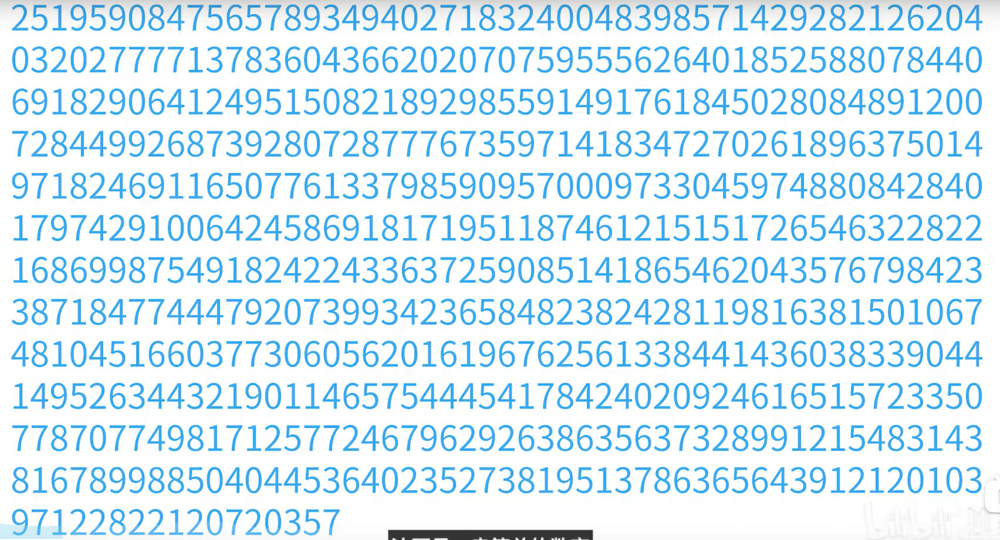
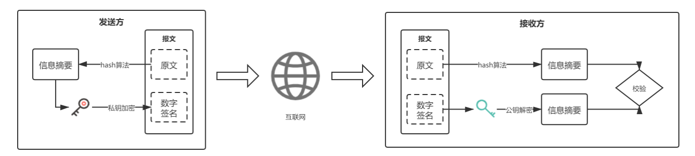
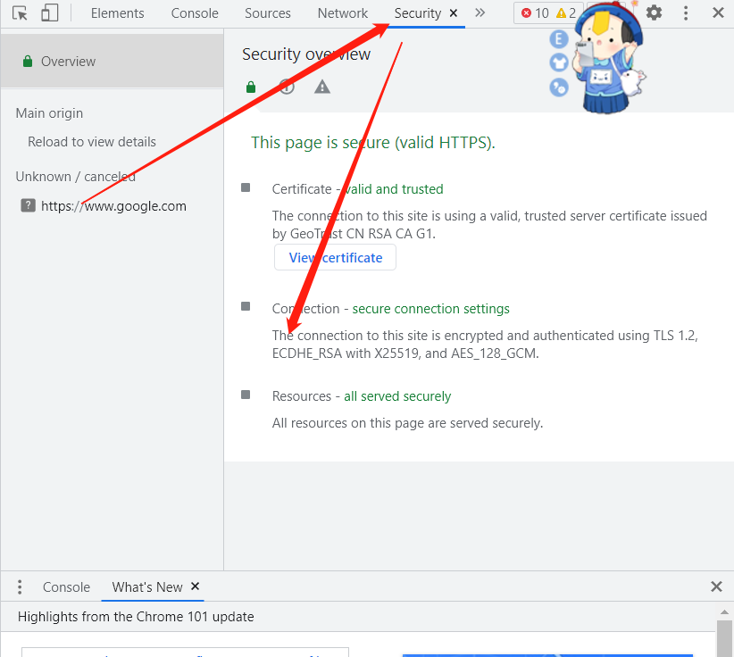
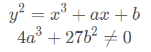
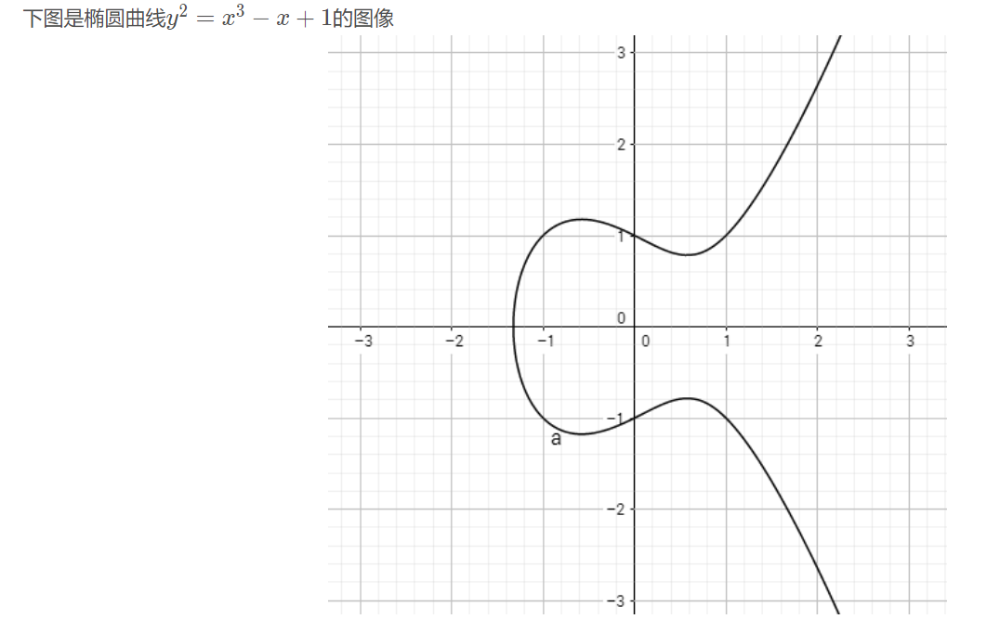
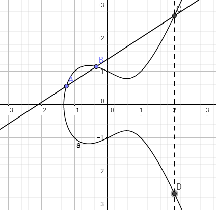
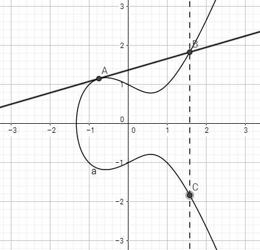
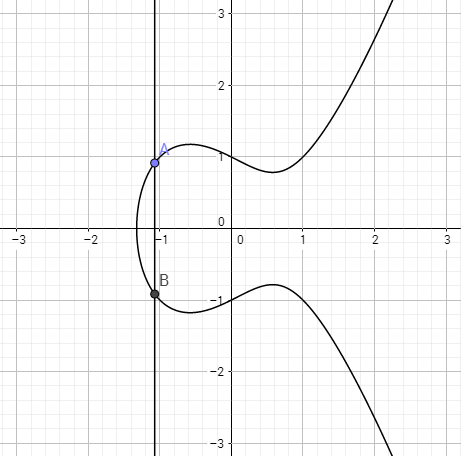
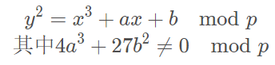

# 密码学：常见的信息加密算法

## 一、引入：git添加rsa ssh key后仍提示Permission denied (publickey)解决方法

### 1、概括

```bash
在最新的git客户端尝试使用使用 ssh-rsa 哈希算法生成的 SSH 密钥时，不接受 SSH 密钥（用户收到“权限被拒绝”消息）
```

### 2、使用ssh -vvvv诊断，诊断结果

```bash
debug3: authmethod_is_enabled publickey
debug1: Next authentication method: publickey
debug1: Offering public key: /home/user/.ssh/id_rsa RSA ... agent
debug1: send_pubkey_test: no mutual signature algorithm <-- ssh-rsa is not enabled 
debug1: No more authentication methods to try.
user@hostname: Permission denied (publickey).
```


### 3、问题原因

https://www.openssh.com/txt/release-8.2

```bash
Future deprecation notice
=========================
It is now possible[1] to perform chosen-prefix attacks against the
SHA-1 hash algorithm for less than USD$50K. For this reason, we will
be disabling the "ssh-rsa" public key signature algorithm that depends
on SHA-1 by default in a near-future release.
This algorithm is unfortunately still used widely despite the
existence of better alternatives, being the only remaining public key
signature algorithm specified by the original SSH RFCs.
The better alternatives include:
 * The RFC8332 RSA SHA-2 signature algorithms rsa-sha2-256/512. These
   algorithms have the advantage of using the same key type as
   "ssh-rsa" but use the safe SHA-2 hash algorithms. These have been
   supported since OpenSSH 7.2 and are already used by default if the
   client and server support them.
 * The ssh-ed25519 signature algorithm. It has been supported in
   OpenSSH since release 6.5.
 * The RFC5656 ECDSA algorithms: ecdsa-sha2-nistp256/384/521. These
   have been supported by OpenSSH since release 5.7.
To check whether a server is using the weak ssh-rsa public key
algorithm for host authentication, try to connect to it after
removing the ssh-rsa algorithm from ssh(1)'s allowed list:
    ssh -oHostKeyAlgorithms=-ssh-rsa user@host
If the host key verification fails and no other supported host key
types are available, the server software on that host should be
upgraded.
A future release of OpenSSH will enable UpdateHostKeys by default
to allow the client to automatically migrate to better algorithms.
Users may consider enabling this option manually.
[1] "SHA-1 is a Shambles: First Chosen-Prefix Collision on SHA-1 and
    Application to the PGP Web of Trust" Leurent, G and Peyrin, T
    (2020) https://eprint.iacr.org/2020/014.pdf
Security
========
 * ssh(1), sshd(8), ssh-keygen(1): this release removes the "ssh-rsa"
   (RSA/SHA1) algorithm from those accepted for certificate signatures
   (i.e. the client and server CASignatureAlgorithms option) and will
   use the rsa-sha2-512 signature algorithm by default when the
   ssh-keygen(1) CA signs new certificates.
   Certificates are at special risk to the aforementioned SHA1
   collision vulnerability as an attacker has effectively unlimited
   time in which to craft a collision that yields them a valid
   certificate, far more than the relatively brief LoginGraceTime
   window that they have to forge a host key signature.
   The OpenSSH certificate format includes a CA-specified (typically
   random) nonce value near the start of the certificate that should
   make exploitation of chosen-prefix collisions in this context
   challenging, as the attacker does not have full control over the
   prefix that actually gets signed. Nonetheless, SHA1 is now a
   demonstrably broken algorithm and futher improvements in attacks
   are highly likely.
   OpenSSH releases prior to 7.2 do not support the newer RSA/SHA2
   algorithms and will refuse to accept certificates signed by an
   OpenSSH 8.2+ CA using RSA keys unless the unsafe algorithm is
   explicitly selected during signing ("ssh-keygen -t ssh-rsa").
   Older clients/servers may use another CA key type such as
   ssh-ed25519 (supported since OpenSSH 6.5) or one of the
   ecdsa-sha2-nistp256/384/521 types (supported since OpenSSH 5.7)
   instead if they cannot be upgraded.
```

**百度翻译**

```bash
日后弃用通知书
=========================
现在可以[1]对SHA-1哈希算法的价格低于5万美元。因此，我们将禁用“ssh rsa”公钥签名算法，这取决于在不久的将来发布的SHA-1上默认使用。
不幸的是，这种算法仍然被广泛使用，尽管存在更好的替代方案，是仅存的公钥原始SSH RFC指定的签名算法。
更好的选择包括：
     *RFC8332 RSA SHA-2签名算法RSA-sha2-256/512。这些算法的优点是使用与之相同的密钥类型“ssh rsa”，但使用安全的SHA-2哈希算法。这些都是从OpenSSH 7.2开始支持，如果客户端和服务器支持它们。
    *ssh-ed25519签名算法。它得到了许多国家的支持OpenSSH从6.5版开始。
    *RFC5656 ECDSA算法：ECDSA-sha2-nistp256/384/521。这些自5.7版以来一直受到OpenSSH的支持。
检查服务器是否使用弱ssh rsa公钥用于主机身份验证的算法，请在从ssh（1）的允许列表中删除ssh rsa算法：
ssh-oHostKeyAlgorithms=-ssh rsauser@host
如果主机密钥验证失败且没有其他受支持的主机密钥类型可用，则该主机上的服务器软件应升级。
OpenSSH的未来版本将默认启用UpdateHostKeys允许客户端自动迁移到更好的算法。用户可以考虑手动启用此选项。
[1] “SHA-1是一堆乱七八糟的东西：首先选择的前缀在SHA-1和
应用于PGP信任网络“Leurent，G和Peyrin，T
(2020) https://eprint.iacr.org/2020/014.pdf

安全
========
*ssh（rsh），这个版本删除了（RSA/SHA1）算法，该算法与证书签名所接受的算法不同（即客户端和服务器CASignatureAlgorithms选项）并将默认情况下，在以下情况下使用rsa-sha2-512签名算法：ssh keygen（1）CA签署新证书。
证书对上述SHA1有特殊风险作为攻击者，冲突漏洞实际上是无限的制造碰撞并产生有效碰撞的时间证书，远远超过相对较短的登录时间他们必须伪造主机密钥签名的窗口。
OpenSSH证书格式包括指定的CA（通常是随机）证书开头附近的nonce值在此上下文中利用所选前缀冲突具有挑战性，因为攻击者无法完全控制实际得到签名的前缀。尽管如此，SHA1现在是一个明显破坏的算法和攻击的进一步改进很有可能。
7.2之前的OpenSSH版本不支持较新的RSA/SHA2将拒绝接受由OpenSSH 8.2+CA使用RSA密钥，除非使用了不安全的算法在签名期间显式选择（“ssh-keygen-t ssh-rsa”）。较旧的客户端/服务器可能会使用其他CA密钥类型，例如ssh-ed25519（从OpenSSH 6.5开始支持）或ecdsa-sha2-nistp256/384/521类型（从OpenSSH 5.7开始支持）

```

```bash
    由于各种安全漏洞，RSA SHA-1 哈希算法在操作系统和 SSH 客户端中迅速被弃用，其中许多技术现在完全拒绝使用该算法。
    如果您使用的操作系统或 SSH 客户端的版本禁用了此算法，则这些技术可能不再接受以前使用此算法生成的任何 SSH 密钥。
```

### 4、解决方式

https://jira.atlassian.com/browse/BSERV-13013

#### 方式一：使用ecdsa或者ed25519算法重新生成秘钥对

##### 1.生成密钥对，二选一

```bash
ssh-keygen -t ed25519 -C "your_email@example.com"
ssh-keygen -t ecdsa -C "your_email@example.com"

#例如
ssh-keygen -t ed25519
```

##### 2.将公钥复制到gerrit

```bash
cat ~/.ssh/id_ed25519.pub
```

#### 方式二：重新启用 ssh-rsa，不推荐

```bash
cd 
HP@trevorwu MINGW64 ~ # cd .ssh
HP@trevorwu MINGW64 ~/.ssh # vim config
Host *
HostkeyAlgorithms +ssh-rsa
PubkeyAcceptedKeyTypes +ssh-rsa
```

#### 方式三：返回旧版本，不推荐


## 二、常见加密算法比较

### 1、两大类加密技术

> *加密技术通常分为两大类:"对称式"和"非对称式"。*
>
> *用途：对称加密算法用来对敏感数据等信息进行加密*

#### 1.对称性加密算法

```bash
    对称式加密就是加密和解密使用同一个密钥。信息接收双方都需事先知道密匙和加解密算法且其密匙是相同的，之后便是对数据进行加解密了。对称加密算法用来对敏感数据等信息进行加密。
```

#### 2.非对称性加密算法

```bash
    非对称式加密就是加密和解密所使用的不是同一个密钥，通常有两个密钥，称为"公钥"和"私钥"，它们两个必需配对使用，否则不能打开加密文件。发送双方A,B事先均生成一堆密匙，然后A将自己的公有密匙发送给B，B将自己的公有密匙发送给A，如果A要给B发送消 息，则先需要用B的公有密匙进行消息加密，然后发送给B端，此时B端再用自己的私有密匙进行消息解密，B向A发送消息时为同样的道理。
```


### 2、散列算法

```bash
    散列算法，又称哈希函数，是一种单向加密算法。在信息安全技术中，经常需要验证消息的完整性，散列(Hash)函数提供了这一服务，它对不同长度的输入消息，产生固定长度的输出。这个固定长度的输出称为原输入消息的"散列"或"消息摘要"(Message digest)。散列算法不算加密算法，因为其结果是不可逆的，既然是不可逆的，那么当然不是用来加密的，而是签名。
```

### 3、常见对称性加密算法

#### 1.DES

```bash
（Data Encryption Standard）：数据加密标准，速度较快，适用于加密大量数据的场合。
```

#### 2.3DES

```bash
（Triple DES）：是基于DES，对一块数据用三个不同的密钥进行三次加密，强度更高。
```

#### 3.AES

```bash
（Advanced Encryption Standard）：高级加密标准，速度快，安全级别高；AES是一个使用128为分组块的分组加密算法，分组块和128、192或256位的密钥一起作为输入，对4×4的字节数组上进行操作。众所周之AES是种十分高效的算法，尤其在8位架构中，这源于它面向字节的设计。AES 适用于8位的小型单片机或者普通的32位微处理器,并且适合用专门的硬件实现，硬件实现能够使其吞吐量（每秒可以到达的加密/解密bit数）达到十亿量级。同样，其也适用于RFID系统。
```

### 4、常见非对称性算法

#### 1.RSA

```bash
由 RSA 公司发明，是一个支持变长密钥的公共密钥算法，需要加密的文件块的长度也是可变的。RSA在国外早已进入实用阶段，已研制出多种高速的RSA的专用芯片。
```

#### 2.DSA

```bash
（Digital Signature Algorithm）：数字签名算法，是一种标准的 DSS（数字签名标准），严格来说不算加密算法。
```

#### 3.ECC

```bash
（Elliptic Curves Cryptography）：椭圆曲线密码编码学。ECC和RSA相比，具有多方面的绝对优势，主要有：抗攻击性强。相同的密钥长度，其抗攻击性要强很多倍。计算量小，处理速度快。ECC总的速度比RSA、DSA要快得多。存储空间占用小。ECC的密钥尺寸和系统参数与RSA、DSA相比要小得多，意味着它所占的存贮空间要小得多。这对于加密算法在IC卡上的应用具有特别重要的意义。带宽要求低。当对长消息进行加解密时，三类密码系统有相同的带宽要求，但应用于短消息时ECC带宽要求却低得多。带宽要求低使ECC在无线网络领域具有广泛的应用前景。
```

### 5、常见散列算法]

>用途：主要用于验证，防止信息被修。具体用途如：文件校验、数字签名、鉴权协议

#### 1.MD5

```bash
MD5是一种不可逆的加密算法，它对应任何字符串都可以加密成一段唯一的固定长度的代码。但也不安全了。
```

#### 2.SHA1

```bash
    SHA-1是由NIST NSA设计为同DSA⼀起使⽤的，SHA-1设计时基于和MD4相同原理，并且模仿了该算法，SHA-1抗穷举(brute-force)性更好，它产出160位的Hash值，对于⾮线性运算、移位和加法运算也与MD5类似。SHA-1也应⽤于包括TLS和SSL、PGP、SSH、S/MIME和IPsec等多种协议中，曾被视为是MD5的后继者。SHA-1的如今已经明确不具备安全性可⾔了

    在2016年1⽉1⽇后基于SHA-1签发的SSL和代码签名的X.509证书已不具备安全性可⾔，多个操作系统、浏览器都建议将基于SHA-1⽽签发的证书、代码签名替换⾄SHA-2的产品，但⽬前在Windows XP（官⽅已停更）操作系统上仍然只兼容基于SHA-1算法的SSL和代码签名产品。
    就在2017年2⽉23⽇Google宣布实现了对SHA-1算法的碰撞破解，所以SHA-1算法已经正式被宣布为不安全的算法，主流⼚商对⾃⾝产品及安全要求都提升⾄了SHA-2算法。
```

#### 3.SHA2

```bash
    SHA-224、SHA-256、SHA-384和SHA-512并称为SHA-2，发布于2001年，⽬前⽐较⼴泛应⽤的SSL数字证书和代码签名证书签名算法均采⽤SHA-256算法，相较于SHA-1算法⽽⾔，⾄今SHA-2算法还未被破解，从某种意义上SHA-2延⽤了SHA-1算法，所以⾄少发⽂时间起是安全的。⽬前顶级CA和Google、苹果等公司都采⽤基于SHA-256算法作为SSL证书和代码签名证书的主流签名算法。
```

#### 4.SHA3

```bash
    SHA-3算法正式发布于2015年，SHA-3并不是要取代SHA-2，因为SHA-2⽬前并没有出现明显的弱点。由于对MD5、SHA-0和SHA-1出现成功的破解，NIST感觉需要⼀个与之前算法不同的，可替换的加密Hash算法，也就是现在的 SHA-3。
```

### 6、其他算法

#### 1.Base64

```bash
    其实不是安全领域下的加密解密算法，只能算是一个编码算法，通常用于把二进制数据编码为可写的字符形式的数据，对数据内容进行编码来适合传输(可以对img图像编码用于传输)。这是一种可逆的编码方式。编码后的数据是一个字符串，其中包含的字符为：A-Z、a-z、0-9、+、/，共64个字符(26 + 26 + 10 + 1 + 1 = 64，其实是65个字符，“=”是填充字符。Base64要求把每三个8Bit的字节转换为四个6Bit的字节(3*8 = 4*6 = 24)，然后把6Bit再添两位高位0，组成四个8Bit的字节，也就是说，转换后的字符串理论上将要比原来的长1/3。原文的字节最后不够3个的地方用0来补足，转换时Base64编码用=号来代替。这就是为什么有些Base64编码会以一个或两个等号结束的原因，中间是不可能出现等号的，但等号最多只有两个。其实不用"="也不耽误解码，之所以用"="，可能是考虑到多段编码后的Base64字符串拼起来也不会引起混淆。)
    Base64编码是从二进制到字符的过程，像一些中文字符用不同的编码转为二进制时，产生的二进制是不一样的，所以最终产生的Base64字符也不一样。例如"上网"对应utf-8格式的Base64编码是"5LiK572R"， 对应GB2312格式的Base64编码是"yc/N+A=="。
    标准的Base64并不适合直接放在URL里传输，因为URL编码器会把标准Base64中的“/”和“+”字符变为形如“%XX”的形式，而这些“%”号在存入数据库时还需要再进行转换，因为ANSI SQL中已将“%”号用作通配符。
    为解决此问题，可采用一种用于URL的改进Base64编码，它不在末尾填充'='号，并将标准Base64中的“+”和“/”分别改成了“-”和“_”，这样就免去了在URL编解码和数据库存储时所要作的转换，避免了编码信息长度在此过程中的增加，并统一了数据库、表单等处对象标识符的格式。
    另有一种用于正则表达式的改进Base64变种，它将“+”和“/”改成了“!”和“-”，因为“+”，“*”以及前面在IRCu中用到的“[”和“]”在正则表达式中都可能具有特殊含义。
此外还有一些变种，它们将“+/”改为“_-”或“._”（用作编程语言中的标识符名称）或“.-”（用于XML中的Nmtoken）甚至“_:”（用于XML中的Name）。
```

#### 2.https

```bash
    全称：Hypertext Transfer Protocol over Secure Socket Layer，是以安全为目标的HTTP通道，简单讲是HTTP的安全版。即HTTP下加入SSL层，HTTPS的安全基础是SSL(SSL使用40 位关键字作为RC4流加密算法，这对于商业信息的加密是合适的。)，因此加密的详细内容就需要SSL。https:URL表明它使用了HTTP，但HTTPS存在不同于HTTP的默认端口及一个加密/身份验证层（在HTTP与TCP之间），提供了身份验证与加密通讯方法，现在它被广泛用于万维网上安全敏感的通讯，例如交易支付方面。它的主要作用可以分为两种：一种是建立一个信息安全通道，来保证数据传输的安全；另一种就是确认网站的真实性。
```

### 7、总结

```bash
1. 加密算法是可逆的，用来对敏感数据进行保护。散列算法(签名算法、哈希算法)是不可逆的，主要用于身份验证。
2. 对称加密算法使用同一个密匙加密和解密，速度快，适合给大量数据加密。对称加密客户端和服务端使用同一个密匙，存在被抓包破解的风险。
3. 非对称加密算法使用公钥加密，私钥解密，私钥签名，公钥验签。安全性比对称加密高，但速度较慢。非对称加密使用两个密匙，服务端和客户端密匙不一样，私钥放在服务端，黑客一般是拿不到的，安全性高。
4. Base64不是安全领域下的加解密算法，只是一个编码算法，通常用于把二进制数据编码为可写的字符形式的数据，特别适合在http，mime协议下的网络快速传输数据。UTF-8和GBK中文的Base64编码结果是不同的。采用Base64编码不仅比较简短，同时也具有不可读性，即所编码的数据不会被人用肉眼所直接看到，但这种方式很初级，很简单。Base64可以对图片文件进行编码传输。
5. https协议广泛用于万维网上安全敏感的通讯，例如交易支付方面。它的主要作用可以分为两种：一种是建立一个信息安全通道，来保证数据传输的安全；另一种就是确认网站的真实性。
6. 大量数据加密建议采用对称加密算法，提高加解密速度；小量的机密数据，可以采用非对称加密算法。在实际的操作过程中，我们通常采用的方式是：采用非对称加密算法管理对称算法的密钥，然后用对称加密算法加密数据，这样我们就集成了两类加密算法的优点，既实现了加密速度快的优点，又实现了安全方便管理密钥的优点。
```


## 三、RSA算法

### 1、引入：值钱的数字



上面的这些数字价值20万美刀，换算成人民币120万左右，但是前提是我们能破解它

### 2、RSA介绍

```bash
    1977年，RSA算法由MIT的罗纳德 · 李维斯特（Ron Rivest）、阿迪 · 萨莫尔（Adi Shamir）和伦纳德 · 阿德曼（Leonard Adleman）共同设计，于1978年正式发布，以他们三人的首字母命名。RSA(Rivest-Shamir-Adleman)是一种公钥密码算法。
    在这之前所用的对称加密方式只采用一个密钥，知道加密密钥就可以知道解密密钥。但是由于双方需要事先约定加密的规则，就导致没有办法安全地交换密钥，建立安全的传递通道。
    但是1976年出现的非对称加密算法的思想就可以解决密钥的交换和存放问题。它使用两个密钥，一个用来加密消息和验证签名，叫公钥，另一个用来解密，叫私钥，加解密双方是不平等的。这种新的构思是由美国计算机科学家Whitfield Diffie和Martin Hellman提出的，被称为Diffie-Hellman密钥交换算法，RSA算法就是受到它的启发产生的，是这种构思的具体实现方式，既可以用来加密，解密，也可以用于密钥交换。
    RSA主要使用大整数分解这个数学难题进行设计，巧妙地利用了数论的概念。给了RSA公钥，首先想到的攻击就是分解模数，给了的因子攻击者可以计算得到，从而也可以计算得到解密指数，我们称这种分解模数的方法为针对RSA的暴力攻击。虽然分解算法已经稳步改进，但是在正确使用RSA情况下，当前的技术水平仍远未对RSA的安全性构成威胁。如今，只有短的 RSA 密钥才有可能被强力方式解破。
    目前，RSA部署在许多商业系统中。Web服务器和浏览器使用它来保护Web流量，它可以用于保障电子邮件的隐私和真实性，还可以用于保护远程登录会话，同时它也是电子信用卡支付系统的核心。简而言之，RSA常用于需要考虑数字数据安全性的应用中。
    RSA被用于公钥密码和数字签名。并且被广泛使用
    1983年，RSA公司为RSA算法在美国取得了专利，但现在该专利已经过期。
```

### 3、名词解释

```bash
质数：
    在大于1的自然数中，除了1和它本身以外不再有其他因数的自然数。就是不能被2、3、5、7整除的数。
    2 3 5 7 11 13 17 19 23 29 31 37 41 43 47 53 59 61 67 71 73 79 83 89 97

互质：
    若N个整数的最大公因数是1，则称这N个整数互质，公因数只有1的两个自然数，叫做互质自然数，后者是前者的特殊情形。
```


### 4、简单理解原理

在实际应用中e和N都是大整数，为了方便理解，下面选取非常小的整数来实现一次密钥生成过程。

#### 1.随机选择两个质数

```java
p=11 ，q=19
```

#### 2.计算它们的乘积为N，公钥其中的一个值

```java
N=p*q=11×19=209
```

#### 3.p和q各自减1，求r

```java
r=(p-1)(q-1)=10*18=180
```

#### 4.选择e，e是与r互质的整数，且1<e<r

```java
e=7
```

#### 5.得到公钥N和e

```bash
N=209 e=7
```

#### 6.求私钥值d

```java
要求：d*e÷r取模为1，且d<r
    mod：取模
 
mod(d*e÷r)=1
d*7÷180=x...1
d=103
```

#### 7.整理一下

```bash
公钥：e=7  N=209
私钥：d=103
```

#### 8.公钥方利用公钥加密求结果c

> 假设明文内容是33

```bash
c=mod(33的e次方÷N)=22
```

> 将c=22和公钥发给私钥方

#### 9.私钥方开始解密

```bash
mod(c的d次方÷N)=33
```


#### 10.稍微复杂一点点

##### 1)欧拉函数

```bash
欧拉函数
  小于n且与n互素的正整数的个数就是欧拉函数，记为φ(n)
  
欧拉函数具有以下性质：
1.如果n为素数，则小于所有n的正整数都与n互素，那么
φ(n) = n - 1

2.如果gcd(p,q)=1,那么
φ(p*q) = φ§*φ(q)

3.如果整数n因数分解为n=p1,p2,…,pn,p1,p2,…,pn为互不相同的素数，那么
Φ(n)=n(1 - 1/p1)(1 - 1/p2)…(1 - 1/pn)

```

##### 2）难一点

```bash
取p=47, q=71,

n = p * q = 3337, Φ(n)=(p-1)(q-1)=3220,

随机选择加密密钥e，e与Φ(n)互素，若取e=79,则d=79^(-1) mod 3220 = 1019。

假设要加密的明文是m=6882326879666683，首先，根据n的大小将m进行分组，这里我们把明文m分成六个组，即：
m1=688,m2=232,m3=687,m4=966,m5=668,m6=003

接着分别对各个分组进行加密运算，第一个分组加密为
c1=68879(mod 3337) = 1570

类似的，对其余各个分组分别进行加密运算，得到如下密文：
c=1570 2756 2091 22 76 2423 158

解密时用私钥1019分别对明文进行解密运算，即：
m1=15701019(mod 3337) = 688

```


#### 11.实际生活上的N非常大

```bash
    现在银行用的n高达617位，用几万台超算破解几个月才有可能找到答案
    RSA的密钥不是你随便挑的，是要从p, q两个大素数计算得到的，p, q两个数在计算得到密钥后必须严格保密，最好丢弃。
    RSA的安全性是基于大数分解的难度，也就是说从n要逆向得到p, q在目前是没有什么好方法的，超过了目前计算机所拥有的计算能力。一旦大数分解这个问题得到解决，RSA也就失去了存在的意义
```

### 5、关于RSA被破解的传言

```bash
   Rambus公司发现了RSA一个漏洞：如果两个素数p和q接近，很容易被硬猜，则RSA库很容易受到攻击。
```

#### 1.证明

> 假设p和q很接近

```bash
a=(p+q)÷2
b=(p-q)÷2

# 求q和p
p=a+b
q=a-b

#N=p*q带入
N=p*q=(a+b)(a-b)=a²-b²
a²=N+b²＞N

# 因为p和q很接近
# 所以
a²≈N

#因为p和q都是奇数，所以p和q必定为整数
# 假设
  N=27263=a²-b²
# 因为a²≈N
  a≈27263的平放根≈165.12
# 假设a开始猜b
  a=166
  b²=293   #不是整数方，pass
  
  a=167
  b²=626   #不是整数方，pass
  
  a=168
  b²=961   b=19
  
# a=168 b=19
p=a+b=199
q=a-b=137

# N=27263已经被破解了
凡是用27263作为N的，无论e是多少都会轻松反推出d。
```

> 上面的漏洞并不是通用的破解方法，有个前提：假设p和q很接近。上面很多东西都是提前算好的，所以计算量不是很大。

#### 2.RSA的安全标准

```bash
1.|p-q|＜N的四次平方根
2.p和q要足够大
3.p和q应为强素数。如p满足以下三个条件，即为强素数：
  P-1有大素数因子r
  P+1有大素数因子s
  R-1有大素数因子t
4.p-1和q-1的最大公因数应很小
公钥e的选择
e不能太小；最好选择e为modΦ(n)的阶数，意思就是要使i的值尽量大才能使得ei≡ (mod Φ(n))成立。i等于(p-1)(q-1)/2是最好的。

按照银行的N是617来计算，漏洞发生的概率是10的308次方之1，

Rambus也只是在打印机和邮件的加密测试里发现了这些漏洞。
```

#### 3.RSA的特性

##### 1.优点

```bash
1.密钥分发简单。由于加密密钥和解密密钥不同，并且不能由加密密钥推出解密密钥，从而使得加密密钥表可以像电话号码本一样由主管部门发送给各个用户。
2.需要秘密保存的密钥量减少。
3.可以满足互不认识的人之间的私人通信的保密性要求。
4.可以完成数字签名和认证。
```

##### 2.缺点

```bash
1.产生密钥非常麻烦，受制于当前素数产生技术的限制，很难做到一次一密。

2.安全性。RSA的安全性依赖于大数的因子分解，但并没有从理论上证明破译RSA的难度与大数分解难度等价，而且密码学界多数人士倾向于因子分解不是NPC问题。目前，人们已能分解140多个十进制位的大素数，这就要求使用更长的密钥。

3.速度慢。RSA的分组长度太大，为保证安全性，n至少也要512位以上，使运算代价很高，尤其是速度很慢，较对称密码算法慢几个数量级；且随着大数分解技术的发展，这个长度还在增加，不利于数据格式的标准化。
```

##### 3.安全性

对RSA算法的攻击可能有如下5种方式：

```bash
1.穷举攻击：这种方法试图穷举所有可能的私钥；
2.数学攻击：有多种数学攻击方法，它们的实质都是试图分解两个素数的乘积。大合数的因子分解算法有：试除分解法，连分数分解法，p-1分解法，p+1分解法，二次筛选分解法，椭圆曲线分解法，代数域筛选分解法等；

3.计时攻击：这类方法依赖于解密算法的运行时间；

4.基于硬件故障的攻击：这种方法应用产生签名过程中处理器发生的故障；

5.选择密文攻击：利用RSA的算法性质;

6.共模攻击：由于目前生成大素数的速度还是比较慢的，造成有的人为了加快算法速度而选择同样的大素数，也就是相同的模数，只是选择不同的密钥。这样做虽然加快了速度，但也给RSA算法带来了安全隐患。
```

数学攻击

```bash
1.分解n为两个素因子。这样就可以计算出φ(n)=(p-1)(q-1)，从而可以确定d
2.直接确定φ(N)而不先确定p和q。这样同样也可以确定d
3.直接确定d，而不先确定φ(N)
```

## 四、DSA算法

https://blog.csdn.net/ForTheDevelopers/article/details/113099272

### 1、简介

```bash
    DSA（Digital Signature Algorithm）是Schnorr和ElGamal签名算法的变种，被美国NIST作为DSS(DigitalSignature Standard) 数字签名的标准。

    DSA是一种更高级的验证方式，它是一种公开密钥算法，不能用来加密数据，一般用于数字签名和认证。DSA 不单单只有公钥、私钥，还有数字签名。私钥加密生成数字签名，公钥验证数据及签名。在DSA数字签名和认证中，发送者使用自己的私钥对文件或消息进行签名，接受者收到消息后使用发送者的公钥来验证签名的真实性，包括数据的完整性以及数据发送者的身份。如果数据和签名不匹配则认为验证失败！数字签名的作用就是校验数据在传输过程中不被修改。

    DSA数字签名可以理解为是单向加密的升级，不仅校验数据完整性，还校验发送者身份，同时还由于使用了非对称的密钥来保证密钥的安全，所以相比消息摘要算法更安全。

    DSA只是一种算法，和RSA不同之处在于它不能用作加密和解密，也不能进行密钥交换，只用于签名,它比RSA要快很多。
```

### 2、签名使用过程



```bash
1.使用消息摘要算法将要发送数据加密生成信息摘要。
2.发送方用自己的DSA私钥对信息摘要再加密，形成数字签名。
3.将原报文和加密后的数字签名一并通过互联网传给接收方。
4.接收方用发送方的公钥对数字签名进行解密，同时对收到的数据用消息摘要算法产生同一信息摘要。
5.将解密后的信息摘要和收到的数据在接收方重新加密产生的摘要进行比对校验，如果两者一致，则说明在传送过程中信息没有破坏和篡改；否则，则说明信息已经失去安全性和保密性。
```

### 3、算法原理

```bash
DSA是基于整数有限域离散对数难题的，其安全性与RSA相比差不多。DSA的一个重要特点是两个素数公开，这样，当使用别人的p和q时，即使不知道私钥，你也能确认它们是否是随机产生的，还是作了手脚。
```

#### 1.参数定义

```bash
素数就是质数
每个合数都可以写成几个质数相乘的形式,这几个质数都叫做这个合数的质因数.
```


```bash
p：一个素模数，其值满足：2^(L-1) < p < 2^L，其中L是64的倍数，且满足512≤ L ≤ 1024
q：(p-1)的素因子，其值满足2^159 < q < 2^160，
g：g = powm(h,(p-1)/q,p)。h为满足1 < h < p-1 的任意整数，从而有powm(h,(p-1)/q,p) > 1
x：私钥。x为一个随机或伪随机生成的整数，其值满足 0 < x < q。
y：公钥。y = powm(g,x,p)
```

注意：

```bash
整数p，q，g可以公开，也可以仅由一组特定用户共享。
私钥x和公钥y称为一个密钥对(x,y)，私钥只能由签名者本人独自持有，公钥则可以公开发布。密钥对可以在一段时间内持续使用。
```

#### 2.签名过程

```bash
产生一个随机数k，其值满足 0 < k < q
计算r = powm(g,k,p) mod q，其值满足 r > 0
计算 s = (k^(-1)(SHA(M) + x * r)) mod q，其值满足 s > 0
```

注意：

```bash
1.k^(-1) 表示整数k关于某个模数的逆元，并非指k的倒数。k在每次签名时都要重新生成，用于不要将同样的k用于进行其他的签名运算！
2.逆元：满足(a * b) mod m = 1 的a 和 b 互为关于模数 m 的逆元，表示为 a = b^(-1) 或 b = a^(-1)。如(2 * 5) mod 3 = 1,则 2 和 5 互为模数 3 的逆元。
SHA(M)： M 的 hash 值，M为待签名的明文。SHA 是一个单向散列函数。DSS中选用SHA1算法，此时SHA(M) 为160 bits长的数字串，其满足不可逆和抗碰撞性。
3.最终的签名就是证书对(r, s)，它们和 M 一起发送到验证方。
4.尽管 r 和 s 为 0 的概率相当小，但只要有任何一个为 0 ，必须重新生成 k，并重新计算 r 和 s 。
```

#### 3.验签过程

```bash
    我们用(r’, s’, M’) 来表示验证方通过某种途径获得的签名结果，之所以这样表示是因为你不能保证你这个签名的结果一定是发送方生成的真签名相反有可能被人篡改过，甚至掉了包。为了描述简便，下面仍用(r, s, M) 代替(r’, s’, M’)。

    为了验证(r, s, M) 的签名是否确由发送方所签，验证方需要有(g, p, q, y)，验证过程如下：

计算 w = s^(-1) mod q
计算 u1 = (SHA(M) * w) mod q
计算 u2 = (r * w) mod q
计算 v = (((g^u1) * (y^u2)) mod p ) mod q = ((g^u1 mod p) * (y^u2 mod p) mod p) mod q = (powm(g, u1, p) * powm(y, u2, p) mod p) mod q
若 v等于 r，则通过验证，否则验证失败
```

```bash
验证通过说明：签名(r, s) 有效，即(r, s, M) 确为发送方的真实签名结果，真实性可以高度信任，M未被篡改，为有效信息。
验证失败说明：签名(r, s) 无效，即(r, s, M) 不可靠，或者M被篡改过，或者签名是伪造的，或者M的签名有误，M为无效信息。
```


## 五、椭圆曲线加密算法ECC

### 1、引入

```bash
    随着计算机性能的提升，市面上的加密技术越来越不安全，1024位的RSA私钥加密已经可以破解，目前有效的手段只是将1024位换成2048位，但随着技术的进步，RSA算法的破解难度会越来越低，因此需要用更安全的加密算法来代替，下面我们来介绍更为安全的ECC公钥加密算法
```

### 2、什么是ECC

```bash
ECC是Elliptic Curve Cryptography（椭圆曲线密码学）的缩写，是一种基于椭圆曲线数学的公开密钥加密算法，其本质是利用离散对数问题实现加密。
ECC的主要优势，是在使用更小的密钥的同时，提供更快的性能和更高等级的安全。
```

### 3、为什么要用椭圆曲线加密

椭圆曲线[加密](https://so.csdn.net/so/search?q=加密&spm=1001.2101.3001.7020)（以下简称ECC）实际上已经应用到了各个网站的HTTPS连接中。你平常访问的网站，大部分都是基于椭圆曲线加密，比如CSDN。如果你用的是chrome浏览器，按下F12，点开Security，可以看到下图这样的内容：



```bash
    这里的ECDHE就是椭圆曲线密钥交换的简称。能进行密钥交换的算法并非只有ECC，但是现在的大型网站（除了某些老旧的银行网站）都不约而同地选择了ECC。还有大火的比特币，先不论比特币的争议，设计相当精妙，其身份认证机制便是以ECC为基础。为何比特币选择的也是ECC？
```

>如果你是一个服务端程序员或者运维人员，那么肯定没少用SSH连接服务器。SSH连接里面经常会用公钥进行登录。这时会要求先在本机使用`ssh-keygen`生成密钥对，然后把密钥对里的公钥上传到服务器。但是用多了有没有发现`ssh-keygen`默认生成的密钥有点长？比如这个公钥：


```bash
ssh-rsa AAAAB3NzaC1yc2EAAAADAQABAAABAQCypa+az50x7bi0vweyY2dVQIztS9Q/v4DL3OQMPCPDR85bFsvsXWB5r/fbETDlo25ZDyWBInOVxqR96H0vKeWE28tbbQSqne41WAobPe1Z4gxq5o2WJXsC44qjW9ne34dJFVYNX9DrcnvddyZdTxw4Apa6A/hixMtaPDueQF6lct8EsVhkRqFSbdYfumABxUlGW4kKbwA86zT+jDCbnOHyk7EOvtUuLqlTntZmko7gm46QSuYNuhlFeGQirzmVmU8C55wABvVjeVw/wXZe96Q5faPEqAvY+X3o0ku1eliQuI/7BGq9j9s8q2WqSTBweOhJ5mHhf+kyra0jm70WYRlb
```

> 但是你只需要把`ssh-keygen`的密钥类型从默认的RSA切换到ECC，也就是运行`ssh-keygen -t ed25519`，就可以得到一个短得多的公钥：

```bash
    一般来说，密钥越长安全性越高，但是这个短密钥的安全性比上面长的还要高。破解它的难度相当于破解长度为3000位（二进制位）的RSA密钥。而ssh-keygen默认生成的是长度为2048位的RSA密钥。为什么ECC的密钥可以这么短但是安全性却更高？
```

### 4、前言

```bash
    不管是RSA、离散对数加密还是椭圆曲线加密，公钥加密算法都是依赖于某个正向计算很简单（比如多项式时间复杂度），而逆向计算很难（比如指数时间复杂度）的数学难题。对于RSA，这个问题是大整数因子分解问题；对于离散对数加密，是离散对数问题；对于椭圆曲线加密，则是椭圆曲线上的离散对数问题。
    主要介绍椭圆曲线加密，但是离散对数加密和椭圆曲线加密原理比较相似，在这里一起介绍
```


### 5、离散对数问题

#### 1.对数问题

```bash
    如果a^x=N(a>0,且a≠1)，则x叫做以a为底N的对数,记做x=log(a)N，其中a要写于log右下。其中a叫做对数的底，N叫做真数。通常我们将以10为底的对数叫做常用对数，以e为底的对数称为自然对数。
```

这是实数域上的对数问题，不是什么难算的东西，随便按一下计算器结果就出来了。

#### 2.离散对数问题

```bash
给定素数p和正整数g ，知道g^x mod p的值，求x
```

对于符合特定条件的p和g，这个问题是很难算的，更准确地说，是没有多项式时间的解法。而g^x mod p的计算却非常快，由此造成了正向和逆向天差地别的计算速度。打个比方，就像随手一扔，玻璃杯就摔碎成渣，而想要将一堆玻璃渣拼回完整的玻璃杯，即使做得到，所需的人力物力也远远大于当初那随手一扔。

#### 3.应用：Diffie—Hellman秘钥交换

Diffie–Hellman密钥交换（以下简称DH）是用于双方在可能被窃听环境下安全交换密钥的一种方法。
算法的安全性是由上面提到的离散对数难题保证。

具体算法流程如下：

```bash
1.小红和小明约定p和g的值
2.小红生成私钥x，计算g^x mod p作为公钥公布出去
3.小明生成私钥y，计算g^ymod p 作为公钥公布出去
4.小红得知g^ymod p后，计算
s=(g^y mod p)^x mod p=(g^y)^x mod p=g^{xy} mod p
5.小明得到g^x mod p后，计算
s=(g^x mod p)^y mod p=(g^x)^y mod p=g^{xy} mod p
6.双方都得到了相同的密钥的s，交换完毕
```

上面的流程中x和y始终由两人自行保管的，第三方窃听得到的只有p、g、g^x mod p、g^y mod p这几个值。

### 6、椭圆曲线

中学的时候我们学过圆锥曲线，比如椭圆、双曲线和抛物线。因为描述这些曲线的方程都是二次方程，圆锥曲线又被称为二次曲线。而椭圆曲线是则是由三次方程描述的一些曲线。更准确地说，椭圆曲线是由下面的方程描述的曲线：



需要注意的是，椭圆曲线之所以叫“椭圆曲线”，是因为其曲线方程跟利用微积分计算椭圆周长的公式相似。实际上它的图像跟椭圆完全不搭边。

#### 1.图像



#### 2.椭圆曲线的性质

```bash
关于X轴对称
画一条直线跟椭圆曲线相交，它们最多有三个交点
```


### 7、椭圆曲线上的运算

​    由于椭圆曲线[加密](https://so.csdn.net/so/search?q=加密&spm=1001.2101.3001.7020)进行的运算实际上都是在椭圆曲线上进行的，必须注意的是，这里把这些运算称为“加法”和“乘法”仅仅是方便描述，他们跟平时认知的加法和乘法完全是两码事，完全可以给他们取其它名字（比如”乘法“和”幂运算“等）。总之就是规定，规定，规定(重要的事说三遍)

​    椭圆曲线加密之所以难破解，是因为其加密、解密运算是在椭圆曲线上进行的，所以接下来需要定义一些椭圆曲线上的运算。可以回想一下小学的时候第一次学整数加减法的情景，两者其实是类似的。

#### 1.D=A+B

​    首先定义椭圆曲线上点的加法。设椭圆曲线上有两点，A和B点，那么作过这两点的直线与该曲线相交于第三点（C点），然后关于X轴对称得到D点，则D为这两个点的和，记作D = A + B。很明显，D点也在该曲线上。所以椭圆曲线上两点之和也是曲线上的点。
 

​     这个性质我们称之为**封闭性**，也就是只要A和B是曲线上的点，他们的和也必然是曲线上的点。类比于整数加法，只要相加的两个数是整数，那么他们的和也必然是整数。

#### 2.C=A+A

​    特别地，如果两点重合，则作椭圆曲线在A点处的切线，与曲线相交于第二点（B点），然后关于X轴对称得到C点，则C点为A点与自身的和，记作C = A + A
 

##### 1）为什么要定义一个这么奇怪的加法？

​    实际上这个加法来源于椭圆曲线上利用已知有理点（横、纵坐标都是有理数的点）寻找其它有理点的方法，叫切线法（tangent and chord method）。这种加法可以保证以下两个结论是成立的：

###### ①交换律

直线没有方向，过A点作直线经过B点，和过B点作直线经过A点，得到的是同一条直线。

```bash
A+B=B+A
```

###### ②结合律

```bash
( A + B ) + C = A + ( B + C )
```

#### 3.零点

​     如果相加的两个点，A点和B点形成的直线恰好垂直于X轴，那么这条直线与椭圆曲线不管怎么算最多只有两个交点，上面的加法岂不是没法做了？为了补足这个缺陷，这里我们定义坐标系中距离X轴无穷远点为椭圆曲线上的一个特殊点，称为0点（零点）。 因为任意一条垂直于X轴的直线都会与椭圆曲线相交于0点。这里可能有点难以理解，实际上可以类比平面上平行线的定义。我们知道，两条直线必定有交点这一结论是错的，因为平行线是个例外。但是如果我们定义，两条平行的直线相交于无穷远点，那么这个结论就是成立的。

- 因为**0点是无穷远点**，所以过A点与0点的直线是垂直于X轴的，它与曲线相交于另一点B点，那么B点关于X轴对称的点就是A点，即A点为A点和0点之和。(**这里其实是 A+0 = 过A和0的第三点B的对称点A， 所以 A+0=A**)



##### 1）关于0点的结论

###### ①对于椭圆曲线上任意一点A，都存在曲线上另一点B，使得A + B = 0

因为椭圆曲线关于X轴对称，所以对于曲线上任意一点A，总存在另一点B使得过A、B的直线垂直于X轴，也就是该直线与曲线交于0点，所以A+B=0

###### ②A + 0 = 0 + A = A

因为0点是距离X轴无穷远的点，所以过A点与0点的直线是垂直于X轴的，它与曲线相交于另一点B点，那么B点关于X轴对称的点就是A点，即A点为A点和0点之和。

###### ③*A*−*B*=*A*+(−*B*)

实际上这里“顺便”定义了椭圆曲线中的负数，若A+B=0，那么B=−A。椭圆曲线上点的减法也就自然而然地出现了，A−B=A+(−B)


就这样，我们得到了一个新的加法运算“体系”，类似整数加法，它有零，满足交换律、结合律，还有对应的减法。只是里面的基本元素从整数变成椭圆曲线上的点，加法的运算也变得略微有点奇怪。

#### 4.乘法

我们对这个“体系”进一步拓展，在加法的基础上，定义椭圆曲线上点的**乘法**

设P是椭圆曲线上的一个点，那么正整数k乘以点P的结果由下面的式子定义，注意式子中的加法是上面提到的椭圆曲线上点的加法：

>1∗P=P
>2∗P=P+P
>3∗P=2∗P+P
>…
>k∗P=(k−1)∗P+P

这个乘法满足以下性质：

>对于任意正整数k和j，有
>k∗(j∗P)=(kj)∗P=(jk)∗P=j∗(k∗P)

这个性质在下文中的椭圆曲线密钥交换中会用到。

### 8、椭圆曲线上的离散对数问题

#### 1.快速幂算法

通过累加k−1次的方式计算k∗P是一种很笨的办法，其时间复杂度是线性的。上面我们提到过，椭圆曲线上点的加法是满足结合律的，即(A+B)+C=A+(B+C)，扩展一下，就有

>*P*+*P*+*P*+*P*=(*P*+*P*)+(*P*+*P*)=2*P*+2*P*

于是就有这么一种骚操作，比如计算16P，我们可以先计算2P=P+P；然后计算4P=P+P+P+P=2P+2P；再计算8P=P+P...+P=4P+4P；最后计算16P=8P+8P。这里我们把15次加法减少到了4次。

k的值不可能总是偶数。实际上上面的操作可以推广到k为任意正整数的情况。比如计算23P，首先计算2P=P+P，然后

4P=2P+2P
8P=4P+4P
16P=8P+8P
因为23=16+4+2+1，所以23P=16P+4P+2P+P。总共只需要7次加法。

分析一下，对于任意正整数k，我们都可以利用这个方法将计算k∗P所需的加法计算次数降低到2⋅⌊log(2)k⌋−1

也就是说，从时间复杂度的角度来看，这个算法是一个O(logk)的算法。

这个方法被称为快速幂算法，原本常用于快速计算某个数的k次幂，这里将其推广到椭圆曲线点乘的快速计算中。

       为什么要在介绍了椭圆曲线上点的乘法后突然冒出一个快速幂算法？快速幂算法对于椭圆曲线加密有什么意义？因为密码学家发现，利用快速幂算法计算k∗P的时间复杂度是对数级的，但是要在知道k∗P和P的前提下，倒推出k的值，没有比挨个尝试k的值快太多的算法。于是椭圆曲线加密依赖的数学难题就这么诞生了。
>k为正整数，P是椭圆曲线上的点（称为基点），已知k∗P和P，计算k

#### 2.椭圆曲线上的离散对数问题

如果我们改一种记法，把椭圆曲线上点的加法记作乘法，原来的乘法就变成了幂运算，那么上述难题的形式跟离散对数问题应该是一致的。即：

>k为正整数,P是椭圆曲线上的点，已知P^k和P，计算k=log(p)P^k

所以这个难题叫椭圆曲线上的离散对数问题。

​    尽管两个的形式一致，但是他们并不等价。实际上这个问题比大整数质因子分解（RSA）和离散对数（DH）难题都要难不少，目前还没有出现亚指数级时间复杂度的算法（大整数质因子分解和离散对数问题都有），这就是文章开头提到的同样甚至更高的安全强度下，椭圆曲线加密的密钥比RSA和DH的短不少的原因。

### 9、有限域上的椭圆曲线

#### 1.密码学的的要求

>但是密码学中，并不能直接用上面说的实数域上的椭圆曲线。因为

```bash
实数域上的椭圆曲线是连续的，有无限个点，密码学要求有限点。
实数域上的椭圆曲线的运算有误差，不精确。密码学要求精确。
```

所以我们需要引入有限域上的椭圆曲线。

#### 2.有限域上的椭圆曲线方程

原先的椭圆曲线方程


有限域上的椭圆曲线，简单来说就是满足下面式子要求的曲线（x, y, a, b都是小于素数p的非负整数）：



可以看到这个只是对原式进行了简单的取模处理而已。实际上RSA和DH中也是基于这种形式的取模运算。

#### 3.有限域

密码学中有限域上的椭圆曲线一般有两种，一种是定义在以素数p为模的整数域GF(p)；另一种则是定义在特征为2的伽罗瓦域GF(2^m)

​    按数论定义，**有限域GF(p)指给定某个质数p，由\**0、1、2......p-1\**共p个元素组成的整数集合**。且方程的坐标点满足了在有限域中定义的加减乘除运算的结果也应该是在域中。


#### 4.y²=x³ + x + 1 (mod 23)

>假设椭圆曲线为 y² = x³ + x + 1，其在有限域GF(23)上时，写作：

y²=x³ + x + 1 (mod 23)

**此时，椭圆曲线不再是一条光滑曲线，而是一些不连续的点**，如以点(1,7)为例，7²=1³ + 1 + 1 = 3 (mod 23)。如此还有如下点：

​    (0,1) (0,22)
　　(1,7) (1,16)
　　(3,10) (3,13)
　　(4,0)
　　(5,4) (5,19)
　　(6,4) (6,19)
　　(7,11) (7,12)
　　(9,7) (9,16)
　　(11,3) (11,20)
　　等等。


另外，**如果P(x,y)为椭圆曲线上的点，则-P即(x,-y)也为椭圆曲线上的点**。如点P(0,1)，-P=(0,-1)=(0,22)也为椭圆曲线上的点。看图：（**从图中可以看出图上的点全部以 \**y = 23/2\** 对称**）

.png)

#### 5.y²=x³ - x + 1 (mod 97)

.png)

原本连续光滑的曲线变成了离散的点，基本已经面目全非了，但是依然可以看到它是关于某条水平直线（y=97/2）对称的。

而且上面定义的椭圆曲线的加法仍然可用（当然乘法也可以）

.gif)

### 10、对比rsa

```bash
a. 相同密钥长度下，安全性能更⾼，如160位ECC已经与1024位RSA、DSA有相同的安全强度。
b. 计算量⼩，处理速度快，在私钥的处理速度上（解密和签名），ECC远⽐RSA、DSA快得多。
c. 存储空间占⽤⼩ ECC的密钥尺⼨和系统参数与RSA、DSA相⽐要⼩得多，所以占⽤的存储空间⼩得多。
d. 带宽要求低使得ECC具有⼴泛得应⽤前景
```


## 六、基于椭圆曲线的DH密钥交换（ECDH）

>ECDH跟DH的流程基本是一致的。

```bash
小红和小明约定使用某条椭圆曲线（包括曲线参数，有限域参数以及基点P等）
小红生成私钥 x，计算 x∗P 作为公钥公布出去
小明生成私钥 y，计算 y∗P 作为公钥公布出去
 

小红得知 y∗P 后，计算 
       s = x∗(y∗P) = xy∗P

小明得到x∗Px∗P后，计算 
       s = y∗(x∗P) = yx∗P

双方都得到了相同的密钥的ss，交换完毕
```

由于计算椭圆曲线上的离散对数是很难的，所以第三方没办法在只知道 x∗P 和 y∗P 的情况下计算出 x 或 y 的值。


## 七、小结

```bash
    实际业务应用中，我们不用管椭圆曲线这一堆参数该怎么选（要选对参数对于普通用户来说并不现实），已经有一大批现成的曲线，集成在OpenSSL之类的基础库里，从里面选一个就行了。比如prime256v1是比较常用的曲线，很多常见网站的ECC加密算法都是用的它；而Curve25519是比较新的曲线，安全性和效率都很高，而且密钥更短，现在颇受青睐。比特币用的是secp256k1，它效率比较高，更重要的是它的参数是通过可预测（predictable）的方式选出来的，大大降低了包含后门的可能性。相比之下有的曲线虽然至今还没被发现有安全性问题，但是他们的参数选择却一直无法给出有效的解释，所以经常被怀疑藏有后门。
    因为在安全性、加解密性能、网络消耗方面有较大优势，ECC加密算法大有取代RSA成为下一代主流加密算法的趋势。如今ECC应用范围很广，在TLS、区块链（比特币、以太坊等等）、SM2国密算法、证书、银行政府机构等许多方面都有大量应用。
    
    按照当前的超算运行速度，足够大的rsa和ecc还是很安全的。但是随着时间推移，超算会升级换代，计算速度加快、一些新的反推算算法的出现、一些数学猜想被证实、更或者量子计算取得了重大突破。都可能让一些牢不可破的加密盾牌破碎。就像是二战的艾伦·麦席森·图灵（Alan Mathison Turing）破解了当时号称最难的密码系统：英格玛（Enigma）。一个加密算法的破解，可能仅需要一个契机，只是它还没出现。
```


https://blog.csdn.net/qq_25870633/article/details/82900508

https://segmentfault.com/a/1190000019172260

https://blog.csdn.net/qmickecs/article/details/76585303

https://wenku.baidu.com/view/1e8f5b1984c24028915f804d2b160b4e767f817f.html

## 七、推荐：利用msf工具基于rsa秘钥暴力破解

https://www.bilibili.com/video/BV1Fi4y1P7No?spm_id_from=333.337.search-card.all.click
